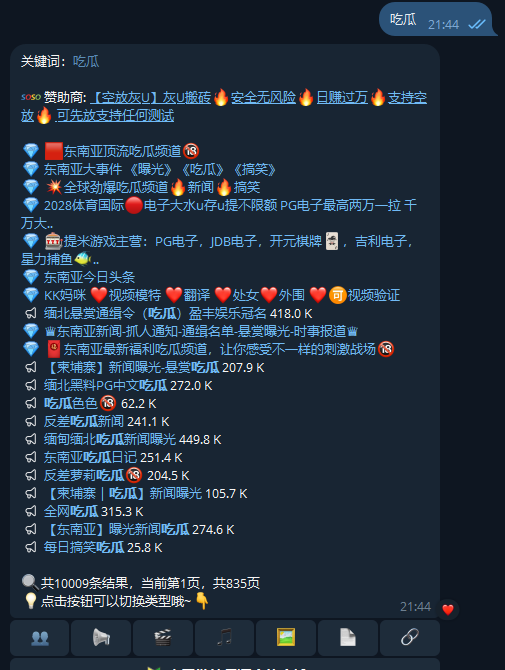

# Telegram搜索机器人推荐——高效查找海量资源

在信息爆炸的时代，如何高效获取所需资源？Telegram搜索机器人为你带来全新解决方案，无需翻找频道或群组，只需输入关键词，即可一键查找海量内容。无论是影视剧、电子书、图片还是优质群组，Telegram搜索机器人都能帮你轻松定位。推荐机器人：[@soso](https://t.me/soso)、[@smss](https://t.me/smss)、[@jisou](https://t.me/jisou)

  

---

## 🤔什么是Telegram搜索机器人？

Telegram搜索机器人是一类专为Telegram用户打造的智能工具，能够帮助你快速检索频道、群组、文件、视频、图片等多种资源，大幅提升信息获取效率。只需输入关键词，便可在Telegram平台上精准定位所需内容，节省大量时间。

---

## 🤠主要功能亮点

- **智能关键词搜索**：输入关键词，机器人自动匹配相关资源，查找更精准高效。
- **多格式资源支持**：支持文档、图片、视频、音频等多种类型，满足不同需求。
- **实时内容更新**：资源库持续扩展，最新内容随时可查，紧跟热点。
- **操作便捷**：无需复杂设置，直接在聊天窗口与机器人互动，适合所有用户。
- **隐私保障**：无需暴露个人信息，保护用户隐私，安全可靠。

---

## 💌推荐的Telegram搜索机器人

- **极搜 [@jisou](https://t.me/jisou)**  
  快速定位优质群组和频道，拓展社交圈，发现更多兴趣内容。

- **搜搜 [@soso](https://t.me/soso)**  
  专注文件搜索，适合查找文档、PDF、电子书等学习资源。

- **神马搜索 [@smss](https://t.me/smss)**  
  支持多语言，检索速度快，适合日常资源查找，覆盖面广。

---

## ❓如何使用Telegram搜索机器人？

1. 点击上述链接，进入对应机器人聊天窗口。
2. 输入你想查找的关键词（如“电影”、“电子书”、“群组”、“吃瓜”）。

3. 等待机器人返回相关资源链接或文件，快速获取所需内容。

---

## 🗺️应用场景举例

- **影视剧查找**：输入片名即可获取下载或在线观看链接，追剧更方便。
- **电子书搜索**：直接搜索书名，机器人帮你定位资源，学习资料一键获取。
- **群组频道推荐**：输入兴趣关键词，快速找到相关频道和群组，拓展社交圈。

---

## 总结

Telegram搜索机器人让资源获取变得前所未有的简单和高效。无论你是学习、娱乐还是工作，都能在Telegram上轻松找到所需内容。赶快体验Telegram搜索机器人，让你的信息检索更智能、更高效！