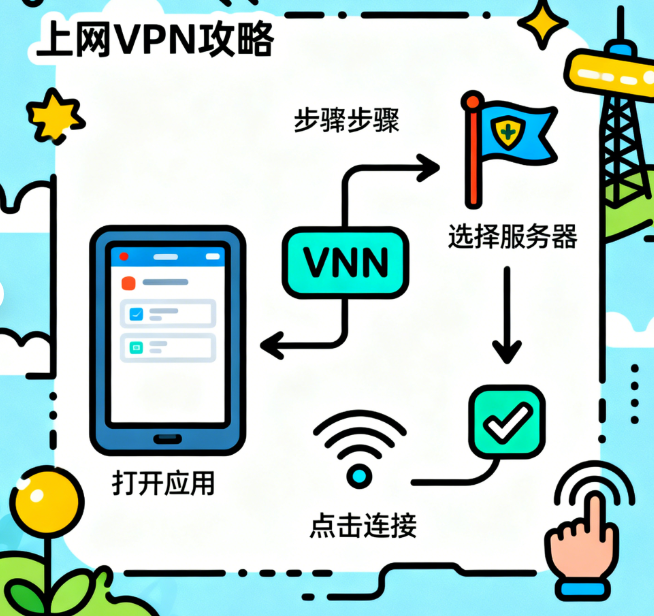

本页内容

 [VPN配置的必要性](#✅一VPN配置的必要性) 

 [配置前的准备工作](#✅二配置前的准备工作) 

 [老牌机场推荐](#✅老牌机场推荐) 

 [全平台配置指南](#✅三全平台配置指南) 

 [高级配置与优化](#✅四高级配置与优化) 

 [故障排除指南](#✅五故障排除指南)

 [安全最佳实践](#✅六安全最佳实践) 

 [使用建议与注意事项](#✅七使用建议与注意事项) 

---
# [👉新用户1天1G流量免费体验](https://www.ssone.uk/register?aff=X9RslxvT ) 
# [👉新用户85折优惠券领取](https://www.xxvip.shop/register?code=rXypHVO4 ) - **邀请码**：rXypHVO4

通过本指南，你将能够顺利完成VPN配置并优化使用体验。网络安全需要持续关注，定期检查更新配置是保持在线安全的重要环节。遇到技术问题时，建议优先联系VPN服务商获取专业技术支持。
# 2025年VPN配置全攻略：从入门到精通


## 机场详情参考以下评测
[🛩SSONE机场深度评测：2025年高性价比科学上网选择](https://vpnnew.net/article/ssone/)

[🛩XXYUN机场深度评测：2025年高性价比BGP专线选择](https://vpnnew.net/article/XXYUN/)

[🛩cyberguard机场深度评测：2025年高性价比质量高、稳定运营两年](https://vpnnew.net/article/cyberguard/)
## ✅一、VPN配置的必要性

### 📱1.1 数字化时代的网络安全需求
在当今数字化环境中，网络隐私和数据安全已成为每个互联网用户必须关注的核心问题。VPN技术通过建立加密的网络通道，为用户在线活动提供全方位保护。

### 📱1.2 主要应用场景
- **远程办公**：安全接入企业内部资源
- **内容访问**：突破地域限制，获取全球资源
- **公共网络防护**：保护咖啡厅、机场等公共Wi-Fi下的数据传输
- **隐私保护**：防止网络服务商追踪和广告商数据收集

# [👉新用户1天1G流量免费体验](https://www.ssone.uk/register?aff=X9RslxvT ) 

## ✅二、配置前的准备工作

### 💻2.1 VPN服务商选择标准

| 选择维度 | 具体要求 | 推荐标准 |
|---------|----------|----------|
| 隐私政策 | 明确的无日志政策 | 经过第三方审计验证 |
| 协议支持 | 现代加密协议 | WireGuard、OpenVPN、IKEv2 |
| 服务器网络 | 全球覆盖范围 | 包含主要国家和地区 |
| 性能表现 | 连接质量 | 无限带宽，低延迟 |
| 客户端支持 | 多平台兼容 | 全平台客户端支持 |

### 💻2.2 必备配置信息
订阅VPN服务后，需要准备以下关键信息：
- 服务器地址（IP或域名）
- 账户认证信息（用户名和密码）
- 安全密钥（部分协议需要）
- 配置文件（OpenVPN等协议）
- 推荐连接协议类型

# [👉新用户85折优惠券领取](https://www.xxvip.shop/register?code=rXypHVO4 ) - **邀请码**：rXypHVO4

## ✅老牌机场推荐

| 机场名称 | 官方地址 | 试用体验 | 入门套餐 | 流量购买 | 用户社群 |
|---------|------|------|------------|------------|------|
| [ssone](https://vpnnew.net/article/ssone/) | [hello-ssone.com](https://www.ssone.uk/register?aff=X9RslxvT ) | 1天 1G | 10元/60G每月 | ❌不支持单独购买 | [telegram](https://t.me/ssoneio ) |
| [xxyun](https://vpnnew.net/article/XXYUN/) | [xxyun.de](https://www.xxvip.shop/register?code=rXypHVO4 ) | 无 | 8.88元/100G每月 | ✔️支持单独购买 | [telegram](https://t.me/+eYsE6P_xvjk2NGY5 ) |
| [CyberGuard](https://vpnnew.net/article/cyberguard/) | [cyberguard.best](https://www.cyberguard.best/#/register?code=qWL0nnJs ) | 无 | 18元/100G每月 | ✔️支持单独购买 | [telegram](https://t.me/CyberGuardChat ) |

## ✅三、全平台配置指南

### 🔌3.1 Windows系统配置
> 详情可参考此文[电脑用VPN怎么选？实用攻略与建议](https://vpnnew.net/article/diannanvpnzenmexuan/ ) 

   - **系统自带配置方案**：
     ```bash
     1. 打开【设置】→【网络和Internet】→【VPN】
     2. 点击【添加VPN连接】
     3. 填写配置信息：
        - 连接名称：自定义识别名称
        - 服务器名称或地址：服务商提供的地址
        - VPN类型：选择自动或指定协议
        - 登录信息：用户名和密码
     4. 点击保存并连接
     ```


**专用客户端方案**：
- 下载官方客户端软件
- 安装并登录账户
- 选择服务器节点一键连接
- 配置自动连接选项

### 🔌3.2 macOS系统配置 

> 详情可参考此文[Mac VPN配置完全指南：从校园连接到流媒体访问](https://vpnnew.net/article/MacVPNpeizhizhinan/ ) 

**手动配置流程**：
1. 打开【系统偏好设置】→【网络】
2. 添加新连接（点击"+"）
3. 选择VPN接口和类型
4. 填写服务器地址和账户信息
5. 输入认证密码和共享密钥
6. 应用配置并建立连接

### 🔌3.3 移动设备配置
**📱iOS设备**：
> 详情可参考此文[iPhone上装哪款VPN iOS版本？避坑指南](https://vpnnew.net/article/iphoneVPN/ ) 

- 下载官方客户端或手动配置
- 路径：【设置】→【通用】→【VPN】
- 选择协议类型（IKEv2、IPSec等）
- 填写服务器信息和认证凭证

**📲Android设备**：
> 详情可参考此文[2025年安卓VPN完全指南：从选购到实战](https://vpnnew.net/article/anzhuoVPNzhinan/ ) 

- 【设置】→【网络和互联网】→【VPN】
- 添加新的VPN网络
- 填写名称、类型、服务器地址
- 输入用户名和密码
- 保存并连接

### 🔌3.4 路由器全局配置
> 详情可参考此文[路由器翻墙详细教程：2025年最佳路由器VPN配置指南](https://vpnnew.net/article/luyouqi/ ) 

**配置优势**：
- 保护所有连接设备
- 无需单独配置每个终端
- 提供全天候保护

**配置步骤**：
1. 登录路由器管理界面
2. 定位VPN客户端设置
3. 上传配置文件或手动输入参数
4. 保存设置并重启设备
5. 验证连接状态

## ✅四、高级配置与优化

### 💽4.1 协议选择指南

| 机场名称 | 官方地址 | 试用体验 | 入门套餐 | 流量购买 | 用户社群 |
|---------|------|------|------------|------------|------|
| [ssone](#🛩SSONE机场服务评测) | [hello-ssone.com](https://www.ssone.uk/register?aff=X9RslxvT ) | 1天 1G | 10元/60G每月 | ❌不支持单独购买 | [telegram](https://t.me/ssoneio ) |
| [xxyun](#🛩xxyun机场服务评测) | [xxyun.de](https://www.xxvip.shop/register?code=rXypHVO4 ) | 无 | 8.88元/100G每月 | ✔️支持单独购买 | [telegram](https://t.me/+eYsE6P_xvjk2NGY5 ) |
| [CyberGuard](#🛩cyberguard机场服务评测) | [cyberguard.best](https://www.cyberguard.best/#/register?code=qWL0nnJs ) | 无 | 18元/100G每月 | ✔️支持单独购买 | [telegram](https://t.me/CyberGuardChat ) |

# [👉新用户1天1G流量免费体验](https://www.ssone.uk/register?aff=X9RslxvT ) 

### 💽4.2 性能优化技巧
**服务器选择策略**：
- 优先选择地理位置近的节点
- 避开高峰时段拥挤服务器
- 根据用途选择专用服务器

**连接参数优化**：
- 启用数据压缩功能
- 调整MTU大小优化传输
- 优先使用UDP协议
> #  [新用户专享](https://www.xxvip.shop/register?code=rXypHVO4 )：使用优惠码 **rXypHVO4** 即可享受首次订购 85 折特别优惠。（注：该优惠码每个账户仅限使用一次）
## ✅五、故障排除指南

### 🧮5.1 常见连接问题
**连接失败**：
- 检查服务器地址准确性
- 验证防火墙设置
- 尝试切换连接协议
- 测试不同服务器节点

**速度缓慢**：
- 更换服务器节点
- 调整连接协议
- 检查本地网络状态
- 避开使用高峰期

### 🧮5.2 安全检测验证
**DNS泄漏检测**：
- 使用专业检测工具验证
- 确认DNS查询通过VPN服务器
- 必要时手动配置DNS

**IP地址验证**：
- 连接后检查实际IP地址
- 确认与VPN服务器位置一致
- 多平台交叉验证

# [👉新用户1天1G流量免费体验](https://www.ssone.uk/register?aff=X9RslxvT ) 
## ✅六、安全最佳实践

### 📀6.1 基础安全措施
- 启用终止开关功能
- 使用高强度密码
- 保持客户端软件更新
- 启用双重认证

### 📀6.2 高级安全配置
- 配置分割隧道规则
- 使用可信DNS解析服务
- 选择非标准端口
- 定期审计连接日志

## ✅七、使用建议与注意事项
# [👉新用户1天1G流量免费体验](https://www.ssone.uk/register?aff=X9RslxvT ) 
### 📺7.1 服务商选择建议
- 优先选择有明确无日志政策的服务商
- 查看第三方安全审计报告
- 谨慎使用免费VPN服务
- 考察技术支持服务质量

### 📺7.2 法律合规提醒
> **重要提示**：使用VPN服务必须遵守所在国家/地区的法律法规。请确保将VPN技术用于合法用途，不得参与任何违法活动。部分国家对VPN使用有特殊规定，使用前请了解相关法律要求。

### 📺7.3 长期维护建议
- 定期检查服务商安全更新
- 监控连接性能指标
- 备份重要配置文件
- 关注网络安全动态

---
>📝 **免责声明**：本文仅供信息参考，建议均为个人经验与观点，不构成法律意见。实际情况以最新政策和主管部门解释为准，请在合法合规框架内使用相关服务。任何违法使用行为与本站无关。