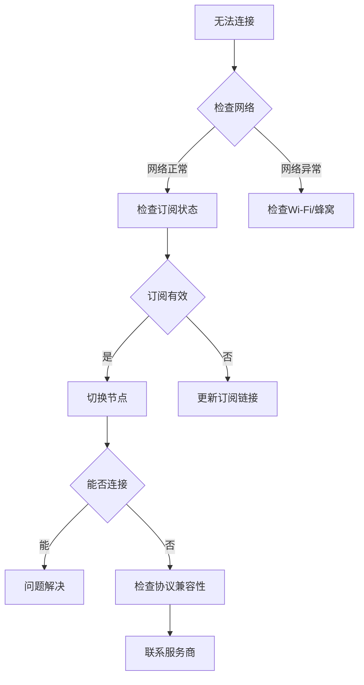

 Shadowrocket是一款专为iOS/macOS设备设计的代理工具客户端，支持多种代理协议，因其界面直观、功能强大而被广泛使用。本文将带你全面了解Shadowrocket （小火箭）以及iOS/macOS==全平台配置教程并包含非国区 Apple ID 共享账号==。
<!-- more -->
---

## 目录

- 应用概览与准备工作
- 非国区 Apple ID 共享账号列表
- 第一步：应用下载与安全安装
- 第二步：订阅配置与节点管理
- 第三步：服务器选择与连接
- 第四步：功能测试与优化
- 第五步：故障排除与维护
- 最佳实践与使用技巧
- 版本更新与资源汇总

---

## 📱 应用概览与准备工作


*正版Shadowrocket应用在App Store中的显示效果*

### ⚠️官网链接[Shadowrocket跳转下载地址](https://apps.apple.com/us/app/shadowrocket/id932747118)，一定要认真辨别不要下载成山寨应用！！！

### 📢系统要求与兼容性
| 设备类型 | 最低系统版本 | 推荐系统版本 | 内存要求 |
|---------|-------------|-------------|---------|
| iPhone | iOS 12.0+ | iOS 15.0+ | 1GB+ |
| iPad | iPadOS 13.0+ | iPadOS 16.0+ | 2GB+ |
| Mac | macOS 11.0+ | macOS 14.0+ | 4GB+ |

---

## 📲非国区 Apple ID 共享账号列表

| 地区 | Apple ID 账号 | 密码操作 |
|------|--------------|----------|
| 美国 | `DahliaynswLanawejc478@gmail.com` | <span onclick="this.innerHTML='dgbT4c7tXY'; navigator.clipboard.writeText('dgbT4c7tXY')" style="cursor:pointer; color:blue; text-decoration:underline">点击显示并复制</span>  |
| 美国 | `dh61n0c4qbjxsrrqzptx@icloud.com` | <span onclick="this.innerHTML=' cGRDB9pYjN'; navigator.clipboard.writeText(' cGRDB9pYjN')" style="cursor:pointer; color:blue; text-decoration:underline">点击显示并复制</span>  |
| 美国 | `juyffl2675@icloud.com` | <span onclick="this.innerHTML='r5eeszVMBy'; navigator.clipboard.writeText('r5eeszVMBy')" style="cursor:pointer; color:blue; text-decoration:underline">点击显示并复制</span>  |
| 日本 | `cecilyherreraeiaj3@gmail.com` | <span onclick="this.innerHTML='78p8ERgxaG'; navigator.clipboard.writeText('78p8ERgxaG')" style="cursor:pointer; color:blue; text-decoration:underline">点击显示并复制</span>  |
| 韩国 | `SamPrghwrh54754@icloud.com` | <span onclick="this.innerHTML=' 38rf5KuS8K'; navigator.clipboard.writeText(' 38rf5KuS8K')" style="cursor:pointer; color:blue; text-decoration:underline">点击显示并复制</span>  |
| 香港 | `paulasfordsckcg@gmail.com` | <span onclick="this.innerHTML='kM8bF7HDVh'; navigator.clipboard.writeText('kM8bF7HDVh')" style="cursor:pointer; color:blue; text-decoration:underline">点击显示并复制</span>  |
| 台湾 | `lenaucarrollk9z0e@gmail.com` | <span onclick="this.innerHTML='78mt5KMANz'; navigator.clipboard.writeText('78mt5KMANz')" style="cursor:pointer; color:blue; text-decoration:underline">点击显示并复制</span>  |
| 新加坡 | `tamrauella5805@outlook.com` | <span onclick="this.innerHTML='BrgADtG3as'; navigator.clipboard.writeText('BrgADtG3as')" style="cursor:pointer; color:blue; text-decoration:underline">点击显示并复制</span>  |


## 💻第一步：应用下载与安全安装


1. **切换账号**
   - 打开App Store应用
   - 点击右上角头像
   - 滑动到底部选择"退出登录"

2. **安全登录共享账号**
   ```markdown
   关键操作提示：
   • 粘贴复制的账号密码
   • 遇到安全验证时务必选择"其他选项"
   • 选择"不升级"选项
   • 如界面未切换，重启App Store
   ```

3. **搜索与下载**
   - 搜索"Shadowrocket"
   - 核对开发者是否为"Shadow Launch Technology Limited"
   - 确认图标为橙色火箭标志
   - 点击获取/下载按钮

4. **安装完成处理**
   - 等待应用安装完成
   - 立即退出共享账号
   - 重新登录个人Apple ID

### ⚠️ 安全警告
| 禁止行为 | 推荐做法 | 原因说明 |
|---------|---------|---------|
| ❌ 在系统设置中登录 | ✅ 仅在 App Store 登录 | 防止设备被锁 |
| ❌ 开启双重认证 | ✅ 选择"不升级"选项 | 避免验证问题 |
| ❌ 长期使用共享账号 | ✅ 下载后立即退出 | 保证账号可用性 |
| ❌ 修改账号信息 | ✅ 仅用于下载应用 | 尊重其他使用者 |

### 🔄 备用方案
如果以上账号不可用，建议：
1. **等待更新**：共享账号不定期更新
2. **注册个人账号**：使用海外手机号或礼品卡
3. **购买成品账号**：电商平台有售（注意安全）
4. **寻找替代应用**：国区可能有功能相似的应用

---

### 🖲️免费美区ID获取资源
| 资源平台 | 更新频率 | 可用性 | 风险等级 |
|---------|---------|-------|---------|
| 共享账号网站 | 每日更新 | 中高 | ⭐⭐ |
| 论坛社区分享 | 不定期 | 中等 | ⭐⭐⭐ |
| 个人注册 | 永久 | 最高 | ⭐ |

>*提示：共享账号具有时效性，如无法使用请寻找最新资源。建议重要应用使用个人账号购买以保障数据安全。*

---

## 📔第二步：订阅配置与节点管理

### 📋 获取订阅链接
在配置Shadowrocket前，需要准备可用的翻墙机场。

###  📢机场推荐汇总： 👉[2026年性价比翻墙机场推荐评测（长期更新）]( https://vpnnew.net/article/VPN/ )
###  📢机场福利推荐汇总：👉[2026年翻墙机场优惠券及免费试用体验汇总（长期更新）]( https://vpnnew.net/article/youhuijuan/ )

#### 📖订阅来源推荐
| 服务类型 | 价格范围 | 稳定性 | 适合人群 |
|---------|---------|-------|---------|
| 付费机场 | ¥10-50/月 | 高 | 日常使用 |
| 免费节点 | 免费 | 低 | 临时需求 |
| 自建服务 | 成本不定 | 中高 | 技术用户 |

**推荐步骤**：
1. 选择信誉良好的机场服务
2. 注册账户并购买套餐
3. 在用户中心复制订阅链接

### ⚙️ Shadowrocket订阅配置

#### 📃配置界面详解

**添加订阅流程**：
1. 打开Shadowrocket应用
2. 点击右上角"+"按钮
3. 类型选择"Subscribe"（订阅）
4. 在URL字段粘贴订阅链接
5. 点击右上角"完成"

#### 📓订阅配置参数表
| 参数项 | 推荐设置 | 作用说明 |
|-------|---------|---------|
| 类型 | Subscribe | 订阅类型 |
| URL | 订阅链接 | 节点信息来源 |
| 备注 | 自定义名称 | 便于识别 |
| 自动更新 | 开启 | 定期更新节点 |
| 更新间隔 | 86400秒 | 每天更新一次 |

### 🔄 订阅更新与管理

**更新操作**：
- **手动更新**：点击订阅右侧的刷新按钮
- **自动更新**：在设置中配置更新频率
- **多订阅管理**：支持添加多个订阅源

---

## 📨第三步：服务器选择与连接

### 🌐 节点选择策略

**选择标准**：
1. **延迟优先**：选择延迟最低的节点
2. **地理位置**：根据目标服务选择地区
3. **负载情况**：选择用户数较少的节点
4. **特殊用途**：流媒体节点、游戏节点等

#### 📩节点信息解读
```yaml
节点示例：
- 名称: 🇺🇸 US-01 Netflix
- 延迟: 128ms
- 协议: VMess+WS+TLS
- 流量: 已用12GB/剩余88GB
- 标签: [Netflix] [4K]
```

### 🚀 启动代理连接

#### 💡连接操作步骤
1. **选择节点**
   - 在主界面点击节点列表
   - 选择目标服务器

2. **开启代理**
   - 点击右上角开关按钮
   - 首次使用需要授权VPN配置
   - 输入锁屏密码或使用Face ID

3. **连接状态确认**
   - 状态栏显示VPN图标
   - Shadowrocket界面显示连接时间
   - 节点信息显示实时流量

#### 🏮连接状态指示
| 状态图标 | 颜色 | 含义 | 操作建议 |
|---------|------|------|---------|
| 🟢 | 绿色 | 已连接 | 正常使用 |
| 🟡 | 黄色 | 连接中 | 等待连接 |
| 🔴 | 红色 | 连接失败 | 检查配置 |
| ○ | 灰色 | 未连接 | 点击开启 |

---

## 🧮第四步：功能测试与优化

### 🧪 连接测试方法

#### 💿基础连通性测试
1. **内置测试工具**
   - 点击节点右侧的"测速"按钮
   - 等待测试结果（延迟/丢包率）
   - 选择测试结果最佳的节点

2. **实际访问测试**
   ```markdown
   测试网站列表：
   • Google.com - 基础连通性
   • YouTube.com - 视频加载能力
   • Netflix.com - 流媒体解锁
   • Speedtest.net - 速度测试
   ```

#### 💽测试结果解读表
| 测试项目 | 优秀指标 | 合格指标 | 需优化 |
|---------|---------|---------|-------|
| 延迟 | <100ms | 100-200ms | >300ms |
| 下载速度 | >50Mbps | 10-50Mbps | <5Mbps |
| 网站访问 | 秒开 | 3秒内打开 | 超时 |
| 视频加载 | 4K无缓冲 | 1080p流畅 | 卡顿 |

### ⚙️ 高级配置选项

#### 💾路由规则配置

**推荐路由模式**：
- **配置模式**（默认）：智能分流，国内外流量自动判断
- **代理模式**：所有流量通过代理
- **直连模式**：所有流量不通过代理
- **场景模式**：根据网络环境自动切换

#### 📱规则组配置示例
```json
{
  "规则类型": "DOMAIN-SUFFIX",
  "匹配模式": "google.com",
  "策略": "代理",
  "优先级": "高"
}
```

#### 💎性能优化设置
| 设置项 | 推荐值 | 优化效果 |
|-------|-------|---------|
| 并发连接数 | 3-5个 | 平衡速度与稳定性 |
| 本地DNS | 223.5.5.5 | 解析速度优化 |
| 日志级别 | Error | 减少资源占用 |
| 内存清理 | 开启 | 防止内存泄漏 |

---

## 🔎第五步：故障排除与维护

### 🔧 常见问题解决方案

#### 🔍问题排查流程图



#### 具体问题处理表
| 问题现象 | 可能原因 | 解决方案 | 优先级 |
|---------|---------|---------|-------|
| **无法连接** | 订阅失效 | 更新订阅链接 | 高 |
| **速度缓慢** | 节点拥堵 | 切换其他节点 | 中 |
| **频繁断开** | 网络不稳定 | 切换网络环境 | 高 |
| **部分网站无法访问** | 规则问题 | 调整路由规则 | 中 |
| **应用闪退** | 版本不兼容 | 更新应用版本 | 高 |

### 🔄 日常维护建议

#### 🔦定期维护清单
```markdown
✅ 每日检查：
1. 连接速度测试
2. 订阅更新状态
3. 流量使用情况

✅ 每周维护：
1. 清理无效节点
2. 更新路由规则
3. 检查应用更新

✅ 每月优化：
1. 评估服务商表现
2. 调整订阅套餐
3. 备份配置文件
```

#### 📺配置文件备份
1. **导出配置**：设置 → 通用 → 导出配置
2. **云备份**：保存至iCloud或第三方云盘
3. **本地备份**：通过AirDrop传输至电脑

---

## 📊 最佳实践与使用技巧

### 🎯 不同场景配置方案

| 使用场景 | 节点选择 | 路由规则 | 额外设置 |
|---------|---------|---------|---------|
| **日常浏览** | 自动选择低延迟 | 配置模式 | 开启广告过滤 |
| **视频观看** | 专用流媒体节点 | 代理模式 | 开启IPv6 |
| **游戏加速** | 固定低延迟节点 | 直连模式 | 开启UDP转发 |
| **工作使用** | 稳定商务节点 | 场景模式 | 开启分应用代理 |
| **隐私保护** | 多跳中转节点 | 全局代理 | 开启混淆 |

### ⚡ 性能加速技巧

1. **DNS优化**
   ```yaml
   推荐DNS服务器：
   - 国内: 223.5.5.5, 119.29.29.29
   - 国际: 1.1.1.1, 8.8.8.8
   - DoH支持: Cloudflare/Google
   ```

2. **协议选择建议**
   | 网络环境 | 推荐协议 | 优势 |
   |---------|---------|------|
   | 稳定网络 | VMess+WS+TLS | 速度快、抗干扰 |
   | 严格环境 | Trojan+TCP | 伪装性好 |
   | 移动网络 | VLESS+XTLS | 节省流量 |

3. **省电设置**
   - 关闭"始终开启VPN"
   - 设置按需连接规则
   - 开启低电量模式优化

### 🛡️ 安全注意事项

#### 📞安全使用准则
1. **账号安全**
   - 不使用来源不明的订阅
   - 定期更换密码
   - 开启双重验证

2. **隐私保护**
   - 开启"增强隐私模式"
   - 禁用日志记录
   - 使用匿名支付方式

3. **设备安全**
   - 保持系统更新
   - 安装安全软件
   - 定期检查权限设置

---

## 📝 版本更新与资源汇总

### 🔄 Shadowrocket更新历史
| 版本号 | 更新日期 | 重要更新 | 兼容性 |
|-------|---------|---------|-------|
| v2.2.0 | 2025-12 | 支持新协议 | iOS 15+ |
| v2.1.8 | 2025-08 | 性能优化 | iOS 14+ |
| v2.1.5 | 2025-05 | 规则更新 | iOS 13+ |

### 🆘 技术支持渠道
| 问题类型 | 解决渠道 | 响应时间 | 推荐度 |
|---------|---------|---------|-------|
| 使用问题 | 服务商客服 | 即时-24小时 | ⭐⭐⭐⭐ |
| 技术问题 | 社区论坛 | 几小时-几天 | ⭐⭐⭐ |
| Bug反馈 | 应用商店评价 | 不确定 | ⭐⭐ |
| 功能建议 | 官方邮箱 | 几周 | ⭐ |

---
>📝 免责声明：本文仅供信息参考，建议均为个人经验与观点，不构成法律意见。实际情况以最新政策和主管部门解释为准，请在合法合规框架内使用相关服务。任何违法使用行为与本站无关。