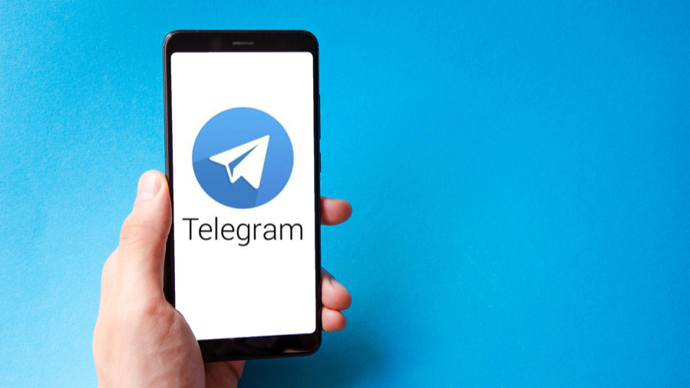

更换新手机本应是件令人愉悦的事，但不少用户在打开==Telegram==（俗称纸飞机/电报）准备登录时，却遭遇了无法登录的尴尬局面。聊天记录、重要群组和频道仿佛被禁锢在旧设备中，这种"失联"感确实令人焦虑。
绝大多数登录问题都可以通过系统化的排查步骤得到解决。==本文将为你提供从基础确认到高级处理的完整解决方案==。
<!-- more -->
---

## 📑 目录

- [问题现状分析](#问题现状分析)
- [登录前的基础确认](#登录前的基础确认)
- [验证码接收的两种路径](#验证码接收的两种路径)
- [旧设备仍可用时的完整迁移](#旧设备仍可用时的完整迁移)
- [旧设备无法访问时的应对方案](#旧设备无法访问时的应对方案)
- [特殊场景处理](#特殊场景处理)
- [登录后的安全设置](#登录后的安全设置)
- [未来换机防坑指南](#未来换机防坑指南)

## 问题现状分析

根据用户反馈，换机登录失败的主要原因集中在以下几个方面：

- **验证码接收异常**：收不到短信验证码，或旧设备收不到应用内通知
- **手机号格式错误**：输入号码时遗漏了国际区号
- **两步验证密码遗忘**：设置了额外密码但想不起来
- **系统或客户端兼容性问题**：特定品牌手机或官方客户端存在bug
- **网络环境限制**：IP被临时封锁或网络不稳定

## 登录前的基础确认

### 确认注册手机号与区号

手机号码是登录Telegram的唯一凭证，但必须使用完整的国际格式：

| 国家/地区 | 区号 | 完整格式示例 |
|----------|------|-------------|
| 中国大陆 | +86 | +86 13800138000 |
| 香港 | +852 | +852 91234567 |
| 台湾 | +886 | +886 912345678 |
| 澳门 | +853 | +853 66123456 |
| 美国 | +1 | +1 2125551234 |

许多用户在登录时只输入本地的11位数字，却遗漏了国家代码，这会导致系统判定为无效号码。

**确认号码的最佳方式**：如果旧手机还能开机，打开Telegram的"设置"→"账号"页面，那里会清晰显示绑定的完整电话号码。如果旧设备已无法使用，请仔细回想当初注册时使用的是主卡、副卡还是已停用的号码。

### 检查网络连接状态

稳定的网络连接是成功登录的基础：

- 确认设备已正常连接互联网（可尝试打开网页验证）
- 尝试在Wi-Fi和移动数据之间切换
- 如果使用VPN，尝试更换不同节点或暂时关闭
- 开启飞行模式30秒后关闭，快速重置网络连接

## 验证码的两种接收路径

在新设备上发起登录操作后，Telegram会通过两种方式发送验证码：

### 路径一：应用内通知
验证码会以特殊消息的形式，发送至仍然登录着Telegram的旧设备上。你会在旧设备的聊天列表顶部找到名为"Telegram"或"验证码"的系统对话。

**这是优先推荐的接收方式**，因为它不依赖短信通道，速度更快且不会被运营商拦截。

### 路径二：传统短信（SMS）
验证码会直接发送至你注册的手机号码。这种方式适用于旧设备已无法访问的场景。

### 重要提醒
频繁点击"重新发送验证码"可能会触发系统的安全限制机制，导致暂时锁定。如果收不到验证码，**建议耐心等待几分钟后再尝试**。

## 旧设备仍可用时的完整迁移

如果旧手机还在身边且能正常使用，这是最理想的迁移场景。请按照以下步骤操作：

### 第一步：检查两步验证设置
在旧设备的Telegram中，进入"设置"→"隐私与安全"，查看是否已开启"两步验证"。如果已开启，**务必确认或找回该密码**，因为在新设备登录时会需要输入。

### 第二步：保持旧设备在线
确保旧设备保持网络连接且Telegram处于登录状态。无需在旧设备上进行任何特殊操作，只需让它保持在线上。

### 第三步：新设备发起登录
1. 在新手机打开Telegram，输入完整的手机号（含区号）
2. 系统会提示"验证码已发送到您的其他设备"
3. 查看旧设备的Telegram聊天列表，找到来自"Telegram"的验证码消息
4. 在新设备输入该6位数字验证码
5. 如果开启了双重验证，继续输入两步验证密码

### 第四步：完成同步
登录成功后，由于Telegram采用云端存储，所有聊天记录、媒体文件和订阅列表会自动同步到新设备，无需手动导入。

## 旧设备无法访问时的应对方案

这是最棘手的情况，但仍有多种解决方案可尝试。

### 方案一：请求电话验证

如果短信验证码迟迟未到，可以尝试电话验证方式：

1. 在验证码输入界面，点击"未收到验证码？"或"Didn't get the code?"
2. 选择"Call Me"（通过电话呼叫）
3. 接听自动语音电话，收听系统播报的验证码
4. 输入收到的数字验证码完成登录

这种方法能有效绕过运营商对国际短信的拦截或延迟问题。

### 方案二：切换网络环境

Telegram会基于IP地址进行请求频率限制。切换网络可以重置IP，有助于解除临时封锁：

- 从Wi-Fi切换到移动数据，或反之
- 如果使用VPN，尝试切换不同国家的节点
- 确保切换后的网络未使用可能被标记的代理IP

### 方案三：清理应用数据（Android）

对于Android用户，清理应用缓存和数据可能解决登录问题：

1. 进入手机"设置"→"应用管理"→找到Telegram
2. 点击"强制停止"
3. 选择"存储占用"→"清除数据"（注意：这会清除该设备上的本地数据，但不会影响云端账号）
4. 重新打开Telegram尝试登录

**重要提示**：清除数据会永久删除该设备上的秘密聊天记录和本地草稿，如有重要内容请提前备份。

### 方案四：尝试第三方客户端

部分用户反馈，官方Telegram客户端在某些手机上存在登录问题，而第三方客户端却能正常工作。据V2EX用户分享，当官方客户端无法收到验证码时，AyuGram、Nekogram等第三方客户端可以成功接收。

### 方案五：使用Telegram Web版

如果手机端反复失败，可以尝试通过电脑浏览器访问Telegram Web（web.telegram.org）进行登录：

1. 在电脑浏览器打开web.telegram.org
2. 输入相同的手机号
3. 如果成功登录，说明账号正常，只是手机端存在问题
4. 登录后可以查看是否显示有剩余冷却时间等信息

### 方案六：联系官方支持

如果以上方法全部无效，最后的手段是联系Telegram官方支持：

- **通过官网表单**：访问telegram.org/support，详细填写问题描述
- **发送邮件**：recover@telegram.org（账号恢复专用邮箱）
- **提供信息**：需包含完整手机号（含区号）、问题描述、已尝试的解决步骤

官方客服通常会在24小时内回复，但需耐心等待。

## 特殊场景处理

### 场景一：手机号已停用或丢失SIM卡

如果注册手机号已停用、SIM卡丢失，且旧设备也无法访问，账号恢复将变得非常困难。

**可行措施**：
1. 尝试通过已设置的两步验证恢复邮箱找回（如果之前绑定过）
2. 联系官方支持，提供尽可能多的账号证明信息（注册时间、常用地区、最近对话等）
3. 如果以上均无效，可能需要接受账号无法恢复的现实，重新注册新账号

**重要提醒**：有用户建议，如果失去旧手机号但还能登录旧设备，应尽快在设置中更换绑定的手机号码，避免被该号码的新主人登录你的账号。

### 场景二：遇到"尝试次数过多"提示

如果看到"Too many attempts, please try again later"的提示，说明触发了Telegram的登录频率限制。

**解决方法**：
- 停止所有登录尝试，等待冷却期结束（通常为几小时到24小时不等）
- 期间不要重复尝试，否则会重置计时器
- 可以尝试在Web端登录查看剩余等待时间

### 场景三：小米/澎湃系统用户遇到的特殊问题

有用户反映在小米手机（MIUI/澎湃系统）上使用官方Telegram客户端时，无法收到已登录设备发送的验证码，但同一账号在三星手机上使用第三方客户端却能正常接收。

**可能原因**：
- 系统级通知拦截或权限限制
- 官方客户端的特定兼容性问题

**建议尝试**：
- 检查系统通知权限，确保Telegram的通知权限已开启
- 尝试第三方客户端如AyuGram、Nekogram
- 检查是否安装了Google服务框架（部分功能依赖）

## 登录后的安全设置

成功登录新设备后，建议立即完成以下安全设置，防止未来再次遇到类似问题：

### 1. 设置两步验证（强制推荐）

两步验证能为账号增加第二道防线，即使别人拿到验证码，没有密码也无法登录。

**操作步骤**：
- 进入"设置"→"隐私与安全"→"两步验证"
- 设置一个与主密码不同的附加密码
- **务必填写有效的备用邮箱**，用于忘记密码时恢复

**重要提示**：如果忘记两步验证密码且未设置恢复邮箱，可能需要等待7天才能重置账户。

### 2. 检查并管理活跃会话

查看所有登录你账号的设备，及时移除不认识的设备。

**操作步骤**：
- 进入"设置"→"设备"（或"活跃会话"）
- 查看所有已登录的设备列表
- 点击并登出不再使用或不认识的设备

### 3. 绑定备用邮箱

确保两步验证中设置的恢复邮箱是有效且可访问的，这是找回账号的最后一道保障。

### 4. 调整隐私设置

根据个人需求调整隐私选项，限制陌生人通过手机号查找、查看在线状态等。

## 未来换机防坑指南

为了避免下次换机再次陷入登录困境，建议提前做好以下准备：

### ✅ 牢记关键信息
- 记住注册手机号的完整格式（含区号）
- 保存两步验证密码和恢复邮箱
- 记录账号的用户名（如果有设置）

### ✅ 保持号码有效
- 确保注册手机号长期有效，更换号码前先在Telegram中更新绑定
- 如需更换号码，需在正版客户端登录一周后才能修改绑定手机号

### ✅ 定期检查安全状态
- 每3-6个月检查一次活跃会话列表
- 确认恢复邮箱仍可访问
- 更新Telegram到最新版本

### ✅ 了解验证机制
理解Telegram的验证码发送逻辑：优先通过已登录设备发送应用内通知，其次才是短信。这样在换机时就能从容应对。

## 总结

换新手机后Telegram登录失败，绝大多数情况都能通过以下思路解决：

1. **确认基础信息**：手机号格式正确、网络稳定
2. **利用旧设备**：优先接收应用内验证码
3. **备选方案**：电话验证、切换网络、清理数据
4. **最后手段**：联系官方支持

提前做好安全设置（两步验证、绑定邮箱）不仅能提升账号安全性，也能在遇到问题时多一条恢复路径。

希望这份指南能帮助你顺利登录账号，重新连接重要的聊天和群组。如果过程中遇到其他问题，欢迎在评论区分享交流。

## 📲非国区 Apple ID 共享账号列表（用来下载Telegram）

### ⚠️ 安全警告
| 禁止行为 | 推荐做法 | 原因说明 |
|---------|---------|---------|
| ❌ 在系统设置中登录 | ✅ 仅在 App Store 登录 | 防止设备被锁 |
| ❌ 开启双重认证 | ✅ 选择"不升级"选项 | 避免验证问题 |
| ❌ 长期使用共享账号 | ✅ 下载后立即退出 | 保证账号可用性 |
| ❌ 修改账号信息 | ✅ 仅用于下载应用 | 尊重其他使用者 |

  

    更新时间：{{ updateTime || '加载中...' }}
  

  <button class="refresh-btn" @click="fetchData" :disabled="loading">
    刷新中...
    刷新
  </button>

  正在获取最新账号信息...

  {{ error }}

  <Card v-for="(acc, index) in accounts" :key="index">
    <Badge :type="getBadgeType(acc.region)" :text="acc.region" />
    只能登录 App Store，登录设置会导致锁机！
      
    账号 <code>{{ acc.email }}</code>
      
    密码 <Plot trigger="click" effect="blur"><code>{{ acc.password }}</code></Plot>
      
    <button class="copy-btn" @click="copy(acc.email, acc, 'email')">
        {{ acc.copiedEmail ? '已复制' : '复制账号' }}
    </button> 
    <button class="copy-btn" @click="copy(acc.password, acc, 'password')">
        {{ acc.copiedPassword ? '已复制' : '复制密码' }}
    </button>
  </Card>

---
##  📢机场推荐汇总： 👉[2026年翻墙机场推荐评测 稳定便宜VPN机场排行榜（高性价比科学上网工具长期更新）]( https://vpnnew.net/article/VPN/ )   

## 📌 延伸阅读

👉iOS手机：[Shadowrocket （小火箭）2026年使用指南：iOS/macOS全平台配置教程(含非国区ID)](https://vpnnew.net/article/Shadowrocket/ )

👉Android手机：[Clash for Android 2026年使用指南：终极配置指南教程](https://vpnnew.net/article/ClashforAndroid/ )

👉Windows/Linux/Mac：[2026年 Clash Verge （Windows/Linux/Mac）全平台配置指南](https://vpnnew.net/article/ClashVerge/ )

👉每天免费更新Apple ID：[2026年 最新最全免费共享美区 Apple ID |Shadowrocket/小火箭下载|每日更新]( https://vpnnew.net/article/freeAppleID/ )  

---

>📝 免责声明：本文仅供信息参考，建议均为个人经验与观点，不构成法律意见。实际情况以最新政策和主管部门解释为准，请在合法合规框架内使用相关服务。任何违法使用行为与本站无关。

