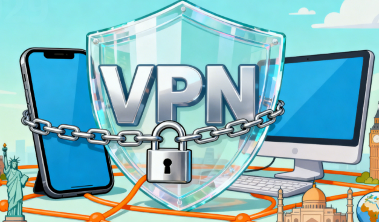

当你面对"该内容在您所在地区不可用"的提示时，是否感到困扰？连接公共Wi-Fi时，是否担心个人信息泄露？在当今数字化生活中，网络安全已成为每个人必须重视的课题。作为从业十余年的网络安全专家，我将为你全面解析VPN安全机制，让你轻松掌握隐私保护要领。
<!-- more -->

目录

 [隐私危机与VPN解决方案](#📢数字时代的隐私危机与VPN解决方案) 

 [VPN工作原理](#📢VPN工作原理：构建数字世界的"安全隧道") 

 [安全防护体系](#📢安全防护体系)

 [免费机场陷阱](#📢免费机场陷阱免费背后的风险) 

 [零日志政策](#📢零日志政策机场服务的诚信基石) 

 [关键安全功能](#📢关键安全功能构建全方位保护体系) 

 [协议选择策略](#📢协议选择策略适应不同网络环境) 

 [安全检测实操](#📢安全检测实操验证机场保护效果) 

 [常见问题权威解答](#📢常见问题权威解答) 

 [2025年机场选择标准](#📢2025年机场选择标准) 

 [总结](#📢总结构建个人数字安全防线) 

---
## 📢数字时代的隐私危机与VPN解决方案

## 📢VPN工作原理：构建数字世界的"安全隧道"

>## 小白可以先参考一下这篇文案(老鸟略过)[什么是翻墙？Clash与VPN区别详解完整指南](https://vpnnew.net/article/fanqiang/) 

### 📱理解VPN的核心价值
想象你的网络数据如同明信片，途经的每个人都能阅读内容。VPN则像是一个加密信封，为你的数据建立专属安全通道。

### 📲技术实现机制
1. **加密隧道建立**：设备与VPN服务器间创建点对点加密连接
2. **数据封装传输**：所有网络请求经过加密处理后转发
3. **IP地址隐藏**：对外显示VPN服务器地址，保护真实地理位置

**核心功能**：
- 端到端数据加密
- 真实IP地址隐藏
- 地理位置伪装

## 📢安全防护体系
- **零日志政策**：不记录用户活动数据
- **高级加密**：采用军事级别加密技术
- **隐私保障**：严格保护个人信息安全
- **协议更新**：持续支持最新安全协议
- **流媒体支持**：完美解锁Netflix、Disney+、HBO等平台
- **AI工具访问**：稳定支持ChatGPT、Claude等AI服务
- **设备兼容性**：支持多设备同时在线，无数量限制
- **高速稳定**：优化网络链路，确保跨境访问流畅稳定
- **全球覆盖**：多地区服务器节点，支持智能路由选择
- **隐私保护**：企业级加密技术，全面保障用户数据安全

## 📢免费机场陷阱免费背后的风险

### 💻三大核心风险
1. **数据收集与转售**
   - 记录浏览历史
   - 收集购买行为
   - 打包出售给第三方

2. **恶意软件威胁**
   - 捆绑安装广告软件
   - 植入追踪代码
   - 设备资源占用

3. **安全漏洞风险**
   - 加密强度不足
   - 协议存在缺陷
   - 服务器配置不当

**关键结论**：免费VPN的盈利模式决定了用户数据就是产品
## 📢零日志政策机场服务的诚信基石

### 🖥️真正的零日志标准
**严禁记录的数据类型**：
- 原始IP地址
- 连接时间戳
- 浏览历史记录
- 数据传输内容
- DNS查询记录

### ⌨️审计验证机制
**权威审计机构**：
- 普华永道（PwC）
- 德勤（Deloitte）
- 毕马威（KPMG）
- 安永（EY）

**审计重点**：
- 政策执行一致性
- 数据留存验证
- 系统安全评估

## 📢关键安全功能构建全方位保护体系

**工作机制**：
- 实时监控VPN连接状态
- 检测到断开立即切断网络
- 防止IP地址意外暴露

**配置建议**：
- 启用系统级保护
- 设置应用级拦截
- 配置自动重连

### 💽DNS泄漏防护
**泄漏风险**：
- ISP监控浏览记录
- 地理位置暴露
- 访问意图泄露

**防护措施**：
- 使用VPN提供商DNS
- 启用内置防护功能
- 定期检测泄漏情况

## 📢协议选择策略适应不同网络环境

> ## 📍适用建议:适合对网络质量有一定要求的用户，遵循“一分钱一分货”的原则，在同等价位中提供优质的服务体验。

### 💼特殊环境适配
**国内网络环境建议**：

- 确保服务器线路优化
- 验证连接稳定性

### 💡机场信息详情可参考一下文章

###  📢机场推荐汇总： 👉[2026年性价比翻墙机场推荐评测（长期更新）]( https://vpnnew.net/article/VPN/ )
###  📢机场福利推荐汇总：👉[2026年翻墙机场优惠券及免费试用体验汇总（长期更新）]( https://vpnnew.net/article/youhuijuan/ )

### 每个推荐机场均经过至少一周实际测试，确保信息真实可靠，助你轻松选择适合自己的科学上网工具。

## 📢安全检测实操验证机场保护效果

### 📖双重检测流程

**第一步：IP地址验证**
 验证标准：
- 显示IP与VPN服务器一致
- 地理位置正确匹配
- 无真实IP泄露

**第二步：DNS泄漏测试**
 合格标准：
- 所有DNS查询通过VPN
- 无本地ISP信息
- 查询结果集中

## 📢常见问题权威解答

### 📗法律合规性
**国内使用现状**：
- 服务提供需要资质
- 个人使用需谨慎
- 选择海外合规服务商
### 详细介绍可参考一下文案
## [国内购买VPN违法吗？法律解析与合规建议](https://vpnnew.net/article/vpnweifama/)

### 📚性能影响分析
**网速影响因素**：
- 服务器距离
- 网络拥堵程度
- 加密算法开销
- 协议效率

**优化建议**：
- 选择就近服务器
- 使用高效协议
- 避开高峰时段

### 📩多设备支持
**典型配置**：
- 同时连接5-10台设备
- 跨平台兼容支持
- 路由器全局保护

## 📢2026年机场选择标准
###  📢机场推荐汇总： 👉[2026年性价比翻墙机场推荐评测（长期更新）]( https://vpnnew.net/article/VPN/ )
###  📢机场福利推荐汇总：👉[2026年翻墙机场优惠券及免费试用体验汇总（长期更新）]( https://vpnnew.net/article/youhuijuan/ )
### 🧾核心评估维度
1. **安全性能**
   - 经过审计的零日志政策
   - 完备的安全功能

2. **技术实力**
   - 协议多样性
   - 服务器质量
   - 网络优化

3. **服务可靠性**
   - 技术支持响应
   - 连接稳定性
   - 更新维护频率

### 📁推荐配置方案
**基础用户**：
- WireGuard协议
- 中等服务器网络
- 基础安全功能

**高级用户**：
- 多协议支持
- 全球服务器覆盖
- 高级安全特性

**企业用户**：
- 专用线路
- 定制化协议
- 专业技术支持

## 📢总结构建个人数字安全防线
选择VPN不仅是技术决策，更是对数字隐私的长期投资。在2025年的网络环境中，一个合格的VPN服务必须具备：
- **军事级加密保障**
- **可验证的零日志政策**
- **完善的安全防护功能**
- **稳定的连接性能**
- **专业的技术支持**
记住：在数字世界，你的隐私安全值得最好的保护。远离风险重重的免费服务，选择经得起考验的专业VPN提供商，为您的网络生活构建坚实的安全防线。

##  📢机场推荐汇总： 👉[2026年翻墙机场推荐评测 稳定便宜VPN机场排行榜（高性价比科学上网工具长期更新）]( https://vpnnew.net/article/VPN/ )   

## 📌 延伸阅读

👉iOS手机：[Shadowrocket （小火箭）2026年使用指南：iOS/macOS全平台配置教程(含非国区ID)](https://vpnnew.net/article/Shadowrocket/ )

👉Android手机：[Clash for Android 2026年使用指南：终极配置指南教程](https://vpnnew.net/article/ClashforAndroid/ )

👉Windows/Linux/Mac：[2026年 Clash Verge （Windows/Linux/Mac）全平台配置指南](https://vpnnew.net/article/ClashVerge/ )

👉每天免费更新Apple ID：[2026年 最新最全免费共享美区 Apple ID |Shadowrocket/小火箭下载|每日更新]( https://vpnnew.net/article/freeAppleID/ )  

---

>📝 免责声明：本文仅供信息参考，建议均为个人经验与观点，不构成法律意见。实际情况以最新政策和主管部门解释为准，请在合法合规框架内使用相关服务。任何违法使用行为与本站无关。