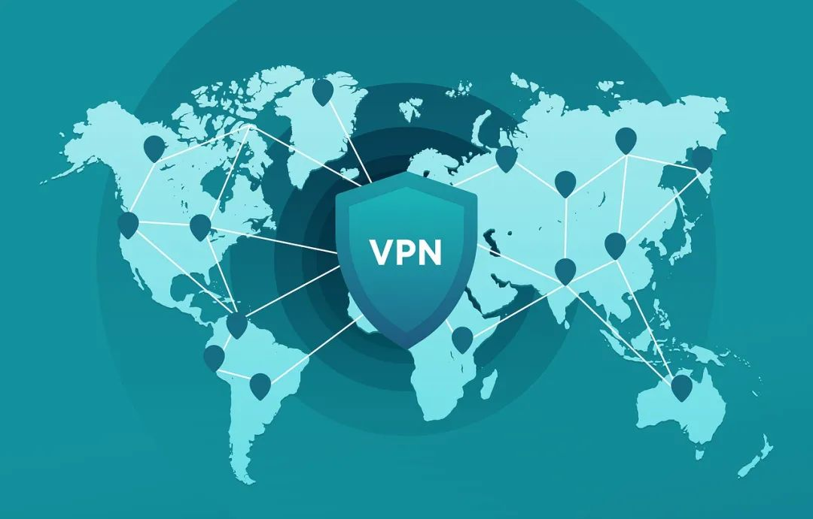

在2026年，VPN仍然是保护隐私和访问受限内容的重要工具，但VPN并不能保证完全匿名。本文将详细解析VPN是否安全、是否会被追踪、VPN的隐私风险以及如何更安全地使用VPN，帮助你全面了解VPN的真实安全性。
<!-- more -->
---

# 📑 目录
1. VPN是什么（基础原理）
2. 2026年VPN安全吗
3. VPN会被追踪吗
4. VPN隐私风险有哪些
5. VPN能否躲避监控
6. 如何更安全使用VPN
7. VPN安全总结
8. FAQ常见问题

---

## 一、VPN是什么（基础原理）
在讨论VPN是否安全之前，需要先了解VPN的工作原理。

VPN（Virtual Private Network，虚拟专用网络）本质上是一条加密的网络通道。当你连接VPN之后，你的网络访问路径会变成：

**你的设备 → VPN服务器 → 目标网站**

而不是：
**你的设备 → 直接访问网站**

这意味着：
- 网站看到的是VPN服务器的IP
- 你的真实IP被隐藏
- 网络数据被加密
- 网络运营商无法看到你访问的具体内容

因此，VPN常被用于：
- 保护隐私
- 访问受限制网站
- 防止公共WiFi被监听
- 远程办公
- 跨区域访问内容

但是，很多人误以为：**使用VPN = 完全匿名**，实际上这是一个非常大的误解。

---

## 二、2026年VPN安全吗？
### 1、结论先说
**2026年VPN总体是安全的，但前提是你使用的是可靠的VPN服务。**

VPN本身是一种加密技术，是安全的，但问题在于VPN服务商是否可信。

因为当你使用VPN时，你的网络流量不再经过运营商，而是经过VPN公司服务器，所以本质上是：

> 你把隐私从“网络运营商”转移给了“VPN服务商”。

因此VPN是否安全，取决于：
- 是否记录日志
- 是否出售用户数据
- 是否有安全审计
- 是否使用强加密协议
- VPN公司是否可信
- 是否有长期运营历史

---

### 2、安全VPN通常具备这些特点
一个安全的VPN通常具备以下特征：

- 无日志政策（No Logs）
- AES-256 加密
- 支持 WireGuard / OpenVPN
- Kill Switch（断网保护）
- DNS Leak Protection
- RAM Only Server（内存服务器）
- 独立安全审计
- 多国家服务器
- 长期运营品牌

如果没有这些功能，安全性会下降很多。

---

## 三、VPN会被追踪吗？
这是很多人最关心的问题之一。

### 1、VPN能隐藏什么？
VPN主要可以隐藏：
- 真实IP地址
- 地理位置
- 网络流量内容
- 网络运营商监控
- 公共WiFi监听

但VPN**不能隐藏你的身份行为**，例如：
- 登录账号
- 浏览器指纹
- Cookies
- 设备信息
- 使用习惯
- 浏览行为

所以结论是：

> VPN可以降低被追踪概率，但不能做到100%匿名。

---

### 2、常见的追踪方式
即使使用VPN，仍然可能通过以下方式被追踪：

#### （1）账号登录追踪
如果你使用VPN登录：
- Google
- Facebook
- Apple ID
- Microsoft
- 邮箱
- 社交账号

那么网站仍然知道你是谁，因为你登录了账号。

VPN只能隐藏IP，不能隐藏账号身份。

---

#### （2）浏览器指纹追踪
网站可以通过浏览器信息识别用户，例如：
- 浏览器版本
- 操作系统
- 屏幕分辨率
- 字体
- 插件
- WebGL
- Canvas
- 时区
- 语言

这些信息组合起来可以形成**浏览器指纹**，可以识别你，即使你更换IP地址。

---

#### （3）VPN日志记录
如果VPN公司记录：
- 用户真实IP
- 连接时间
- 使用服务器
- 带宽使用
- 设备信息

那么在法律要求下，这些数据可能被提供出去。

这也是为什么很多人强调：
**一定要选择无日志VPN。**

---

#### （4）DNS泄漏
如果DNS请求没有走VPN：
- 网站仍然可以看到真实DNS请求
- 可能暴露访问网站记录

---

## 四、VPN隐私风险有哪些？
VPN不仅仅是安全工具，也存在隐私风险。

### 1、免费VPN出售用户数据
很多免费VPN的盈利方式：
- 收集用户浏览数据
- 出售用户数据
- 注入广告
- 跳转链接
- 挖矿
- 安装恶意软件

因为服务器和带宽成本非常高，免费VPN不可能长期免费而没有盈利模式。

**一句话总结：**
> 如果VPN是免费的，那么你可能就是产品。

---

### 2、虚假无日志VPN
很多VPN宣传“无日志”，但实际上可能：
- 记录连接日志
- 记录IP地址
- 记录设备信息
- 记录带宽使用
- 记录连接时间

普通用户很难验证，所以最好选择有安全审计的VPN。

---

### 3、IP / DNS / WebRTC泄漏
如果VPN配置不好，可能出现：
- IP泄漏
- DNS泄漏
- WebRTC泄漏

这会导致真实IP暴露。

---

### 4、恶意VPN软件
一些VPN软件可能包含：
- 木马程序
- 后门程序
- 键盘记录器
- 广告插件
- 挖矿程序

尤其是一些来源不明的VPN软件，非常危险。

---

### 5、虚假安全感
很多用户认为：
> 开了VPN就完全匿名、不会被追踪。

这是错误的认知。

真正的隐私保护需要：
- VPN
- 隐私浏览器
- 禁止追踪
- 不登录账号
- 使用加密通信
- 使用匿名邮箱
- 加密DNS

隐私保护是系统工程，而不是只靠VPN。

---

## 五、VPN能躲避监控吗？
答案是：

**VPN可以提高隐私，但不能保证完全不被监控。**

原因包括：
- 流量分析
- 深度包检测（DPI）
- VPN公司日志
- 法律调查
- 浏览器指纹识别
- 账号身份识别
- 设备指纹识别

VPN的作用是：
> 提高被追踪的难度，而不是完全隐身。

---

## 六、如何更安全使用VPN
如果你想提高隐私安全，建议：

### 安全使用VPN建议
1. 使用可靠付费VPN
2. 开启 Kill Switch
3. 开启 DNS Leak Protection
4. 使用无痕浏览模式
5. 使用隐私浏览器
6. 不登录真实身份账号
7. 使用加密DNS
8. 禁用WebRTC
9. 定期更换服务器
10. 可以使用 VPN + Tor 双重代理

这样安全性会提高很多。

---

## 七、总结
关于VPN安全，记住以下几点：

1. VPN在2026年仍然是安全工具
2. VPN可以隐藏IP，但不能完全匿名
3. VPN可以降低被追踪概率，但不能完全防追踪
4. 免费VPN隐私风险很高
5. VPN公司是否记录日志非常重要
6. 浏览器指纹比IP更容易识别用户
7. 不要认为VPN = 完全隐身
8. 隐私保护不仅仅是VPN
9. 隐私保护是系统工程
10. 付费VPN通常比免费VPN安全

---

## 八、FAQ 常见问题
### 2026年VPN安全吗？
VPN在2026年仍然是安全的，但需要选择可靠的VPN服务商，避免使用不安全的免费VPN。

### VPN会被追踪吗？
VPN可以隐藏IP地址，但仍然可能通过账号、浏览器指纹或VPN日志等方式被追踪。

### 免费VPN安全吗？
大多数免费VPN存在隐私风险，例如记录用户数据、出售用户信息或注入广告。

### VPN可以完全匿名吗？
不可以，VPN只能隐藏IP地址，但不能隐藏账号、浏览器指纹和设备信息。

### 使用VPN违法吗？
大多数国家使用VPN是合法的，但部分国家限制VPN使用。

### VPN能防黑客吗？
在公共WiFi环境下，VPN可以有效防止数据被监听和攻击。

---
## 📢VPN机场推荐汇总： 👉[2026年翻墙机场推荐评测 稳定便宜VPN机场排行榜（高性价比科学上网工具长期更新）]( /vpn-recommend/ )  

## 📌 延伸阅读

👉iOS手机：[Shadowrocket （小火箭）2026年使用指南：iOS/macOS全平台配置教程(含非国区ID)](/article/Shadowrocket/ )

👉Android手机：[Clash for Android 2026年使用指南：终极配置指南教程](/article/ClashforAndroid/ )

👉Windows/Linux/Mac：[2026年 Clash Verge （Windows/Linux/Mac）全平台配置指南](/article/ClashVerge/ )

👉每天免费更新Apple ID：[2026年 最新最全免费共享美区 Apple ID |Shadowrocket/小火箭下载|每日更新](/article/freeAppleID/ )  

---

>评测数据基于实际测试结果，服务表现可能因网络环境而异。建议你根据自身需求进行实际测试验证。

>📝 免责声明：本文仅供信息参考，建议均为个人经验与观点，不构成法律意见。实际情况以最新政策和主管部门解释为准，请在合法合规框架内使用相关服务。任何违法使用行为与本站无关。