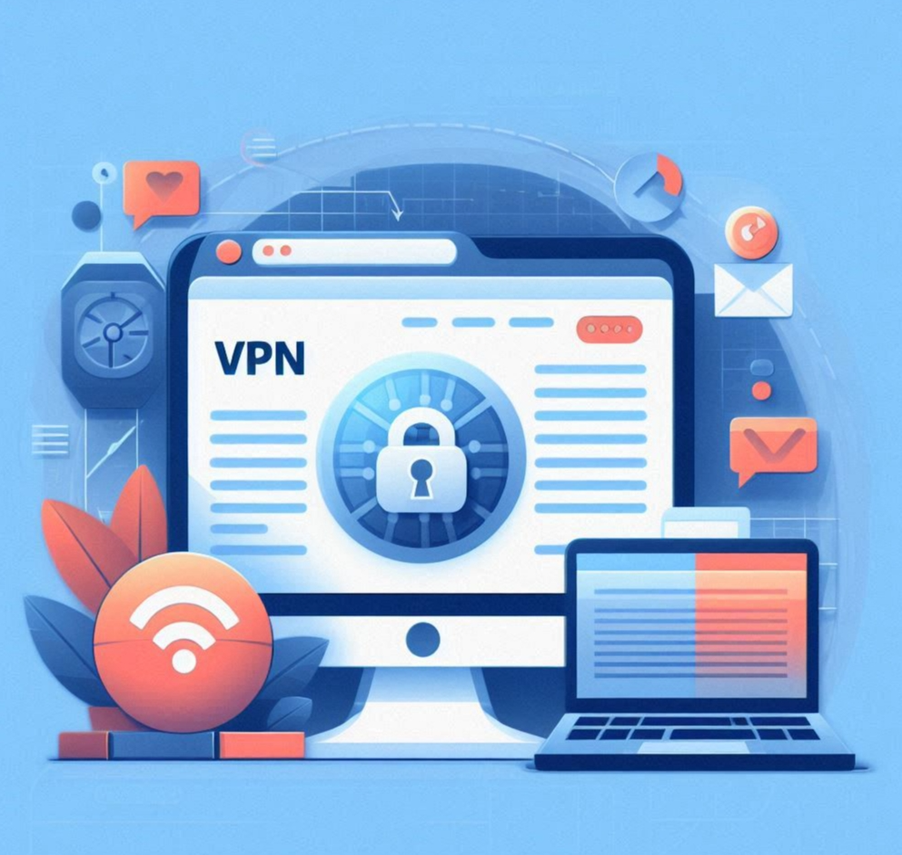
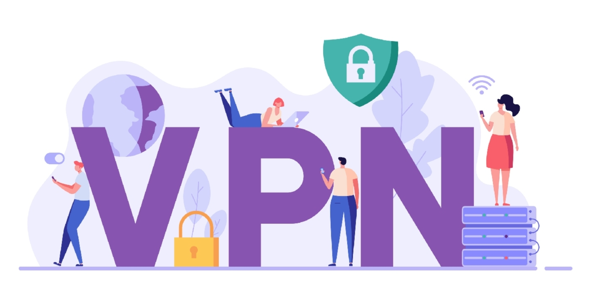
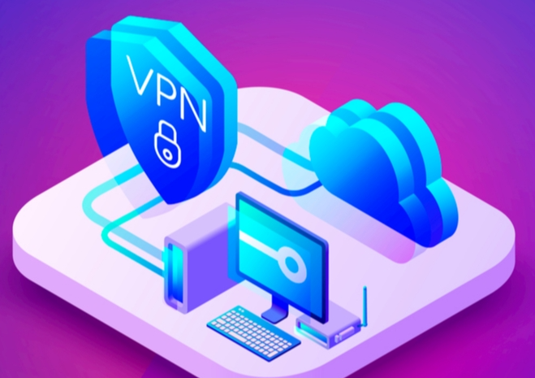

## 一、🏫为什么学生需要VPN？

- 校外访问校内资源（如图书馆、教学平台、论文数据库）
- 保护个人隐私，避免公共WiFi泄露账号信息
- 提升网络安全，防止数据被窃取

---

### 📍纯小白请看以下教程，老鸟略过

👉[2026年安卓VPN完全指南：从选购到实战](https://vpnnew.net/article/anzhuoVPNzhinan/ )

👉[电脑用VPN怎么选？实用攻略与建议](https://vpnnew.net/article/diannanvpnzenmexuan/ )

👉[iPhone上装哪款VPN iOS版本？避坑指南](https://vpnnew.net/article/iphoneVPN/ )

## 二、📶VPN选型建议

- 优先选择学校官方推荐或合作的VPN服务（如校园VPN门户）
- 若需自选第三方VPN，建议选有良好口碑、无日志政策、支持多平台的服务商（留言索取）
- 注意：部分免费VPN存在隐私风险，建议优先使用正规付费服务

---

## 三、🔁VPN配置流程

### 校园官方VPN

1. 登录学校信息中心或VPN服务页面，下载适用于你设备的客户端
2. 按学校提供的账号和密码登录
3. 选择校内资源访问模式，连接后即可访问图书馆、教学平台等

### 第三方VPN

1. 在官网注册账号并下载客户端
2. 安装并登录，选择距离学校较近的服务器节点
3. 连接后访问校内资源，部分平台需提前绑定学号或校园邮箱

> **重要提示：**  
不要用于违规用途：避免用VPN做占带宽的爬虫、破解或其他可能触犯校纪的操作。
---
## 📈校园远程接入解决方案对比表（按用户场景）

| 📚 场景                         |  📑方案                        | 📗 优点                                 | 📕 风险/限制                                         |  📔成本                |
|------------------------------------|-------------------------------|----------------------------------------|------------------------------------------------------|-----------------------|
| 访问只限校园IP的图书数据库         | 学校自家VPN / 远程桌面         | 原生授权、兼容性好、无需额外认证        | 仅限校方提供且需维护，配置相对复杂                   | 通常免费              |
| 公共Wi‑Fi下保护隐私               | 商业VPN| 强加密、跨国节点、客户端易用            | 可能无法模拟校园专用IP段，需付费                      | 月/年费不等，优惠时性价比高 |
| 同时看流媒体和访问课程资源         | 混合策略：学校VPN + 商业VPN备用| 灵活，兼顾兼容性与隐私保护              | 需切换配置，管理成本较高                             | 中等，可能有双重订阅  |
| 节约费用又想稳定访问               | 免费VPN / 学生优惠              | 成本低，部分品牌有学生价                | 速度、隐私、带宽有限，广告或日志问题                  | 低 / 免费             |
> **表格重点：**  
没有“万能”方案。若目标是稳定访问校园内部服务，优先选学校自家VPN；若主要关心公共Wi‑Fi下隐私或想同时访问国际流媒体，商业VPN更合适。混合策略最灵活但需多做配置与切换。

---

## 四、♻️实操步骤：如何安全配置并测试你的校园访问

1. **先问学务/网络中心**  
   了解学校是否有官方远程访问通道，确认是否允许外部IP登录数据库。这是合规的第一步。

2. **若学校有VPN**  
   按学校说明安装官方VPN客户端（通常有详细教程），优先选择学校证书验证的连接方式。不要随意将账号密码输入到第三方设备或软件中。

3. **若需用商业VPN**  
   选择支持多协议、可自定义端口/静态IP或专用IP的VPN服务（部分数据库更易接受静态IP）。可评论留言参考第三方性能评测了解稳定性差异。

4. **测速与切换节点**  
   在不同VPN节点下测试访问速度（如Netflix、Google、学校资源），记录延迟和下载速度。教学平台对延迟要求不高，但下载大文件时带宽影响明显。

5. **开启 Kill Switch 和 DNS 泄露保护**  
   启用VPN的 Kill Switch 功能和 DNS 泄露保护，防止VPN断连时流量直接暴露真实IP。

6. **合规使用，勿违规操作**  
   不要用VPN进行爬虫、破解或其他可能违反校纪的行为，避免占用过多带宽或触发学校安全警告。

---

>通过以上步骤，你可以安全、合规地配置并测试校园远程访问，保障学习和数据安全。

---

## 五、✔️安全与风险提示

- 不要在公共场所随意连接陌生WiFi，优先用VPN加密流量
- 谨慎使用来路不明的VPN，避免账号和数据泄露
- 遵守学校及当地法律法规，合理使用VPN服务
- 优先选择距离较近的服务器，减少延迟
- 避开网络高峰时段，提升连接速度
- 如遇卡顿，可尝试切换协议（如WireGuard、OpenVPN）
---

## 六、✅常见问题速答

**🙋：校外访问图书馆总是失败怎么办？**  
A：优先使用学校官方VPN，确保账号密码正确，必要时联系信息中心技术支持。

**🙋：VPN连接慢怎么办？**  
A：切换到距离较近的节点，或避开高峰时段，尝试不同协议。

**🙋：用VPN会被学校检测吗？**  
A：使用官方VPN不会有问题，第三方VPN建议合理使用，避免影响正常学习。

###  📢机场推荐汇总： 👉[2026年性价比翻墙机场推荐评测（长期更新）]( https://vpnnew.net/article/VPN/ )
###  📢机场福利推荐汇总：👉[2026年翻墙机场优惠券及免费试用体验汇总（长期更新）]( https://vpnnew.net/article/youhuijuan/ )

---

>通过以上指南，学生可在校园网或校外安全便捷地访问校内资源，畅享高效学习体验。

>📝 免责声明：本文仅供信息参考，建议均为个人经验与观点，不构成法律意见。实际情况以最新政策和主管部门解释为准，请在合法合规框架内使用相关服务。任何违法使用行为与本站无关。