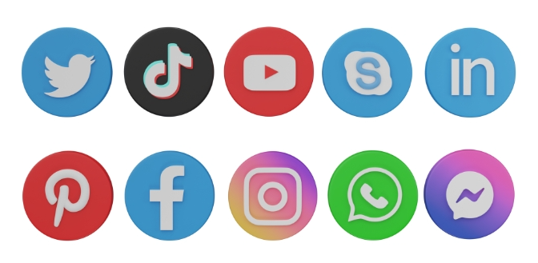
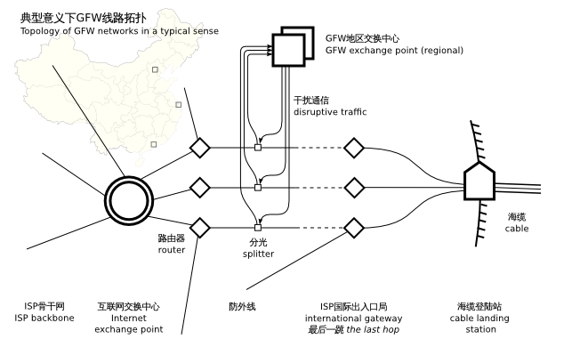
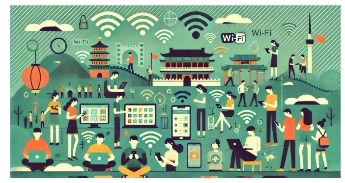

# 什么是翻墙？2025年最新Clash代理工具完整指南

> 本文将带你全面了解翻墙、Clash、V2Ray等主流代理工具的原理与使用方法，助你科学上网、保障网络安全、轻松跨区解锁。

---

## 目录

- 一：代理工具简介与推荐
- 二：Clash代理工具核心功能
- 三：免费与付费代理工具对比
- 四：中国大陆科学上网实用建议
- 五：Clash与VPN区别详解
- 六：如何选择科学上网工具
- 七：混合使用方案参考

---

## 一：代理工具简介

在数字化时代，网络已成为生活必需，但全球互联网并非完全开放。各国政府、企业、黑客等常常通过区域限制、流量监控等手段影响信息自由流动。许多平台（如Netflix、Hulu、Facebook、Instagram、Twitter、Line等）可能因政策被部分地区屏蔽，公共Wi-Fi环境下也存在数据泄露风险。

为此，科学上网工具（如Clash、V2Ray等代理工具）应运而生。它们不仅能突破地域限制，还能加密流量，保护隐私。对于需要访问海外网站或提升网络安全的用户来说，Clash等工具已成为必备选择。

## [2025年性价比翻墙机场推荐评测（长期更新）](https://vpnnew.net/article/VPN/ )

## 📄推荐列表
| 机场名称 | 官方地址 | 试用体验 | 入门套餐 | 流量购买 | 用户社群 | 详情信息 |
|---------|------|------|------------|------------|------|------|
| [奈云](#🛩奈云机场服务评测) | [www.v2ny.me](https://www.v2ny.me?path=register&code=6bJ8swbK ) | 无 | 10.6元/168G每月（年付） | ✔️支持单独购买 | [telegram](https://t.me/v2naiun ) | [👉前往](https://vpnnew.net/article/naiyun/ ) |
| [ssone](#🛩SSONE机场服务评测) | [hello-ssone.com](https://www.ssone.uk/register?aff=X9RslxvT ) | 1天 1G | 10元/60G每月 | ❌不支持单独购买 | [telegram](https://t.me/ssoneio ) | [👉前往](https://vpnnew.net/article/ssone/ ) |
| [灯塔cloud](#🛩灯塔cloud机场服务评测) | [dengtacloud.com](https://dengta.xn--xhq8sm16c5ls.com/register?code=ExbmL3T6 ) | 无 | 10元/100G每月 | ✔️支持单独购买 | [telegram](https://t.me/+xBRgJGSBcNdlNWJl ) | [👉前往](https://vpnnew.net/article/dengtacloud/ ) |
| [flybit](#🛩flybit机场服务评测) | [goflybit.pages.dev](http://flybit.vip/#/register?code=bYcRnAxq ) | 1天2G | 11元/50G每月 | ✔️支持单独购买 | [telegram](https://t.me/flybitvip ) | [👉前往](https://vpnnew.net/article/flybit/ ) |
| [99吧](#🛩99吧机场服务评测) | [99vpn.bar](https://99vpn.bar/#/register?code=cdfPGm0D ) |1天1G | 9.9元/99G每月 | ✔️支持单独购买 | [telegram](https://t.me/jiujiuchat ) | [👉前往](https://vpnnew.net/article/99bajichang/ ) |
| [极连云](#🛩极连云机场服务评测) | [jly01.jiliancloud.net](https://a01.jlyvipaff.cc/#/register?code=aqXIHmRI) | 无 | 8元/60G每月 | ✔️支持单独购买 | [telegram](https://t.me/JLYCloud ) | [👉前往](https://vpnnew.net/article/jilianyun/ ) |
| [ccyz](#🛩ccyz机场服务评测) | [ccyz.org/YByL9bFd.html](https://ccyz.yswy.my/register?code=YByL9bFd ) | 1GB | 15元/150G每月 | ✔️支持单独购买 | [telegram](https://t.me/+jiosLuqA9Mk0Yjkx ) | [👉前往](https://vpnnew.net/article/ccyz/ ) |
| [xxyun](#🛩xxyun机场服务评测) | [xxyun.de/rXypHVO4.html](https://www.xxvip.shop/register?code=rXypHVO4 ) | 无 | 8.88元/100G每月 | ✔️支持单独购买 | [telegram](https://t.me/+eYsE6P_xvjk2NGY5 ) | [👉前往](https://vpnnew.net/article/XXYUN/ ) |
| [星岛梦](#🛩星岛梦机场服务评测) | [a01.sdmvipaff.cc](https://vip01.thundermouse.cc/#/?code=W91WdGyv) | 无 | 16.00元/100G每月 | ✔️支持单独购买 | [telegram](https://t.me/thundermousecc ) | [👉前往](https://vpnnew.net/article/xingdaommeng/ ) |
| [TNT](#🛩tnt机场服务评测) | [web01.tntyun.cc](https://a09.tntvipaffb02.cc/#/register?code=I2MrSqcx) | 无 | 8.16元/60G每月(年付) | ❌不支持单独购买 | [telegram](https://t.me/TNTCloud2 ) | [👉前往](https://vpnnew.net/article/TNT/ ) |
| [OKANC](#🛩okanc机场服务评测) | [okanc.com](https://www.okanc.com/index.php#/register?code=j4gYClCp) | 无 | 46元/328G每月 | ❌不支持单独购买 | [telegram](https://t.me/okancup ) | [👉前往](https://vpnnew.net/article/OKANC/ ) |
| [cocoduck](#🛩cocoduck机场服务评测) | [cocoduck.live](https://cocoduck.live/auth/register?code=b7bc5faa47 ) | 1天2G | 15元/150G每月 | ✔️支持单独购买 | [telegram](https://t.me/cocoduck_pub ) | [👉前往](https://vpnnew.net/article/CocoDuck/ ) |
| [光速云](#🛩光速云机场服务评测) | [a01.gsyvipaff.cc](https://vip01.lightspeed.club/#/?code=wzQ4YW83) | 无 | 8元/60G每月 | ✔️支持单独购买 | [telegram](https://t.me/lightspeed98 ) | [👉前往](https://vpnnew.net/article/guangsuyun// ) |
| [唯兔云](#🛩唯兔云机场服务评测) | [https://a01.v2cvipaff.cc](https://a01.v2cvipaff.cc/#/?code=0rioEOd3) | 无 | 6元/45G每月 | ✔️支持单独购买 | [telegram](https://t.me/v2yun_v2 ) | [👉前往](https://vpnnew.net/article/weituyun/ ) |
| [koodog](#🛩koodog机场服务评测) | [koodog.com](https://zero.thisgourl.xyz/#/register?code=9GqU6tvI ) | 无 | 5元/35G每月 | ✔️支持单独购买 | [telegram](https://t.me/KooDogGroup ) | [👉前往](https://vpnnew.net/article/koodogjichang/ ) |
| [CyberGuard](#🛩cyberguard机场服务评测) | [cyberguard.best](https://www.cyberguard.best/#/register?code=qWL0nnJs ) | 无 | 18元/100G每月 | ✔️支持单独购买 | [telegram](https://t.me/CyberGuardChat ) | [👉前往](https://vpnnew.net/article/cyberguard/ ) |
| [superbiu](#🛩superbiu机场服务评测) | [biubiux.online](https://biubiux.online/#/register?code=K536fups ) | 无 | 11元/50G每月 | ✔️支持单独购买 | [telegram](https://t.me/superbiu888 ) | [👉前往](https://vpnnew.net/article/SuperBiu/ ) |
| [大哥云](#🛩大哥云机场服务评测) | [aff02.dgy02.com](https://aff02.dgy02.com/#/register?code=0Usc20lX ) | 无 | 19.9元/100G每月 | ❌不支持单独购买 | [telegram](https://t.me/dageyun ) | [👉前往](https://vpnnew.net/article/dageyunvpn/ ) |
---

---

## 二：Clash代理工具核心功能

### 什么是代理工具和Clash？

代理工具通过在公共网络上建立加密通道，将你的流量转发到代理服务器。这样，外界看到的是代理服务器的IP，而非你的真实IP，极大提升了匿名性和安全性。

Clash是当前最受欢迎的代理客户端之一，支持Shadowsocks、V2Ray、Trojan等多种协议，拥有强大的分流规则和友好的界面。

### 代理工具的主要用途

- **科学上网/绕过区域限制**  
  让你“伪装”成其他地区用户，访问被封锁的内容。
- **隐私与安全保护**  
  加密所有数据，防止黑客在公共Wi-Fi环境下窃取信息。
- **匿名浏览**  
  隐藏真实IP，降低被广告商、政府追踪的几率。
- **企业远程办公**  
  远程安全访问公司内部资源。
- **P2P/BT下载优化**  
  隐藏下载流量，提升速度，避免ISP限速。

### Clash与其他工具的差异

- **传统代理服务器**：仅更换IP，未必加密全部流量，安全性较低。
- **Tor**：多层节点加密，匿名性强但速度慢，不适合高带宽需求。
- **Clash**：多协议支持、智能分流、速度快、界面友好，适合日常科学上网。

---

## 三：免费与付费代理工具对比

### 免费代理工具

**优点：**
- 无需付费，适合临时或短期使用
- 操作简单，安装即用

**缺点：**
- 流量和速度有限，高峰期易卡顿
- 广告多，部分工具可能收集用户数据
- 安全性无法保障，存在恶意风险

### 付费代理工具

**优点：**
- 速度快，服务器多，全球覆盖
- 隐私和安全性更高，通常有无日志政策
- 跨区解锁能力强，支持多设备

**缺点：**
- 需支付月费，价格一般在2-12美元之间

### 如何选择？

- 偶尔科学上网：免费工具即可
- 经常串流、下载或出差：建议选择付费服务

---

## 四：中国大陆科学上网实用建议

在中国大陆，因“长城防火墙”（GFW）大规模封锁，Google、Facebook、Twitter、Instagram、YouTube、Line、WhatsApp等均无法直接访问。Clash等代理工具成为必需。

### 使用注意事项

- 遵守当地法律法规，仅用于学习、工作等正常需求
- 避免访问敏感内容
- 选择可靠的服务商

### 封锁与节点更新

- 代理工具和节点经常被封锁，需定期更新配置
- 建议提前准备好工具和配置文件，避免境内下载困难
- 准备多种工具和节点作为备选，关注服务商动态

### 服务器选择

- 优先连接香港、日本、新加坡、韩国等邻近地区，速度更快更稳定

### 各平台Clash客户端

- Android：Clash for Android
- Windows：Clash for Windows
- iOS：Clash for iOS

---

## 五：Clash与VPN区别详解

很多用户会问：“Clash和VPN有什么区别？该选哪个？”

### 技术架构差异

| 特性         | VPN                      | Clash                      |
| ------------ | ------------------------ | -------------------------- |
| 工作原理     | 加密隧道，系统级代理     | 多协议代理，应用级分流     |
| 协议支持     | OpenVPN、IKEv2、WireGuard| Shadowsocks、V2Ray、Trojan |
| 流量分流     | 全局代理                 | 智能分流、规则定制         |
| 抗封锁能力   | 一般，易被识别           | 强，支持多种混淆技术       |
| 资源消耗     | 较高                     | 较低                       |
| 界面友好度   | 非常友好                 | 需一定学习成本             |

### 使用场景分析

**VPN更适合：**
- 新手用户，追求一键连接
- 需要全局代理
- 企业远程办公
- 临时访问被封网站
- 移动设备简单使用

**Clash更适合：**
- 进阶用户，追求精细化控制
- 智能分流，国内外网站自动切换
- 多节点管理，快速切换
- 游戏加速，低延迟
- 长期频繁使用

### 在中国大陆表现

- VPN易被检测和封锁，连接不稳定
- Clash支持新协议和混淆，抗封锁能力强，节点更新快，分流体验更好

### 成本对比

- VPN：月费约$5-15，设备数有限
- Clash机场：月费￥10-50（$1.5-8），多设备支持，性价比高

### 安全性考量

- VPN：成熟加密算法，无日志政策，部分受法律保护
- Clash：开源透明，协议安全，需选可靠服务商

---

## 六：如何选择科学上网工具

**选择VPN：**
- 网络新手，追求简单易用
- 海外使用，抗封锁要求不高
- 企业级安全需求
- 不在意较高月费

**选择Clash：**
- 有一定网络基础
- 长期在中国大陆使用
- 需要流量分流和灵活控制
- 追求性价比

---

## 七：混合使用方案参考

许多用户会采用混合方案：

- 日常主力：Clash作为科学上网工具
- 备用方案：准备一个稳定VPN服务应急
- 根据不同场景灵活切换，保障网络畅通与安全

---
### 📀移动设备
### 纯小白请看以下教程，老鸟略过

👉[2025年安卓VPN完全指南：从选购到实战](https://vpnnew.net/article/anzhuoVPNzhinan/ )

👉[电脑用VPN怎么选？实用攻略与建议](https://vpnnew.net/article/diannanvpnzenmexuan/ )

👉[iPhone上装哪款VPN iOS版本？避坑指南](https://vpnnew.net/article/iphoneVPN/ )

>📝 免责声明：本文仅供信息参考，建议均为个人经验与观点，不构成法律意见。实际情况以最新政策和主管部门解释为准，请在合法合规框架内使用相关服务。任何违法使用行为与本站无关。