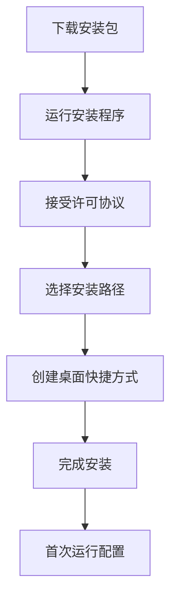
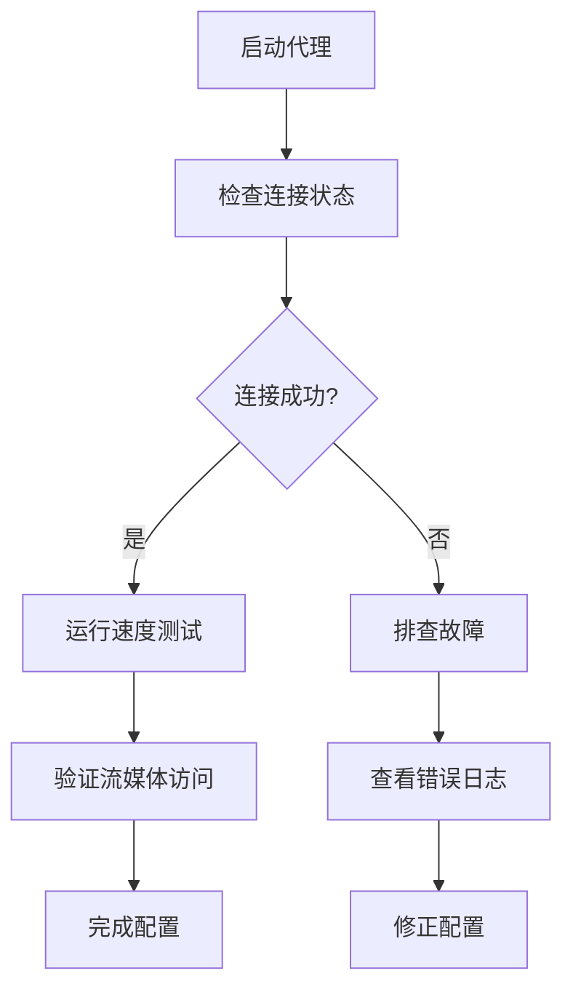

Clash Verge 作为多平台代理客户端，为 Windows、macOS、Linux 提供标准化的科学上网解决方案。本文将系统阐述从基础安装到高级配置的完整工作流程，小白快速上手。
<!-- more -->
---

## 📋 目录导航
- [一、Clash Verge 应用概览](#应用概览)
- [二、多平台安装详细步骤](#安装指南)
- [三、订阅配置与导入教程](#订阅配置)
- [四、核心功能设置详解](#功能设置)
- [五、连接测试与验证](#连接测试)
- [六、高级配置优化](#高级配置)
- [七、故障排除与维护](#故障排除)
- [八、安全注意事项](#安全事项)

---

## 💡一、Clash Verge 应用概览 {#应用概览}

### 🧮应用特点与优势对比

| 特性维度 | Clash Verge | 其他Clash客户端 | 优势分析 |
|---------|------------|----------------|---------|
| **跨平台支持** | Windows/macOS/Linux | 部分平台支持 | ⭐⭐⭐⭐⭐ |
| **用户界面** | 现代化GUI | 命令行/基础界面 | ⭐⭐⭐⭐ |
| **TUN模式** | 内置支持 | 需要额外配置 | ⭐⭐⭐⭐⭐ |
| **更新频率** | 每月更新 | 不定期更新 | ⭐⭐⭐⭐ |
| **社区支持** | 活跃社区 | 依赖开发者 | ⭐⭐⭐ |

### 🔎2026年版本推荐
```yaml
推荐版本：Clash Verge v1.4.2+
系统要求：
  - Windows: Windows 10 64位或更高
  - macOS: macOS 11.0+ (Big Sur)
  - Linux: Ubuntu 20.04+/CentOS 8+
硬件要求：
  - 内存: 最低2GB，推荐4GB+
  - 存储: 至少100MB可用空间
  - 网络: 稳定网络连接
```

---

###  📢机场推荐汇总： 👉[2026年翻墙机场推荐评测 稳定便宜VPN机场排行榜（高性价比科学上网工具长期更新）]( /vpn-recommend/ )  

## 💡二、多平台安装详细步骤 {#安装指南}

### 🖥️下载渠道对比表

| 平台 | 官方下载 |推荐|  文件类型 |
|------|---------|---------|---------|
| **Windows** | [国内加速下载](https://file.ermao.net/files/clash-verge-rev/Clash.Verge.Windows.x64.exe)、[ARM 版本下载](https://file.ermao.net/files/clash-verge-rev/Clash.Verge.Windows.arm64.exe) |Clash Verge Windows x64（直链下载，含系统代理/TUN 支持）|  .exe/.msi |
| **macOS** | [Intel 芯片下载](https://file.ermao.net/files/clash-verge-rev/Clash.Verge.Mac.x64.dmg)、[Apple Silicon 下载](https://file.ermao.net/files/clash-verge-rev/Clash.Verge.Mac.aarch64.dmg) |Clash Verge macOS x64 / Apple Silicon (M 系列)|  .dmg |
| **Linux** | [Linux x64 deb](https://file.ermao.net/files/clash-verge-rev/Clash.Verge.Linux.x64.deb)、[Linux arm64 deb](https://file.ermao.net/files/clash-verge-rev/Clash.Verge.Linux.arm64.deb) |Deb 包（多数发行版）|  .deb/.rpm |

### 💻Windows 安装指南

#### ⌨️安装流程图

::: tabs
@tab 图表


@tab 代码



:::

#### 🖱️详细步骤
1. **获取安装包**
   - 推荐下载：Clash Verge Windows x64 安装包
   - 备用下载：使用国内加速镜像链接

2. **安装过程**
   ```markdown
   关键操作提示：
   ✅ 以管理员身份运行安装程序
   ✅ 安装路径避免使用中文或特殊字符
   ✅ 建议创建桌面快捷方式
   ✅ 安装完成后不要立即重启
   ```

3. **初次运行配置**

   - 启动Clash Verge应用
   - 授予防火墙权限
   - 配置服务模式

### 🖥️macOS 安装指南

#### 🖲️安装流程
```bash
# 方法一：DMG安装（推荐）
1. 下载Clash Verge.dmg文件
2. 双击打开DMG镜像
3. 将Clash Verge拖入"应用程序"文件夹
4. 在应用程序中启动应用
5. 系统提示时授予网络权限

# 方法二：Homebrew安装
brew install --cask clash-verge
```

#### ☎️安全配置
```markdown
⚠️ macOS安全设置：
1. 首次运行时系统可能阻止
2. 前往"系统设置" → "隐私与安全"
3. 找到Clash Verge并点击"允许"
4. 可能需要输入管理员密码
```

### 📞Linux 安装指南

#### 🔔各发行版安装命令
| 发行版 | 安装命令 | 包管理器 |
|--------|---------|---------|
| **Ubuntu/Debian** | `sudo apt install ./clash-verge_*.deb` | APT |
| **Fedora/RHEL** | `sudo dnf install ./clash-verge_*.rpm` | DNF |
| **Arch Linux** | `yay -S clash-verge` 或从AUR安装 | Pacman |
| **openSUSE** | `sudo zypper install ./clash-verge_*.rpm` | Zypper |

#### 📣安装后配置
```bash
# 1. 启动系统服务
sudo systemctl enable clash-verge

# 2. 配置自动启动
sudo systemctl start clash-verge

# 3. 检查服务状态
sudo systemctl status clash-verge

# 4. 查看日志
journalctl -u clash-verge -f
```

---

## 💡三、订阅配置与导入教程 {#订阅配置}

###  📢机场推荐汇总： 👉[2026年翻墙机场推荐评测 稳定便宜VPN机场排行榜（高性价比科学上网工具长期更新）]( /vpn-recommend/ )  


### 🎬订阅导入流程图

::: tabs
@tab 图表


@tab 代码


:::

### 📸详细配置步骤


#### 🎞️步骤1：进入订阅管理

1. 启动Clash Verge应用
2. 点击左侧导航栏的"订阅"选项
3. 查看现有的订阅列表


#### 📽️步骤2：添加新订阅
```yaml
订阅参数配置：
- URL: 机场服务商提供的订阅链接
- 名称: 自定义标识（如"主用机场"）
- 更新间隔: 默认1440分钟（24小时）
- 代理模式: 初始选择"规则"
- 启用状态: 立即启用
```


#### 🎬步骤3：配置参数详解
| 参数项 | 推荐设置 | 作用说明 |
|-------|---------|---------|
| **订阅URL** | 必填项 | 节点信息获取链接 |
| **配置名称** | 自定义 | 便于识别不同订阅 |
| **更新间隔** | 1440分钟 | 每天自动更新一次 |
| **代理组** | 自动创建 | 根据订阅内容生成 |
| **启用TUN** | 根据需求 | 增强网络兼容性 |


#### 🎥步骤4：订阅编辑与管理

1. **编辑订阅**：右键点击订阅 → 编辑配置
2. **更新订阅**：点击刷新按钮手动更新
3. **删除订阅**：右键 → 删除配置
4. **多订阅管理**：支持同时启用多个订阅


### 📸订阅链接获取建议
```markdown
🔗 订阅来源选择标准：
1. 服务商信誉：运营时间长、口碑好
2. 节点质量：延迟低、稳定性高
3. 协议支持：兼容Clash配置文件格式
4. 客服支持：响应及时、解决问题快

📡 推荐获取方式：
- 专业机场服务商
- 自建服务器订阅
- 社区分享（注意验证安全性）
```

---

###  📢机场推荐汇总： 👉[2026年翻墙机场推荐评测 稳定便宜VPN机场排行榜（高性价比科学上网工具长期更新）]( /vpn-recommend/ )  

## 💡四、核心功能设置详解 {#功能设置}

### 📲服务模式与TUN模式配置

#### 📠Windows 特定配置

```markdown
服务模式配置步骤：
1. 点击"设置" → "常规"
2. 找到"服务模式"选项
3. 点击右侧"安装"按钮
4. 等待安装完成提示
5. 点击"启动"启用服务模式

TUN模式开启步骤：
1. 确保服务模式已启用
2. 找到"TUN模式"开关
3. 滑动开关至开启状态
4. 重启应用使设置生效
```

#### 🔋macOS 特定配置
```markdown
网络权限配置：
1. 首次运行时系统弹出权限请求
2. 点击"允许"授予网络访问权限
3. 如需修改：系统设置 → 网络 → 高级

TUN模式配置：
1. 点击应用菜单栏图标
2. 选择"偏好设置"
3. 在"网络"标签中启用TUN
```

#### 🔌Linux 特定配置
```bash
# 检查TUN模块加载
lsmod | grep tun

# 如果没有加载，手动加载
sudo modprobe tun

# 永久启用
echo "tun" | sudo tee -a /etc/modules-load.d/tun.conf

# 验证加载
ls /dev/net/tun
```

### 🖨️代理模式选择指南

| 代理模式 | 工作方式 | 适用场景 | 推荐度 |
|---------|---------|---------|-------|
| **规则模式** | 智能分流，自动判断 | 日常使用、混合访问 | ⭐⭐⭐⭐⭐ |
| **全局模式** | 所有流量通过代理 | 需要完全匿名、全部访问国外 | ⭐⭐⭐ |
| **直连模式** | 所有流量不通过代理 | 临时关闭、仅访问国内 | ⭐⭐ |
| **脚本模式** | 自定义规则脚本 | 高级用户、特殊需求 | ⭐⭐⭐ |

### 📀系统代理配置

```markdown
系统代理开启步骤：
1. 点击Clash Verge系统托盘图标
2. 选择"系统代理"选项
3. 点击"启用系统代理"
4. 验证代理端口（默认7890）

代理端口说明：
- HTTP代理: 127.0.0.1:7890
- SOCKS5代理: 127.0.0.1:7891
- 混合端口: 127.0.0.1:7890
```

---

## 💡五、连接测试与验证 {#连接测试}


### 🏮连接测试流程图

::: tabs
@tab 图表


@tab 代码



:::

### 🪔测试方法与标准

#### 📕1. 内置测试工具

```markdown
测试步骤：
1. 点击"代理"页面
2. 选择"测试全部"按钮
3. 等待测试结果
4. 查看延迟和连接状态

测试指标解读：
- 延迟: <100ms优秀，100-200ms良好，>300ms较差
- 下载速度: 受限于本地网络和节点带宽
- 连接状态: 绿色表示正常，红色表示失败
```

#### 📖2. 实际访问测试
| 测试网站 | 测试目的 | 成功标志 |
|---------|---------|---------|
| **google.com** | 基础连通性 | 正常打开，无重定向 |
| **youtube.com** | 视频流能力 | 可播放视频，无缓冲 |
| **netflix.com** | 流媒体解锁 | 显示非大陆内容 |
| **speedtest.net** | 速度测试 | 显示代理服务器IP |
| **whatismyipaddress.com** | IP验证 | 显示代理IP非本地 |

#### 📗3. 专业测速工具
```bash
# Windows: 使用PowerShell测试
Test-NetConnection -ComputerName google.com -Port 443

# macOS/Linux: 使用curl测试
curl -I https://google.com --socks5 127.0.0.1:7890

# 延迟测试
ping -c 4 8.8.8.8
```

---

## 💡六、高级配置优化 {#高级配置}

### 📗性能优化设置

#### 📘网络参数优化
```yaml
推荐配置参数：
网络设置:
  - DNS服务器: 
      - 223.5.5.5
      - 1.1.1.1
      - 8.8.8.8
  - 允许局域网连接: 关闭（安全考虑）
  - 日志级别: info（平衡信息与性能）
  - 混合端口: 开启（简化配置）

性能优化:
  - TCP快速打开: 开启
  - UDP转发: 根据需求开启
  - 并发连接数: 根据内存调整（默认4）
  - 内存优化: 开启定期清理
```

#### 📙规则优化配置
```markdown
规则集管理：
1. 内置规则：使用官方维护的规则集
2. 自定义规则：添加特定网站分流
3. 规则更新：定期更新规则文件
4. 优先级设置：合理安排规则顺序

推荐规则源：
- ACL4SSR规则集
- Clash规则集
- 自建规则（高级用户）
```

### 📚多平台同步配置

#### 📓配置文件导出导入

```markdown
配置备份步骤：
1. 点击"设置" → "备份与恢复"
2. 选择"导出配置"
3. 保存到安全位置

配置恢复步骤：
1. 点击"导入配置"
2. 选择备份文件
3. 确认覆盖现有配置
4. 重启应用生效

云同步建议：
- 使用私有Git仓库
- 加密敏感信息
- 定期同步更新
```

---

###  📢机场推荐汇总： 👉[2026年翻墙机场推荐评测 稳定便宜VPN机场排行榜（高性价比科学上网工具长期更新）]( /vpn-recommend/ )  

## 💡七、故障排除与维护 {#故障排除}

### 📒常见问题解决矩阵

| 问题现象 | 可能原因 | 解决方案 | 优先级 |
|---------|---------|---------|-------|
| **无法启动代理** | 端口被占用 | 1.检查端口占用 2.更换端口 | 高 |
| **TUN模式失败** | 权限不足/驱动问题 | 1.以管理员运行 2.重新安装驱动 | 高 |
| **订阅导入失败** | 链接失效/格式错误 | 1.检查链接 2.联系服务商 | 中 |
| **速度缓慢** | 节点拥堵/网络问题 | 1.切换节点 2.网络诊断 | 中 |
| **频繁断开连接** | 网络不稳定/配置问题 | 1.稳定网络 2.优化配置 | 高 |
| **系统代理不生效** | 系统设置冲突 | 1.关闭其他代理 2.重启应用 | 中 |

### 📃诊断工具使用

#### 📄日志查看方法
```markdown
日志访问路径：
Windows: %APPDATA%\Clash Verge\logs\
macOS: ~/Library/Logs/Clash Verge/
Linux: ~/.config/clash-verge/logs/

日志级别设置：
- debug: 最详细，用于故障诊断
- info: 日常使用，记录关键操作
- warning: 仅警告和错误
- error: 仅错误信息
```

#### 🪎网络诊断命令
```bash
# 检查代理端口
netstat -ano | findstr :7890  # Windows
lsof -i :7890                 # macOS/Linux

# 测试代理连接
curl -x socks5://127.0.0.1:7890 https://www.google.com

# 检查DNS解析
nslookup google.com 127.0.0.1
```

### 📩定期维护建议

#### 📤维护任务清单
```markdown
每日检查：
✅ 代理连接状态
✅ 节点延迟情况
✅ 流量使用统计

每周维护：
✅ 更新订阅节点
✅ 清理日志文件
✅ 备份配置文件
✅ 测试备用节点

每月优化：
✅ 评估服务商表现
✅ 更新应用版本
✅ 检查系统兼容性
✅ 优化规则配置
```

---

## 💡八、安全注意事项 {#安全事项}

### 📁安全配置指南

#### 📂账户与订阅安全
```markdown
🔐 订阅安全：
1. 不要公开分享订阅链接
2. 定期更换订阅密钥
3. 使用不同订阅源备份
4. 监控异常流量使用

🛡️ 隐私保护：
1. 选择零日志服务商
2. 启用DNS over HTTPS
3. 定期清理浏览数据
4. 使用隐私保护模式
```

#### 🗂️系统安全设置
| 安全设置 | 推荐配置 | 安全等级 |
|---------|---------|---------|
| **自动更新** | 开启自动检查 | ⭐⭐⭐⭐ |
| **权限管理** | 最小必要权限 | ⭐⭐⭐⭐⭐ |
| **日志记录** | 开启重要操作日志 | ⭐⭐⭐⭐ |
| **网络隔离** | 禁用局域网访问 | ⭐⭐⭐⭐ |
| **配置文件加密** | 敏感信息加密 | ⭐⭐⭐⭐ |

### ⚠️法律合规提醒
```markdown
⚠️ 重要提醒：
1. 遵守所在国家/地区的法律法规
2. 不得用于非法活动或访问违禁内容
3. 尊重知识产权，不进行盗版下载
4. 保护个人隐私，不侵犯他人权益
5. 企业使用需符合公司信息安全政策
```

---

## 📊 配置完成检查清单

### 🔈基础配置确认
- [ ] Clash Verge 安装完成
- [ ] 订阅成功导入并更新
- [ ] 服务模式已启用（Windows）
- [ ] TUN模式按需配置
- [ ] 系统代理已开启
- [ ] 代理模式设置为"规则"

### 🔉功能验证清单
- [ ] 代理连接成功建立
- [ ] 网络访问测试通过
- [ ] 速度测试结果满意
- [ ] 流媒体解锁验证
- [ ] 配置文件已备份

### 优化配置完成
- [ ] DNS服务器配置优化
- [ ] 规则集更新至最新
- [ ] 日志级别适当设置
- [ ] 自动更新已开启
- [ ] 安全设置已检查

---

## 🔄 版本更新与支持

### 🔊更新策略建议
```markdown
版本更新频率：
- 功能更新：每月检查一次
- 安全更新：立即应用
- 大版本更新：先测试后升级

更新前准备：
1. 备份当前配置文件
2. 记录重要自定义设置
3. 了解版本变更内容
4. 在非工作时间更新
```

### 📣技术支持渠道
| 问题类型 | 推荐渠道 | 响应时间 | 有效性 |
|---------|---------|---------|-------|
| **使用问题** | 官方文档/GitHub Wiki | 立即 | ⭐⭐⭐⭐ |
| **技术故障** | GitHub Issues | 1-3天 | ⭐⭐⭐⭐ |
| **功能建议** | GitHub Discussions | 1-2周 | ⭐⭐⭐ |
| **紧急问题** | 社区论坛/Discord | 即时-几小时 | ⭐⭐⭐ |

---

## 📢机场推荐汇总： 👉[2026年翻墙机场推荐评测 稳定便宜VPN机场排行榜（高性价比科学上网工具长期更新）]( /vpn-recommend/ )  

## 📌 延伸阅读

👉iOS手机：[Shadowrocket （小火箭）2026年使用指南：iOS/macOS全平台配置教程(含非国区ID)](/article/Shadowrocket/ )

👉Android手机：[Clash for Android 2026年使用指南：终极配置指南教程](/article/ClashforAndroid/ )

👉Windows/Linux/Mac：[2026年 Clash Verge （Windows/Linux/Mac）全平台配置指南](/article/ClashVerge/ )

👉每天免费更新Apple ID：[2026年 最新最全免费共享美区 Apple ID |Shadowrocket/小火箭下载|每日更新](/article/freeAppleID/ )  

---

>评测数据基于实际测试结果，服务表现可能因网络环境而异。建议你根据自身需求进行实际测试验证。

>📝 免责声明：本文仅供信息参考，建议均为个人经验与观点，不构成法律意见。实际情况以最新政策和主管部门解释为准，请在合法合规框架内使用相关服务。任何违法使用行为与本站无关。