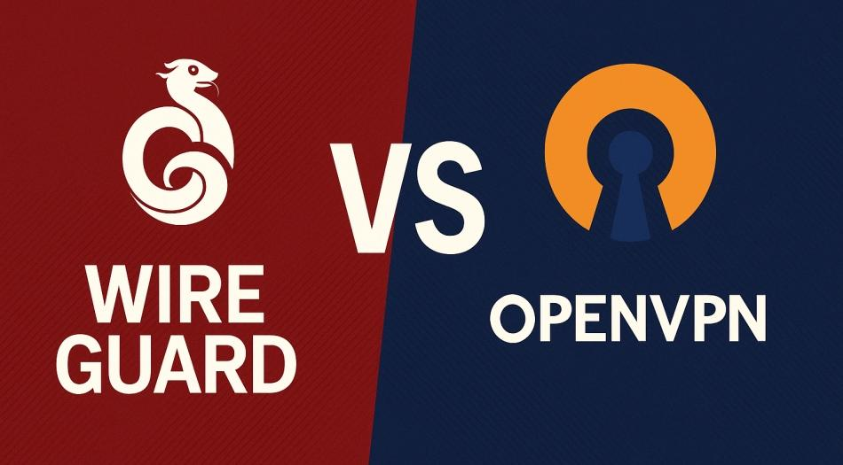

OpenVPN和WireGuard是目前最常见的两种VPN协议。OpenVPN诞生较早，稳定性和兼容性非常好，而WireGuard是新一代VPN协议，速度更快、延迟更低。本文将从速度、安全性、稳定性、加密方式和使用场景全面对比OpenVPN与WireGuard，帮助你选择最适合自己的VPN协议。
<!-- more -->
---

# 📑 目录
1. 什么是VPN协议
2. 什么是OpenVPN
3. 什么是WireGuard
4. OpenVPN与WireGuard速度对比
5. OpenVPN与WireGuard安全性对比
6. OpenVPN与WireGuard稳定性对比
7. OpenVPN与WireGuard优缺点
8. OpenVPN和WireGuard如何选择
9. 总结
10. FAQ常见问题

---

## 一、什么是VPN协议
VPN协议可以理解为VPN连接时使用的通信规则和加密方式。不同的VPN协议会影响：
- 连接速度
- 延迟
- 稳定性
- 加密强度
- 是否容易被封锁
- 设备兼容性

常见VPN协议包括：
- OpenVPN
- WireGuard
- IKEv2
- L2TP/IPSec
- PPTP（已不安全）

目前主流VPN基本都使用：
**OpenVPN 或 WireGuard**

---

## 二、什么是OpenVPN
OpenVPN诞生于2001年，是目前最成熟、最稳定的VPN协议之一，被广泛应用于商业VPN、企业VPN和科研网络。

OpenVPN特点：
- 开源协议
- 非常稳定
- 安全性高
- 兼容性好
- 可以使用TCP或UDP
- 可以伪装HTTPS流量
- 不容易被封锁
- 适合复杂网络环境

OpenVPN通常使用：
- AES-256 加密
- RSA证书
- TLS加密
- SHA认证

OpenVPN被认为是**最安全、最稳定的VPN协议之一**。

但缺点是：
> 速度相对WireGuard较慢，延迟较高。

---

## 三、什么是WireGuard
WireGuard是新一代VPN协议，大约在2015年开始开发，近几年成为主流VPN协议。

WireGuard设计目标：
- 更快
- 更简单
- 更安全
- 更轻量
- 更低延迟

WireGuard特点：
- 代码非常少（约4000行）
- 使用现代加密算法
- 连接速度快
- 延迟低
- 移动设备切换网络更稳定
- 更适合手机使用
- 更适合游戏和视频

WireGuard使用的加密算法：
- ChaCha20
- Poly1305
- Curve25519
- BLAKE2
- SipHash

这些都是现代高性能加密算法。

---

## 四、OpenVPN与WireGuard速度对比
一般情况下速度对比：

| 协议 | 速度 | 延迟 |
|---|---|---|
| WireGuard | 非常快 | 非常低 |
| OpenVPN UDP | 较快 | 中 |
| OpenVPN TCP | 较慢 | 较高 |

原因：
- WireGuard代码少
- 加密效率高
- 使用UDP
- 网络切换更快
- 建立连接更快

通常WireGuard比OpenVPN快：
**20% – 100%**

如果你用于：
- 看视频
- 打游戏
- 下载
- 日常浏览
- 手机使用

WireGuard通常体验更好。

---

## 五、OpenVPN与WireGuard安全性对比
很多人关心哪个更安全。

实际上：
**两者都非常安全。**

安全性对比：

| 对比 | OpenVPN | WireGuard |
|---|---|---|
| 加密算法 | AES-256 | ChaCha20 |
| 代码复杂度 | 高 | 低 |
| 审计历史 | 很长 | 较新 |
| 漏洞风险 | 低 | 很低 |
| 安全性 | 很高 | 很高 |

OpenVPN优势：
- 经过20多年验证
- 安全研究很多
- 企业使用广泛

WireGuard优势：
- 代码更少，更不容易出漏洞
- 使用现代加密算法
- 设计更现代

总体来说：
> 安全性两者都很高，没有明显谁更不安全。

---

## 六、OpenVPN与WireGuard稳定性对比
稳定性对比：

| 场景 | OpenVPN | WireGuard |
|---|---|---|
| 弱网络 | 更稳定 | 稍弱 |
| 切换WiFi/4G | 一般 | 非常稳定 |
| 企业网络 | 更稳定 | 一般 |
| 手机网络 | 一般 | 更稳定 |
| 被封锁网络 | OpenVPN更容易伪装 | 一般 |

总结：
- OpenVPN适合复杂网络
- WireGuard适合移动网络
- WireGuard更适合手机
- OpenVPN更适合公司网络

---

## 七、OpenVPN与WireGuard优缺点
### OpenVPN优点
- 非常稳定
- 安全性高
- 可以使用TCP
- 可以伪装HTTPS
- 不容易被封锁
- 兼容性最好

### OpenVPN缺点
- 速度较慢
- 延迟较高
- 配置复杂

### WireGuard优点
- 速度非常快
- 延迟低
- 代码少
- 更现代
- 手机体验好
- 网络切换稳定

### WireGuard缺点
- 较新协议
- 不容易伪装流量
- 某些网络环境不稳定

---

## 八、OpenVPN和WireGuard如何选择
### 如果你用于：
- 看Netflix
- YouTube
- 日常浏览
- 打游戏
- 手机使用
- 下载
- ChatGPT
- TikTok

👉 建议选择 **WireGuard**

### 如果你用于：
- 公司网络
- 学校网络
- 网络限制严格
- VPN容易被封
- 需要TCP 443端口
- 需要稳定连接

👉 建议选择 **OpenVPN**

---

## 九、总结
OpenVPN与WireGuard总结：

| 对比 | OpenVPN | WireGuard |
|---|---|---|
| 速度 | 中 | 快 |
| 延迟 | 中 | 低 |
| 安全 | 高 | 高 |
| 稳定 | 高 | 高 |
| 手机 | 一般 | 好 |
| 游戏 | 一般 | 好 |
| 视频 | 一般 | 好 |
| 抗封锁 | 强 | 一般 |
| 推荐 | 稳定环境 | 日常使用 |

**一句话总结：**
> 想要速度用WireGuard，想要稳定和抗封锁用OpenVPN。

---

## 十、FAQ 常见问题
### OpenVPN和WireGuard哪个更快？
WireGuard通常比OpenVPN更快，延迟更低，适合游戏和视频。

### WireGuard比OpenVPN更安全吗？
两者都非常安全，WireGuard使用更现代加密算法。

### OpenVPN更稳定吗？
在复杂网络和严格网络环境下，OpenVPN通常更稳定。

### WireGuard适合手机吗？
非常适合，WireGuard在手机切换WiFi和移动网络时更稳定。

### 什么时候应该使用OpenVPN？
当VPN容易被封锁或网络环境复杂时，建议使用OpenVPN。

---
## 📢VPN机场推荐汇总： 👉[2026年翻墙机场推荐评测 稳定便宜VPN机场排行榜（高性价比科学上网工具长期更新）]( /vpn-recommend/ )  

## 📌 延伸阅读

👉iOS手机：[Shadowrocket （小火箭）2026年使用指南：iOS/macOS全平台配置教程(含非国区ID)](/article/Shadowrocket/ )

👉Android手机：[Clash for Android 2026年使用指南：终极配置指南教程](/article/ClashforAndroid/ )

👉Windows/Linux/Mac：[2026年 Clash Verge （Windows/Linux/Mac）全平台配置指南](/article/ClashVerge/ )

👉每天免费更新Apple ID：[2026年 最新最全免费共享美区 Apple ID |Shadowrocket/小火箭下载|每日更新](/article/freeAppleID/ )  

---

>评测数据基于实际测试结果，服务表现可能因网络环境而异。建议你根据自身需求进行实际测试验证。

>📝 免责声明：本文仅供信息参考，建议均为个人经验与观点，不构成法律意见。实际情况以最新政策和主管部门解释为准，请在合法合规框架内使用相关服务。