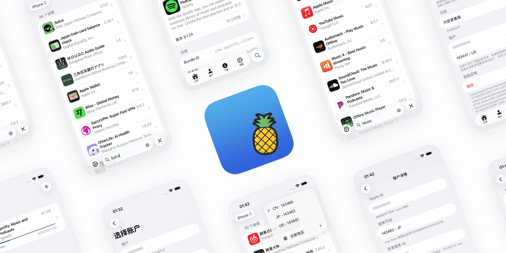

Asspp是一种用于**iPhone多账号切换App Store及跨区下载应用**的工具，能够帮助用户快速访问美区、日区、港区等外区应用商店，从而下载地区限制App。但由于其非官方性质，存在一定安全风险，建议优先使用官方Apple ID切换方案。

👉 本文将彻底解决：
- iPhone如何跨区下载App（2026最新方法）
- App Store怎么切换国家/地区
- Asspp详细使用教程（新手保姆级）

👉 适合人群：
- 想下载海外App（如ChatGPT、海外游戏等）
- iOS多账号用户
- 跨区游戏/应用体验用户
   
<!-- more -->

---

>在你下载时没有合适的翻墙工具可以参考这里📢机场推荐汇总： 👉[2026年翻墙机场推荐评测 稳定便宜VPN机场排行榜（高性价比科学上网工具长期更新）]( https://vpnnew.net/article/VPN/ )     

>如果你没有Apple ID可以参考这里📢每天更新免费ID： 👉[2026年 最新最全免费共享美区 Apple ID |Shadowrocket/小火箭下载|每日更新]( https://vpnnew.net/article/freeAppleID/ ) 

## 📚 目录（Table of Contents）

- [一、什么是Asspp](#一什么是asspp)
- [二、使用前准备（成功率关键）](#二使用前准备成功率关键)
- [三、Asspp下载与安装教程](#三asspp下载与安装教程)
- [四、Asspp使用详细步骤（保姆级）](#四asspp使用详细步骤保姆级)
- [五、跨区下载实战演示](#五跨区下载实战演示)
- [六、常见错误与解决方法](#六常见错误与解决方法)
- [七、热门地区推荐](#七热门地区推荐)
- [八、Asspp安全吗（避坑重点）](#八asspp安全吗避坑重点)
- [九、官方替代方案（强烈推荐）](#九官方替代方案强烈推荐)
- [十、FAQ](#十faqseo流量入口)
- [十一、总结](#十一总结)

---

## 🔍 一、什么是Asspp

Asspp是一类**第三方App Store辅助工具**，并非官方应用，其核心作用是帮助用户实现：

- Apple ID多账号快速切换  
- 不同国家App Store自由访问  
- 下载“地区限制应用”  

📌 技术本质：
通过模拟登录或中转机制，实现不同地区账号快速切换，从而**绕过App Store地区限制**

📌 使用场景：
- 下载美区独占App（如AI工具）
- 体验日区手游
- 获取国内已下架应用

---

## ⚠️ 二、使用前准备（成功率关键）

### ✅ 必做准备（决定是否成功）

>如果你没有Apple ID可以参考这里📢每天更新免费ID： 👉[2026年 最新最全免费共享美区 Apple ID |Shadowrocket/小火箭下载|每日更新]( https://vpnnew.net/article/freeAppleID/ )    

1. **准备一个外区Apple ID（强烈推荐）**
   - 美区 / 日区 / 港区
   - 不要使用主账号

2. **退出当前App Store账号**
   - 避免账号冲突
   - 路径：App Store → 头像 → 退出登录

3. **网络环境稳定**
   - 避免频繁切换网络
   - 防止登录失败

---

### ❌ 常见失败原因

| 问题 | 原因 | 解决方案 |
|------|------|--------|
| 无法登录 | 网络异常 | 切换WiFi/蜂窝 |
| 打不开App | 未信任证书 | 手动信任 |
| 下载失败 | 地区不匹配 | 重新切换账号 |
| 账号锁定 | 使用共享账号 | 更换账号 |

---

## 🚀 三、Asspp下载与安装教程

### 📥 下载步骤

1. 打开 **Safari浏览器（必须）**
2. 搜索关键词：  
   👉 *Asspp下载 / Asspp官网*
3. 进入官网点击下载
4. 等待安装完成（桌面出现图标）

---

### 📲 安装后关键步骤（必须操作）

进入：

> 设置 → 通用 → VPN与设备管理 → 企业级应用 → 点击信任

📌 如果不操作会出现：
- “未受信任的企业开发者”
- App无法打开

---

## ⚙️ 四、Asspp使用详细步骤（保姆级）

### 1️⃣ 打开Asspp

- 首次打开可能失败（正常）
- 返回设置完成证书信任

---

### 2️⃣ 添加Apple ID账号

👉 推荐方式（安全）：
- 手动输入自己的外区账号

👉 不推荐方式：
- 使用共享账号（极易封号）

---

### 3️⃣ 切换App Store地区

操作流程：

1. 打开账号管理  
2. 选择地区（美国/日本）  
3. 点击“切换”  

📌 成功标志：
- 自动跳转App Store
- 显示外区内容

---

### 4️⃣ 跳转App Store

成功后：

- 页面语言改变（如英文）
- 推荐内容变为海外App

---

### 5️⃣ 下载应用

1. 搜索App名称  
2. 点击“获取”  
3. 输入Face ID/密码下载  

---

## 🎯 五、跨区下载实战演示

### 示例：下载美区App

完整流程：

1. 使用Asspp切换美区账号  
2. 打开App Store  
3. 搜索目标应用（如AI工具/海外软件）  
4. 点击下载  

---

### 📌 成功判断标准

- App Store变为英文  
- 显示$价格  
- 推荐内容变化  

---

## ❗ 六、常见错误与解决方法

### ❌ 无法连接App Store

原因：
- 网络问题 / Apple服务器异常  

解决：
- 切换网络（WiFi/4G）
- 重新登录账号  

---

### ❌ 下载按钮灰色

原因：
- 当前账号地区不匹配  

解决：
- 重新切换账号  

---

### ❌ App闪退 / 打不开

原因：
- 企业证书失效  

解决：
- 删除重装  

---

### ❌ 频繁掉账号

原因：
- 工具不稳定  

解决：
- 减少切换频率  

---

## 🌎 七、热门地区推荐

### 🇺🇸 美区（最推荐）

优点：
- 应用最全  
- 更新最快  
- AI工具最多  

---

### 🇯🇵 日区

优点：
- 手游资源丰富  
- 独占游戏多  

---

### 🇭🇰 港区

优点：
- 中文界面  
- 下载方便  

---

## 🔐 八、Asspp安全吗（避坑重点）

### ❗ 风险详解

1. Apple ID封号  
2. 账号被盗  
3. 数据泄露  
4. 恶意软件风险  

---

### 🛡️ 避坑建议（极重要）

✔ 使用“备用账号”  
✔ 不绑定银行卡  
✔ 不长期登录  
✔ 不输入主账号密码  

---

## ✅ 九、官方替代方案（强烈推荐）

### 方法1：切换Apple ID（最安全）

步骤：

1. 打开App Store  
2. 点击头像 → 退出  
3. 登录外区账号  

---

### 方法2：注册外区Apple ID

优点：

- 100%安全  
- 永久使用  
- 不封号  

📌 建议：主流用户首选

---

## ❓ 十、FAQ

### Asspp怎么下载？
通过Safari浏览器访问官网下载安装，并手动信任证书。

---

### iPhone怎么跨区下载App？
最安全方式是切换Apple ID，其次可使用Asspp工具。

---

### Asspp为什么用不了？
常见原因包括证书失效、网络问题或版本过期。

---

### Asspp安全吗？
存在风险，建议只用于辅助，不长期使用。

---

### App Store可以永久跨区吗？
可以，通过注册外区Apple ID实现长期使用。

---

## 🧠 十一、总结

✔ Asspp下载：适合快速跨区  
✔ App Store跨区下载：官方更安全  
✔ iPhone多账号切换：推荐Apple ID  

---

## 🎯 最优解决方案

👉 **外区Apple ID + 官方App Store下载**

---

## 📢机场推荐汇总： 👉[2026年翻墙机场推荐评测 稳定便宜VPN机场排行榜（高性价比科学上网工具长期更新）]( /vpn-recommend/ )  

## 📌 延伸阅读

👉iOS手机：[Shadowrocket （小火箭）2026年使用指南：iOS/macOS全平台配置教程(含非国区ID)](/article/Shadowrocket/ )

👉Android手机：[Clash for Android 2026年使用指南：终极配置指南教程](/article/ClashforAndroid/ )

👉Windows/Linux/Mac：[2026年 Clash Verge （Windows/Linux/Mac）全平台配置指南](/article/ClashVerge/ )

👉每天免费更新Apple ID：[2026年 最新最全免费共享美区 Apple ID |Shadowrocket/小火箭下载|每日更新](/article/freeAppleID/ )  

---

>评测数据基于实际测试结果，服务表现可能因网络环境而异。建议你根据自身需求进行实际测试验证。

>📝 免责声明：本文仅供信息参考，建议均为个人经验与观点，不构成法律意见。实际情况以最新政策和主管部门解释为准，请在合法合规框架内使用相关服务。任何违法使用行为与本站无关。

