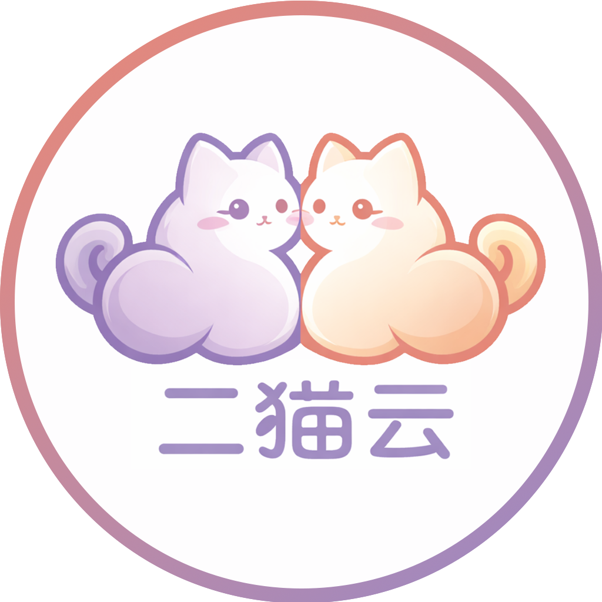
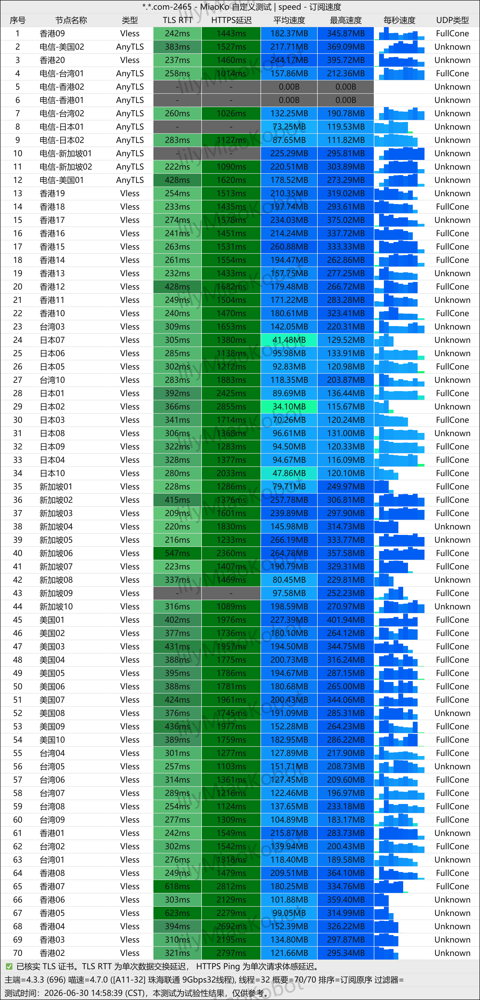

随着越来越多机场开始打价格战，真正能够长期稳定运营、持续维护线路质量、不断优化用户体验的平台反而越来越少。

二猫云就是这样一家定位比较特殊的机场。

官方并没有把重点放在"全网最低价"、"无限流量"等营销口号上，而是强调：

- 海外技术团队主理
- 独家定制客户端
- 支持通用订阅
- 不卷低价跑路盘
- 长期稳定运营
- 提供真正高枕无忧的网络体验

那么本文将从产品定位、套餐价格、使用体验、客户端、订阅方式、适合人群等多个方面进行全面解析。

📲 官网地址（建议收藏）：[https://youyounet.ermaoaff.com](https://youyounet.ermaoaff.com/#/register?code=KXiMtc9I)

<!-- more -->

---

## 二猫云机场基础信息

| 项目 | 详细信息 |
| :--- | :--- |
| **🌐 官方网站** | [https://youyounet.ermaoaff.com](https://youyounet.ermaoaff.com/#/register?code=KXiMtc9I) |
| **💰 入门价格** | 7.41元/60G每月（年付）|
| **💳 充值方式** | 支付宝、微信支付、USDT |
| **🌍 线路** | 60+ 全球节点 |
| **🔗 协议支持** | 解锁Netflix/ChatGPT、海外技术团队主理、独家定制客户端等 |

---

## 📚套餐详情

| 🧮套餐等级 | 📛套餐名称 | 📑适用人群 | 🔁可选周期 | 💰月费 | 📶流量 | 🛍️购买链接 |
|---------|----------|----------|----------|------|------|----------| 
| 入门版 | 二猫年付小包 | 轻度使用 | 年付 | ¥7.41/每月 |60GB/月 |[购买链接](https://www.lvpn.cc/r/Q8TKEB ) |
| 进阶版 | 二猫云 · 白猫套餐 | 中度用户 | 月付、季付、半年、年付 | ¥20.00/每月 |130GB/月 | [购买链接](https://www.lvpn.cc/r/Q8TKEB ) |
| 专业版 | 二猫云 · 橘猫畅玩版 |	中转重度用户 | 月付 | ¥40.00/每月 |230GB/月 |[购买链接](https://www.lvpn.cc/r/Q8TKEB ) |
| 尊享版 | 二猫云 · 牛奶猫尊享版 | 重度用户 | 月付、季付、半年、年付 | ¥80.00/每月 |430GB/月 | [购买链接](https://www.lvpn.cc/r/Q8TKEB ) |
| 至尊版 | 二猫云 · 黑猫重度用户版  | 老重度用户 | 月付、季付、半年、年付 | ¥160.00/每月 |850GB/月 |[购买链接](https://www.lvpn.cc/r/Q8TKEB ) |

👉 **推荐指数：⭐⭐⭐⭐（性价比极高）**

---

## 官方介绍：

> 海外技术团队主理，拥有独家定制客户端。我们不卷低价跑路盘，只做真正能长期陪伴、高枕无忧的优质网络体验。

虽然介绍只有一句话，但是表达出了几个核心方向。

## 海外团队维护

相比很多个人维护的小型机场，拥有长期技术团队意味着：

- 节点维护更加及时
- 系统升级更稳定
- 客户端更新更积极
- 后期运营更有保障

对于长期用户而言，这一点远比便宜几块钱更重要。

---

## 拥有独家客户端

很多机场只是提供订阅地址。

二猫云除了支持标准订阅，还拥有自己的客户端。

这样最大的优势就是：

- 导入更加简单
- 更新更方便
- 新手零学习成本
- 使用体验更加统一

对于第一次接触机场的新用户来说，几乎不用研究各种参数即可快速使用。

---

## 同时支持通用订阅

虽然拥有自己的客户端，但二猫云依旧支持通用订阅。

意味着可以导入：

- Clash Meta
- Clash Verge Rev
- Mihomo Party
- Shadowrocket
- Surge
- Stash
- Quantumult X
- sing-box

兼顾了新手和老用户。

---

## 套餐推荐

### 20元130GB

适合：

- 新用户体验
- 备用机场
- 日常浏览网页
- AI工具
- ChatGPT
- Google搜索

对于轻度用户已经足够。

---

### 40元230GB

推荐指数：⭐⭐⭐⭐⭐

这是个人认为性价比最高的一档。

适合：

- 日常办公
- YouTube
- Netflix
- GPT
- Claude
- Gemini

绝大多数普通用户选择这一档即可。

---

### 80元430GB

适合：

- 经常观看4K视频
- 多设备同时使用
- 家庭共享
- 高频网络用户

拥有更充足流量。

---

### 160元850GB

属于高流量套餐。

适合：

- 重度影音用户
- 下载较多
- 多人共同使用

基本不用担心流量不足。

---

## 一次性订阅说明

官方说明：

> 订阅链接采用加密，仅导入时有效。

这种设计主要有几个优点：

- 防止订阅泄露
- 防止被恶意传播
- 提高账号安全性
- 减少链接失效风险

相比传统明文订阅，更加安全。

---

## 为什么越来越多人选择稳定机场？

很多用户以前喜欢选择最低价机场。

但是近几年越来越多人开始关注：

- 是否跑路
- 是否长期运营
- 是否有人维护
- 是否更新节点
- 是否及时修复故障

二猫云提出：

> 不卷低价跑路盘。

其实正是顺应了当前用户需求。

真正每天都会使用机场的人，更愿意选择稳定而不是便宜。

---

## 二猫云有哪些优势？

### ① 海外技术团队

拥有持续维护能力。

### ② 独家客户端

使用简单。

### ③ 支持通用订阅

兼容所有主流客户端。

### ④ 套餐丰富

覆盖轻度到重度用户。

### ⑤ 长期运营理念

相比低价机场更加注重长期体验。

---

## 哪些人适合二猫云？

推荐以下用户：

✅ ChatGPT 用户

✅ Claude 用户

✅ Gemini 用户

✅ YouTube 用户

✅ Netflix 用户

✅ TikTok 用户

✅ 日常办公

✅ 留学生

✅ 外贸从业者

✅ 开发者

✅ 跨境电商

---

## 二猫云适合长期使用吗？

从官方定位来看：

> 不卷低价跑路盘

说明官方更愿意投入维护。

对于长期使用机场来说，这种定位通常更加可靠。

当然，任何机场都建议：

- 先购买低套餐体验
- 确认当地网络表现
- 满意后再升级套餐

这是选择机场最稳妥的方法。

---

## 为什么二猫云适合新手？

很多机场需要：

- 找客户端
- 找教程
- 导入订阅
- 修改配置

而二猫云拥有：

- 定制客户端
- 标准订阅
- 更简单的导入方式

能够降低学习成本。

---

## 总结

综合来看，二猫云并不是一款追求极限低价的机场，而是一款更加注重长期稳定运营和用户体验的产品。

其主要优势包括：

- 海外技术团队维护
- 独家定制客户端
- 支持通用订阅
- 加密订阅链接
- 多档套餐选择
- 长期运营理念

如果你更重视稳定、省心，而不是一味追求最低价格，那么二猫云值得加入你的机场备选名单。

---

## 常见问题（FAQ）

### 二猫云机场靠谱吗？

官方定位长期运营，拥有海外技术团队维护，支持通用订阅，并强调不做低价跑路盘。

---

### 二猫云支持哪些客户端？

支持Clash Meta、Clash Verge Rev、Shadowrocket、Surge、Stash、Quantumult X、sing-box等支持标准订阅的客户端。

---

### 二猫云最便宜套餐多少钱？

20元130GB，是目前最低门槛套餐。

---

### 二猫云适合新手吗？

适合。

拥有独家客户端，同时支持标准订阅，导入过程比较简单。

---

### 二猫云值得长期使用吗？

如果你更关注稳定性和长期体验，而不是极低价格，那么二猫云是值得考虑的机场之一。

---

## 延伸阅读

- 👉 查看完整推荐榜单：[2026年翻墙机场推荐评测｜稳定便宜VPN机场排行榜（高性价比科学上网工具长期更新）](/vpn-recommend/)  
- 👉 机场对比分析：[全网最全推荐！2026翻墙机场性能与价格对比榜,实测百家机场：哪家最稳？哪家最便宜？（持续更新）](/airport/jichangpk/)    
- 👉 Clash教程：[2026最新版Clash 全平台使用教程（Windows / Mac / Android / iOS）｜新手入门+配置详解](/scamvpn/Clashquanpingtai/)  
- 👉 Shadowrocket教程：[Shadowrocket （小火箭）2026年使用指南：iOS/macOS全平台配置教程(含非国区ID)](/article/Shadowrocket/)     
- 👉 常见问题FAQ：[Shadowrocket 被封怎么办？2026最新解决方法（小火箭无法连接/节点超时/订阅失效））](/article/shadowrocketbeifeng/)  
👉每天免费更新Apple ID：[2026年 最新最全免费共享美区 Apple ID |Shadowrocket/小火箭下载|每日更新](/article/freeAppleID/ )  

---

## 🔄 更新说明

📅 最后更新：2026年7月（已实测节点稳定性）  

本文将持续更新测速与稳定性表现，建议收藏。

---

>评测数据基于实际测试结果，服务表现可能因网络环境而异。建议你根据自身需求进行实际测试验证。

>📝 免责声明：本文仅供信息参考，建议均为个人经验与观点，不构成法律意见。实际情况以最新政策和主管部门解释为准，请在合法合规框架内使用相关服务。任何违法使用行为与本站无关。
