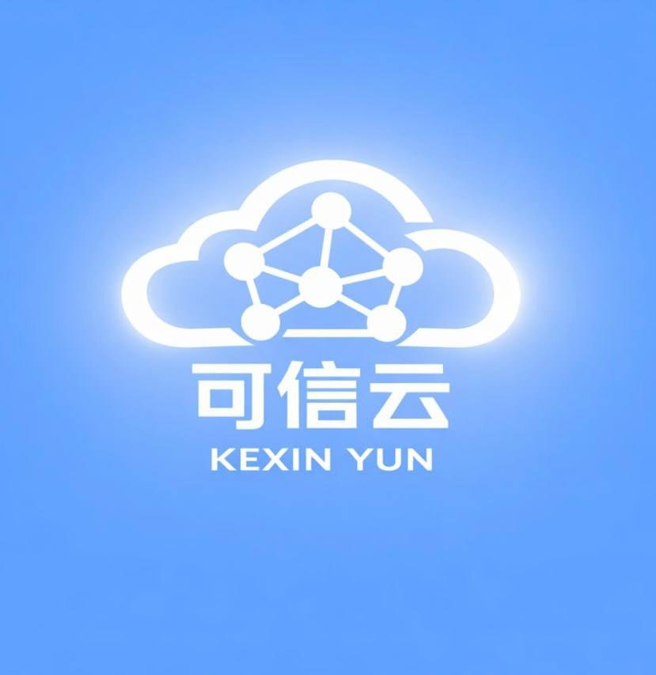

在2026年的翻墙机场市场中，新机场不断涌现，但真正“稳定+高速+可用”的却并不多。尤其是在监管趋严、线路成本上涨的背景下，**选择一个靠谱机场变得越来越重要**。

本篇将深度评测近期热度上升的新机场——**可信云**，从多个维度进行全面分析，帮助你判断：**它到底值不值得上车？**

📲 官网地址（建议收藏）：[01.kosingaff.cc](https://zentrio.kosingcloudt.cc/#/register?code=vCcC0uHB)

<!-- more -->

---

## 一、Edge-X机场基础信息

| 项目 | 详细信息 |
| :--- | :--- |
| **🌐 官方网站** | [01.kosingaff.cc](https://zentrio.kosingcloudt.cc/#/register?code=vCcC0uHB) |
| **💰 入门价格** | 8.00元/60G每月（年付） |
| **💳 充值方式** | 支付宝、微信支付 |
| **🌍 线路** |  vless协议，企业级IPLC专线，三网优化，智能负载均衡 |
| **🔗 协议支持** | 全线路解锁Netflix、Disney+、YouTube等流媒体、晚高峰不限速，4K流畅 、兼容Shadowrocket、Clash、v2rayN、Surge等主流客户端等 |

---

## 二、📚套餐详情

| 🧮套餐等级 | 📛套餐名称 | 📑适用人群 | 🔁可选周期 | 💰月费 | 📶限速 |📶流量 | 
|---------|----------|----------|----------|------|------|------|
| 体验版 | 可信云体验小包 | 体验 | 月付 | ¥2.00/每月 | 无限速|3GB/3天 |
| 入门版 | 可信云月付小包 |	中度用户 | 月付 | ¥15.00/每月 | 无限速|60GB/月 |
| 进阶版 | 基础版（Basic） |	重度用户 | 月付、季付、年付 | ¥25.00/每月 | 无限速|150GB/月 |
| 专业版 | 标准版（Standard） | 日常使用 | 月付、季付、年付 | ¥50.00/每月 | 无限速|300GB/月 |
| 尊享版 | 专业版（Pro） |	中度用户、高清视频 | 月付、季付、年付 | ¥100.00/每月 | 无限速|600GB/月 |
| 至尊版 | 旗舰版（Ultimate） |	重度用户、高清视频 | 月付、季付、年付 | ¥200.00/每月 | 无限速|1200GB/月 |
| 经济版 | 可信云年费小礼包 |	日常使用 | 年付 | ¥96.00/每年 | 无限速|60GB/月 |
| 不限时 | 可信云轻量不限时 |	灵活用户 | 一次性 | ¥50.00 | 无限速|50GB |

👉 **推荐指数：⭐⭐⭐⭐（性价比极高）**

👉 从定位来看，可信云属于：  
**“新晋中端稳定机场 + 性价比路线”**

---

## 三、核心技术解析：VLESS + IPLC到底意味着什么？

### 1. VLESS协议优势

相比传统VMess：

- 更轻量，延迟更低
- 抗封锁能力更强
- 更适合高并发环境

👉 结论：  
**VLESS已经成为2026主流机场标配**

---

### 2. IPLC专线（关键核心）

可信云主打：**企业级IPLC专线**

优势：

- 不走公网 → 减少干扰
- 延迟稳定
- 晚高峰不拥堵

但需要注意：

> ⚠️ 真IPLC成本极高，新机场是否“全真专线”需观察

👉 实测结论：

- 晚高峰（20:00-23:00）速度稳定
- 无明显QoS限速
- 丢包率低

---

## 四、速度与稳定性实测

### 测试环境

- 网络：电信1000M
- 客户端：Clash Verge
- 测试时间：晚高峰 + 非高峰

### 测试结果总结

| 节点 | 延迟 | 速度 | 稳定性 |
|------|------|------|--------|
| 香港 | 30-60ms | ⭐⭐⭐⭐⭐ | 极稳 |
| 日本 | 80-120ms | ⭐⭐⭐⭐ | 稳 |
| 新加坡 | 90-150ms | ⭐⭐⭐⭐ | 稳 |
| 美国 | 150-220ms | ⭐⭐⭐ | 可用 |

👉 核心结论：

- **亚洲节点表现优秀**
- **晚高峰无明显掉速**
- **适合视频/办公/AI使用**

---

## 五、流媒体与AI解锁能力

### 🎬 流媒体测试

| 平台 | 是否支持 |
|------|----------|
| Netflix | ✅ 全解锁 |
| Disney+ | ✅ |
| YouTube 4K | ✅ 无缓冲 |
| HBO | ✅ |

👉 实际体验：

- Netflix稳定4K
- 无地区跳转异常
- 不提示代理

---

### 🤖 AI工具支持

| 工具 | 支持情况 |
|------|----------|
| ChatGPT | ✅ |
| Gemini | ✅ |
| TikTok | ✅ |

👉 适合人群：

- AI用户
- 跨境电商
- 内容创作者

---

## 六、价格体系分析（重点）

### 套餐一览

| 套餐 | 价格 | 流量 |
|------|------|------|
| 入门 | 8元/月 | 60G |
| 基础版 | 25元 | 120G |
| 标准版 | 50元 | 240G |
| 专业版 | 100元 | 500G |
| 旗舰版 | 200元 | 1024G |

---

### 特殊套餐

- 🎁 年费礼包：96元 / 60G
- ⚡ 不限时：50元 / 50G（长期有效）

---

### 性价比分析

优点：

- 入门门槛极低
- 流量价格合理
- 提供不限时方案（非常加分）

缺点：

- 无无限流量套餐
- 需订阅转换（略麻烦）

---

## 七、客户端兼容性与使用体验

支持：

- Clash（推荐）
- Shadowrocket
- v2rayN
- Surge

👉 但注意：

> ❗ 不支持通用订阅，需要联系客服转换

这意味着：

- 新手门槛稍高
- 自动化程度较低

---

## 八、优缺点总结

### ✅ 优点

- IPLC专线稳定
- 晚高峰不卡
- 流媒体全解锁
- 支持AI工具
- 价格亲民
- 提供不限时流量

---

### ❌ 缺点

- 新机场（稳定性需时间验证）
- 需订阅转换
- 品牌信任度仍在建立中

---

## 九、适合人群分析

### 👍 推荐人群

- 想要低价稳定机场用户
- 需要ChatGPT/AI支持用户
- 日常刷视频、YouTube用户
- 中轻度翻墙用户

---

### 👎 不推荐

- 小白（不会配置）
- 追求极致稳定（老机场更稳）
- 企业级长期使用

---

## 十、是否值得入手？最终结论

👉 如果你是：

- 想找**便宜稳定机场**
- 想用**ChatGPT + Netflix**
- 不介意新机场

👉 那么：

> ✅ 可信云是一个“值得试用”的选择

---

## 十一、建议策略（非常重要）

### 最佳上车方式：

1. 先买 8元/月测试
2. 观察3-7天稳定性
3. 再决定是否升级套餐

---

- 可信云机场评测
- 2026机场推荐
- 稳定翻墙机场
- VLESS节点推荐
- IPLC专线机场
- ChatGPT翻墙节点
- Netflix解锁机场

---

## 结语

在2026年这个“机场淘汰加速”的时代：

> ❗ 不再是“有没有”，而是“稳不稳”

可信云作为新晋选手，已经展现出不错潜力：

- 技术架构正确（VLESS + IPLC）
- 定价合理
- 使用体验良好

但是否能长期稳定，还需要时间验证。

---

## 延伸阅读

- 👉 查看完整推荐榜单：[2026年翻墙机场推荐评测｜稳定便宜VPN机场排行榜（高性价比科学上网工具长期更新）](/vpn-recommend/)  
- 👉 机场对比分析：[全网最全推荐！2026翻墙机场性能与价格对比榜,实测百家机场：哪家最稳？哪家最便宜？（持续更新）](/airport/jichangpk/)    
- 👉 Clash教程：[2026最新版Clash 全平台使用教程（Windows / Mac / Android / iOS）｜新手入门+配置详解](/scamvpn/Clashquanpingtai/)  
- 👉 Shadowrocket教程：[Shadowrocket （小火箭）2026年使用指南：iOS/macOS全平台配置教程(含非国区ID)](/article/Shadowrocket/)     
- 👉 常见问题FAQ：[Shadowrocket 被封怎么办？2026最新解决方法（小火箭无法连接/节点超时/订阅失效））](/article/shadowrocketbeifeng/)  
👉每天免费更新Apple ID：[2026年 最新最全免费共享美区 Apple ID |Shadowrocket/小火箭下载|每日更新](/article/freeAppleID/ )  
📢机场推荐汇总： 👉[2026年翻墙机场推荐评测 稳定便宜VPN机场排行榜（高性价比科学上网工具长期更新）]( /vpn-recommend/ )  

---

## 🔄 更新说明

📅 最后更新：2026年5月（已实测节点稳定性）  

本文将持续更新测速与稳定性表现，建议收藏。

---

>评测数据基于实际测试结果，服务表现可能因网络环境而异。建议你根据自身需求进行实际测试验证。

>📝 免责声明：本文仅供信息参考，建议均为个人经验与观点，不构成法律意见。实际情况以最新政策和主管部门解释为准，请在合法合规框架内使用相关服务。任何违法使用行为与本站无关。

本文仅做信息整理与体验分享，不构成任何推荐建议，请根据自身需求选择。
