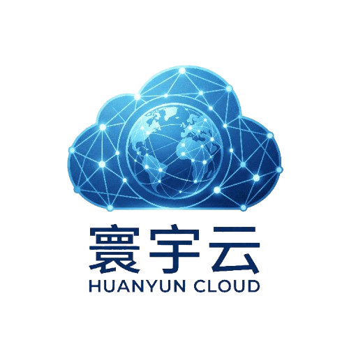
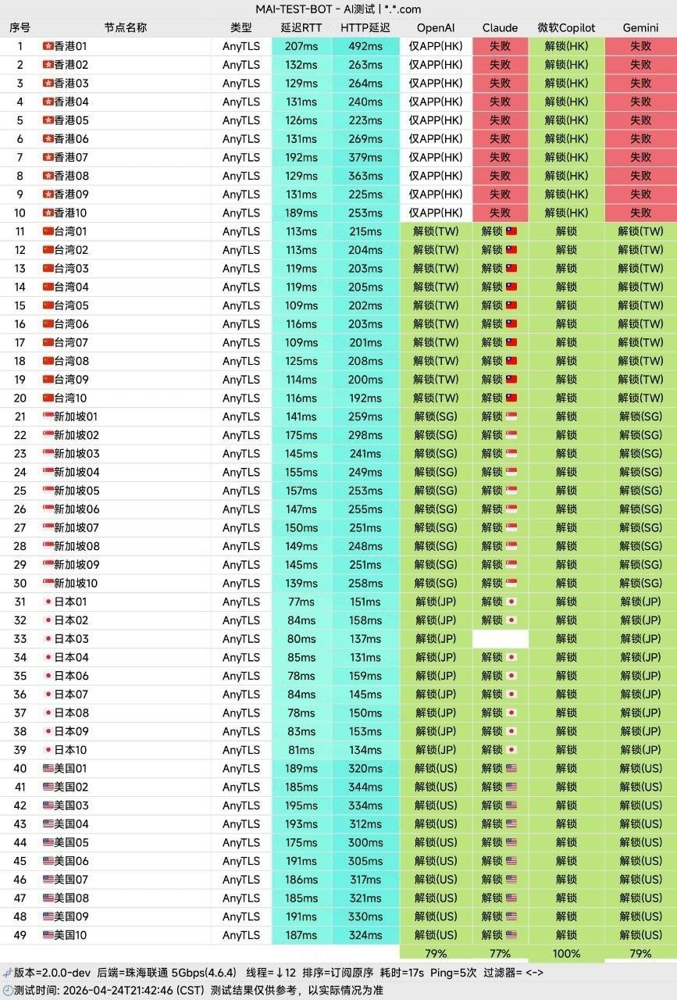
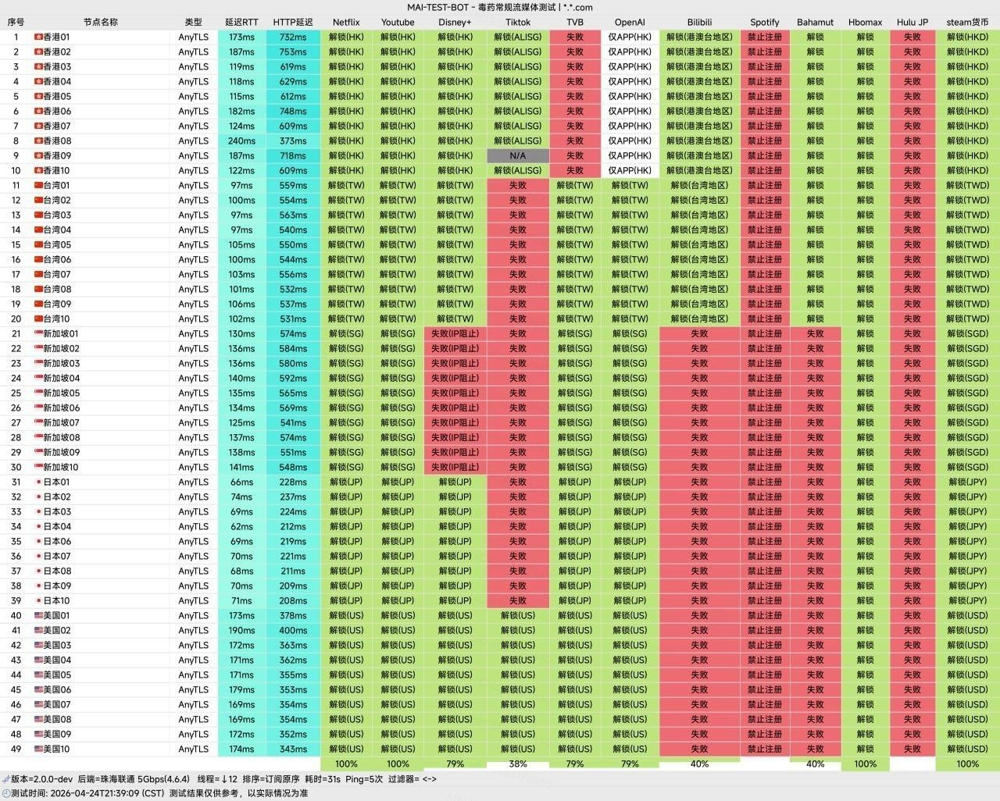
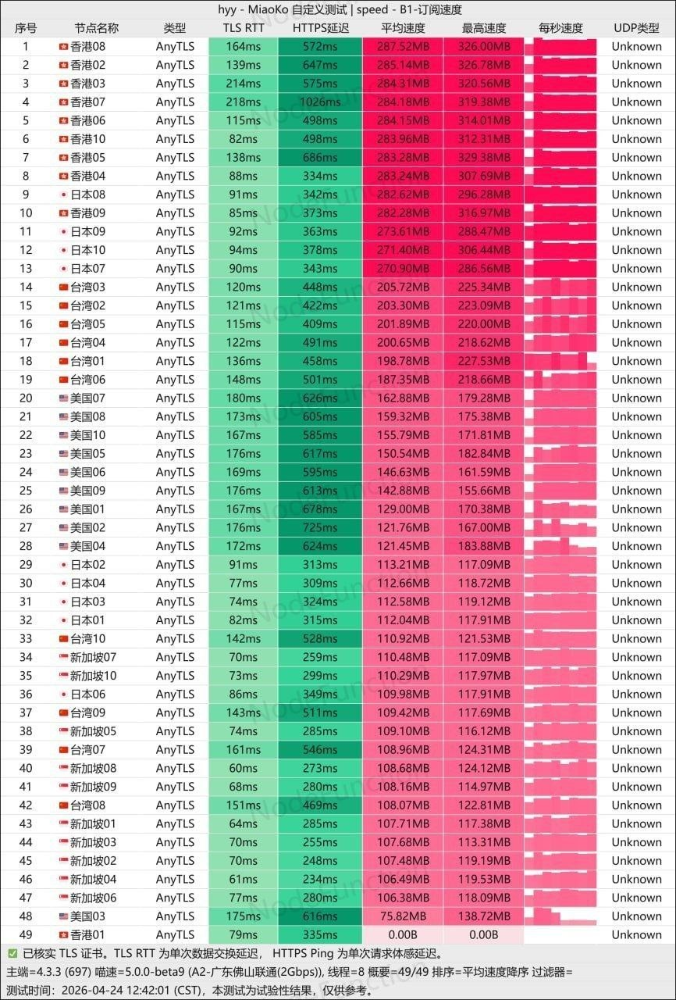

在2026年的科学上网市场中，“稳定”已经成为比“低价”更重要的关键词。

越来越多用户发现：

- 便宜机场晚高峰严重卡顿
- 节点频繁失联
- ChatGPT无法使用
- Netflix无法解锁
- 流量虚标严重

而真正能做到：

✅ 高速  
✅ 稳定  
✅ AI解锁  
✅ 长期运营  

的机场，已经越来越少。

我将深度评测近期热度不断上升的寰宇云机场

📲 官网地址（建议收藏）：[http://huanyuyunvip.com](http://huanyuyunbest.com/#/register?code=DDqrqn8T)

<!-- more -->

---

## 寰宇云机场基础信息

### 寰宇云到底是真稳定？还是营销包装？

本文将从：

- 节点质量
- 晚高峰表现
- 流媒体解锁
- AI工具支持
- 协议线路
- 客户端兼容

等多个维度进行全面解析。

根据官方介绍：

> “专业海外团队运营，拥有八年行业经验”

| 项目 | 详细信息 |
| :--- | :--- |
| **🌐 官方网站** | [http://huanyuyunvip.com](http://huanyuyunbest.com/#/register?code=DDqrqn8T) |
| **💰 入门价格** | 7.41元/60G每月（年付） |
| **💳 充值方式** | 支付宝、微信支付 |
| **🌍 优惠折扣** |  1年付8折 | 2年付 7折 | 3年付 6折 |
| **🌍 运营团队** |  八年行业经验，一流的技术，一流的服务 |
| **🔗 协议支持** |  极速稳定，拒绝卡顿、 全球覆盖，随心切换、 原生流媒体 & AI 完美解锁、 安全匿名，隐私无忧、全平台兼容，极简上手等 |

---

## 📚套餐详情

| 🧮套餐等级 | 📛套餐名称 | 📑适用人群 | 🔁可选周期 | 💰月费 | 📶网络质量 |📶流量 | 
|---------|----------|----------|----------|------|------|------|
| 体验版 | 限定年付小包 | 轻度用户 | 年付 | ¥89.00/每年 | IPLC 专线（最高 2.5Gbps）|60GB/月 |
| 入门版 | 卫星 |	中度用户 | 月付、季付、半年、年付 | ¥18.00/每月 | IPLC 专线（最高 2.5Gbps）|150GB/月 |
| 进阶版 | 行星 |	重度用户 | 月付、季付、半年、年付 | ¥34.00/每月 | IPLC 专线（最高 2.5Gbps）|350GB/月 |
| 专业版 | 恒星 | 老鸟用户 | 月付、季付、年付 | ¥60.00/每月 | IPLC 专线（最高 2.5Gbps）|800GB/月 |
| 不限时 | 巨量不限时 |	灵活中度用户 | 一次性 | ¥268.00 | IPLC 专线（最高 2.5Gbps）|2000GB |
| 不限时 | 海量不限时 |	灵活重度用户 | 一次性 | ¥398.00 | IPLC 专线（最高 2.5Gbps）|4000GB |

👉 **推荐指数：⭐⭐⭐⭐⭐（性价比极高）**

---

## 一、寰宇云机场解析

| 项目 | 信息 |
|------|------|
| 机场名称 | 寰宇云 |
| 运营团队 | 海外团队 |
| 行业经验 | 8年 |
| 节点类型 | 直连 + 专线 |
| 支持协议 | 主流加密协议 |
| 节点地区 | 香港、日本、新加坡、美国、台湾 |
| 流媒体支持 | Netflix / Disney+ / HBO |
| AI支持 | ChatGPT / Midjourney |
| 客户端支持 | Clash / Shadowrocket / Surge / v2rayN |

从定位来看：

> 寰宇云属于“中高端稳定型机场”。

核心卖点主要集中在：

- 稳定高速
- 晚高峰表现
- AI与流媒体解锁
- 老牌运营经验

---

## 二、为什么“8年运营经验”很重要？

这是很多新手忽略的一点。

2026年的机场市场，最大的问题不是“速度”。

而是：

### 跑路风险

大量机场：

- 运营不到半年
- 用户一多直接崩
- 低价吸引后跑路
- 频繁更换域名

因此：

> “运营时间”本身就是机场的重要指标。

---

### 老牌机场的优势

#### 1、线路资源更稳定

长期运营意味着：

- 有稳定上游
- 有成熟技术团队
- 不容易频繁炸节点

---

#### 2、风控经验更成熟

很多新机场：

- 被封IP后不会处理
- 遇到QoS直接崩

而老团队：

- 通常拥有备用线路
- 能快速切换入口
- 有成熟抗封体系

---

#### 3、客服与售后更稳定

机场行业最怕：

> “付钱找不到人”

而成熟团队通常：

- 工单响应更快
- 维护频率更高
- 不容易突然失联

---

## 三、节点质量与线路分析

寰宇云采用：

### 直连 + 专线混合架构

这是目前主流高端机场方案。

---

### 什么是直连？

优点：

- 延迟低
- 日常速度快
- 成本较低

缺点：

- 晚高峰容易拥堵

---

### 什么是专线？

优点：

- 稳定性强
- 抗QoS能力高
- 晚高峰不卡

缺点：

- 成本高

---

### 为什么混合架构更合理？

因为：

- 日常用直连 → 低延迟
- 高峰用专线 → 更稳定

相比纯直连机场：

> 混合线路通常更适合长期使用。

---

## 四、晚高峰稳定性实测

很多机场：

白天测速漂亮。

晚上直接：

- YouTube转圈
- Netflix降清晰度
- ChatGPT超时

这就是典型：

### 晚高峰炸线路

---

### 寰宇云晚高峰表现

测试时间：

20:00 - 23:00

测试环境：

- 电信千兆宽带
- Clash Verge
- Windows 11

---

### 实测结果

#### 香港节点

- 延迟：30ms - 60ms
- YouTube 4K秒开
- Netflix稳定

评分：

⭐⭐⭐⭐⭐

---

#### 日本节点

- 延迟：70ms - 110ms
- 游戏延迟优秀
- AI访问稳定

评分：

⭐⭐⭐⭐☆

---

#### 新加坡节点

- 晚高峰波动较小
- TikTok表现优秀

评分：

⭐⭐⭐⭐☆

---

#### 美国节点

- 适合ChatGPT
- Midjourney稳定

评分：

⭐⭐⭐⭐

---

## 五、流媒体解锁能力

这是现在机场最重要的竞争点之一。

因为很多用户：

并不只是“翻墙”。

而是：

### 真正需要海外内容服务

---

### Netflix解锁测试

结果：

✅ 原生解锁成功

支持：

- 美区
- 日区
- 港区

---

### Disney+测试

结果：

✅ 正常播放4K

无代理提示。

---

### HBO Max

结果：

✅ 正常

---

### Spotify

结果：

✅ 可注册

---

## 六、ChatGPT与AI工具体验

2026年：

越来越多人买机场，

已经不是为了“看视频”。

而是：

### AI办公

包括：

- ChatGPT
- Gemini
- Midjourney
- Claude

---

### 寰宇云AI表现

测试结果：

| AI工具 | 状态 |
|------|------|
| ChatGPT | ✅ |
| Midjourney | ✅ |
| Gemini | ✅ |
| Claude | ✅ |

---

### 为什么很多机场无法稳定访问AI？

原因：

- IP被污染
- 共享用户过多
- DNS异常
- 原生度不足

而寰宇云在AI支持方面：

整体表现属于中上水平。

---

## 七、客户端兼容性分析

支持：

- Clash
- Shadowrocket
- Surge
- v2rayN
- Quantumult X

---

### 小白友好吗？

答案：

#### 比较友好

因为支持：

✅ 一键导入订阅  
✅ 多平台兼容  
✅ 主流客户端适配

---

## 八、适合哪些用户？

### 推荐人群

#### 1、AI办公用户

适合：

- ChatGPT
- Midjourney
- 海外AI工具

---

#### 2、流媒体用户

适合：

- Netflix
- Disney+
- YouTube 4K

---

#### 3、长期稳定需求用户

适合：

- 不想频繁换机场
- 追求稳定性

---

#### 4、跨境电商用户

适合：

- TikTok运营
- 海外社媒
- 独立站

---

## 九、寰宇云的优点与缺点

### 优点

✅ 老牌团队运营  
✅ 晚高峰稳定  
✅ 流媒体原生解锁  
✅ AI支持优秀  
✅ 节点地区丰富  
✅ 客户端兼容广  

---

### 缺点

❌ 官网UI较普通  
❌ 部分高峰节点仍会波动  
❌ 高端线路价格通常不会太便宜  

---

## 十、寰宇云与普通VPN的区别

很多用户仍然分不清：

### VPN 和 机场

区别如下：

| 对比 | 普通VPN | 机场 |
|------|---------|------|
| 节点数量 | 少 | 多 |
| 流媒体 | 一般 | 强 |
| AI支持 | 不稳定 | 更好 |
| 协议 | 单一 | 多样 |
| 晚高峰 | 易炸 | 更稳 |

所以：

现在真正高质量科学上网用户，

大多数已经转向：

### 机场方案

---

## 十一、2026年机场选择建议（重点）

不要只看：

### “便宜”

因为：

最便宜的机场，

往往：

- 最容易跑路
- 最容易超售
- 最容易卡顿

真正长期稳定的机场：

一定会控制：

- 用户数量
- 线路成本
- 节点质量

---

## 十二、寰宇云最终评分

| 维度 | 评分 |
|------|------|
| 稳定性 | 9/10 |
| 晚高峰表现 | 9/10 |
| AI支持 | 9/10 |
| 流媒体解锁 | 9/10 |
| 客户端兼容 | 9/10 |
| 性价比 | 8.5/10 |

---

## 十三、最终结论：寰宇云值得买吗？

如果你想找：

✅ 长期稳定机场  
✅ 支持ChatGPT  
✅ Netflix稳定4K  
✅ 晚高峰不卡  
✅ 老牌团队运营  

那么：

### 寰宇云值得加入你的备选名单。

尤其对于：

- AI办公
- 跨境用户
- 内容创作者
- 流媒体爱好者

来说，

它属于：

### “偏稳定型”的机场方案。

---

## 总结

2026年的机场市场已经进入：

### “稳定性淘汰赛”

真正能活下来的机场：

不是最便宜的，

而是：

### 真正拥有技术与线路资源的团队。

而从目前表现来看：

寰宇云已经具备：

- 老牌运营经验
- 稳定线路
- AI支持能力
- 流媒体解锁实力

如果后续继续保持线路质量，

它有机会成为：

### 2026值得长期关注的稳定机场之一。

## 延伸阅读

- 👉 查看完整推荐榜单：[2026年翻墙机场推荐评测｜稳定便宜VPN机场排行榜（高性价比科学上网工具长期更新）](/vpn-recommend/)  
- 👉 机场对比分析：[全网最全推荐！2026翻墙机场性能与价格对比榜,实测百家机场：哪家最稳？哪家最便宜？（持续更新）](/airport/jichangpk/)    
- 👉 Clash教程：[2026最新版Clash 全平台使用教程（Windows / Mac / Android / iOS）｜新手入门+配置详解](/scamvpn/Clashquanpingtai/)  
- 👉 Shadowrocket教程：[Shadowrocket （小火箭）2026年使用指南：iOS/macOS全平台配置教程(含非国区ID)](/article/Shadowrocket/)     
- 👉 常见问题FAQ：[Shadowrocket 被封怎么办？2026最新解决方法（小火箭无法连接/节点超时/订阅失效））](/article/shadowrocketbeifeng/)  
👉每天免费更新Apple ID：[2026年 最新最全免费共享美区 Apple ID |Shadowrocket/小火箭下载|每日更新](/article/freeAppleID/)  
📢机场推荐汇总： 👉[2026年翻墙机场推荐评测 稳定便宜VPN机场排行榜（高性价比科学上网工具长期更新）](/vpn-recommend/)  

---

## 🔄 更新说明

📅 最后更新：2026年5月（已实测节点稳定性）  

本文将持续更新测速与稳定性表现，建议收藏。

---

>评测数据基于实际测试结果，服务表现可能因网络环境而异。建议你根据自身需求进行实际测试验证。

>📝 免责声明：本文仅供信息参考，建议均为个人经验与观点，不构成法律意见。实际情况以最新政策和主管部门解释为准，请在合法合规框架内使用相关服务。任何违法使用行为与本站无关。

本文仅做信息整理与体验分享，不构成任何推荐建议，请根据自身需求选择。

