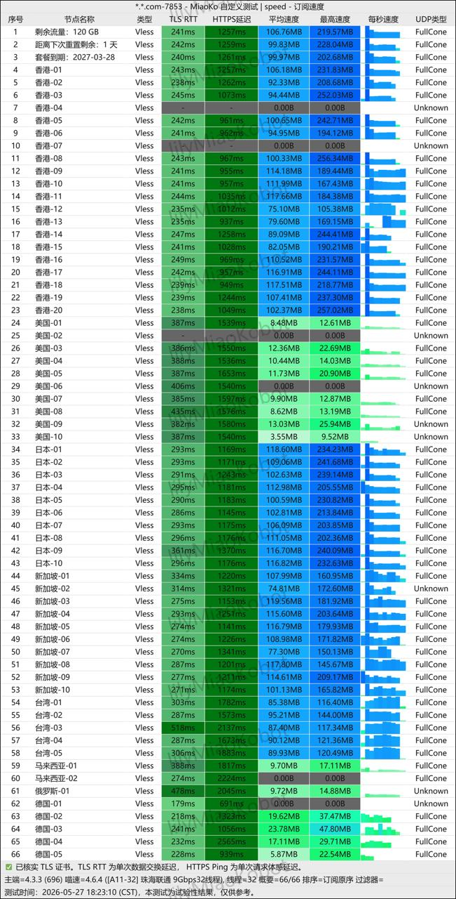
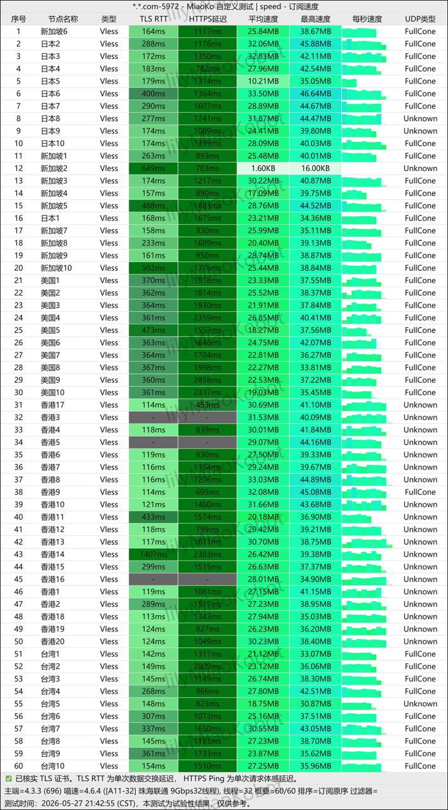

如果你正在寻找一家主打 **IEPL专线、低延迟、晚高峰稳定、流媒体秒开、远程办公不卡顿** 的机场，那么 **速界机场** 是近期值得关注的新机场之一。

速界机场官网宣传重点非常明确：

- 真 IEPL 内网专线
- 端到端独享国际专线链路
- 不经过公共互联网
- 低延迟、低抖动、晚高峰稳定
- 支持 Shadowsocks / V2Ray / Trojan
- 支持 Windows、macOS、iOS、Android、OpenWrt、软路由
- 面向 4K/8K 流媒体、远程办公、海外游戏、跨境电商和开发者场景

本文会从 **速界机场基础信息、套餐价格、IEPL专线优势、适合人群、使用风险、购买建议、FAQ** 等方面进行完整解析，帮助你判断速界机场是否适合作为主力机场或备用机场。

📲 官网地址（建议收藏）：[官网](https://youyou.speedworldaff.com/#/register?code=GlQn6mMK)

<!-- more -->

---

## 速界机场基础信息

| 项目 | 详细信息 |
| :--- | :--- |
| **🌐 官方网站** | [官网](https://youyou.speedworldaff.com/#/register?code=GlQn6mMK) |
| **🏷️ 机场名称** | 速界机场 / SpeedWorld |
| **💰 入门价格** | 年付体验包 ¥90/年；开业8折后约 ¥72/年，折合约 ¥6/月 |
| **📡 核心线路** | 企业级 IEPL 专线 |
| **🔐 协议支持** | Shadowsocks / V2Ray / Trojan |
| **📱 客户端支持** | Windows / macOS / iOS / Android，支持 OpenWrt、软路由导入 |
| **🔗 通用订阅** | 可订制临时订阅，当前主推官方客户端 |
| **📶 已知最低流量** | 年付体验包 50GB/月 |
| **🎯 适用场景** | 4K/8K流媒体、远程办公、视频会议、海外游戏、跨境电商、开发者API调用 |

::: warning 选购提醒
建议先用年付体验包或短周期套餐测试本地网络表现，不建议一上来就购买多年高价套餐。
:::

---

### 年付体验包

| 套餐名称 | 适合人群 | 周期 | 原价 | 开业优惠后 | 已知流量 | 购买链接 |
| --- | --- | --- | --- | --- | --- | --- |
| 年付体验包 | 轻度用户、备用机场、新手体验 | 年付 | ¥90/年 | 8折后约¥72/年，约¥6/月 | 50GB/月 | [前往官网](https://youyou.speedworldaff.com/#/register?code=GlQn6mMK) |

### 常规套餐价格

| 🧮套餐等级 | 📛套餐名称 | 📑适用人群 | 🔁月付 | 🔁季付 | 🔁半年付 | 🔁年付 | 🔁两年付 | 🔁三年付 | 🔄重置包 |
| --- | --- | --- | --- | --- | --- | --- | --- | --- | --- |
| 入门版 | 极速版 | 日常浏览、AI工具、轻度流媒体 | ¥25/月 | ¥71.25/季 | ¥135/半年 | ¥255/年 | ¥480/两年 | ¥630/三年 | ¥22.5/次 |
| 进阶版 | 超速版 | 中度用户、多设备、高清视频 | ¥50/月 | ¥142.50/季 | ¥270/半年 | ¥510/年 | ¥960/两年 | ¥1260/三年 | ¥46/次 |
| 专业版 | 光速版 | 4K流媒体、远程办公、游戏加速 | ¥100/月 | ¥285/季 | ¥540/半年 | ¥1020/年 | ¥1920/两年 | ¥2520/三年 | ¥95/次 |
| 企业版 | 跃迁版 | 团队协作、跨境业务、高频API调用 | ¥200/月 | ¥570/季 | ¥1080/半年 | ¥2040/年 | ¥3840/两年 | ¥5040/三年 | ¥180/次 |

👉 **性价比建议：**

- 只想低成本体验：优先看 **年付体验包**
- 日常轻度使用：优先看 **极速版**
- 想兼顾视频、AI、办公：可从 **超速版** 开始
- 对延迟和稳定性要求高：再考虑 **光速版 / 跃迁版**

---

## 速界机场核心优势解析

### 1. 真 IEPL 内网专线：稳定性的核心卖点

速界机场最重要的关键词是 **IEPL专线**。

官方介绍中提到，速界采用端到端独享 IEPL 国际专线链路，不经过公共互联网。这类线路相比普通公网中转，优势主要体现在：

- 晚高峰更不容易拥塞
- 延迟更低，抖动更小
- 数据传输路径更稳定
- 更适合视频会议、远程桌面、游戏和高频请求

如果你经常遇到普通机场晚高峰卡顿、YouTube掉速、Zoom会议音画不同步，IEPL专线通常会比普通公网线路更稳。

---

### 2. 全球智能接入点：降低入口延迟

速界机场宣传覆盖中国主要省市以及东南亚、欧美核心城市，并会自动优选低延迟入口。

对于机场体验来说，入口质量非常关键。

很多用户以为节点国家越多越好，但实际更影响体验的是：

- 入口是否离用户近
- 入口是否拥塞
- 是否针对电信、联通、移动做优化
- 高峰期是否能保持稳定

如果智能接入点调度做得好，用户不需要反复手动测速，也能获得比较稳定的连接体验。

---

### 3. 企业级加密传输：支持主流协议

速界机场支持：

- Shadowsocks
- V2Ray
- Trojan

并强调全节点 TLS 加密。

这意味着速界并不是只依赖单一协议，而是覆盖了当前主流代理协议生态。对于新手用户来说，官方客户端更省心；对于进阶用户来说，如果需要 Clash、Shadowrocket、Stash、Surge、sing-box 等客户端，建议购买前先确认是否能提供对应订阅格式。

---

### 4. 全平台兼容：电脑、手机、路由器都能用

速界机场资料中明确提到支持：

- Windows
- macOS
- iOS
- Android
- OpenWrt
- 软路由一键导入

这点对家庭用户和多设备用户很重要。

如果只在手机上使用，普通客户端即可；如果需要全家设备共享，OpenWrt 或软路由方案会更方便。你可以把速界作为主力节点源，再配合路由器实现电视、游戏机、平板等设备统一走代理。

---

## 速界机场适合哪些使用场景？

### 4K / 8K 流媒体

速界机场广告词中重点提到 **4K/8K 流媒体秒开**，适用平台包括：

- Netflix
- Disney+
- YouTube

对于流媒体用户来说，核心不是单次测速峰值，而是持续稳定带宽。IEPL专线如果质量稳定，通常更适合长时间观看高清视频。

---

### 跨国远程办公

远程办公更看重稳定性，而不是瞬时峰值速度。

典型场景包括：

- Zoom 视频会议
- Microsoft Teams
- Google Workspace
- Slack / Notion / Jira
- 海外远程桌面
- SSH / GitHub / API 请求

这类应用一旦丢包或抖动，体验会非常明显。速界主打低延迟 IEPL 专线，理论上更适合这类办公场景。

---

### 海外游戏加速

游戏加速更关注：

- ping 是否稳定
- 是否丢包
- 抖动是否小
- 高峰期是否突然跳延迟

如果速界的 IEPL 入口和目标节点调度稳定，对于海外游戏会比普通公网线路更有优势。不过游戏效果强依赖地区、运营商和游戏服务器位置，建议先小额测试。

---

### 跨境电商与开发者 API

跨境电商和开发者经常需要稳定访问：

- Shopify
- Amazon
- Google Ads
- Meta Business
- Stripe
- GitHub
- OpenAI / Claude / Gemini 相关服务

这类场景不适合频繁更换 IP 或使用质量很差的免费节点。速界如果能保持稳定线路和较干净的节点环境，会更适合作为生产力网络工具。

---

## 速界机场和普通机场有什么区别？

| 对比维度 | 速界机场 | 普通中转机场 |
| --- | --- | --- |
| 核心线路 | 企业级 IEPL 专线 | 公网中转、直连或混合线路 |
| 晚高峰稳定性 | 理论上更强 | 容易受拥塞影响 |
| 延迟表现 | 主打低延迟 | 视节点质量波动较大 |
| 适用场景 | 办公、流媒体、游戏、跨境业务 | 日常浏览、轻度使用 |
| 价格定位 | 中高端专线定位 | 覆盖低价到中端 |
| 新手友好度 | 主推客户端，入门更简单 | 通常需要自行导入订阅 |
| 风险点 | 运营约5个月，仍需观察 | 老机场看历史，新机场同样需观察 |

---

## 速界机场优缺点总结

### 优点

- 主打企业级 IEPL 专线
- 宣传端到端独享链路，不经过公共互联网
- 适合流媒体、远程办公、游戏加速和跨境业务
- 支持 Shadowsocks / V2Ray / Trojan
- 支持全平台客户端和软路由导入
- 年付体验包价格较低，开业优惠后约6元/月

---

### 缺点与风险

- 运营时间约5个月，仍属于新机场
- 暂无公开 TG 群或频道信息
- 当前资料未标明所有套餐的具体月流量
- 主推客户端，通用订阅需要提前确认
- 没有提供公开测速截图时，真实速度仍需用户本地测试

这些缺点并不是说速界不能用，而是提醒用户：新机场最重要的是先验证稳定性，再决定是否长期使用。

---

## 速界机场购买建议

### 推荐先买年付体验包的人

适合：

- 轻度用户
- 备用机场用户
- 想测试 IEPL 专线的人
- 只看 YouTube / ChatGPT / Google 的用户
- 对流量需求不高的人

年付体验包 50GB/月，开业优惠后折合约6元/月，试错成本比较低。

---

### 推荐买极速版的人

适合：

- 日常办公
- AI工具
- 网页浏览
- 偶尔看视频
- 手机和电脑双设备

如果你觉得体验包流量太少，但又不想一开始花太多，可以从极速版开始。

---

### 推荐买超速版或光速版的人

适合：

- 经常看高清视频
- 多设备同时使用
- 需要稳定会议
- 玩海外游戏
- 做跨境电商

这类用户对稳定性要求更高，建议先月付测试，再考虑长周期。

---

### 跃迁版适合哪些人？

跃迁版价格较高，更像是面向团队或高强度使用场景：

- 外贸团队
- 跨境电商团队
- 高频 API 调用
- 长时间远程办公
- 对延迟和稳定性要求很高的用户

个人用户一般不建议直接从跃迁版开始，除非已经确认本地网络表现非常稳定。

---

## 速界机场靠谱吗？

从产品定位看，速界机场的优势很清晰：

> 速界不是主打最低价，而是主打企业级 IEPL 专线和稳定低延迟。

但也要看到现实情况：

- 运营时长约5个月
- 暂无公开社群信息
- 缺少长期用户口碑积累
- 套餐流量信息需要以下单页为准

因此更稳妥的判断是：

**速界机场值得关注，也适合测试，但目前更建议先作为备用机场或轻度主力机场观察一段时间。**

如果后续运营稳定、节点质量持续在线、客服响应正常，再升级为主力机场会更稳。

---

## 总结：速界机场值得买吗？

综合来看，速界机场是一家定位比较清晰的新机场。

它不是那种靠极限低价吸引用户的机场，而是把核心卖点放在：

- 企业级 IEPL 专线
- 低延迟
- 晚高峰稳定
- 全平台客户端
- 流媒体和远程办公体验
- 跨境业务可用性

如果你只是偶尔浏览网页，可能不一定需要高规格专线机场；但如果你对稳定性、延迟、流媒体和办公体验有要求，速界机场可以加入你的备选名单。

**最稳妥的购买方式：先买体验包或短周期套餐，确认本地网络表现后再升级。**

---

## 常见问题（FAQ）

### 速界机场是什么？

速界机场是一家主打企业级 IEPL 专线、低延迟和高稳定体验的机场服务，主要面向流媒体、远程办公、海外游戏、跨境电商和开发者场景。

---

### 速界机场官网是多少？

速界机场官网是：[官网](https://youyou.speedworldaff.com/#/register?code=GlQn6mMK)

---

### 速界机场最便宜套餐多少钱？

根据当前资料，年付体验包为 ¥90/年，开业8折后约 ¥72/年，折合约 ¥6/月，每月 50GB 流量。

---

### 速界机场支持 Clash 或 Shadowrocket 吗？

当前资料显示速界可订制临时订阅，但主推官方客户端。如果你需要 Clash、Shadowrocket、Stash、Surge 等通用客户端，建议购买前先咨询官方确认订阅格式。

---

### 速界机场适合长期使用吗？

速界机场线路定位不错，但运营时长约5个月，仍需要时间验证。建议先短周期或低门槛体验，确认稳定后再长期使用。

---

### 速界机场适合看 Netflix 和 YouTube 吗？

官方宣传适合 4K/8K 流媒体，包括 Netflix、Disney+、YouTube 等场景。实际解锁能力和清晰度表现会受节点、地区和平台风控影响，建议以实际测试为准。

---

## 延伸阅读

- 👉 查看完整推荐榜单：[2026年翻墙机场推荐评测｜稳定便宜VPN机场排行榜（高性价比科学上网工具长期更新）](/vpn-recommend/)
- 👉 机场对比分析：[全网最全推荐！2026翻墙机场性能与价格对比榜，实测百家机场：哪家最稳？哪家最便宜？（持续更新）](/airport/jichangpk/)
- 👉 Clash教程：[2026最新版Clash 全平台使用教程（Windows / Mac / Android / iOS）｜新手入门+配置详解](/scamvpn/Clashquanpingtai/)
- 👉 Shadowrocket教程：[Shadowrocket（小火箭）2026年使用指南：iOS/macOS全平台配置教程](/article/Shadowrocket/)
- 👉 跑路避坑：[2026年机场跑路前的10大征兆：90%用户踩坑前都忽略了这些信号](/article/airport-scam-warning-signs-2026/)
- 👉 免费试用合集：[2026最新翻墙机场免费试用合集（免费试用+稳定机场推荐长期更新）](/article/mianfeijichang/)

---

## 更新说明

📅 最后更新：2026年7月3日

本文将持续更新测速与稳定性表现，建议收藏。

---

> 评测内容基于当前公开资料与用户提供信息整理，服务表现会因地区、运营商、客户端、节点负载和平台风控而变化。建议购买前先选择低门槛套餐实际测试。

> 📝 免责声明：本文仅供信息参考，不构成法律意见或强制购买建议。请在合法合规框架内使用相关网络服务，任何违法使用行为与本站无关。
