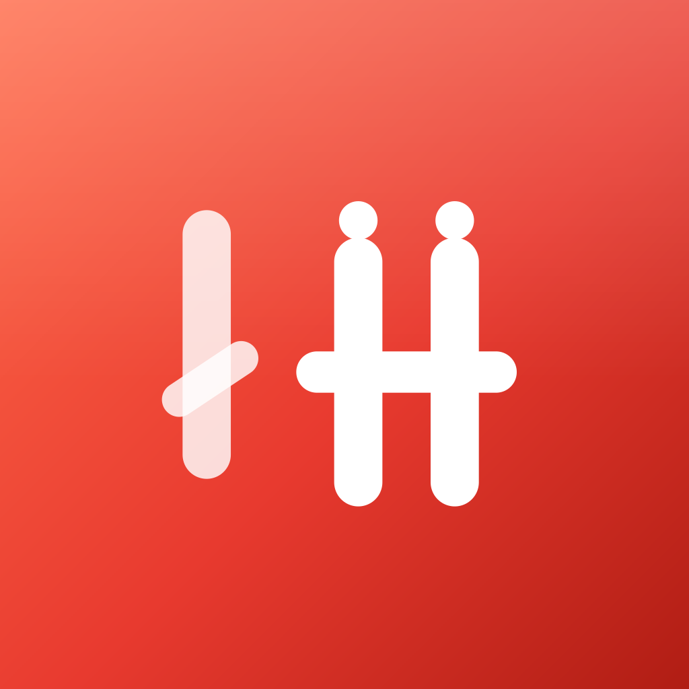
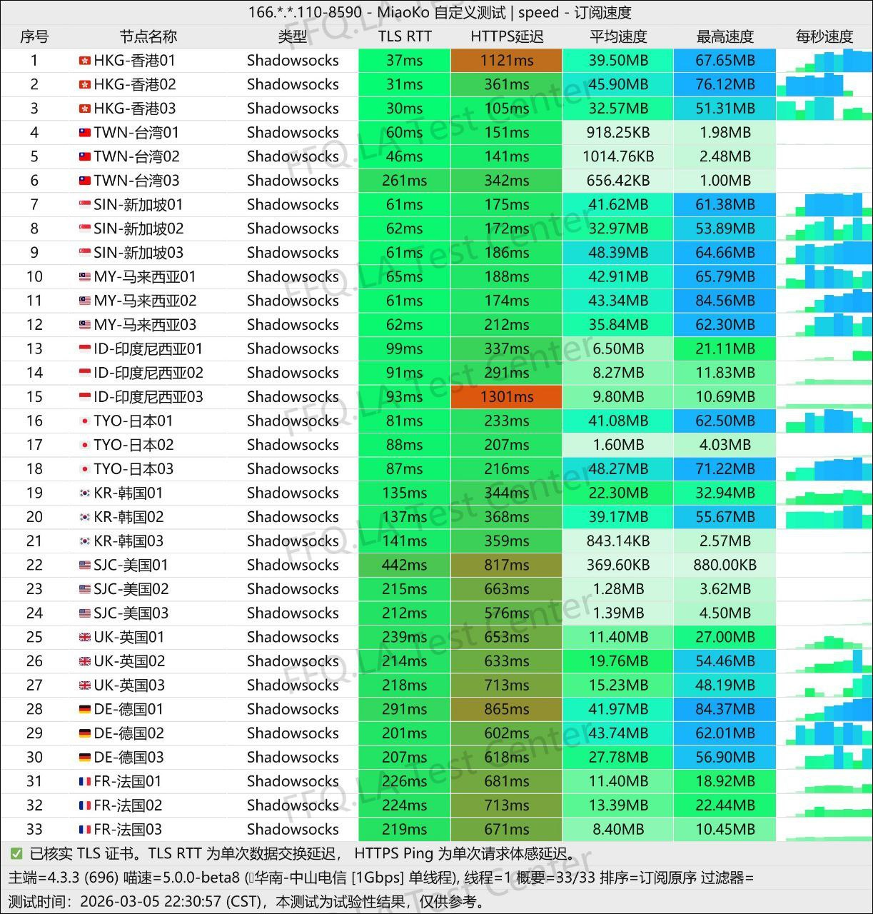

拼好连机场 9.9 元 100G 起，支持 Shadowsocks 协议、Netflix 和 YouTube 流媒体解锁，是目前关注度比较高的一类 高性价比机场推荐。如果你正在寻找一款价格低、入门门槛不高、适合新手测试的 Shadowsocks 机场，那么拼好连机场值得纳入对比列表。

拼好连机场主打的是轻量化、高可用、便于上手的使用体验，适合日常浏览、视频观看、社交媒体访问和基础办公场景。本文将从 套餐价格、节点线路、速度表现、客户端支持、购买流程、适合人群、优缺点 等多个维度，做一次更完整的深度评测。。==本人一直自用的机场,闭眼入！==

📲 官网地址 ： 👉 [官网](https://www.runwayhz.com/#/register?code=6uVJY4zh)
<!-- more -->
---

## 目录

1 📋信息总览  
2 📈套餐详情  
3 💻拼好连机场节点  
4 📲拼好连机场速度  
5 📩支持客户端  
6 📖购买与使用教程
7 💡常见问题  

---

## 📋信息总览 

| 项目 | 详细信息 |
|------|----------|
| 🌐 **官方网站** | [官网](https://www.runwayhz.com/#/register?code=6uVJY4zh) |
| 🎁 **新用户福利** | [👉一天免费6GB体验领取](https://www.runwayhz.com/#/register?code=6uVJY4zh) |
| 💰 **入门价格** | 9.9元/月（100G/月流量）|
| 💳 **充值方式** | 支付宝、微信支付 |
| 🌍 **设备限制** | 不限客户端连接数量 |
| 🔗 **协议支持** | Shadowsocks 协议 |
| 📺 **流媒体支持** | Netflix、YouTube 等流媒体解锁 |
| 🚀 **线路特点** | 三网 5G 网络优化、稳定高速、适合晚高峰场景 |
| 🧩 **适用人群** | 新手用户、轻度用户、流媒体用户、便宜机场需求用户 |
---

拼好连机场的核心卖点很明确：价格低、体验门槛低、支持流媒体、适合尝试。对于不想一开始就投入较高预算的用户来说，这种类型的机场更容易作为第一站进行测试和筛选。

## 📈套餐详情

| 🧮套餐等级 | 📛套餐名称 | 📑适用人群 | 🔁网速限制 | 💰费用 |🔁可选周期 | 📶流量 | 🛍️购买链接 |
|---------|----------|----------|----------|------|------|------|----------|
| 标准级 | 天天尝鲜拼 | 轻度用户 | 200Mbps | ¥9.90/月 |月付、季付、半年、一年| 100GB/月 | [购买链接](https://www.runwayhz.com/#/register?code=6uVJY4zh) |
| 专业级 | 万人好评拼 | 日常使用 | 400Mbps | ¥19.90/月 |月付、季付、半年、一年| 200GB/月 | [购买链接](https://www.runwayhz.com/#/register?code=6uVJY4zh) |
| 至尊级 | 至尊金牌拼 | 重度用户 | 不限速 | ¥50.00/月 |月付、季付、半年、一年| 600GB/月 | [购买链接](https://www.runwayhz.com/#/register?code=6uVJY4zh) |
| 尊享级 | 跨境全球拼 | 老鸟重度用户 | 不限速 | ¥79.00/月 |月付、季付、半年、一年| 1TB/月 | [购买链接](https://www.runwayhz.com/#/register?code=6uVJY4zh) |
| 不限时 | 随心充能包 | 灵活用户 | 不限速 | ¥45.00 |一次性| 150GB | [购买链接](https://www.runwayhz.com/#/register?code=6uVJY4zh) |
---

## 📌 优惠政策：

- 经济舱年付相对折扣约 18%，约省 ¥20.80。
- 商务舱年付相对折扣约 16%，约省 ¥38.80。
- 头等舱年付相对折扣约 17%，约省 ¥100.00。
- 三档套餐均建议季付起购，实际以官网结算页为准。

从价格结构来看，拼好连机场更适合 预算敏感型用户 和 尝试型用户。如果你是第一次购买机场，或者只是偶尔需要访问海外网站、看视频、测试节点稳定性，那么 9.9 元入门套餐的试错成本比较低。

## 💻拼好连机场节点

拼好连机场目前覆盖的主要节点包括：

- 香港
- 日本
- 新加坡
- 美国
- 欧洲

这些节点对于不同场景的意义很明确：

- 香港节点：延迟相对较低，适合日常浏览、聊天、轻量办公。
- 日本节点：适合多数亚洲线路场景，视频与网页访问表现通常较均衡。
- 新加坡节点：适合流媒体和跨境访问，整体体验较稳定。
- 美国节点：适合海外服务访问、流媒体切换和部分网站解锁。
- 欧洲节点：适合对地区线路有特殊需求的用户。

从机场评测的角度看，节点是否丰富并不是唯一标准，更重要的是线路是否稳定、是否容易晚高峰波动、是否能长期保持可用性。拼好连机场的定位更偏向 实用型和性价比型，不是复杂功能堆砌型。

---

## 📲拼好连机场速度

根据用户测试结果，拼好连机场的速度表现大致如下：

- 延迟：60ms - 120ms
- 下载速度：100Mbps+
- 使用体验：适合视频、浏览、远程办公、社交媒体访问

如果从实际使用场景来判断，拼好连机场比较适合：

- 轻度到中度日常使用
- 视频网站访问
- 海外网页浏览
- 通讯、资料查询和基础远程办公

如果你追求的是极致大流量、超高峰值速度、重度下载或复杂业务场景，那么需要结合更高档位套餐再评估。

## 📩支持客户端

拼好连机场支持以下常见客户端：

- Clash
- Shadowrocket
- Stash
- v2rayN
- Clash Verge

这意味着它对主流客户端的兼容性比较友好，适合 iOS、Windows、macOS 和部分 Android 用户。对于新手来说，客户端兼容度越高，后续的配置和迁移成本就越低。

如果你是第一次接触机场订阅，建议优先选择你当前设备上最熟悉的客户端，例如：

- iPhone / iPad：Shadowrocket、Stash
- Windows：Clash Verge、v2rayN
- macOS：Clash Verge、Stash
- Android：Clash 系客户端

## 📖购买教程
### 第一步：访问官网

打开拼好连机场官网：

[官网](https://www.runwayhz.com/#/register?code=6uVJY4zh)

### 第二步：注册账号

根据页面提示完成注册，建议使用常用邮箱或可正常接收验证码的方式注册，方便后续找回与通知接收。

### 第三步：选择套餐

根据自己的流量消耗与使用习惯选择套餐：

- 轻度用户：9.9 元 100G 起
- 日常用户：19.9 元 200G
- 重度用户：50 元以上高流量套餐

### 第四步：完成支付

支持支付宝、微信支付，适合国内用户快速下单。

### 第五步：导入订阅

购买后获取订阅链接，复制到 Clash、Shadowrocket、Stash、v2rayN 或 Clash Verge 中即可使用。

### 第六步：开始测速和切换节点

导入成功后，建议先测试以下内容：

- 节点延迟
- 海外网页打开速度
- Netflix / YouTube 解锁情况
- 晚高峰是否稳定

## ✅拼好连机场优缺点
### 优点
价格门槛低，入门友好
支持 Shadowsocks 协议
支持 Netflix、YouTube 流媒体
支持主流客户端，兼容性较好
套餐结构清晰，适合不同层级用户
适合新手测试和轻中度使用
### 缺点
最低价套餐流量有限，不适合高频重度使用
不同线路在不同时段的体验可能存在波动
对于极限速度需求用户，可能需要更高档套餐
测试表现仍会受本地网络环境影响

综合来看，拼好连机场属于典型的 高性价比便宜机场推荐，更适合“先试用、后决定”的用户，而不是一开始就追求满配的重度玩家。

## 💡适合哪些人购买拼好连机场？

拼好连机场比较适合以下几类用户：

1）新手用户

如果你刚开始接触机场订阅，不想一上来就买高价套餐，拼好连机场的低门槛方案比较友好。

2）流媒体用户

如果你的主要需求是 Netflix、YouTube 等流媒体解锁，那么这类支持流媒体的机场更适合做日常使用。

3）预算有限的用户

9.9 元起步的价格，对于想找 便宜机场推荐 的用户来说非常有吸引力。

4）轻量办公用户

偶尔需要查资料、收邮件、访问海外网站、做跨境信息浏览的用户，可以优先考虑。

5）想测试备用机场的人

如果你已经有主力机场，也可以把拼好连机场作为备用节点来源，用于高峰期切换和应急。

## 📌与其他机场选择思路对比

很多用户搜索“拼好连机场怎么样”，其实真正想比较的是：

- 便宜机场和稳定机场怎么选？
- Shadowsocks 机场和其他协议机场怎么选？
- Netflix 解锁机场值不值得买？
- 新手应该先买低价套餐还是高价套餐？

这类问题没有绝对答案，通常要根据以下维度判断：

- 预算
- 流量需求
- 是否看流媒体
- 是否需要稳定低延迟
- 是否作为主力机场
- 是否需要备用节点

如果你的目标是“尽量低成本先上车”，拼好连机场的定位非常清晰；如果你的目标是“长期重度稳定使用”，则建议结合更多机场做横向对比。

## 🔥为什么越来越多人搜索拼好连机场？

近几年，越来越多用户搜索的不再只是「VPN」，而是更加关注 **便宜机场推荐、高性价比机场、Shadowsocks 机场、Netflix 解锁机场** 等长尾关键词。

拼好连机场之所以逐渐受到关注，主要有以下几个原因：

- 入门价格低，仅需 9.9 元即可体验
- 新用户可领取免费体验流量，购买前可先测试线路
- 支持 Shadowsocks 协议，兼容 Clash、Shadowrocket 等主流客户端
- 提供香港、日本、新加坡、美国等热门节点
- 支持 Netflix、YouTube 等流媒体平台
- 配置简单，新手用户也能快速完成订阅导入

相比传统 VPN，机场通常拥有更多节点、更高自由度和更高性价比，因此越来越受到跨境办公、AI 工具使用以及流媒体用户的青睐。

---

## ⭐拼好连机场最大的优势是什么？

如果将拼好连机场与目前市面上的同类型机场进行横向比较，它最大的优势主要体现在以下几个方面。

### ① 入门门槛低

最低套餐仅需 **9.9 元/月（100GB）**。

对于第一次购买机场的新手来说，可以用较低预算体验机场服务，无需一次投入数百元购买长期套餐。

### ② 节点覆盖主流地区

目前提供：

- 香港
- 日本
- 新加坡
- 美国
- 欧洲

能够满足日常浏览、海外网站访问、流媒体观看以及轻度跨境办公等使用需求。

### ③ 支持热门流媒体与 AI 工具

除了支持 Netflix、YouTube 等流媒体平台之外，对于需要访问海外 AI 服务的用户，也能够满足日常使用需求，例如：

- ChatGPT
- Claude
- Gemini
- Grok
- Perplexity

### ④ 客户端兼容性高

支持目前主流客户端，包括：

- Clash
- Clash Verge
- Clash Meta
- Shadowrocket
- Stash
- v2rayN

无论是 Windows、macOS、Android 还是 iPhone 用户，都能够快速导入订阅链接开始使用。

---

## 💼拼好连机场适合哪些使用场景？

不同用户购买机场的目的各不相同，拼好连机场更适合以下几类使用需求。

### 日常网页浏览

适用于：

- Google
- Gmail
- GitHub
- Reddit
- Wikipedia

### AI 工具访问

对于需要访问 ChatGPT、Claude、Gemini、Grok、Perplexity 等 AI 服务的用户，拼好连机场支持 Shadowsocks 协议，可直接导入 Clash 或 Shadowrocket 使用。

### 流媒体观看

支持：

- Netflix
- YouTube
- Disney+
- Spotify

稳定线路对于高清视频播放体验更为重要。

### 跨境办公

适用于：

- Slack
- Zoom
- Microsoft Teams
- Notion
- GitHub

对于轻度远程办公或跨境协作来说，入门套餐已经能够满足多数需求。

---

## 🔄拼好连机场与普通 VPN 有什么区别？

不少第一次接触机场的新手都会有这样的疑问：

> 拼好连机场是不是 VPN？

实际上，两者虽然都可以帮助访问海外网络，但在使用方式和定位上存在明显区别。

| 对比项目 | 拼好连机场 | 普通 VPN |
|----------|------------|-----------|
| 协议 | Shadowsocks | OpenVPN、WireGuard 等 |
| 配置方式 | 导入订阅链接 | 安装官方客户端 |
| 节点数量 | 更多，可自由切换 | 通常较少 |
| 客户端 | Clash、Shadowrocket 等 | 官方 App |
| 流媒体支持 | 较好 | 因品牌而异 |
| 性价比 | 较高 | 通常价格更高 |

对于已经熟悉 Clash 或 Shadowrocket 的用户来说，机场通常拥有更高的自由度和更丰富的线路选择。

---

## 💰拼好连机场值得买吗？

很多用户真正关心的问题其实是：

- 拼好连机场靠谱吗？
- 拼好连机场能买吗？
- 拼好连机场值得买吗？

综合价格、节点数量、客户端兼容性、流媒体支持以及免费体验等多个方面来看，拼好连机场属于目前比较值得尝试的一类 **高性价比 Shadowsocks 机场**。

当然，任何机场都会受到运营商、本地网络环境以及节点负载等因素影响，因此建议先领取免费体验流量，实际测试速度和稳定性后，再根据自己的使用需求选择合适的套餐。

如果你的主要需求是：

- 日常网页浏览
- 海外流媒体观看
- AI 工具访问
- 轻度跨境办公
- 新手入门体验

那么拼好连机场是一款值得纳入对比名单的选择。

---

## ❓更多常见问题

### 拼好连机场安全吗？

建议始终通过官方网站购买套餐，并使用官方提供的订阅链接，避免使用来源不明的公共订阅。

### 拼好连机场支持哪些设备？

支持 Windows、macOS、Linux、Android、iPhone、iPad 等主流平台。

### 拼好连机场支持 Clash 吗？

支持 Clash、Clash Meta、Clash Verge 等客户端，可直接导入订阅链接。

### 拼好连机场支持 Shadowrocket 吗？

支持 Shadowrocket，iPhone 和 iPad 用户可直接导入订阅使用。

### 拼好连机场晚高峰稳定吗？

---

## 📢总结

拼好连机场整体定位非常明确：低门槛、性价比高、支持流媒体、适合新手和轻中度用户。如果你正在寻找一款能兼顾价格、流媒体解锁和基础稳定性的 Shadowsocks 机场，那么拼好连机场值得测试。

### 推荐人群
想找 便宜机场推荐 的用户
第一次购买机场的新手
需要 Netflix / YouTube 解锁的人
想要备用节点的用户
轻量办公和日常浏览用户
### 不太适合的人群
超高流量重度使用者
对极限稳定性要求很高的专业用户
只想要超大带宽和长期大流量方案的用户

### 👉新用户首次订购可使用优惠码  **6uVJY4zh**

### [👉新用户一天免费6GB体验领取](https://www.runwayhz.com/#/register?code=6uVJY4zh)

---

>评测数据基于实际测试结果，服务表现可能因网络环境而异。建议你根据自身需求进行实际测试验证。

---

## 延伸阅读

- 👉 查看完整推荐榜单：[2026年翻墙机场推荐评测｜稳定便宜VPN机场排行榜（高性价比科学上网工具长期更新）](/vpn-recommend/)  
- 👉 机场对比分析：[全网最全推荐！2026翻墙机场性能与价格对比榜,实测百家机场：哪家最稳？哪家最便宜？（持续更新）](/airport/jichangpk/)    
- 👉 Clash教程：[2026最新版Clash 全平台使用教程（Windows / Mac / Android / iOS）｜新手入门+配置详解](/scamvpn/Clashquanpingtai/)  
- 👉 Shadowrocket教程：[Shadowrocket （小火箭）2026年使用指南：iOS/macOS全平台配置教程(含非国区ID)](/article/Shadowrocket/)     
- 👉 常见问题FAQ：[Shadowrocket 被封怎么办？2026最新解决方法（小火箭无法连接/节点超时/订阅失效））](/article/shadowrocketbeifeng/)  
👉每天免费更新Apple ID：[2026年 最新最全免费共享美区 Apple ID |Shadowrocket/小火箭下载|每日更新](/article/freeAppleID/)  
📢机场推荐汇总： 👉[2026年翻墙机场推荐评测 稳定便宜VPN机场排行榜（高性价比科学上网工具长期更新）](/vpn-recommend/)  

---

## 🔄 更新说明

📅 最后更新：2026年6月 

本文将持续更新拼好连机场数据测评，建议收藏。

---

>📝 免责声明：本文仅供信息参考，建议均为个人经验与观点，不构成法律意见。实际情况以最新政策和主管部门解释为准，请在合法合规框架内使用相关服务。任何违法使用行为与本站无关。