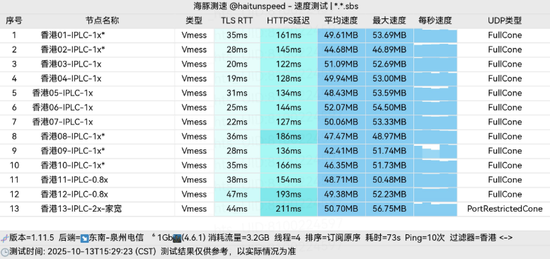
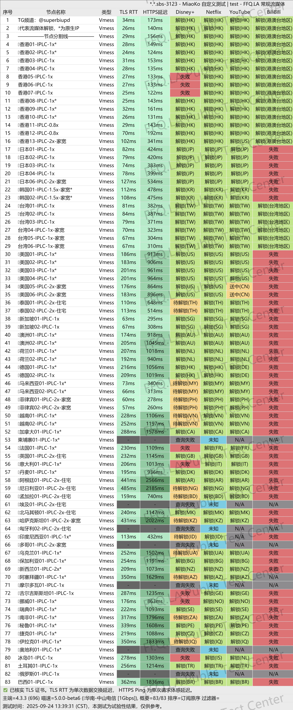

[SuperBiu](https://biubiux.online/#/register?code=K536fups ) 是一款基于三网融合技术的专业网络加速服务，通过 IPLC 国际专线构建高速稳定的跨境网络通道，为用户提供优质的网络访问体验。
<!-- more -->

---

## 服务概览

**官方网站**：[biubiux.online](https://biubiux.online/#/register?code=K536fups )

## 🦾核心特性解析

## ✍️服务套餐详情

### 1. 定期订阅套餐

| 🧮套餐等级 | 📛套餐名称 | 📑适用人群 | 🔁可选周期 | 💰月费 | 📶流量 | 🛍️购买链接 |
|---------|----------|----------|----------|------|------|----------| 
| 基础版 | Small Biu 50G | 轻度用户、备用 | 月付、季付、半年、年付 | ¥11.00/每月 |50GB/月 |[购买链接](https://biubiux.online/#/register?code=K536fups ) |
| 进阶版 | Mini Biu 100G |	一般日常使用 | 月付、季付、半年、年付 | ¥16.00/每月 |100GB/月 |[购买链接](https://biubiux.online/#/register?code=K536fups ) |
| 专业版 | Mini Biu 200G | 中度用户、高清视频 | 月付、季付、半年、年付 | ¥24.00/每月 |200GB/月 | [购买链接](https://biubiux.online/#/register?code=K536fups ) |
| 尊享版 | Medium Biu 300G | 重度用户、多设备 | 月付、季付、半年、年付 | ¥33.00/每月 |300GB/月 | [购买链接](https://biubiux.online/#/register?code=K536fups ) |
| 终极版 | Medium Biu 500G | 极重度用户、共享 | 月付、季付、半年、年付 | ¥45.00/每月 |500GB/月 | [购买链接](https://biubiux.online/#/register?code=K536fups ) |

### 2. 按量付费流量包

此模式适合使用频率不固定或需求波动的用户，流量包在有效期内无时间限制。

| 🧮套餐等级 | 📛套餐名称 | 📑适用人群 | 🔁可选周期 | 💰费用 | 📶流量 | 🛍️购买链接 |
|---------|----------|----------|----------|------|------|----------| 
| 基础版 | Biu-as-you-go 120G | 短期项目、临时需求 | 一次性 | ¥40 |120GB |[购买链接](https://biubiux.online/#/register?code=K536fups ) |
| 进阶版 | Biu-as-you-go 240G  |	中期使用、偶尔高峰 | 一次性 | ¥79 |240GB |[购买链接](https://biubiux.online/#/register?code=K536fups ) |
| 专业版 | Biu-as-you-go 380G | 长期备用、灵活使用 | 一次性 | ¥128 |380GB | [购买链接](https://biubiux.online/#/register?code=K536fups ) |
| 尊享版 | Biu-as-you-go 880G | 团队共享、大量消耗 | 一次性 | ¥238 |880GB | [购买链接](https://biubiux.online/#/register?code=K536fups ) |

## 多平台客户端支持

### 🌐 网络架构优势
- **三网融合接入**：整合电信、联通、移动三大运营商网络资源
- **IPLC 专线传输**：跨境数据传输全程专线，避免公网拥堵
- **智能路由调度**：根据网络状况自动选择最优路径
- **全球节点覆盖**：在香港、日本、新加坡、美国、欧洲等地部署服务器

### ⚡ 性能表现

- **超低延迟**：香港节点延迟低至 18ms
- **高速传输**：支持 8K 视频流畅播放
- **高峰稳定**：晚高峰时段性能无显著下降
- **多协议支持**：全面兼容主流网络协议

## 📢技术特色深度分析

### 🔧 网络优化技术
- **智能负载均衡**：自动分配用户至最优服务器
- **流量压缩**：减少数据传输量，提升速度
- **协议优化**：针对不同应用优化传输协议
- **QoS 保障**：优先保障实时应用网络质量

### 🔒 安全隐私保护
- **端到端加密**：全链路数据加密传输
- **流量混淆**：防止特征识别和干扰
- **无日志政策**：最大限度保护用户隐私
- **定期安全审计**：确保系统安全性

## 🪗实际应用场景

### 🎬 内容访问
- **流媒体服务**：完美支持 Netflix、Disney+、HBO 等平台
- **AI 工具**：稳定访问 ChatGPT、Claude、Midjourney 等服务
- **学术资源**：畅通访问国际学术数据库和期刊

### 💼 专业应用
- **远程办公**：安全连接企业内网资源
- **在线交易**：低延迟访问国际交易平台
- **云游戏**：支持主流云游戏服务
- **开发协作**：顺畅使用 GitHub、GitLab 等开发平台

## 📄性能实测数据

### 📈 网络性能指标
## SuperBiu 网络加速服务深度评测

## 📑性能测试数据

### 📊 网络性能基准测试

**香港节点性能表现**：
- ⬇️ **下载速度**：165 Mbps
- ⬆️ **上传速度**：92 Mbps  
- ⏱️ **网络延迟**：18ms
- 📦 **丢包率**：<0.2%

**美西节点性能表现**：
- ⬇️ **下载速度**：118 Mbps
- ⬆️ **上传速度**：67 Mbps
- ⏱️ **网络延迟**：135ms

### ✅ 服务兼容性验证

**流媒体平台支持**：
- Netflix、Disney+、HBO Max 等主流平台完美解锁
- YouTube 4K/8K 超清流畅播放
- Amazon Prime Video、Hulu 全面支持

**办公应用兼容**：
- Microsoft 365 全套服务稳定访问
- Google Workspace 各项功能正常使用
- Slack、Zoom、Teams 等协作工具流畅运行

**游戏平台连接**：
- Steam 商店高速下载
- PSN、Xbox Live 稳定连接
- 云游戏服务低延迟体验

**开发工具支持**：
- GitHub、GitLab 快速访问
- 各类 IDE 和编程工具顺畅使用
- Docker、Kubernetes 镜像拉取无阻

## 📒客户端配置指南
## [👉新用户专享 SuperBiu](https://biubiux.online/#/register?code=K536fups )
### 📱 多平台客户端支持

**Windows 系统**：
- Clash for Windows（推荐）
- V2rayN
- Shadowsocks

**macOS 系统**：
- ClashX
- Clash Meta
- Surge

**iOS 设备**：
- Shadowrocket（小火箭）
- Quantumult X
- Stash

**Android 设备**：
- Clash for Android
- V2rayNG
- Surfboard

**路由器设备**：
- OpenWrt 系统
- Asuswrt-Merlin
- 梅林固件

### 🔧 快速配置流程

1. **账户注册**
   - 访问官网完成注册
   - 邮箱验证激活账户

2. **套餐选择**
   - 根据需求选择合适套餐
   - 完成支付确认

3. **获取配置**
   - 登录用户中心
   - 复制订阅链接

4. **客户端配置**
   - 安装推荐客户端
   - 导入订阅链接
   - 更新节点列表

5. **连接测试**
   - 选择最优节点
   - 测试连接稳定性
   - 验证网络速度

### 💡 使用优化建议

**节点选择策略**：
- 视频流媒体：选择香港、日本节点
- 游戏加速：选择延迟最低节点
- 下载需求：选择带宽充足节点

**客户端维护**：
- 定期更新客户端版本
- 及时刷新订阅信息
- 清理缓存数据

**流量管理**：
- 监控流量使用情况
- 设置流量提醒
- 合理分配各设备用量

## 📗服务保障体系
## [👉新用户专享 SuperBiu](https://biubiux.online/#/register?code=K536fups )
### 🛎️ 客户支持服务

**技术支持渠道**：
- 7×24 小时在线客服
- 工单系统快速响应
- 技术文档库
- 社区交流论坛

**问题解决时效**：
- 普通咨询：15分钟内响应
- 技术问题：30分钟内处理
- 紧急故障：5分钟内响应

### 🎯 服务质量承诺

**服务可用性**：
- 99.9% 服务正常运行时间
- 多线路冗余备份
- 自动故障转移

**维护升级**：
- 定期系统维护通知
- 无缝升级体验
- 性能持续优化

**监控保障**：
- 实时性能监控
- 自动故障告警
- 快速恢复机制

## 🏷️选购建议指南

### 👥 用户群体匹配

**轻度用户推荐**：
- Small Biu 50G 套餐（¥11/月）
- 适合：偶尔使用、备用需求
- 预估：每日 1-2GB 流量

**常规用户推荐**：
- Mini Biu 100G/200G 套餐
- 适合：日常办公、社交娱乐
- 预估：每日 3-6GB 流量

**重度用户推荐**：
- Medium Biu 300G/500G 套餐
- 适合：4K流媒体、多设备
- 预估：每日 10-16GB 流量

**灵活需求用户**：
- 按量计费套餐
- 适合：不固定使用频率
- 优势：无时间限制

### 💎 性价比分析

**长期订阅优惠**：
- 年付享受最大折扣
- 半年付性价比优异
- 季付灵活度较高

## [👉新用户专享 SuperBiu](https://biubiux.online/#/register?code=K536fups )

**套餐选择策略**：
- 新用户建议从基础套餐开始
- 根据实际使用情况升级
- 多设备用户选择高流量套餐

## ✏️使用注意事项

### 📝 使用规范提醒

**合规使用**：
- 遵守服务条款
- 尊重当地法律法规
- 合理使用网络资源

**账户安全**：
- 定期修改密码
- 开启二次验证
- 监控异常登录

**流量管理**：
- 设置使用提醒
- 避免流量浪费
- 合理分配设备

### 🔔 技术注意事项

**网络环境**：
- 不同 ISP 性能可能差异
- 建议多节点测试比较
- 关注网络质量变化

**客户端维护**：
- 保持客户端更新
- 定期检查配置
- 备份重要设置

**信息服务**：
- 关注官方公告
- 及时获取更新信息
- 参与社区交流

---

## 📍服务总结

### [SuperBiu](https://biubiux.online/#/register?code=K536fups ) 凭借卓越的网络性能、完善的技术支持和灵活的套餐选择，在 2025 年的网络加速服务市场中展现出强劲竞争力。其基于 IPLC 专线的三网融合架构，为用户提供了稳定高速的网络体验。

**核心优势总结**：
- 🚀 超低延迟与高速传输
- 🌍 全球节点优质覆盖
- 🔒 安全可靠的隐私保护
- 💰 灵活多样的套餐选择
- 🛠️ 专业及时的技术支持

> ## **立即体验**：访问官方网站 [biubiux.online](https://biubiux.online/#/register?code=K536fups ) 开启优质网络加速之旅

## [👉新用户专享 SuperBiu](https://biubiux.online/#/register?code=K536fups )
## 新用户首次订购可使用专享码  **K536fups**

## 📢机场推荐汇总： 👉[2026年翻墙机场推荐评测 稳定便宜VPN机场排行榜（高性价比科学上网工具长期更新）]( /vpn-recommend/ )  

## 📌 延伸阅读

👉iOS手机：[Shadowrocket （小火箭）2026年使用指南：iOS/macOS全平台配置教程(含非国区ID)](/article/Shadowrocket/ )

👉Android手机：[Clash for Android 2026年使用指南：终极配置指南教程](/article/ClashforAndroid/ )

👉Windows/Linux/Mac：[2026年 Clash Verge （Windows/Linux/Mac）全平台配置指南](/article/ClashVerge/ )

👉每天免费更新Apple ID：[2026年 最新最全免费共享美区 Apple ID |Shadowrocket/小火箭下载|每日更新](/article/freeAppleID/ )  

---

>📝 免责声明：本文仅供信息参考，建议均为个人经验与观点，不构成法律意见。实际情况以最新政策和主管部门解释为准，请在合法合规框架内使用相关服务。任何违法使用行为与本站无关。