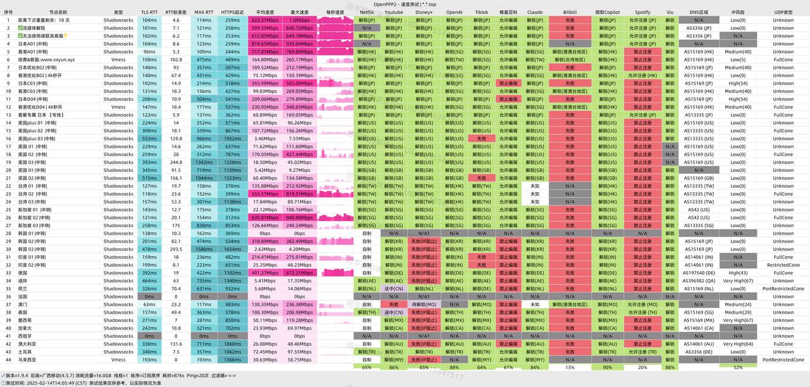

[XXYUN](https://xxyun.at/?code=rXypHVO4 )作为稳定运营两年的老牌机场服务，以其卓越的性价比和优质的BGP中转线路在用户中享有良好口碑。该服务特别针对国内三大运营商进行深度优化，确保网络连接的稳定性和流畅度。
<!-- more -->

---

## ✴️服务核心亮点

**官方网站**：[https://xxyun.de/rXypHVO4.html](https://xxyun.at/?code=rXypHVO4 )

## 📚套餐详情与价格体系

| 套餐类型 | 计费方式 | 流量配额 | 适用场景 | 推荐指数 |
|---------|----------|----------|----------|----------|
| 初级套餐 | 9.99元/月 | 100GB/月 | 轻度用户、社交浏览 | ★★★★☆ |
| 中级套餐 | 19.9元/月 | 300GB/月 | 日常办公、多人共享 | ★★★★★ |
| 高级套餐 | 39.9元/月 | 1000GB/月 | 重度影音、直播需求 | ★★★★★ |
| 永久500G | 66.66元(永久) | 500GB | 偶尔使用、旅行备用 | ★★★★☆ |
| 超划算—永久 2888G | 199元(永久) | 2888GB | 长期囤货、家庭共享 | ★★★★☆ |

> **💡优惠提示**：**[XXYUN官网下单](https://xxyun.at/?code=rXypHVO4 )** 新用户首次订购可使用优惠码 **rXypHVO4** 享受 **85** 折优惠❗

## 多平台客户端支持

### 💻网络架构优势
- **全BGP中转线路**：电信、联通、移动三网深度优化
- **晚高峰保障**：高峰期不限速，确保流畅体验
- **多协议支持**：全面兼容Shadowsocks、V2Ray、Trojan等协议

### 🏮服务功能特色
- **流媒体支持**：完美解锁Netflix、Disney+、HBO等平台
- **AI工具访问**：稳定支持ChatGPT、Claude等AI服务
- **设备兼容性**：支持多设备同时在线，无数量限制

## 🧮性能实测数据

基于实际测试环境（上海电信300M宽带，晚高峰时段）：

**🖧速度表现**：
- 下载速率：70-110 Mbps
- 节点延迟：香港25ms，日本50-60ms，新加坡70ms+

**🖧稳定性指标**：
- 连续运行24小时无中断
- 在线率高达99.7%
- 4K流媒体播放流畅

## 🌐网络性能与解锁能力深度测试

## 🧭客户端配置指南

### 🏙️支持平台
- **移动端**：iOS (Shadowrocket)、Android (Clash)
- **桌面端**：Windows (Clash)、macOS (ClashX)

### 🪂配置流程
1. 官网注册账号并完成验证：[xxyun.de/rXypHVO4.html](https://xxyun.at/?code=rXypHVO4 )
2. 选择合适的流量套餐
3. 获取订阅链接导入客户端
4. 进行节点测速并选择最优线路

## 🌃适用场景推荐

| 使用场景 | 推荐节点 | 优化建议 |
|---------|----------|----------|
| 影音娱乐 | 香港、台湾、日本 | 优先选择流媒体优化节点 |
| 办公学习 | 香港、新加坡 | 注重稳定性和低延迟 |
| 游戏加速 | 日本、韩国 | 选择专线游戏节点 |
| AI工具 | 美国、新加坡 | 确保API访问稳定性 |

## ❓常见问题解答
**🙋‍♂️：是否支持退款政策？**

A：虚拟服务通常不提供退款，建议先试用初级套餐。

**🙋‍♂️：多人共用是否允许？**

A：支持多设备在线，但建议合理控制同时连接数量。

**🙋‍♂️：遇到速度问题如何解决？**

A：可尝试切换节点、更新订阅或联系客服寻求技术支持。

## 📍服务总结

**[XXYUN](https://xxyun.at/?code=rXypHVO4 )** 以其亲民的价格和稳定的服务质量，成为2025年值得推荐的机场选择。特别适合：
- 预算有限但追求稳定体验的用户
- 有多平台流媒体访问需求的用户
- 需要稳定AI工具访问的办公人群

对于寻求高性价比网络加速服务的用户，**[XXYUN](https://xxyun.at/?code=rXypHVO4 )** 无疑是一个值得尝试的可靠选择。

## **📢优惠提示**：**[XXYUN官网下单](https://xxyun.at/?code=rXypHVO4 )** 新用户首次订购可使用优惠码 **rXypHVO4** 享受 **85** 折优惠❗

## 📢机场推荐汇总： 👉[2026年翻墙机场推荐评测 稳定便宜VPN机场排行榜（高性价比科学上网工具长期更新）]( /vpn-recommend/ )  

## 📌 延伸阅读

👉iOS手机：[Shadowrocket （小火箭）2026年使用指南：iOS/macOS全平台配置教程(含非国区ID)](/article/Shadowrocket/ )

👉Android手机：[Clash for Android 2026年使用指南：终极配置指南教程](/article/ClashforAndroid/ )

👉Windows/Linux/Mac：[2026年 Clash Verge （Windows/Linux/Mac）全平台配置指南](/article/ClashVerge/ )

👉每天免费更新Apple ID：[2026年 最新最全免费共享美区 Apple ID |Shadowrocket/小火箭下载|每日更新](/article/freeAppleID/ )  

---

>📝 免责声明：本文仅供信息参考，建议均为个人经验与观点，不构成法律意见。实际情况以最新政策和主管部门解释为准，请在合法合规框架内使用相关服务。任何违法使用行为与本站无关。