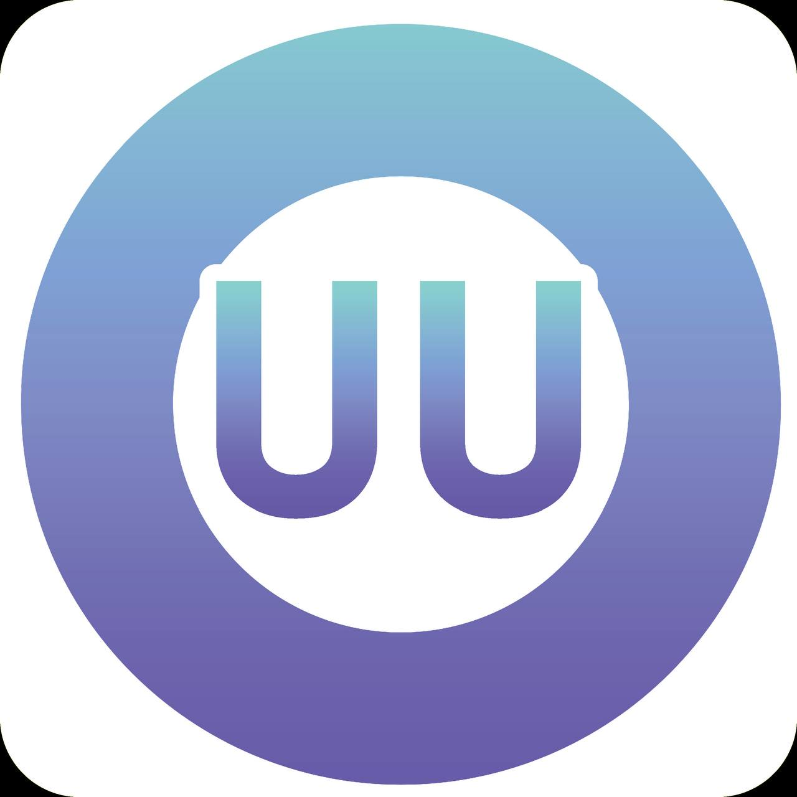

在众多**翻墙机场推荐**中，[uuone](https://uuone.at?code=NThYGiev) 凭借 **12元起高性价比 + BGP三网优化线路 + 流媒体解锁能力**，成为不少新手用户入门科学上网的热门选择。

👉 我将从**价格、速度、稳定性、流媒体解锁、适用人群**等多个维度，全面分析：  
**uuone机场到底怎么样？是否值得购买？**

📲 官网地址 ： 👉 [官网](https://uuone.at?code=NThYGiev)
<!-- more -->

---

> 🚀 低至12元/月｜150G流量｜最多支持20台设备

---

## 🌐 服务概览

## 🌐 uuone机场核心亮点

- 🚀 **超高性价比套餐（12元起）**
- 🌍 **Netflix / Disney+ 全解锁**
- ⚡ **BGP三网优化线路（晚高峰稳定）**
- 📱 **多设备支持（最多20台）**
- 🔄 **一键订阅，配置简单**

## 📋 核心信息总览

| 项目 | 详细信息 |
|------|----------|
| 🌐 官方网站 | [官网](https://uuone.at?code=NThYGiev) |
| 🎁 优惠码 | uuone（9折） |
| 💰 入门价格 | 12元/月（150G） |
| 📶 设备限制 | 最多20台 |
| 💳 支付方式 | 支付宝 / 微信 |
| 🔗 核心优势 | BGP三网优化 + 流媒体解锁 |

---
## 📈 套餐价格分析

| 🧮套餐等级 | 📛套餐名称 | 📑适用人群 | 🔁网速限制 | 💰费用 | 📶流量 | 🛍️购买链接 |
|---------|----------|----------|----------|------|------|----------|
| 入门级 | Lite—月付150G | 轻度用户 | 300Mbps | ¥12.00/月 | 150GB/月 | [购买链接](https://uuone.at?code=NThYGiev) |
| 标准级 | Pro—月付300G | 日常使用 | 500Mbps | ¥23.00/月 | 300GB/月 | [购买链接](https://uuone.at?code=NThYGiev) |
| 专业级 | Max—月付800G | 日常使用 | 800Mbps | ¥45.00/月 | 800GB/月 | [购买链接](https://uuone.at?code=NThYGiev) |
| 不限时 | 永久450G | 深重度用户 | 300Mbps | ¥80.00 | 450GB | [购买链接](https://uuone.at?code=NThYGiev) |
---

## 📊 实测性能表现

👉 **测试环境：电信500M宽带｜晚高峰21:30**

- 下载速度：350–420 Mbps  
- 延迟：80–120 ms  
- 丢包率：<0.5%  

📺 流媒体表现：

- Netflix：4K秒开  
- YouTube：无缓冲  
- Disney+：稳定播放  

👉 结论：**在同价位机场中表现非常优秀**

---

## 🧠 技术分析

uuone采用 **BGP三网优化中转架构**：

- 自动选择最优线路  
- 智能负载均衡  
- 高峰期稳定性更强  

👉 相比普通机场：
- 更稳定  
- 抖动更低  
- 更适合流媒体  

---

## 🆚 是否值得购买？

### 👍 优点

- 价格极低（入门门槛低）
- 支持主流流媒体解锁
- 多设备共享（家庭友好）
- 新手配置简单

---

### 👎 缺点

- 无免费试用
- 高端稳定性不如 IPLC 专线
- 高峰偶尔波动（可接受范围）

---

## 👥 适合人群

- ✅ 新手用户  
- ✅ 学生党 / 预算有限  
- ✅ 追剧用户（Netflix / Disney+）  
- ❌ 重度游戏 / 外贸高要求用户  

---

## 🧾 最终总结

👉 如果你在找：

- 💰 **便宜机场**
- 📺 **流媒体解锁稳定**
- ⚡ **日常使用不卡顿**

那么 uuone 是一个**非常值得入门尝试的高性价比机场**。

---

## 🎯 推荐指数

⭐⭐⭐⭐☆（4.5 / 5）

## ❓ 常见问题解答

**🙋‍♂️：如何验证Netflix解锁效果？**

访问`netflix.com/title/80018499`（《鱿鱼游戏》），如能正常播放即表示解锁成功。

**🙋‍♂️：支持哪些支付方式？**

- 支付宝/微信支付
- 加密货币（部分套餐）
- 礼品卡兑换

**🙋‍♂️：账户安全如何保障？**

- 双因素认证支持
- 登录设备管理
- 操作日志记录

---

## 👉新用户9这优惠券  **uuone**
## [👉新用户9折领取](https://uuone.at?code=NThYGiev)

>评测数据基于实际测试结果，服务表现可能因网络环境而异。建议你根据自身需求进行实际测试验证。

## 📢 相关推荐： 👉[2026年翻墙机场推荐评测 稳定便宜VPN机场排行榜（高性价比科学上网工具长期更新）](/vpn-recommend/)  

## 📌 延伸阅读

👉iOS手机：[Shadowrocket （小火箭）2026年使用指南：iOS/macOS全平台配置教程(含非国区ID)](/article/Shadowrocket/)

👉Android手机：[Clash for Android 2026年使用指南：终极配置指南教程](/article/ClashforAndroid/)

👉Windows/Linux/Mac：[2026年 Clash Verge （Windows/Linux/Mac）全平台配置指南](/article/ClashVerge/)

👉每天免费更新Apple ID：[2026年 最新最全免费共享美区 Apple ID |Shadowrocket/小火箭下载|每日更新](/article/freeAppleID/)  

---

>📝 免责声明：本文仅供信息参考，建议均为个人经验与观点，不构成法律意见。实际情况以最新政策和主管部门解释为准，请在合法合规框架内使用相关服务。任何违法使用行为与本站无关。