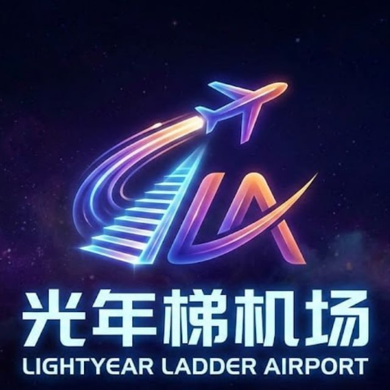
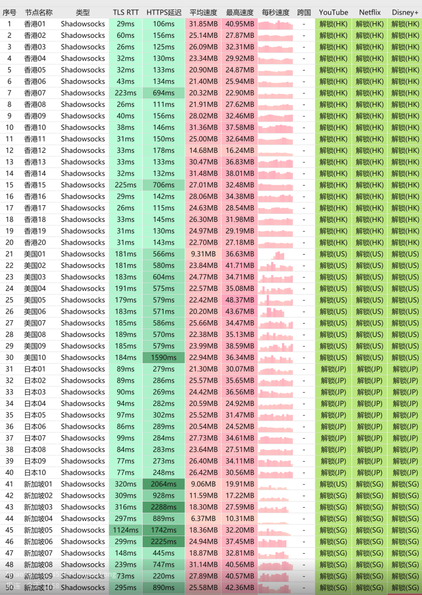

[光年梯](https://yyo649929.gntvipaff.cc/#/?code=wSwAqP3G)是一款专注于基础稳定访问的==轻量级==机场服务。其核心策略是以极具吸引力的入门价格，为用户提供具备==IPLC专线品质==的网络通道，旨在满足对稳定性有要求但预算有限的用户群体。

📲光年梯机场官网地址：[yyo649929.gntvipaff.cc](https://yyo649929.gntvipaff.cc/#/?code=wSwAqP3G)
<!-- more -->

## 🔔服务概览与技术架构

## 掌中世界机场官网地址：[yyo649929.gntvipaff.cc](https://yyo649929.gntvipaff.cc/#/?code=wSwAqP3G)

## 👉[新用户7折福利领取](https://yyo649929.gntvipaff.cc/#/?code=wSwAqP3G)
## 👉[新用户邀请码GNT70](https://yyo649929.gntvipaff.cc/#/?code=wSwAqP3G)
## 💻服务核心信息

| 项目 | 详细信息 |
| :--- | :--- |
| **🌐 官方网站** | [yyo649929.gntvipaff.cc](https://yyo649929.gntvipaff.cc/#/?code=wSwAqP3G)
| **💰 入门价格** | 18.00元/110G每月 |
| **📑 用户福利** | 七折优惠码GNT70 |
| **💳 充值方式** | 支付宝、微信支付 |
| **🌍 服务特色** | 全IPLC专线 |
| **🔗 协议支持** |全IPLC专线，ss协议，不限速，不限制客户端、专线独享流量等 |
---
## 📚套餐详情

| 🧮套餐等级 | 📛套餐名称 | 📑适用人群 | 🔁可选周期 | 💰月费 | 📶流量 | 🛍️购买链接 |
|---------|----------|----------|----------|------|------|----------| 
| 进阶版 | 光年梯 入门版 | 轻度使用 | 月付、季付、半年、年付、两年、三年 | ¥18.00/每月 |110GB/月 |[购买链接](https://www01.lightyearti.cc/#/?code=RsnVWqBV) |
| 专业版 | 光年梯 晋级版 |	中度用户 | 月付、季付、半年、年付、两年、三年 | ¥34.00/每月 |220GB/月 |[购买链接](https://yyo649929.gntvipaff.cc/#/?code=wSwAqP3G) |
| 尊享版 | 光年梯 专业版 | 重度用户 | 月付、季付、半年、年付、两年、三年 | ¥68.00/每月 |450GB/月 | [购买链接](https://yyo649929.gntvipaff.cc/#/?code=wSwAqP3G) |
| 至尊版 | 光年梯 至尊版 | 老鸟重度用户 | 月付、季付、半年、年付、两年、三年 | ¥130.00/每月 |900GB/月 |[购买链接](https://yyo649929.gntvipaff.cc/#/?code=wSwAqP3G) |
| 独享专线版 | 独享私人专线节点 |	专业老鸟用户 | 月付 | ¥680.00/每月 |500GB/月 |[购买链接](https://yyo649929.gntvipaff.cc/#/?code=wSwAqP3G) |

## 📊 核心参数与特性

| 特性维度 | 具体说明 |
| :--- | :--- |
| **💰 定价策略** | **月付18元**，提供**110GB**月度流量，在IPLC专线品类中性价比突出。 |
| **🛣️ 线路品质** | **全IPLC专线**架构，提供比普通公网线路更稳定、低延迟、低丢包的连接体验。 |
| **📡 支持协议** | 默认采用 **SS（Shadowsocks）协议**，兼容性强，配置简单。 |
| **🚫 无限制策略** | **承诺不限连接速度，不限制客户端种类**，用户拥有高度的使用自由度。 |
| **🎯 适用场景** | 适合日常办公、学习、社交通讯、标清/高清流媒体及一般性国际网络访问。 |

## 👥 目标用户画像
- **稳定性优先型用户**：无法忍受网络频繁波动，需要一条可靠“工作线”或“保底线”的用户。
- **精打细算的实用派**：追求物有所值，希望在有限预算内获得尽可能稳定服务的用户。
- **轻中度使用者**：月度网络流量消耗在100GB左右，无超重度下载或8K流媒体需求的用户。
- **技术偏好简洁者**：倾向于使用SS等经典协议，追求配置简单、开箱即用的体验。

## ⚠️ 使用评估与建议
1. **流量与用途匹配**：110GB流量可满足大多数日常工作娱乐，但需注意4K流媒体每小时约消耗7-10GB流量，需合理规划。
2. **协议适用性**：SS协议成熟通用，但在部分网络管控严格的环境或地区，其连接成功率可能不及更新型的协议。
3. **服务侧重点**：该服务的核心竞争力在于 **“IPLC专线的稳定性”** 和 **“极致的入门价格”** ，而非海量节点或极限带宽。
4. **购买决策建议**：强烈建议新用户**首先购买月付套餐**进行完整周期测试，重点考察晚高峰时段的速度稳定性以及本地运营商的兼容性。

> **总结**：光年梯精准地切入了 “稳定刚需” 与 “价格敏感” 之间的市场空白。它并非功能最全、节点最多的服务，但对于那些将 “连接稳定不掉线” 视为首要考量，且希望控制成本的用户来说，它提供了一个非常务实且高性价比的选择。是理想的入门级专线方案或高可靠性备用线路。

---
## [👉新用户七折福利领取](https://yyo649929.gntvipaff.cc/#/?code=wSwAqP3G)
## 👉新用户首次订购七折可使用优惠码  **GNT70**

## 📢机场推荐汇总： 👉[2026年翻墙机场推荐评测 稳定便宜VPN机场排行榜（高性价比科学上网工具长期更新）](/vpn-recommend/)  

## 📌 延伸阅读

👉iOS手机：[Shadowrocket （小火箭）2026年使用指南：iOS/macOS全平台配置教程(含非国区ID)](/article/Shadowrocket/)

👉Android手机：[Clash for Android 2026年使用指南：终极配置指南教程](/article/ClashforAndroid/)

👉Windows/Linux/Mac：[2026年 Clash Verge （Windows/Linux/Mac）全平台配置指南](/article/ClashVerge/)

👉每天免费更新Apple ID：[2026年 最新最全免费共享美区 Apple ID |Shadowrocket/小火箭下载|每日更新](/article/freeAppleID/)  

---

>📝 免责声明：本文仅供信息参考，建议均为个人经验与观点，不构成法律意见。实际情况以最新政策和主管部门解释为准，请在合法合规框架内使用相关服务。任何违法使用行为与本站无关。