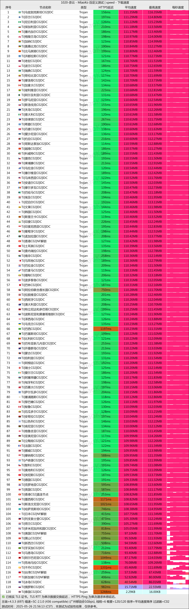

[奈云](https://aff.v2ny.mom?path=register&code=6bJ8swbK)是一家拥有==六年以上==稳定运营历史的专业网络加速服务提供商，以其卓越的可靠性和海量节点资源在业内享有盛誉。长期运营过程中始终保持零负面评价记录，展现了出色的服务品质和用户信赖度。

作为一款长期稳定的 **科学上网工具与VPN机场服务**，奈云机场支持全球多地区节点访问，适合访问 **ChatGPT、Netflix、YouTube、Google** 等海外网站，是目前用户评价较高的 **翻墙机场推荐之一**。

📲奈云机场官网地址：[奈云机场跑路预警](/scamvpn/naiyunyujing/)

<!-- more -->

---

---
::: caution

截至 **2026 年 6 月 30 日**失联（节点全部瘫痪、客服失联72小时、官网无法打开等）。

**疑似跑路！** 请立即停止续费与充值，优先转移业务与备份订阅。

近期机场行业持续出现跑路、失联、停止运营等情况，建议查看：

👉 **[⚠️ 2026年机场跑路汇总名单（持续更新）VPN机场跑路原因与避坑指南](/scamvpn/paolujichang/)  **

持续更新最新跑路机场、失联机场及风险预警。

:::

---

[奈云机场跑路预警](/scamvpn/naiyunyujing/)

## 🔔服务概览与技术架构

## 📲奈云机场官网地址：[www.v2ny.me](https://aff.v2ny.mom?path=register&code=6bJ8swbK)

## 👉[新用户9折领取](https://aff.v2ny.mom?path=register&code=6bJ8swbK)

## 💻服务核心信息

| 项目 | 详细信息 |
| :--- | :--- |
| **🌐 官方网站** | [www.v2ny.me](https://aff.v2ny.mom?path=register&code=6bJ8swbK) |
| **💰 入门价格** | 10.6元/168G每月（年付） |
| **💳 充值方式** | 支付宝、微信支付 |
| **🌍 服务器分布** | 自有机房专柜 环球多地接入点 |
| **🔗 协议支持** | 多全球流媒体解锁 解锁奈飞/迪士尼/ChatGPT 等、可支持5台设备同时接入、不限速(峰值5000M)  |

---

## 📚套餐详情

| 🧮套餐等级 | 📛套餐名称 | 📑适用人群 | 🔁可选周期 | 💰月费 | 📶流量 | 🛍️购买链接 |
|---------|----------|----------|----------|------|------|----------| 
| 进阶版 | Basic 基础套餐 | 轻度至中度日常使用 | 年付 | ¥10.6/每月(年付) |168GB/月 |[购买链接](https://aff.v2ny.mom?path=register&code=6bJ8swbK) |
| 专业版 | Pro 进阶套餐 |	中度用户、高清视频 | 月付、半年、年付 | ¥28.00/每月 |388GB/月 |[购买链接](https://aff.v2ny.mom?path=register&code=6bJ8swbK) |
| 尊享版 | Max 专业套餐 | 重度用户 | 月付、半年、年付 | ¥49.00/每月 |788GB/月 | [购买链接](https://aff.v2ny.mom?path=register&code=6bJ8swbK) |

### 2. 按量付费流量包

此模式适合使用频率不固定或需求波动的用户，流量包在有效期内无时间限制。

| 🧮套餐等级 | 📛套餐名称 | 📑适用人群 | 🔁可选周期 | 💰费用 | 📶流量 | 🛍️购买链接 |
|---------|----------|----------|----------|------|------|----------| 
| 专业版 | 280G [按量计费] | 临时需求、备用线路 | 一次性 | ¥98 |280GB |[购买链接](https://aff.v2ny.mom?path=register&code=6bJ8swbK) |
| 尊享版 | 680G [按量计费]  |	中长期灵活使用 | 一次性 | ¥218 |680GB |[购买链接](https://aff.v2ny.mom?path=register&code=6bJ8swbK) |
| 终极版 | 2048G [按量计费] | 高消耗场景、灵活使用 | 一次性 | ¥498 |2048GB | [购买链接](https://aff.v2ny.mom?path=register&code=6bJ8swbK) |

## 📢奈云网络加速服务概览

## 🔔奈云机场测试

## 📲核心优势

### 🧮长期稳定运营

- **六年以上持续服务**：自成立以来保持不间断稳定运营  
- **零负面评价记录**：用户口碑良好，服务信誉卓越  
- **成熟技术架构**：经过长期优化，系统稳定性极高  

### 🧾个人用户套餐

| 套餐名称 | 月费 | 月流量 | 特色功能 | 推荐指数 |
|----------|------|--------|----------|----------|
| Basic 基础套餐 | ¥10.6/每月(年付) | 168GB | 特惠 | ★★★★★ |
| Pro 进阶套餐 | ¥28.00 | 388GB | 全平台设备使用 | ★★★★☆ |
| Max 专业套餐 | ¥49.00 | 788GB | 多设备接入 | ★★★★★ |

### 🖌️优惠套餐选项

**Basic 基础套餐：**

- 年费：¥128
- 月均流量：168GB
- 适合长期稳定用户
- 性价比极高

### 📩丰富节点资源

- **海量服务器节点**：提供充足资源满足各类用户需求
- **全球网络覆盖**：支持多地区访问需求
- **持续资源扩容**：根据用户增长及时增加服务器资源

### 💰便捷支付体验

- **支持支付宝支付**：国内用户支付便利
- **微信支付支持**：移动端支付快捷安全
- **多样化套餐选择**：满足不同用户群体的使用需求

## 📝使用建议

### 📈套餐选择指南

- **新用户体验**：建议从Basic年付套餐开始，成本效益最高  
- **常规用户**：Pro月付套餐适合大多数日常使用场景  
- **高需求用户**：Max套餐或大容量按量包更经济  
- **不确定需求**：按量计费套餐提供最大灵活性  

### 📋成本优化策略

1. **长期使用优选年付**：Basic年付套餐性价比最高  
2. **按需选择流量包**：不固定需求用户适合按量计费  
3. **合理评估用量**：根据实际使用情况选择对应套餐  
4. **关注官方活动**：定期查看官网是否有特别优惠  

## 🔓服务特点总结

- **历史验证可靠**：六年稳定运营提供质量保证  
- **资源充足丰富**：海量节点满足各类访问需求  
- **支付方式便捷**：支持主流国内支付工具  
- **套餐选择灵活**：从经济型到专业型全面覆盖  
- **用户口碑良好**：长期保持零负面评价记录  

---

### 👉新用户首次订购可使用优惠码  **6bJ8swbK**

### [👉新用户9折领取](https://aff.v2ny.mom?path=register&code=6bJ8swbK)

## 📢机场推荐汇总： 👉[2026年翻墙机场推荐评测 稳定便宜VPN机场排行榜（高性价比科学上网工具长期更新）](/vpn-recommend/)  

## 📌 延伸阅读

👉iOS手机：[Shadowrocket （小火箭）2026年使用指南：iOS/macOS全平台配置教程(含非国区ID)](/article/Shadowrocket/)

👉Android手机：[Clash for Android 2026年使用指南：终极配置指南教程](/article/ClashforAndroid/)

👉Windows/Linux/Mac：[2026年 Clash Verge （Windows/Linux/Mac）全平台配置指南](/article/ClashVerge/)

👉每天免费更新Apple ID：[2026年 最新最全免费共享美区 Apple ID |Shadowrocket/小火箭下载|每日更新](/article/freeAppleID/)  

---

>📝 免责声明：本文仅供信息参考，建议均为个人经验与观点，不构成法律意见。实际情况以最新政策和主管部门解释为准，请在合法合规框架内使用相关服务。任何违法使用行为与本站无关。