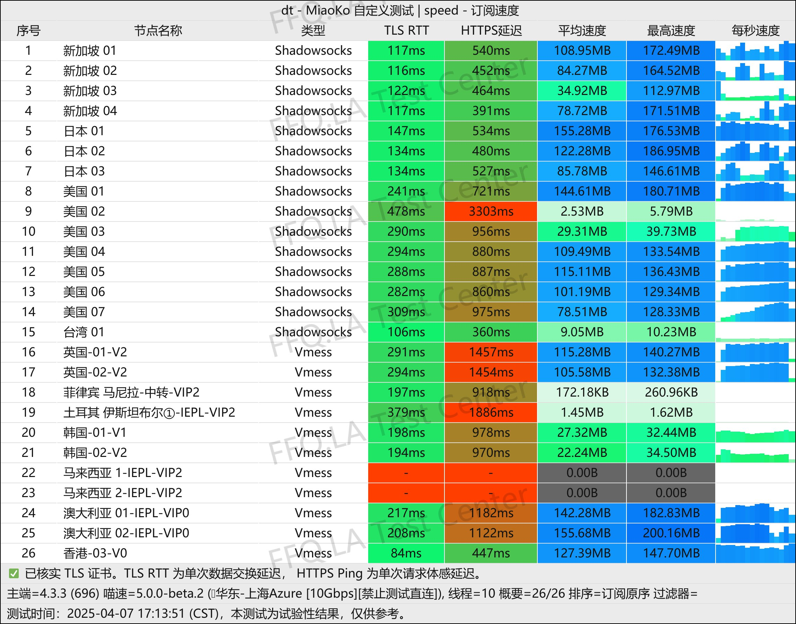

::: tip

## ✅ 2026年8月27日更新：灯塔Cloud已恢复运营

灯塔Cloud官网、登录入口和服务现已恢复，本站同步恢复官网、购买入口、邀请码及套餐信息。8月26日的短时异常记录仍保留在[灯塔Cloud恢复运营说明](/scamvpn/dengtacloud-warning-2026/)中，方便用户核对事件进展。

:::

[灯塔Cloud](https://test.718node.com/register?code=ExbmL3T6)作为业界==知名的老牌机场==服务商，凭借其稳定性与专业的技术支持，在用户群体中建立了较好的口碑。服务团队专注于提供稳定、高速的网络连接体验。

📲灯塔Cloud机场官网地址：[官网](https://test.718node.com/register?code=ExbmL3T6)
<!-- more -->
> 11.6元起100G/月，稳定畅连ChatGPT，独享IEPL专线的优质翻墙服务

## 🌐 服务概览

## 📋 核心信息总览

| 项目 | 详细信息 |
|------|----------|
| 🌐 **官方网站** | [官网](https://test.718node.com/register?code=ExbmL3T6) |
| 🎁 **新用户福利** | 邀请码 `ExbmL3T6`；优惠码 `off85`（以结算页为准） |
| 💰 **入门价格** | 7.50元/月（年付含50G/月流量）|
| 💳 **充值方式** | 支付宝、微信支付 |
| 🌍 **设备限制** | 不限制设备 |
| 🔗 **协议支持** | 流媒体解锁ChatGPT、限速峰值3000MBps、独享IEPL专线、不限制设备等 |
---
## 📈套餐详情

| 🧮套餐等级 | 📛套餐名称 | 📑适用人群 | 🔁设备限制 | 💰费用 | 📶流量 | 🛍️购买链接 |
|---------|----------|----------|----------|------|------|----------|
| 入门级 | 轻量级套餐（包年） | 轻度用户 | 不限制设备 | ¥7.50/月（年付） | 50GB/月 | [购买链接](https://test.718node.com/register?code=ExbmL3T6) |
| 标准级 | 标准版（六个月） | 日常使用 | 不限制设备 | ¥11.60/月 | 100GB/月 | [购买链接](https://test.718node.com/register?code=ExbmL3T6) |
| 专业级 | 个人套餐（三个月） | 日常使用 | 不限制设备 | ¥29.60/月 | 600GB/月 | [购买链接](https://test.718node.com/register?code=ExbmL3T6) |
| 专业级 | 个人套餐（六个月） | 重度用户 | 不限制设备 | ¥25.50/月 | 600GB/月 | [购买链接](https://test.718node.com/register?code=ExbmL3T6) |
| 企业级 | 个人套餐（年） | 重度用户 | 不限制设备 | ¥23.20/月 | 600GB/月 | [购买链接](https://test.718node.com/register?code=ExbmL3T6) |
| 不限时 | 1TB流量不限时 （用完为止） | 深重度用户 | 不限制设备 | 一次性 | 1TB | [购买链接](https://test.718node.com/register?code=ExbmL3T6) |
---

## ✨ 核心优势详解

### 🔧 技术支持与服务质量
- **客服响应**：专业的客服团队提供7×24小时快速响应，解决问题高效，服务态度友好
- **节点维护**：团队持续监控并优化节点网络，确保连接的稳定性和高可用性
- **动态优化**：系统根据实时网络状况自动调整路由策略，为用户提供最优连接路径

### 🌐 网络基础设施
- **节点架构**：遍布全球的优质服务器节点，覆盖主流国家和地区
- **线路质量**：采用优化的网络传输线路，保障低延迟和高带宽
- **更新机制**：定期更新和扩容节点资源，应对不断增长的用户需求

---

## 💰 服务套餐详情

### 💰专属优惠
使用邀请码 **ExbmL3T6** 注册并在下单前核对当前可用优惠；优惠活动以官网结算页为准。

### 📑套餐选项对比

| 套餐类型 | 订阅周期 | 原价 | 月均流量 | 适用场景 |
|----------|----------|-------------------|----------|----------|
| 标准版 | 6个月 | ¥70.00 |  100GB/月 | 轻度至中度使用，日常办公娱乐 |
| 个人套餐 | 3个月 | ¥89.00 |  600GB/月 | 高频用户，多设备共享 |
| 个人套餐 | 6个月 | ¥155.00 |  600GB/月 | 长期稳定需求，性价比优选 |
| 个人套餐 | 12个月 | ¥279.00 |  600GB/月 | 重度依赖用户，最大优惠幅度 |

**性价比分析**：
- **入门推荐**：标准版套餐月均仅 **¥11.6**，提供100GB流量
- **进阶选择**：个人套餐提供超大流量，适合视频流媒体、在线游戏等需求
- **长期价值**：年付套餐享受最大优惠，适合确定长期使用需求的用户

---

## 📊 性能与稳定性评估

### 📗技术亮点
1. **智能路由系统**
   - 实时监测网络质量
   - 自动切换最优节点
   - 避免网络拥堵时段

2. **节点健康管理**
   - 定期性能测试
   - 故障自动隔离
   - 快速恢复机制

3. **用户体验优化**
   - 连接成功率超过99%
   - 晚高峰时段性能稳定
   - 支持多设备同时连接

### 📖兼容性与支持
- **协议支持**：全面兼容主流加密协议
- **设备覆盖**：支持Windows、macOS、iOS、Android全平台
- **应用场景**：办公、学习、娱乐、游戏等多场景优化

---

### 💡使用小贴士
- **新用户建议**：先选择标准版套餐体验服务质量
- **流量管理**：监控使用情况，根据需要调整套餐
- **客户支持**：遇到问题及时联系客服获取帮助

---

## 🎯 目标用户群体

### 📒推荐使用场景
- **日常办公族**：远程办公、视频会议、企业应用访问
- **学习研究者**：学术资源访问、在线课程学习
- **娱乐爱好者**：高清视频流媒体、在线游戏、社交媒体
- **商务人士**：国际业务沟通、跨境数据访问

### 🔎用户评价亮点
- “客服响应迅速，问题解决专业”
- “节点稳定，晚高峰也能保持良好速度”
- “套餐设置合理，满足不同层次需求”
- “老牌服务商，值得长期信赖”

---

## ⚠️ 注意事项与服务承诺

### 📕使用规范
- 请遵守服务条款和当地法律法规
- 合理使用网络资源，避免滥用
- 定期更新客户端软件，确保安全性

### 📘服务承诺
- **稳定性保障**：99%以上服务可用性
- **数据安全**：采用行业标准加密技术
- **隐私保护**：尊重用户隐私，不记录敏感信息

---

## 📝 总结评价

**[灯塔Cloud](https://test.718node.com/register?code=ExbmL3T6)** 已于2026年8月27日恢复运营，官网、购买入口、邀请码和套餐信息现已重新上线。作为一家运营多年的网络加速服务商，其套餐覆盖轻量、标准、大流量及不限时需求。

**核心特点**：
1. ✅ 老牌服务商，现已恢复运营
2. ✅ 支持多平台与多设备使用
3. ✅ 提供IEPL专线及流媒体、ChatGPT解锁
4. ✅ 套餐覆盖轻量用户与大流量用户
5. ✅ 支持通过官方入口注册和购买

> **立即体验**：访问 [官网](https://test.718node.com/register?code=ExbmL3T6)，邀请码 **ExbmL3T6**。购买前请以官网实时套餐和结算信息为准。

## 👉新用户邀请码 **[ExbmL3T6](https://test.718node.com/register?code=ExbmL3T6)**
## [👉前往灯塔Cloud官网](https://test.718node.com/register?code=ExbmL3T6)

## 📢机场推荐汇总： 👉[2026年翻墙机场推荐评测 稳定便宜VPN机场排行榜（高性价比科学上网工具长期更新）](/vpn-recommend/)  

## 📌 延伸阅读

👉iOS手机：[Shadowrocket （小火箭）2026年使用指南：iOS/macOS全平台配置教程(含非国区ID)](/article/Shadowrocket/)

👉Android手机：[Clash for Android 2026年使用指南：终极配置指南教程](/article/ClashforAndroid/)

👉Windows/Linux/Mac：[2026年 Clash Verge （Windows/Linux/Mac）全平台配置指南](/article/ClashVerge/)

👉每天免费更新Apple ID：[2026年 最新最全免费共享美区 Apple ID |Shadowrocket/小火箭下载|每日更新](/article/freeAppleID/)  

---

>📝 免责声明：本文仅供信息参考，建议均为个人经验与观点，不构成法律意见。实际情况以最新政策和主管部门解释为准，请在合法合规框架内使用相关服务。任何违法使用行为与本站无关。
