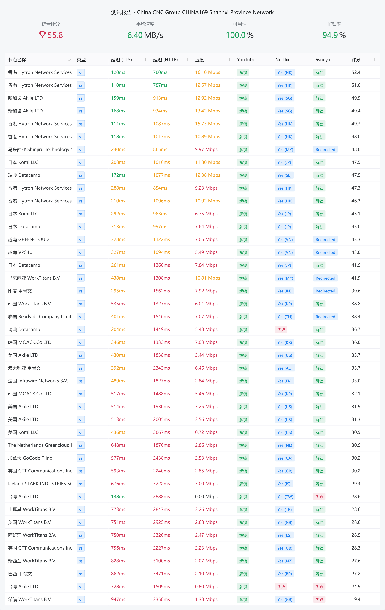
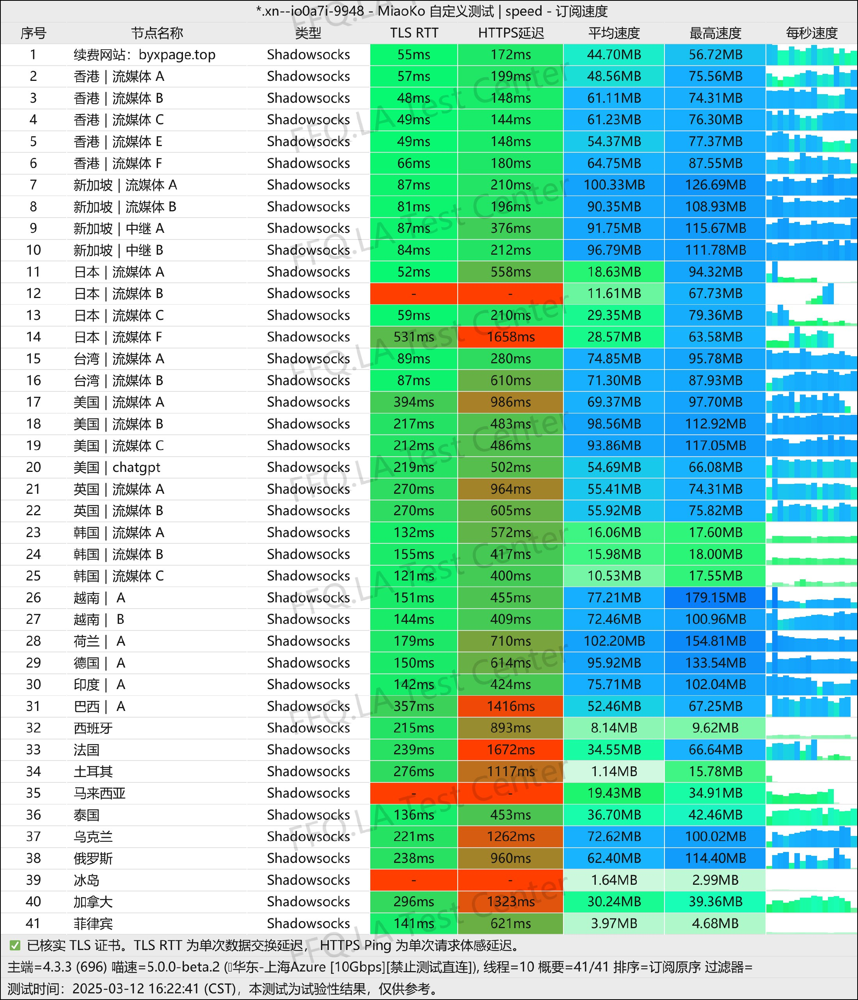

[白羊星](https://baiyangxing.com/#/register?code=GTEMx5I2 )是一款定位清晰的==轻量级、高性价比==机场服务。它以极具竞争力的入门价格，为用户提供==满足日常国际访问与流媒体解锁==需求的基础解决方案。

📲白羊星机场官网地址：[baiyangxing.com](https://baiyangxing.com/#/register?code=GTEMx5I2 )
<!-- more -->

## 🔔服务概览与技术架构

## 白羊星机场官网地址：[baiyangxing.com](https://baiyangxing.com/#/register?code=GTEMx5I2 )

## 👉[新用户福利领取码byx10领取](https://baiyangxing.com/#/register?code=GTEMx5I2 )

## 💻服务核心信息

| 项目 | 详细信息 |
| :--- | :--- |
| **🌐 官方网站** | [baiyangxing.com](https://baiyangxing.com/#/register?code=GTEMx5I2 )
| **💰 入门价格** | 12.00元/100G每月 |
| **📑 试用体验** | 7天 10GB |
| **💳 充值方式** | 支付宝、微信支付 |
| **🌍 服务器分布** | 多地BGP跨境专线出国 |
| **🔗 协议支持** | Netfilx/Hulu/Hbo/Disney+/Chatgpt等流媒体、SS-Obfs协议，支持 不限 台设备同时使用等 |
---
## 📚套餐详情

| 🧮套餐等级 | 📛套餐名称 | 📑适用人群 | 🔁可选周期 | 💰月费 | 📶流量 | 🛍️购买链接 |
|---------|----------|----------|----------|------|------|----------| 
| 进阶版 | 基础配置 | 轻度使用 | 月付、季付、半年、年付、两年、三年 | ¥12.00/每月 |100GB/月 |[购买链接](https://baiyangxing.com/#/register?code=GTEMx5I2 ) |
| 专业版 | 中级配置 |	中度用户 | 月付、季付、半年、年付、两年、三年 | ¥25.00/每月 |388GB/月 |[购买链接](https://baiyangxing.com/#/register?code=GTEMx5I2 ) |
| 尊享版 | 高级配置 | 重度用户 | 月付、季付、半年、年付、两年、三年 | ¥48.00/每月 |800GB/月 | [购买链接](https://baiyangxing.com/#/register?code=GTEMx5I2 ) |
| 特惠进阶版 | 轻量年付 | 轻度至中度日常使用 | 年付 | ¥89.00/每年 |50GB/月 |[购买链接](https://baiyangxing.com/#/register?code=GTEMx5I2 ) |
| 特惠专业版 | 白羊专属配置 |	中度用户、高清视频 | 年付 | ¥188.00/每年 |230GB/月 |[购买链接](https://baiyangxing.com/#/register?code=GTEMx5I2 ) |
| 永久进阶版 | 精英流量包 | 老鸟轻度用户 | 一次性 | ¥88.00 |100GB | [购买链接](https://baiyangxing.com/#/register?code=GTEMx5I2 ) |
| 永久专业版 | 宗师流量包 | 老鸟重度用户 | 一次性 | ¥155.00 |300GB | [购买链接](https://baiyangxing.com/#/register?code=GTEMx5I2 ) |
| 永久尊享版 | 传家级流量包 | 纯老鸟用户 | 一次性 | ¥388.00 |3000GB | [购买链接](https://baiyangxing.com/#/register?code=GTEMx5I2 ) |

## 🔔白羊星机场测试

## 👥 适用人群
- **入门级/轻度用户**：国际网络需求不高，主要用于网页浏览、社交媒体、偶尔观看视频的用户。
- **学生党或预算有限的用户**：寻求最低成本满足基本科学上网需求的群体。
- **作为备用机场**：需要一款低价稳定的服务作为主力机场的补充或应急备用。
- **流媒体尝鲜用户**：希望以低成本体验解锁Netflix、Disney+等平台。

## ⚠️ 注意事项与建议
1. **流量限制**：100GB/月的流量对于经常观看高清/4K流媒体、大文件下载或重度游戏用户可能不足，请根据自身用量评估。
2. **节点与速度**：作为轻量级机场，在晚高峰时段或对特定地区节点的速度期望需合理。
3. **服务定位**：它主打“够用”和“性价比”，而非高端定制或极致速度。适合需求简单、追求实惠的用户。
4. **购买建议**：建议首次购买月付套餐，实际测试本地网络环境下的速度、稳定性和流媒体解锁情况，再决定是否长期使用。

---
> **总结**：[白羊星](https://baiyangxing.com/#/register?code=GTEMx5I2 )机场在“**低价实用**”这个细分领域表现突出。对于每月流量消耗在100GB以内、追求极致性价比的**轻度用户**而言，它是一个非常值得尝试的选择。尤其适合作为新手入门的第一款机场或主力服务之外的备用方案。

## [👉新用户试用7天 10GB福利领取](https://baiyangxing.com/#/register?code=GTEMx5I2 )
## 👉新用户首次订购可使用优惠码  **byx10**

## 📢机场推荐汇总： 👉[2026年翻墙机场推荐评测 稳定便宜VPN机场排行榜（高性价比科学上网工具长期更新）]( /vpn-recommend/ )  

## 📌 延伸阅读

👉iOS手机：[Shadowrocket （小火箭）2026年使用指南：iOS/macOS全平台配置教程(含非国区ID)](/article/Shadowrocket/ )

👉Android手机：[Clash for Android 2026年使用指南：终极配置指南教程](/article/ClashforAndroid/ )

👉Windows/Linux/Mac：[2026年 Clash Verge （Windows/Linux/Mac）全平台配置指南](/article/ClashVerge/ )

👉每天免费更新Apple ID：[2026年 最新最全免费共享美区 Apple ID |Shadowrocket/小火箭下载|每日更新]( /article/freeAppleID/ )  

---

>📝 免责声明：本文仅供信息参考，建议均为个人经验与观点，不构成法律意见。实际情况以最新政策和主管部门解释为准，请在合法合规框架内使用相关服务。任何违法使用行为与本站无关。