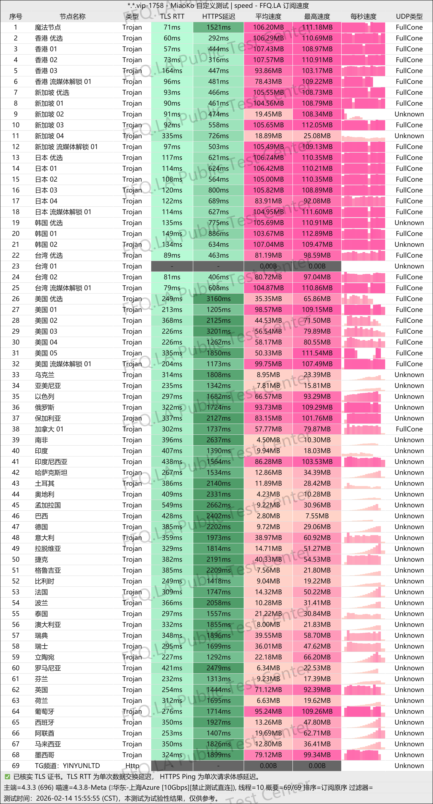

[隐云](https://wkacc.xyz/?code=1d6a5319 )在行业内率先推出==专属客户端与订阅协议兼容==的双模式驱动方案。用户可根据实际需求灵活选择接入方式，无论是习惯使用官方客户端的极简体验，还是偏好第三方订阅工具的自定义配置，都能获得无缝衔接的服务体验。按需购买的模式让资源配置更加精准，避免功能冗余带来的成本浪费。

📲隐云机场官网地址：[x.yinyun365.com/](https://wkacc.xyz/?code=1d6a5319 )
<!-- more -->

## 📑 目录
- [服务概览](#服务概览)
- [产品核心优势](#产品核心优势)
- [技术架构解析](#技术架构解析)
- [全球节点覆盖](#全球节点覆盖)
- [智能路由引擎](#智能路由引擎)
- [适用场景说明](#适用场景说明)

---

[隐云机场跑路预警](/scamvpn/yinyunyujing/)

---
::: caution

截至 **2026 年 6 月 30 日** **隐云机场** 已被本站纳入持续风险观察名单。

**减少损失！** 请立即停止续费与充值，优先转移业务与备份订阅。

近期机场行业持续出现跑路、失联、停止运营等情况，建议查看：

👉 **[⚠️ 2026年机场跑路汇总名单（持续更新）VPN机场跑路原因与避坑指南]( /scamvpn/paolujichang/ )**

持续更新最新跑路机场、失联机场及风险预警。

:::

---

## 服务概览

### 📲隐云机场官网地址：[x.yinyun365.com/](https://wkacc.xyz/?code=1d6a5319 )

### 👉[新用户3天5G体验领取](https://wkacc.xyz/?code=1d6a5319 )

### 💻服务核心信息

| 项目 | 详细信息 |
| :--- | :--- |
| **🌐 官方网站** | [x.yinyun365.com/](https://wkacc.xyz/?code=1d6a5319 ) |
| **💰 入门价格** | 29元/月/流量不限 |
| **💳 充值方式** | 支付宝、微信支付 |
| **🌍 服务器分布** | 自研双模驱动，全球智能连接 |
| **🔗 协议支持** | 专业客户端流量不限，基于TCP延迟的精准链路决策，自研双模驱动，全球智能连接服务，分流引擎等  |
---
 📚套餐详情
专业用户端：
| 🧮套餐等级 | 📛套餐名称 | 📑适用人群 | 🔁可选周期 | 💰月费 | 📶流量 |设备数量 | 🛍️购买链接 |
|---------|----------|----------|----------|------|------|------|----------| 
| 进阶版 | 轻量版 | 轻度至中度日常使用 | 月付、季付、年付 | ¥29.00/每月 |流量不限 |2台|[购买链接](https://wkacc.xyz/?code=1d6a5319 ) |
| 专业版 | 标准版 |	中度用户、高清视频 | 月付、半年、年付 | ¥49.00/每月 |流量不限 |5台|[购买链接](https://wkacc.xyz/?code=1d6a5319 ) |
| 尊享版 | 高级版 | 重度用户 | 月付、半年、年付 | ¥99.00/每月 |流量不限 |10台| [购买链接](https://wkacc.xyz/?code=1d6a5319 ) |
---
通用订阅：
| 🧮套餐等级 | 📛套餐名称 | 📑适用人群 | 🔁可选周期 | 💰月费 | 📶流量 |设备数量 | 🛍️购买链接 |
|---------|----------|----------|----------|------|------|------|----------| 
| 进阶版 | 轻量版 | 轻度至中度日常使用 | 月付、季付、年付 | ¥25.00/每月 |150GB/每月 |不限|[购买链接](https://wkacc.xyz/?code=1d6a5319 ) |
| 专业版 | 标准版 |	中度用户、高清视频 | 月付、半年、年付 | ¥49.00/每月 |400G/每月 |不限|[购买链接](https://wkacc.xyz/?code=1d6a5319 ) |
| 尊享版 | 高级版 | 重度用户 | 月付、半年、年付 | ¥99.00/每月 |1024G/每月 |不限| [购买链接](https://wkacc.xyz/?code=1d6a5319 ) |
---

## 产品核心优势
### 独家双模驱动架构
### 企业级专线基础设施
服务底层构建于**IPLC/IEPL/BGP多线路混合专线架构**之上，采用运营商级传输链路。所有数据通过专属通道传输，有效规避公共互联网的拥堵与干扰问题，实现低延迟、零丢包的高质量连接。多线路互为备份机制确保单点故障时秒级切换，维持业务连续性。

---

## 技术架构解析

### “魔法节点”智能分流技术
隐云自主研发的**服务端智能分流引擎**（Magic Node Technology）彻底简化了用户端的操作复杂度：

- **无需手动配置**：用户无需在本地设备设置复杂的路由规则或代理策略
- **自动识别目标服务**：系统实时分析流量特征，精准识别访问目标
- **智能分配解锁线路**：将Netflix、Disney+、ChatGPT、HBO等流媒体及AI服务流量自动路由至各地区专属优化节点
- **规避IP封锁风险**：流媒体流量与普通浏览流量物理隔离，避免因解锁节点IP被封导致全局服务中断

### 双模协议栈
- **客户端模式**：深度优化的专属协议，在移动网络环境下具备更强的抗丢包能力
- **订阅兼容模式**：支持主流代理协议标准，可导入Surge、Clash、Shadowrocket等第三方工具
- **自动协议协商**：系统根据当前网络环境自动选择最优传输协议

---

## 全球节点覆盖

隐云在全球范围内部署了**30+国家和地区**的接入节点，总数超过**100个**：

| 区域 | 覆盖国家/地区 | 节点类型 |
|------|--------------|---------|
| 东亚 | 香港、台湾、日本、韩国 | 低延迟优化节点 |
| 东南亚 | 新加坡、马来西亚、越南、泰国 | 国际业务加速节点 |
| 北美 | 美国（西岸/东岸）、加拿大 | 流媒体解锁节点 |
| 欧洲 | 英国、德国、法国、荷兰 | 欧洲业务优化节点 |
| 大洋洲 | 澳大利亚、新西兰 | 本地优化节点 |
| 中东/南美 | 阿联酋、巴西等 | 新兴市场覆盖节点 |

**99.9%服务可用性保障**，每个节点均部署多路专线备份，通过实时健康检查自动剔除故障线路。

---

## 智能路由引擎

### 实时网络感知技术
隐云的智能路由引擎持续监测以下网络指标：

- 延迟抖动
- 丢包率变化
- 带宽吞吐能力
- 国际出口拥堵状况

### 动态路径选择算法
基于上述监测数据，系统在**毫秒级时间**内完成路由决策：

1. 用户发起访问请求
2. 引擎实时评估当前所有可用路径质量
3. 选择延迟最低、丢包最少的传输通道
4. 会话期间持续监测，遇质量下降自动切换路径

### 多维度智能调度
- **按应用类型调度**：区分网页浏览、视频流媒体、文件下载、实时通信等场景
- **按时段调度**：针对不同地区高峰时段自动调整路由策略
- **按目标地域调度**：访问当地服务时优先分配本地出口节点

---

## 适用场景说明

### 流媒体观看
- Netflix/Disney+/HBO Max全区域内容解锁
- 4K/HDR视频流畅播放，无缓冲等待
- 多平台同时观看互不影响

### AI服务访问
- ChatGPT/Copilot等AI工具稳定连接
- 文件上传下载速度优化
- API调用低延迟响应

### 国际业务办公
- Google Workspace/Microsoft 365办公套件加速
- 海外网站后台管理
- 跨境团队协作工具优化

### 学术科研
- 国际学术数据库访问
- 论文资料检索下载
- 科研协作平台连接

---
## [👉新用户3天5G福利领取](https://wkacc.xyz/?code=1d6a5319)
## 👉新用户首次订购可使用邀请码  **1d6a5319**

## 📢机场推荐汇总： 👉[2026年翻墙机场推荐评测 稳定便宜VPN机场排行榜（高性价比科学上网工具长期更新）]( /vpn-recommend/ )  

## 📌 延伸阅读

👉iOS手机：[Shadowrocket （小火箭）2026年使用指南：iOS/macOS全平台配置教程(含非国区ID)](/article/Shadowrocket/ )

👉Android手机：[Clash for Android 2026年使用指南：终极配置指南教程](/article/ClashforAndroid/ )

👉Windows/Linux/Mac：[2026年 Clash Verge （Windows/Linux/Mac）全平台配置指南](/article/ClashVerge/ )

👉每天免费更新Apple ID：[2026年 最新最全免费共享美区 Apple ID |Shadowrocket/小火箭下载|每日更新](/article/freeAppleID/ )  

---

>📝 免责声明：本文仅供信息参考，建议均为个人经验与观点，不构成法律意见。实际情况以最新政策和主管部门解释为准，请在合法合规框架内使用相关服务。任何违法使用行为与本站无关。