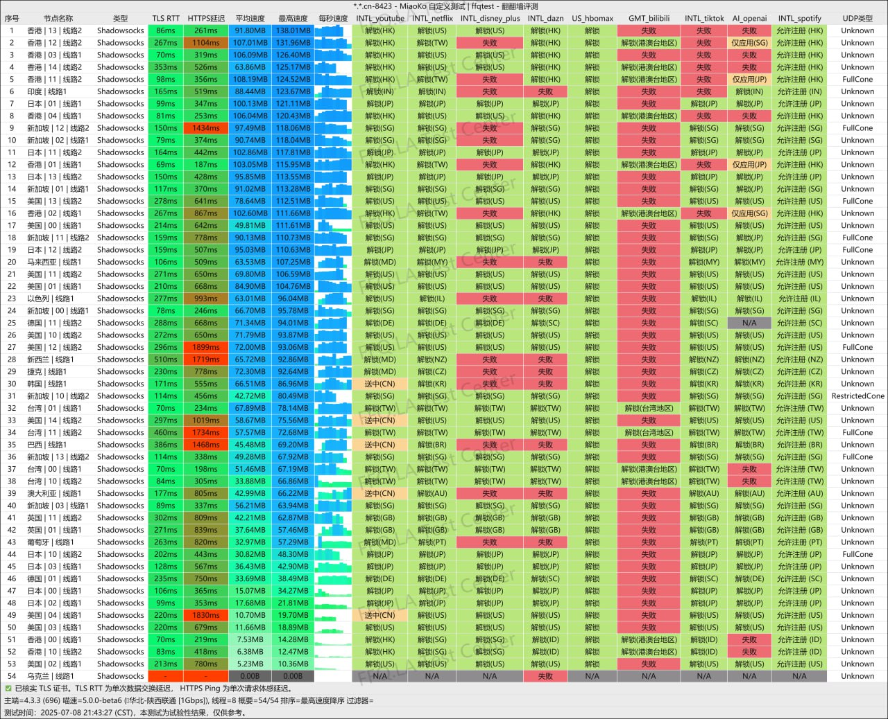
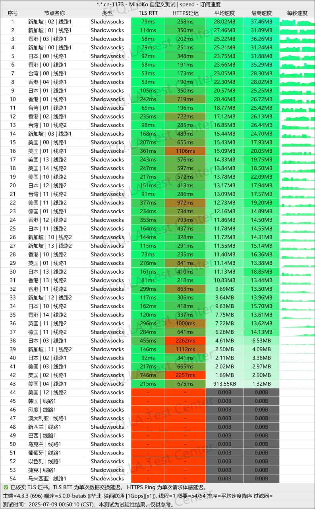

# 🛩99吧机场深度评测：新兴服务商，超高性价比

## 服务概览
[99吧](https://99vpn.bar/#/register?code=cdfPGm0D ) 于2024年8月23日正式投入运营，是一家专注于提供优质网络加速服务的新兴服务商。尽管成立时间相对较短，但其专业的技术架构和服务理念已展现出良好的市场潜力。


# 📃99吧 网络加速服务深度解析

## 📗服务基础信息

### 📰官方访问渠道
- **官方网站**：[99vpn.bar](https://99vpn.bar/#/register?code=cdfPGm0D )
- **专属邀请码**：9A5zBUnC
- **新用户体验**：[1天1G免费试用](https://99vpn.bar/#/register?code=cdfPGm0D )
- **💰 入门价格**：9.9元99G/月

## 📖套餐详情

### 1. 定期订阅套餐
| 🧮套餐等级 | 📛套餐名称 | 📑适用人群 | 🔁可选周期 | 💰月费 | 📶流量 | 🛍️购买链接 |
|---------|----------|----------|----------|------|------|----------| 
| 基础版 | 🔥九九@星耀VIP | 超轻度使用 | 月付、季付、半年、年付 | ¥9.90/每月 |99GB/月 |[购买链接](https://99vpn.bar/#/register?code=cdfPGm0D ) |
| 进阶版 | 🥇九九@铂金VIP |	轻度使用 | 月付、季付、半年、年付 | ¥19.99/每月 |199GB/月 |[购买链接](https://99vpn.bar/#/register?code=cdfPGm0D ) |
| 专业版 | 💎九九@钻石VIP| 中度使用 | 月付、季付、半年、年付  | ¥29.99/每月 |299GB/月 | [购买链接](https://99vpn.bar/#/register?code=cdfPGm0D ) |

### 2. 按量付费流量包

此模式适合使用频率不固定或需求波动的用户，流量包在有效期内无时间限制。

| 🧮套餐等级 | 📛套餐名称 | 📑适用人群 | 🔁可选周期 | 💰费用 | 📶流量 | 🛍️购买链接 |
|---------|----------|----------|----------|------|------|----------| 
| 进阶版 | 🌟 九九@星钻SVIP | 临时需求、备用线路 | 一次性 | ¥29.90 |111GB |[购买链接](https://99vpn.bar/#/register?code=cdfPGm0D ) |
| 专业版 | 🔱 九九@至尊SVIP  |	中长期灵活使用 | 一次性 | ¥59.90 |222GB |[购买链接](https://99vpn.bar/#/register?code=cdfPGm0D ) |
| 尊享版 | 👑九九@皇冠SVIP | 高消耗场景、灵活使用 | 一次性 | ¥99.99 |555GB | [购买链接](https://99vpn.bar/#/register?code=cdfPGm0D ) |
| 终极版 | ⚜️九九@尊耀SVIP | 大量消耗、灵活使用 | 一次性 | ¥199.99 |1111GB | [购买链接](https://99vpn.bar/#/register?code=cdfPGm0D ) |

### 📍纯小白请看以下教程，老鸟略过

👉[2025年安卓VPN完全指南：从选购到实战](https://vpnnew.net/article/anzhuoVPNzhinan/ )

👉[电脑用VPN怎么选？实用攻略与建议](https://vpnnew.net/article/diannanvpnzenmexuan/ )

👉[iPhone上装哪款VPN iOS版本？避坑指南](https://vpnnew.net/article/iphoneVPN/ )

### 📢核心网络架构
- **网络入口层**：采用深港IEPL专线结合广东移动中转的混合架构
- **传输层优化**：IEPL专线与公网中转双通道并行
- **节点落地层**：整合多家优质供应商资源，形成多元化落地网络

### 🔔合作伙伴生态
- **BageVM**：高性能云服务提供商
- **Lain**：专业网络基础设施服务商
- **Akari**：边缘计算节点供应商
- **Misaka**：全球网络覆盖服务商
- **快车道**：优质网络加速解决方案提供商

## 📱技术特性深度分析





### 协议与安全架构
- **核心协议**：全面采用Shadowsocks协议，兼顾性能与安全性
- **加密标准**：支持主流加密算法，确保数据传输安全
- **连接稳定性**：优化协议实现，减少连接中断风险

### 📲网络传输优化
```
网络路径规划：
1. 用户终端 → 广东移动中转节点
2. 中转节点 → 深港IEPL专线
3. 专线出口 → 多元化落地节点
4. 落地节点 → 目标服务
```

### 🔌流量计算策略
- **统一计费系数**：全网所有节点均按1倍率扣减流量
- **透明计费机制**：实时流量监控与统计
- **多端同步计费**：支持多设备使用统一计费

## 💻服务能力与兼容性

### 🖥️平台解锁能力
| 服务类别 | 支持平台 | 解锁状态 | 优化程度 |
|---------|----------|----------|----------|
| **流媒体服务** | Netflix | ✅ 完全支持 | 高清优化 |
| **社交媒体** | TikTok | ✅ 完全支持 | 低延迟优化 |
| **AI工具** | ChatGPT | ✅ 完全支持 | 稳定连接 |
| **其他服务** | 主流国际平台 | ✅ 基础支持 | 标准优化 |

### 🧮多设备支持策略
- **无设备数量限制**：单账户支持无限设备同时连接
- **配置同步功能**：多端配置信息实时同步
- **统一管理界面**：集中管理所有连接设备
- **使用状态监控**：实时查看各设备流量使用情况

## 📀服务套餐体系

### 🖲️试用体验计划
- **试用时长**：1天体验期
- **试用流量**：1GB测试流量
- **试用权限**：完整功能体验
- **试用目的**：服务品质验证

### 📕正式服务套餐
| 套餐等级 | 月费价格 | 月度流量 | 流速 | 性价比指数 |
|---------|----------|----------|----------|------------|
| **入门套餐** | ¥9.90 | 99GB | 🚀 限速999Mbps | ★★★☆☆ |
| **标准套餐** | ¥19.99 | 199GB | 🚀 限速999Mbps | ★★★★☆ |
| **高级套餐** | ¥29.99 | 299GB | 🚀 限速999Mbps | ★★★★★ |

## 📖性能表现评估

**深港专线性能：**
- 平均延迟：<50ms
- 峰值带宽：满足高清流媒体需求
- 稳定性指标：99%以上可用性

**中转节点性能：**
- 连接成功率：>98%
- 抗干扰能力：中等偏上
- 高峰时段表现：保持稳定

### 📗应用场景测试
```
流媒体播放测试：
- Netflix 4K：流畅播放无缓冲
- Disney+：高清内容稳定访问
- TikTok：视频加载迅速

生产力工具测试：
- ChatGPT：响应及时无中断
- 云办公应用：连接稳定可靠
```

## 📃用户体验设计

### 📚配置与管理
- **简易配置流程**：新手友好型设置向导
- **多平台客户端**：覆盖主流操作系统
- **自动优化功能**：智能选择最优节点
- **实时状态反馈**：连接质量可视化显示

### 📙客户支持体系
- **在线文档库**：详细配置教程与FAQ
- **技术支持渠道**：多途径问题反馈机制
- **社区交流平台**：用户经验分享空间
- **定期服务更新**：功能优化与节点扩展通知

## 📒市场定位与竞争优势

### 🧾核心竞争策略
1. **高性价比定位**：入门套餐单价低至每月 9.99元
2. **技术架构优势**：专线+中转混合模式提升稳定性
3. **设备友好策略**：无限制多设备支持满足家庭与小团队需求
4. **新兴服务优势**：采用最新技术架构，无历史负担

### 📨目标用户群体
- **个人用户**：寻求高性价比网络加速服务的个人用户
- **小团队**：需要多设备共享的小型团队
- **学生群体**：预算有限但对服务质量有要求的学生
- **新用户体验**：希望尝试网络加速服务的新用户

## 📩发展前景与建议

### 📤短期发展建议
- 完善套餐体系，增加中高端选项
- 扩展节点覆盖，增加区域多样性
- 优化客户端体验，提升用户满意度
- 建立用户反馈机制，持续改进服务

### 📬长期发展规划
- 构建更完善的技术支持体系
- 探索更多增值服务可能性
- 建立稳定的用户社区生态
- 持续优化网络架构，提升服务质量

---

**总结评价**：[99vpn.bar](https://99vpn.bar/#/register?code=cdfPGm0D )作为新兴的网络加速服务商，凭借其具有竞争力的价格策略、合理的网络架构设计和对多设备的友好支持，在市场中展现了良好的发展潜力。对于寻求高性价比服务且对多设备支持有需求的用户，值得考虑体验。


> **特别提示**：建议新用户从基础套餐开始试用，根据实际需求逐步升级服务方案。

---
#  📢更多机场推荐汇总

# 👉[2025年性价比翻墙机场推荐评测（长期更新）]( https://vpnnew.net/article/VPN/ )
## 👉新用户首次订购可使用优惠码  **[cdfPGm0D](https://99vpn.bar/#/register?code=cdfPGm0D  )**
## [👉新用户1天1G免费试用专属福利](https://99vpn.bar/#/register?code=cdfPGm0D  )

>评测数据基于实际测试结果，服务表现可能因网络环境而异。建议你根据自身需求进行实际测试验证。

>📝 免责声明：本文仅供信息参考，建议均为个人经验与观点，不构成法律意见。实际情况以最新政策和主管部门解释为准，请在合法合规框架内使用相关服务。任何违法使用行为与本站无关。