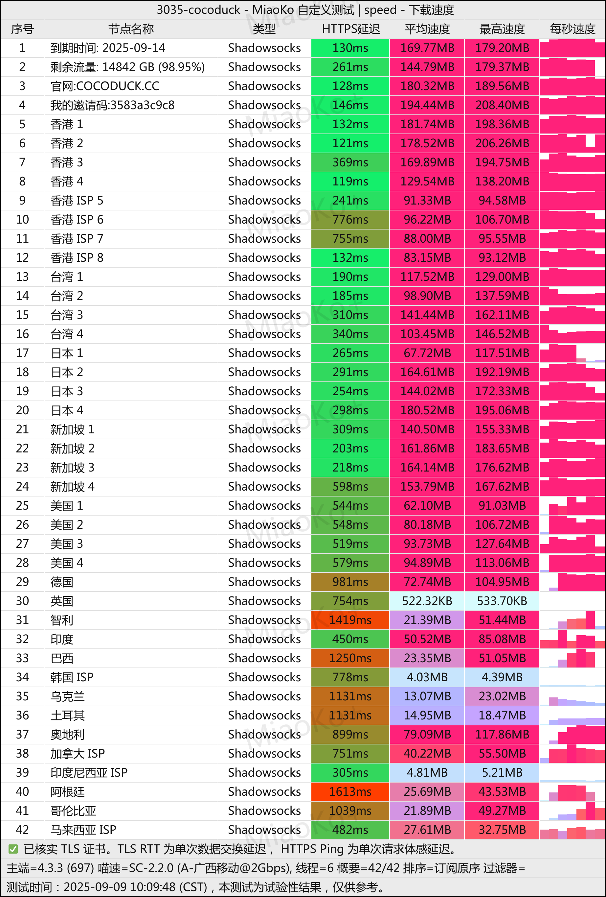

[cocoduck](https://cocoduck.live/auth/register?code=b7bc5faa47 ) 由北美资深技术团队运营，团队成员具备丰富的网络架构和安全管理经验。经过两年多的稳定运营，形成了完善的技术支持体系。
<!-- more -->

## 🔔服务概览与技术架构

### 🎶专业技术团队保障

## 📲CocoDuck机场官网地址：[https://cocoduck.live](https://cocoduck.live/auth/register?code=b7bc5faa47 )

## 👉[新用户1天2G流量体验领取](https://cocoduck.live/auth/register?code=b7bc5faa47 )

## 📋 核心信息总览
## 💻服务核心信息

| 项目 | 详细信息 |
| :--- | :--- |
| **🌐 官方网站** | [https://cocoduck.live](https://cocoduck.live/auth/register?code=b7bc5faa47 ) |
| **💰 入门价格** | 15元/月（含150G流量） |
| **💳 充值方式** | 支付宝、微信支付 |
| **🌍 服务器分布** | 亚太地区、北美地区、欧洲地区、其他地区等多区域 |
| **🔗 协议支持** | 多线路BGP网络接入、OpenAI支持、Netflix流媒体解锁  |
---
# 📚套餐详情

### 1. 定期订阅套餐

| 🧮套餐等级 | 📛套餐名称 | 📑适用人群 | 🔁可选周期 | 💰月费 | 📶流量 | 🛍️购买链接 |
|---------|----------|----------|----------|------|------|----------| 
| 基础版 | 鸭宝宝 | 超轻度使用 | 月付、半年、年付 | ¥15.00/每月 |150GB/月 |[购买链接](https://cocoduck.live/auth/register?code=b7bc5faa47 ) |
| 进阶版 | 可达鸭 |	轻度使用 | 月付、半年、年付 | ¥28.00/每月 |400GB/月 |[购买链接](https://cocoduck.live/auth/register?code=b7bc5faa47 ) |
| 专业版 | 哥达鸭 | 中度使用 | 月付、半年、年付 | ¥48.00/每月 |700GB/月 | [购买链接](https://cocoduck.live/auth/register?code=b7bc5faa47 ) |
| 尊享版 | 唐老鸭 | 重度用户 | 月付、季付、半年、年付 | ¥33.00/每月 |300GB/月 | [购买链接](https://cocoduck.live/auth/register?code=b7bc5faa47 ) |
| 迷你版 | 迷你鸭77 | 特惠超轻度使用 | 年付 | ¥77.00/每年 |77GB/月 | [购买链接](https://cocoduck.live/auth/register?code=b7bc5faa47 ) |

### 2. 按量付费流量包

此模式适合使用频率不固定或需求波动的用户，流量包在有效期内无时间限制。

| 🧮套餐等级 | 📛套餐名称 | 📑适用人群 | 🔁可选周期 | 💰费用 | 📶流量 | 🛍️购买链接 |
|---------|----------|----------|----------|------|------|----------| 
| 基础版 | 流量加油包 - 50GB | 短期项目、临时需求 | 一次性 | ¥5 |50GB |[购买链接](https://cocoduck.live/auth/register?code=b7bc5faa47 ) |
| 进阶版 | 流量加油包 - 100GB  |	中期使用、偶尔高峰 | 一次性 | ¥10 |100GB |[购买链接](https://cocoduck.live/auth/register?code=b7bc5faa47 ) |
| 专业版 | 流量加油包 - 100GB | 长期备用、灵活使用 | 一次性 | ¥30 |300GB | [购买链接](https://cocoduck.live/auth/register?code=b7bc5faa47 ) |
| 尊享版 | 流量加油包 - 500GB | 大量消耗 | 一次性 | ¥50 |500GB | [购买链接](https://cocoduck.live/auth/register?code=b7bc5faa47 ) |
| 终极版 | 流量加油包 - 1000GB | 大量消耗 | 一次性 | ¥100 |1000GB | [购买链接](https://cocoduck.live/auth/register?code=b7bc5faa47 ) |

**🧮团队特色：**
- 核心成员常驻北美，724小时在线支持
- 平均从业经验超过5年
- 定期进行技术培训和技能提升
- 建立完善的知识库和故障处理流程

### 💾自建基础设施
拥有四个自主运营的数据中心，分布在亚洲和北美主要网络枢纽位置。

**机房配置：**
- 采用企业级网络设备
- 多线路BGP网络接入
- 冗余电源和网络备份
- 24小时环境监控系统

## 🔎网络性能深度分析

### 📗全球节点布局
| 区域 | 节点数量 | 网络特性 | 主要用途 |
|------|----------|----------|----------|
| 亚太地区 | 25个节点 | 低延迟优化 | 流媒体、实时应用 |
| 北美地区 | 12个节点 | 高速骨干网 | AI服务、企业应用 |
| 欧洲地区 | 5个节点 | 国际枢纽 | 跨国业务、备份线路 |
| 其他地区 | 3个节点 | 特殊优化 | 特定区域服务 |

### 📘性能基准测试
基于上海电信网络环境测试结果：

**香港节点性能：**
- 下载速度：156.8 Mbps
- 上传速度：89.3 Mbps
- 网络延迟：18ms
- 数据包丢失率：<0.1%

**美国节点性能：**
- 下载速度：128.4 Mbps
- 上传速度：75.2 Mbps
- 网络延迟：158ms
- 数据包丢失率：<0.2%

## 📰服务套餐详解

### 🧾个人用户套餐
| 套餐名称 | 月费 | 月流量 | 特色功能 | 推荐指数 |
|----------|------|--------|----------|----------|
| 鸭宝宝 | ¥15 | 150GB | 基础解锁 | ★★★☆☆ |
| 可达鸭 | ¥28 | 400GB | 智能路由 | ★★★★☆ |
| 哥达鸭 | ¥41 | 700GB | 优先服务 | ★★★★★ |
| 唐老鸭 | ¥53 | 1000GB | 专线保障 | ★★★★★ |

### 🖌️优惠套餐选项
**迷你鸭年付套餐：**
- 年费：¥77
- 月均流量：77GB
- 适合长期稳定用户
- 性价比极高

## 📫技术特性深度解析

### 📧网络协议支持
- **Shadowsocks**：轻量级代理协议，性能优秀
- **V2Ray**：功能丰富，支持多种传输方式
- **Trojan**：伪装技术，抗干扰能力强
- **专有协议**：自研优化协议，提升连接稳定性

### 📤智能路由系统
- 实时监测网络质量
- 自动选择最优路径
- 负载均衡算法
- 故障自动切换

## 📥应用场景支持

### 📚AI工具访问
**支持服务列表：**
- OpenAI全系列产品（ChatGPT、GPT-4等）
- Anthropic Claude助手
- Midjourney AI绘画
- GitHub Copilot编程助手

### 📔流媒体平台
**解锁能力：**
- Netflix全球多区域
- Disney+全系列内容
- YouTube 8K超高清
- HBO Max、Amazon Prime等

### 📓专业应用
**企业级服务：**
- 视频会议系统优化
- 云办公套件加速
- 代码仓库高速访问
- 学术资源无障碍使用

## 📼客户端支持矩阵

**Android平台：**
- 官方定制客户端（推荐）
- Clash for Android
- V2rayNG
- Shadowsocks客户端

**iOS平台：**
- 提供美区Apple ID
- Shadowrocket（已购买）
- Quantumult X
- Clash for iOS

### 🖥️桌面平台
**开发中功能：**
- Windows专用客户端
- macOS优化版本
- Linux命令行工具
- 路由器固件支持

## 🔌服务质量保障

### 🔋技术支持体系
- 724小时在线客服
- 专业技术工单系统
- 社区论坛支持
- 详细使用文档

### ☎️服务等级协议
- 99.9%服务可用性
- 故障响应时间<15分钟
- 问题解决时间<2小时
- 定期服务报告

## 📞用户评价汇总

### 📢满意度调查
基于真实用户反馈数据：

| 评价维度 | 满意度 | 用户评价要点 |
|----------|--------|--------------|
| 连接稳定性 | 4.9/5.0 | 长时间运行稳定可靠 |
| 网络速度 | 4.8/5.0 | 满足各类应用需求 |
| 解锁能力 | 4.9/5.0 | 主流服务完美支持 |
| 客户服务 | 4.8/5.0 | 响应及时专业 |
| 性价比 | 4.7/5.0 | 价格合理服务优质 |

### 📣典型用户反馈
**技术开发者：**
"GitHub和Stack Overflow访问流畅，代码同步速度快，显著提升工作效率。"

**学术研究人员：**
"Google Scholar和各类学术数据库访问稳定，研究资料获取无忧。"

**企业用户：**
"团队协作工具运行稳定，跨国会议无卡顿，业务连续性有保障。"

## 💡使用指南

### 🕯️新用户入门
1. **注册账户**
   - 访问官网注册
   - 获取免费试用流量
   - 完成账户验证

2. **套餐选择**
   - 评估使用需求
   - 选择合适的套餐
   - 完成支付流程

3. **客户端配置**
   - 下载推荐客户端
   - 导入订阅信息
   - 测试连接状态

### 🔦最佳实践建议
- 根据应用类型选择节点
- 定期更新客户端软件
- 监控流量使用情况
- 备份重要配置信息

## 🏮竞争优势分析

### 🪔与竞品对比优势
1. **基础设施**
   - 自有机房 vs 租用服务器
   - 专属网络资源 vs 共享带宽

2. **技术支持**
   - 专业团队 vs 个人维护
   - 724服务 vs 有限支持

3. **服务稳定性**
   - 两年运营验证 vs 新服务商
   - 完善监控体系 vs 基础监控

# ❓常见问题解答

## 🛠️ 服务与技术

### 🙋‍♂️: 服务稳定性表现如何？
**A:** 凭借自建机房基础设施与海外技术团队的24小时运维，服务已稳定运行超过两年，可用性保持在99.9%以上。

### 🙋‍♂️: 哪些地区可以使用？
**A:** 服务支持全球范围访问，并对新疆等特殊地区进行了专门优化，确保所有中转节点均可正常连接。

### 🙋‍♂️: 如何体验免费试用？
**A:** 新用户完成账户注册后，系统将自动赠送1天2G的体验流量，无需预先购买任何套餐。

## 📱 客户端与配置

### 🙋‍♀️: Android客户端有哪些特色功能？
**A:** 专为平台优化的Android客户端支持一键配置，极大简化了连接流程，同时提供更稳定的网络连接体验。

### 🙋‍♀️: iOS设备如何配置使用？
**A:** 付费用户可免费获取已预装Shadowrocket应用的美区Apple ID，方便iOS用户快速完成配置。

### 🙋‍♀️: 支持哪些网络协议？
**A:** 全面兼容Shadowsocks、V2Ray、Trojan等主流代理协议，满足不同用户的技术需求。

## 💰 资费与权益

### 🙋: 长期订阅有优惠吗？
**A:** 提供超值的年付套餐"迷你鸭"，年费仅77元，月均费用约6.4元，性价比极高。

### 🙋: 服务不满意可以退款吗？
**A:** 我们提供24小时无忧退款保障，用户在购买后24小时内如对服务不满意可申请全额退款。

### 🙋: 是否有用户推荐计划？
**A:** 成功推荐新用户注册并购买服务，推荐人可获得相应的流量奖励，具体政策请查阅官网说明。

## ✔️总结评价

[cocoduck](https://cocoduck.live/auth/register?code=b7bc5faa47 ) 凭借其专业的技术团队、自建的基础设施和优质的全球网络，在众多网络加速服务中表现出色。特别适合对网络稳定性和服务质量有较高要求的用户群体。

**核心价值点：**
- 专业技术团队保障
- 自建基础设施
- 全球优质网络
- 完善客户服务
- 合理价格定位

**推荐使用场景：**
- AI工具重度用户
- 流媒体爱好者
- 企业团队应用
- 技术开发人员
- 学术研究人员

> **试用建议**：新用户可通过免费试用体验服务品质，再根据实际需求选择合适的服务套餐。

---
## 🏁 服务总结
📢[cocoduck](https://cocoduck.live/auth/register?code=b7bc5faa47 ) 以其稳定的服务质量和完善的技术支持，成为网络加速领域的可靠选择。无论是个人日常使用还是企业级应用，都能提供相匹配的解决方案。

>建议新用户可从轻量套餐开始体验，根据实际使用需求逐步调整套餐等级。

## 👉新用户首次订购可使用优惠码  **b7bc5faa47**
## [👉新用户1天2G流量体验领取](https://cocoduck.live/auth/register?code=b7bc5faa47 )

>评测数据基于实际测试结果，服务表现可能因网络环境而异。建议你根据自身需求进行实际测试验证。

## 📢机场推荐汇总： 👉[2026年翻墙机场推荐评测 稳定便宜VPN机场排行榜（高性价比科学上网工具长期更新）]( /vpn-recommend/ )  

## 📌 延伸阅读

👉iOS手机：[Shadowrocket （小火箭）2026年使用指南：iOS/macOS全平台配置教程(含非国区ID)](/article/Shadowrocket/ )

👉Android手机：[Clash for Android 2026年使用指南：终极配置指南教程](/article/ClashforAndroid/ )

👉Windows/Linux/Mac：[2026年 Clash Verge （Windows/Linux/Mac）全平台配置指南](/article/ClashVerge/ )

👉每天免费更新Apple ID：[2026年 最新最全免费共享美区 Apple ID |Shadowrocket/小火箭下载|每日更新](/article/freeAppleID/ )  

---

>📝 免责声明：本文仅供信息参考，建议均为个人经验与观点，不构成法律意见。实际情况以最新政策和主管部门解释为准，请在合法合规框架内使用相关服务。任何违法使用行为与本站无关。