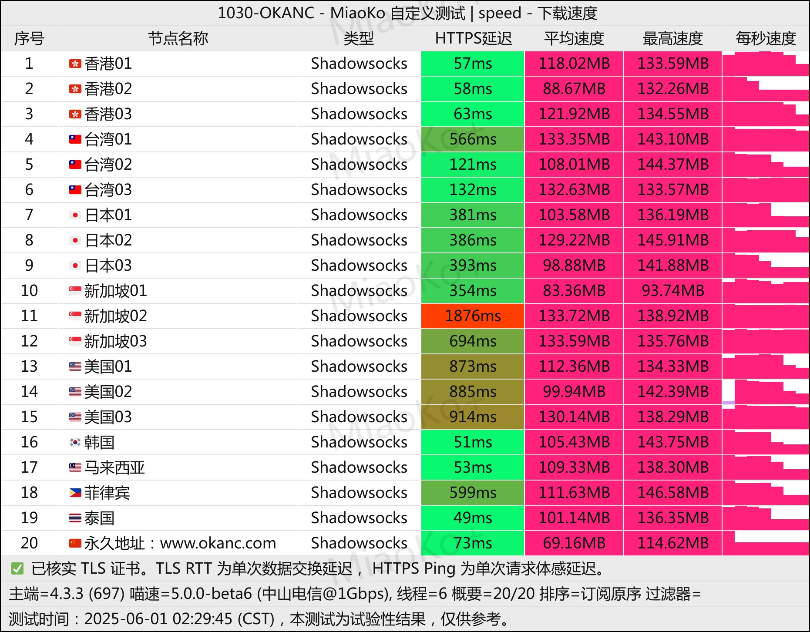

[OKANC](https://www.okanc.com/index.php#/register?code=j4gYClCp)机场并非普通新兴服务，其与业内知名的 ==**奈云 (NaiCloud) 同宗同源**==，继承了成熟的技术架构与运营信誉。专注于为高需求用户提供 ==**顶级网络质量**==，在速度、稳定性与延迟控制上表现卓越，是追求极致网络体验用户的优选。

📲OKANC机场官网地址：[okanc.com](https://www.okanc.com/index.php#/register?code=j4gYClCp) |
<!-- more -->
---
## 🌐 服务概览

## 📋 核心信息总览

| 项目 | 详细信息 |
|------|----------|
| 🌐 **官方网站** | [okanc.com](https://www.okanc.com/index.php#/register?code=j4gYClCp) | |
| 🎁 **新用户福利** | [👉新用户专享领取](https://www.okanc.com/index.php#/register?code=j4gYClCp) |
| 💰 **入门价格** | 46元/月（328G/月流量）|
| 💳 **充值方式** | 支付宝、微信支付 |
| 🌍 **线路优势** | 多地BGP跨境专线 物理绕开封锁 |
| 🔗 **协议支持** | Netfilx 等媒体全天4k播放、ChatGPT 等应用稳定使用、全球主流地区节点随心使用、OKANC 不限制 设备连接数等 |
---
## 📈套餐详情
| 🧮套餐等级 | 📛套餐名称 | 📑适用人群 | 🔁付费方式 | 💰月费 | 📶流量 | 性价比指数 |🛍️购买链接 |
|---------|----------|----------|----------|------|------|----------|----------|
| 基础级 | Pro版 | 日常使用 | 月付、季付、半年、年付 | ¥46.00/月 | 328GB/月 | ⭐⭐⭐ |[购买链接](https://www.okanc.com/index.php#/register?code=j4gYClCp ) |
| 进阶级 | Max版 | 重度使用 | 月付、季付、半年、年付 | ¥52.00/月 | 600GB/月 | ⭐⭐⭐⭐⭐ |[购买链接](https://www.okanc.com/index.php#/register?code=j4gYClCp ) |
| 尊享级 | MAX+极致版 | 超重度用户 | 月付、季付、半年、年付 | ¥88/月 | 1024GB/月 | ⭐⭐⭐⭐ |[购买链接](https://www.okanc.com/index.php#/register?code=j4gYClCp ) |

---
> 💎 **核心提示**：价格定位高于市场平均水平，但对应的是 **奈云级别的技术保障** 和 **商业级网络质量**。

---

## 🏆 五大核心优势解析

### 1. 🛡️ **品牌与技术传承**
- **同源奈云**：共享奈云多年积累的技术架构与节点资源
- **信誉保障**：成熟运营团队的可靠性与稳定性背书
- **持续更新**：前沿协议支持与常态化网络优化

### 2. ⚡ **极致性能表现**
- **低延迟优先**：全球节点深度优化，游戏级网络延迟
- **高速率保障**：支持4K/8K流媒体无缓冲加载
- **稳定性卓越**：企业级SLA保障，99.9%可用性

### 3. 🌍 **全球网络覆盖**
- **优质节点分布**：覆盖香港、日本、新加坡、美国、欧洲等主流区域
- **线路多样化**：BGP、CN2 GIA、IPLC混合骨干网络
- **智能路由**：根据应用类型自动选择最优路径

### 4. 🎬 **全场景解锁能力**
- **流媒体全家桶**：Netflix、Disney+、HBO Max、Amazon Prime等原生解锁
- **游戏零阻碍**：Steam、Xbox、PSN、战网国际服低延迟访问
- **商业应用支持**：AWS、Azure、Google Cloud、Salesforce等企业服务

### 5. 🔒 **高级安全特性**
- **企业级加密**：最新协议支持，防探测防干扰
- **隐私保护**：严格的无日志政策，数据安全有保障
- **抗封锁能力**：深度混淆技术，适应复杂网络环境

---

## 🎯 精准用户画像

### ✅ 特别适合：
- **跨境电商从业者**：需要稳定访问Amazon、Shopify、广告平台
- **国际游戏玩家**：追求低延迟的PS/Xbox/PC在线游戏体验
- **高清影音爱好者**：经常观看4K HDR流媒体内容
- **远程办公专业人士**：依赖Zoom、Teams、Slack等国际协作工具
- **开发与极客用户**：需要稳定访问GitHub、Docker、各类API服务
- **高频出国需求者**：留学、外贸、学术研究等长期跨国网络需求

### ⚠️ 可能不适合：
- 预算有限的轻度用户
- 仅需基础网页浏览和社交媒体的用户
- 对网络质量要求不高的临时需求

---

## 📈 性价比深度分析

### 价格对比视角
| 对比维度 | OKANC机场 | 普通机场 | 优势分析 |
|---------|---------|---------|---------|
| **技术基础** | 奈云同源技术 | 自建或代理节点 | **架构成熟度更高** |
| **网络质量** | 商业级专线 | 共享公共线路 | **稳定性与速度优势明显** |
| **售后服务** | 专业团队支持 | 基础客服响应 | **问题处理能力更强** |
| **长期价值** | 持续优化更新 | 可能波动较大 | **投资回报更可靠** |

### 各套餐价值评估
1. **Pro版 (¥46/328GB)**
   - **日均10GB**，满足高强度个人使用
   - 适合4K流媒体日常观看+重度网页浏览

2. **Max版 (¥52/600GB)**
   - **性价比峰值**，仅加4元流量近乎翻倍
   - 适合家庭共享或2-3设备同时高强度使用

3. **MAX+极致版 (¥88/1024GB)**
   - **商业级容量**，月均1TB超大流量
   - 适合小型团队、直播主或多人大流量场景

---

## 🚀 实测性能预期



### 基准性能指标
- **延迟范围**：
  - 香港/台湾：15-30ms
  - 日本/韩国：30-50ms  
  - 新加坡：50-70ms
  - 美西：120-150ms

- **速度表现**：
  - 本地带宽充足情况下，普遍可达 **200-500Mbps**
  - 4K视频：即点即播，无缓冲等待
  - 大文件下载：稳定满速，支持多线程加速

- **高峰时段**：
  - 专线资源保障，**晚高峰无降速**
  - 节假日期间稳定性依然出色

### 场景化测试
```markdown
游戏场景：
  - 《英雄联盟》国际服：延迟40-60ms，无丢包
  - 《原神》海外版：稳定60ms，流畅体验
  - 在线FPS游戏：反应迅速，无卡顿

工作场景：
  - Zoom/Teams视频会议：1080P流畅，音频清晰
  - 远程桌面连接：操作跟手，无感知延迟
  - 大文件上传下载：速度稳定，不中断

娱乐场景：
  - Netflix 4K HDR：秒开，码率充足
  - YouTube 8K：流畅播放，无缓冲
  - Spotify/Apple Music：高清音频无卡顿
```

---

## 🔧 技术支持与服务

### 客户端兼容性
- **全协议支持**：Shadowsocks、V2Ray、Trojan、Hysteria2等
- **多平台覆盖**：
  - Windows：Clash Verge、NekoRay、V2RayN
  - macOS：ClashX Pro、Surge、Quantumult X
  - iOS：Shadowrocket、Stash、Loon
  - Android：Clash Meta、Matsuri、V2RayNG
  - 路由器：OpenClash、PassWall2、ShellCrash

### 配置便利性
1. **一键订阅**：复制订阅链接，客户端自动导入
2. **智能分组**：按用途（流媒体/游戏/工作）自动分流
3. **规则完善**：内置最新域名/IP规则库，免手动维护

### 客户服务
- **响应时效**：专业团队，快速响应技术问题
- **文档齐全**：详细教程与常见问题解答
- **社区支持**：用户交流群，经验分享与互助

---

## 📋 使用建议与技巧

### 新手入门指南
1. **套餐选择**：首次建议选择 **Max版**，平衡流量与成本
2. **节点策略**：优先选择 **香港/日本** 节点，延迟最低
3. **客户端推荐**：新手用 **Clash Verge**，功能全面配置简单
4. **测试方法**：使用客户端内置测速，选择延迟最低且负载适中的节点

### 高级优化技巧
- **分流规则**：根据应用类型设置精细化分流
- **协议选择**：移动网络推荐Hysteria2，家用宽带推荐V2Ray
- **备用节点**：配置2-3个不同地区的优质节点作为备用
- **定时切换**：可设置脚本在高峰时段自动切换至低负载节点

---

## ⚠️ 注意事项与限制

### 使用限制
- **禁止行为**：严禁任何违法违规用途、P2P下载、网络攻击
- **共享建议**：家庭内部共享可接受，但避免大规模分发
- **流量公平**：禁止长期占用大量带宽影响他人使用

### 网络适应性
- **运营商差异**：移动/联通/电信体验可能略有不同
- **地域影响**：内陆地区连接部分节点延迟会稍高
- **设备要求**：建议使用支持现代加密协议的设备

---

## 📊 竞品对比分析

| 特性对比 | OKANC机场 | 普通高端机场 | 经济型机场 |
|---------|---------|---------|---------|
| **价格水平** | 中高 | 高 | 低 |
| **技术背景** | 奈云同源 | 自主开发 | 开源方案 |
| **网络质量** | 顶级 | 优秀 | 一般 |
| **稳定性** | 极高 | 高 | 中等 |
| **适合用户** | 专业/商业 | 发烧友 | 轻度用户 |

---

## ✅ 最终购买建议

### 强烈推荐购买如果：
- ✅ 你是奈云的老用户，信任其技术品质
- ✅ 需要稳定进行跨境电商或国际业务
- ✅ 是硬核游戏玩家，对网络延迟极其敏感
- ✅ 经常观看4K/8K高清流媒体内容
- ✅ 有远程办公或开发需求，网络中断成本高

### 建议谨慎考虑如果：
- ❌ 每月预算低于50元
- ❌ 仅用于偶尔的网页浏览和社交媒体
- ❌ 对网络质量要求不高，能接受偶尔卡顿
- ❌ 流量需求极小（每月<100GB）

---

## 🎯 总结评价

OKANC机场凭借 **奈云同源的技术底蕴**，提供了市场上 **顶级的网络服务质量**。虽然价格定位偏向中高端，但其在 **速度、稳定性、延迟控制** 等方面的表现确实对得起这份投资。

**核心价值主张**：不是最便宜的，但可能是同价位中 **质量最可靠** 的选择；不是流量最大的，但可能是 **每GB体验最好** 的专线服务。

> **💎 终极建议**：如果你将网络质量视为生产力工具或重要娱乐保障，愿意为 **卓越的稳定性和低延迟** 支付合理溢价，OKANC机场值得成为你的主力选择。特别是对于电商、游戏、远程办公等高需求场景，其可靠性带来的价值远超套餐价格本身。
>
> **🚀 立即体验顶级网络**：[访问 OKANC 官网](https://www.okanc.com/index.php#/register?code=j4gYClCp)，选择适合您需求的套餐，开启无妥协的网络体验。

---

#  📢更多机场推荐汇总

## 👉新用户首次订购可使用优惠码  **[j4gYClCp](https://www.okanc.com/index.php#/register?code=j4gYClCp)**
## [👉新用户专享福利](https://www.okanc.com/index.php#/register?code=j4gYClCp  )

>评测数据基于实际测试结果，服务表现可能因网络环境而异。建议你根据自身需求进行实际测试验证。

## 📢机场推荐汇总： 👉[2026年翻墙机场推荐评测 稳定便宜VPN机场排行榜（高性价比科学上网工具长期更新）]( /vpn-recommend/ )  

## 📌 延伸阅读

👉iOS手机：[Shadowrocket （小火箭）2026年使用指南：iOS/macOS全平台配置教程(含非国区ID)](/article/Shadowrocket/ )

👉Android手机：[Clash for Android 2026年使用指南：终极配置指南教程](/article/ClashforAndroid/ )

👉Windows/Linux/Mac：[2026年 Clash Verge （Windows/Linux/Mac）全平台配置指南](/article/ClashVerge/ )

👉每天免费更新Apple ID：[2026年 最新最全免费共享美区 Apple ID |Shadowrocket/小火箭下载|每日更新](/article/freeAppleID/ )  

---

>📝 免责声明：本文仅供信息参考，建议均为个人经验与观点，不构成法律意见。实际情况以最新政策和主管部门解释为准，请在合法合规框架内使用相关服务。任何违法使用行为与本站无关。