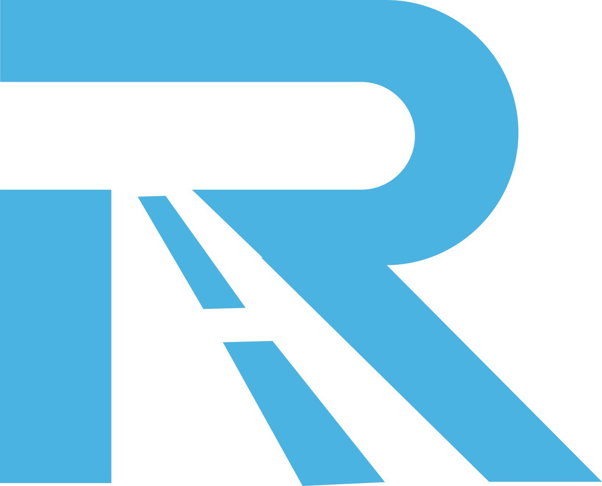

Runway机场9.9元100G起，支持Shadowsocks协议、Netflix和YouTube流媒体解锁，是目前性价比较高的科学上网机场推荐。Runway机场是近年来出现的 **高性价比Shadowsocks机场**。本文将进行 **全面评测**。

📲 官网地址 ： 👉 [https://www.runwayhz.com](https://www.runwayhz.com/#/register?code=6uVJY4zh)
<!-- more -->
---

## 目录

1 📋信息总览  
2 📈套餐详情  
3 💻Runway机场节点  
4 📲Runway机场速度  
5 📩支持客户端  
6 📖购买教程  
7 💡常见问题  

---

## 📋信息总览 

| 项目 | 详细信息 |
|------|----------|
| 🌐 **官方网站** | [https://www.runwayhz.com](https://www.runwayhz.com/#/register?code=6uVJY4zh) |
| 🎁 **新用户福利** | [👉一天免费6GB体验领取](https://www.runwayhz.com/#/register?code=6uVJY4zh) |
| 💰 **入门价格** | 9.9元/月（100G/月流量）|
| 💳 **充值方式** | 支付宝、微信支付 |
| 🌍 **设备限制** | 不限客户端连接数量 |
| 🔗 **协议支持** | 支持 Netflix、YouTube 等流媒体解锁、无视晚高峰网络压力，4K / 8K 视频秒加载、 BGP+IEPL 高速线路保障，SLA 在线率 99.99%等 |
---

## 📈套餐详情

| 🧮套餐等级 | 📛套餐名称 | 📑适用人群 | 🔁网速限制 | 💰费用 |🔁可选周期 | 📶流量 | 🛍️购买链接 |
|---------|----------|----------|----------|------|------|------|----------|
| 标准级 | 经济舱(Economy) | 轻度用户 | 200Mbps | ¥9.90/月 |月付、季付、半年、一年| 100GB/月 | [购买链接](https://www.runwayhz.com/#/register?code=6uVJY4zh ) |
| 专业级 | 商务舱(Business) | 日常使用 | 400Mbps | ¥19.90/月 |月付、季付、半年、一年| 200GB/月 | [购买链接](https://www.runwayhz.com/#/register?code=6uVJY4zh ) |
| 至尊级 | 头等舱(First Class) | 重度用户 | 不限速 | ¥50.00/月 |月付、季付、半年、一年| 600GB/月 | [购买链接](https://www.runwayhz.com/#/register?code=6uVJY4zh ) |
| 不限时 | 空中流量包(Air traffic data package) | 灵活用户 | 不限速 | ¥45.00 |一次性| 150GB | [购买链接](https://www.runwayhz.com/#/register?code=6uVJY4zh ) |
---
> 📌 优惠政策：
> - 经济舱年付相对折扣约 18%，约省 ¥20.80。
> - 商务舱年付相对折扣约 16%，约省 ¥38.80。
> - 头等舱年付相对折扣约 17%，约省 ¥100.00。
> - 三档套餐均建议季付起购，实际以官网结算页为准。

属于 **2026便宜机场推荐**。

---

## 💻Runway机场节点

主要节点：

- 香港
- 日本
- 新加坡
- 美国
- 欧洲

适合：

- Netflix
- YouTube
- 海外网站访问

---

## 📲Runway机场速度

根据用户测试：

- 延迟：60ms-120ms
- 下载速度：100Mbps+

适合：

- 视频
- 浏览
- 远程办公

---

## 纯小白请看以下教程，老鸟略过

👉iOS手机：[Shadowrocket （小火箭）2026年使用指南：iOS/macOS全平台配置教程(含非国区ID)](https://vpnnew.net/article/Shadowrocket/ )

👉Android手机：[Clash for Android 2026年使用指南：终极配置指南教程](https://vpnnew.net/article/ClashforAndroid/ )

👉Windows/Linux/Mac：[2026年 Clash Verge （Windows/Linux/Mac）全平台配置指南](https://vpnnew.net/article/ClashVerge/ )

## 📩支持客户端

支持：

- Clash
- Shadowrocket
- Stash
- v2rayN
- Clash Verge

---

## 📖购买教程

### 第一步

访问官网

[https://www.runwayhz.com](https://www.runwayhz.com/#/register?code=6uVJY4zh)

### 第二步

注册账号

### 第三步

购买套餐

### 第四步

导入订阅

---

## 💡常见问题

❓：Runway机场怎么样

🙋‍♂️：价格低，适合新手。

❓：Runway机场多少钱

🙋‍♂️：9.9元100GB。

❓：Runway机场可以看Netflix吗

🙋‍♂️：支持Netflix。

---

## 📢总结

Runway机场适合：

- 新手用户
- 流媒体用户
- 便宜机场用户

### 👉新用户首次订购可使用优惠码  **6uVJY4zh**

### [👉新用户一天免费6GB体验领取](https://www.runwayhz.com/#/register?code=6uVJY4zh )

### 📢机场推荐汇总： 👉[2026年性价比翻墙机场推荐评测（长期更新）]( https://vpnnew.net/article/VPN/ )

### 📢机场福利推荐汇总：👉[2026年翻墙机场优惠券及免费试用体验汇总（长期更新）]( https://vpnnew.net/article/youhuijuan/ )

---

>评测数据基于实际测试结果，服务表现可能因网络环境而异。建议你根据自身需求进行实际测试验证。

>📝 免责声明：本文仅供信息参考，建议均为个人经验与观点，不构成法律意见。实际情况以最新政策和主管部门解释为准，请在合法合规框架内使用相关服务。任何违法使用行为与本站无关。