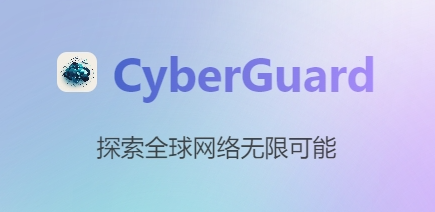
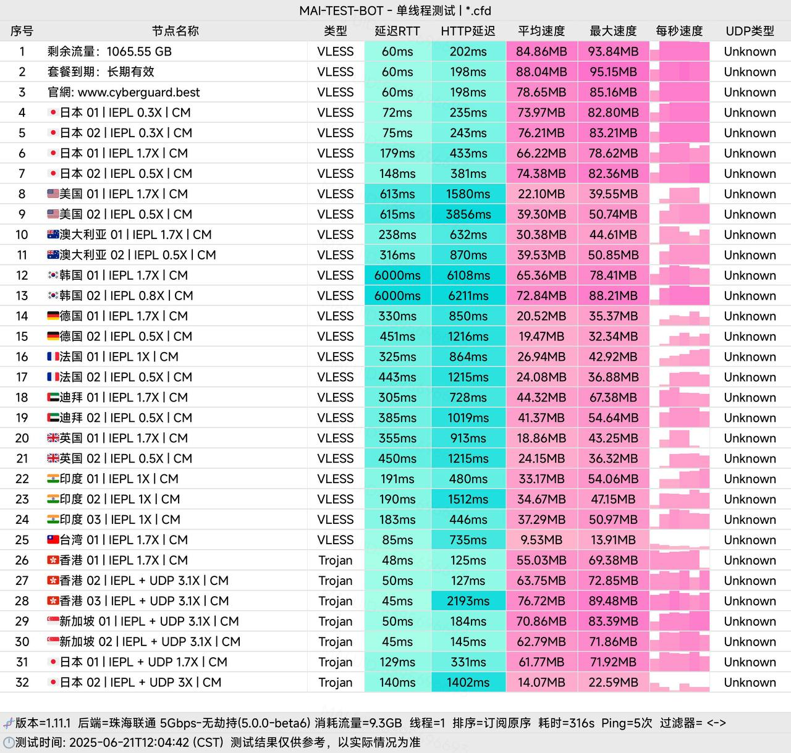

[cyberguard机场](https://www.cyberguard.best/#/register?code=qWL0nnJs )  作为稳定运营两年的专业网络服务提供商，致力于为用户提供安全可靠的高速网络连接解决方案。服务采用多层次技术架构，确保网络连接的稳定性和数据安全性。

📲cyberguard机场官网地址：[cyberguard.best](https://www.cyberguard.best/#/register?code=qWL0nnJs ) 
<!-- more -->

>18元起100G/月，解锁Netflix/Hbo/Disney+/Dazn等流媒体
## 🌐 服务概览

**官方访问地址**：[cyberguard.best](https://www.cyberguard.best/#/register?code=qWL0nnJs ) 

## 📋 核心信息总览
## 服务核心信息

| 项目 | 详细信息 |
| :--- | :--- |
| **🌐 官方网站** | [cyberguard.best](https://www.cyberguard.best/#/register?code=qWL0nnJs ) |
| **💰 入门价格** | 18元/月（含100G流量） |
| **💳 充值方式** | 支付宝、微信支付 |
| **🌍 服务器分布** | 香港、台湾、新加坡、美国、日本、韩国等多区域 |
| **🔗 协议支持** | TLS1.3+Chacha20-Poly1305双向认证  |
---
# 📚套餐详情
| 🧮套餐等级 | 📛套餐名称 | 📑适用人群 | 🔁可选周期 |📶限速| 💰月费 | 📶流量 | 🛍️购买链接 |
|---------|----------|----------|----------|------|------|----------|----------|
| 基础版 | 轻量套餐 | 轻度用户 | 月付、半年、一年、三年|300M带宽保障 | ¥18.00/每月 | 100GB/月 | [购买链接](https://www.cyberguard.best/#/register?code=qWL0nnJs ) |
| 进阶版 | 标准套餐 | 日常使用 | 月付、季度、一年、三年|300M带宽保障 | ¥28.00/每月 | 300GB/月 | [购买链接](https://www.cyberguard.best/#/register?code=qWL0nnJs ) |
| 专业版 | 高速套餐 | 重度用户 | 月付、季度、半年、一年、两年|≥300M带宽保障 | ¥50.00/每月 | 600G/月 | [购买链接](https://www.cyberguard.best/#/register?code=qWL0nnJs ) |
| 标准包 | 200G流量包 |  灵活使用需求 | 一次性|≥300M带宽保障 | ¥79.00 /一次性 | ¥79.00/200 | [购买链接](https://www.cyberguard.best/#/register?code=qWL0nnJs ) |
| 尊享包 | 700G流量包 |  灵活使用需求 | 一次性|1000M带宽保障 | ¥188.00 /一次性 | ¥188.00/700G/月 | [购买链接](https://www.cyberguard.best/#/register?code=qWL0nnJs ) |
| 终极包 | 1800G流量包 |  灵活重度使用需求 | 一次性|1000M带宽保障 | 	¥550.00/一次性 | 1800G/月 | [购买链接](https://www.cyberguard.best/#/register?code=qWL0nnJs ) |
| 终极版 | 企业套餐  |  长期稳定用户 | 月付、季度、半年|1000M带宽保障 | 	¥200.00/每月 | 2TB/月 | [购买链接](https://www.cyberguard.best/#/register?code=qWL0nnJs ) |
---
## 🏷️所有套餐均支持多种付费周期选择：
 月付、季度、半年、一年、两年、三年
 
# [cyberguard机场](https://www.cyberguard.best/#/register?code=qWL0nnJs ) 服务深度评测

### 🌐网络性能优势
- **高速稳定**：优化网络链路，确保跨境访问流畅稳定
- **全球覆盖**：多地区服务器节点，支持智能路由选择
- **隐私保护**：企业级加密技术，全面保障用户数据安全

### 🗺️使用体验优化
- **全平台兼容**：支持 Windows、macOS、iOS、Android 等主流系统
- **简易操作**：直观的用户界面，一键连接快速上手
- **专业支持**：7×24 小时客服团队，及时解决使用问题

## 🎫套餐方案详情
| 🧮套餐等级 | 💰计费模式 | 📶流量配额 | 📑适用场景 | 💹性价比评级 |
|---------|----------|----------|----------|------------|
| 轻量套餐 | 18元/月 | 100GB/月 | 个人日常使用 | ★★★★☆ |
| 标准套餐 | 28元/月 | 300GB/月 | 家庭共享使用 | ★★★★★ |
| 高速套餐 | 50元/月 | 600GB/月 | 高清视频需求 | ★★★★★ |
| 200G不限时 | 79元(永久) | 200GB | 偶尔使用需求 | ★★★★☆ |
| 700G不限时 | 188元(永久) | 700GB | 长期稳定用户 | ★★★★☆ |
| 企业套餐 | 200元/月 | 2TB/月 | 团队商业使用 | ★★★★★ |
---

# CyberGuard数据测试

## 🌃 适用场景与节点推荐

| 使用场景 | 推荐节点 | 优化建议 |
| :--- | :--- | :--- |
| **影音娱乐** | 香港、台湾、日本 | 优先选择标注有“流媒体优化”的节点，以获得更佳的视频加载速度和画质。 |
| **办公学习** | 香港、新加坡 | 重点关注节点的稳定性和低延迟，确保视频会议、资料传输流畅不中断。 |
| **游戏加速** | 日本、韩国 | 在客户端中寻找并选择带有“游戏”或“低延迟”标签的专线节点。 |
| **AI工具** | 美国、新加坡 | 确保节点能够稳定访问各大AI服务的API，避免对话中途出错或中断。 |
---
## 💁服务特色亮点

### 🎒专业技术保障
- 持续两年稳定运营，技术团队经验丰富
- 定期节点维护优化，确保服务质量
- 动态路由调整，智能选择最优路径

### 👔用户体验设计
- 多设备同时在线，满足全场景使用需求
- 定期功能更新，持续优化产品体验
- 灵活的套餐选择，支持多种支付周期

## 🌆适用场景推荐

- **个人用户**：推荐轻量套餐或标准套餐
- **家庭用户**：标准套餐支持多设备共享
- **重度用户**：高速套餐满足大流量需求
- **企业团队**：企业套餐提供专属技术支持

## ❓常见问题解答

**🙋‍♂️: 服务是否支持退款？**

A: 由于服务性质特殊，购买后通常无法提供退款。我们强烈建议新用户先使用体验套餐或购买初级套餐进行测试。

**🙋‍♂️: 一个账号可以多人共用吗？**

A: 账号支持在多台设备上使用，但为了保证每位用户的体验质量，建议合理控制同时连接的设备数量。

**🙋‍♂️: 连接速度不理想怎么办？**

A: 若遇到速度问题，您可以尝试以下步骤：
- 切换至其他服务器节点
- 更新您的订阅链接
- 联系我们的技术支持团队获取帮助

## 🏁 服务总结
📢[cyberguard](https://www.cyberguard.best/#/register?code=qWL0nnJs ) 以其稳定的服务质量和完善的技术支持，成为网络加速领域的可靠选择。无论是个人日常使用还是企业级应用，都能提供相匹配的解决方案。

建议新用户可从轻量套餐开始体验，根据实际使用需求逐步调整套餐等级。
新用户首次订购可使用优惠码  **qWL0nnJs**

---

>评测数据基于实际测试结果，服务表现可能因网络环境而异。建议你根据自身需求进行实际测试验证。

## 📢机场推荐汇总： 👉[2026年翻墙机场推荐评测 稳定便宜VPN机场排行榜（高性价比科学上网工具长期更新）]( https://vpnnew.net/article/VPN/ )  

## 📌 延伸阅读

👉iOS手机：[Shadowrocket （小火箭）2026年使用指南：iOS/macOS全平台配置教程(含非国区ID)](https://vpnnew.net/article/Shadowrocket/ )

👉Android手机：[Clash for Android 2026年使用指南：终极配置指南教程](https://vpnnew.net/article/ClashforAndroid/ )

👉Windows/Linux/Mac：[2026年 Clash Verge （Windows/Linux/Mac）全平台配置指南](https://vpnnew.net/article/ClashVerge/ )

👉每天免费更新Apple ID：[2026年 最新最全免费共享美区 Apple ID |Shadowrocket/小火箭下载|每日更新]( https://vpnnew.net/article/freeAppleID/ )  

---

>📝 免责声明：本文仅供信息参考，建议均为个人经验与观点，不构成法律意见。实际情况以最新政策和主管部门解释为准，请在合法合规框架内使用相关服务。任何违法使用行为与本站无关。