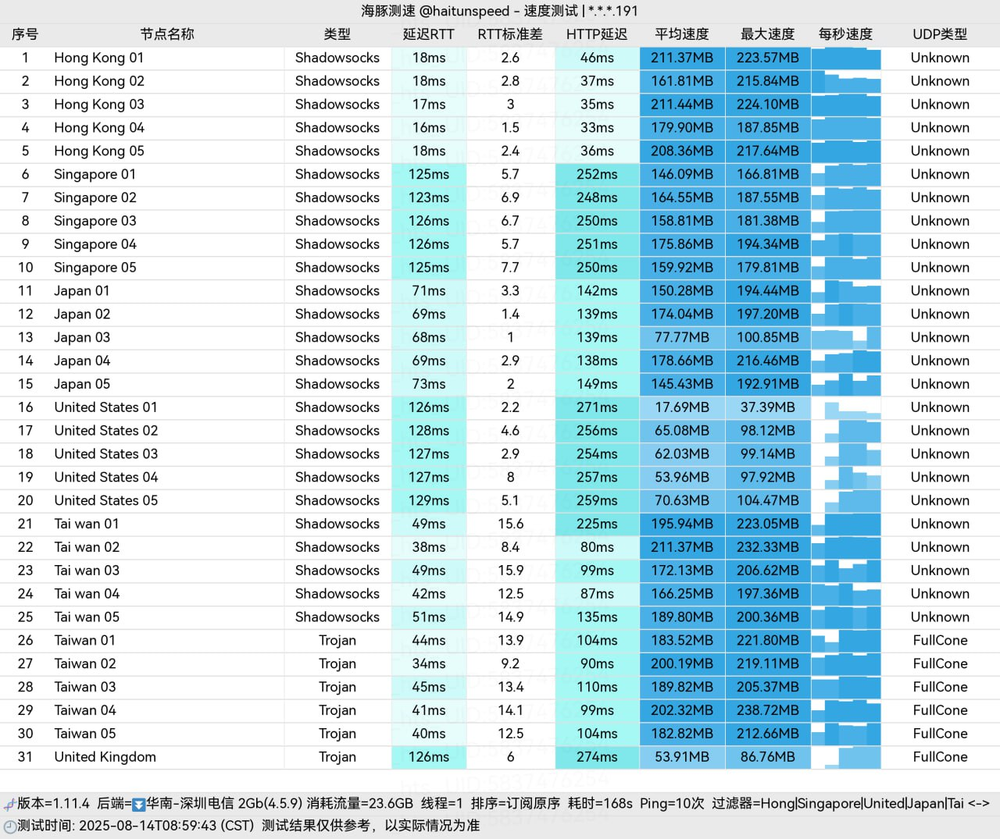
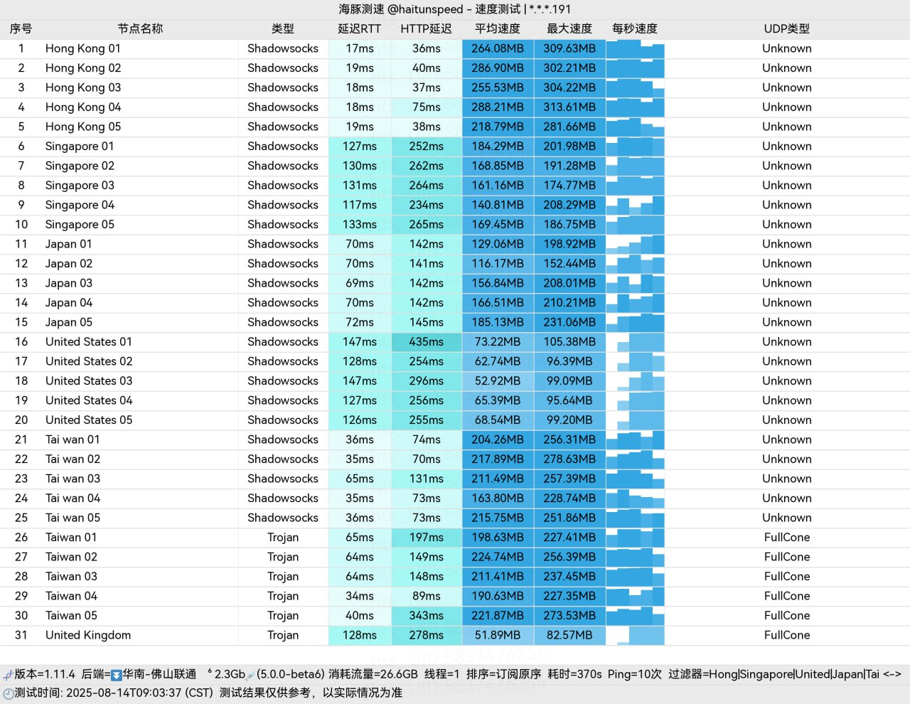
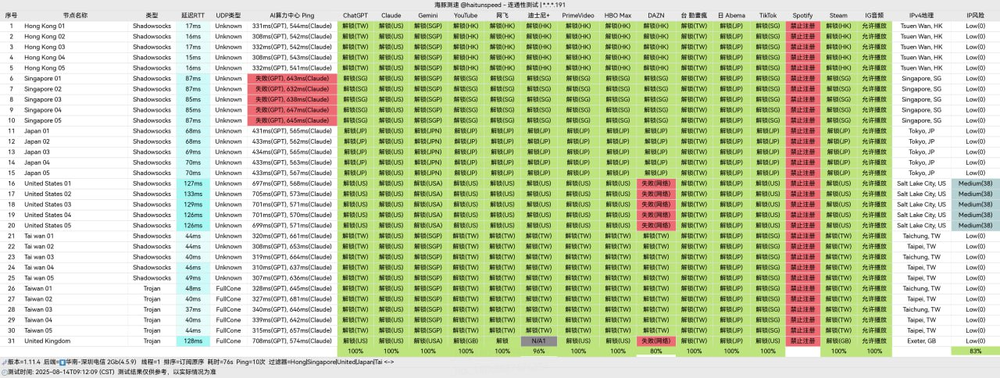

[koodog](https://zero.thisgourl.xyz/#/register?code=9GqU6tvI )作为新兴的网络加速服务商，以其突出的性能表现和稳定的服务质量在市场中脱颖而出。在DDOS攻击频发、行业稳定性普遍面临挑战的背景下，KooDog 仍能保持接近100%的服务在线率，展现出卓越的技术实力与运维能力。
<!-- more -->

## 🔔服务概览与技术架构


### 🎶专业技术团队保障

## 📲koodog机场官网地址：[koodog.com](https://zero.thisgourl.xyz/#/register?code=9GqU6tvI )

## 👉[新用户5大福利领取](https://zero.thisgourl.xyz/#/register?code=9GqU6tvI )


## 📋 核心信息总览
## 💻服务核心信息

| 项目 | 详细信息 |
| :--- | :--- |
| **🌐 官方网站** | [koodog.com](https://zero.thisgourl.xyz/#/register?code=9GqU6tvI ) |
| **💰 入门价格** | 5元/35G每月 |
| **💳 充值方式** | 支付宝、微信支付 |
| **🔗 协议支持** | 全球节点、高速稳定的网络体验、流媒体解锁、多设备支持等  |
---
## 📖套餐详情
### 1. 定期订阅套餐

| 🧮套餐等级 | 📛套餐名称 | 📑适用人群 | 🔁可选周期 | 💰月费 | 📶流量 | 🛍️购买链接 |
|---------|----------|----------|----------|------|------|----------| 
| 基础版 | Edge Lightsail | 超轻度使用 | 月付、季付、半年、一年付、两年付、三年付 | ¥5.00/每月 |35GB/月 |[购买链接](https://zero.thisgourl.xyz/#/register?code=9GqU6tvI ) |
| 进阶版 | Edge |	轻度使用 | 月付、季付、半年、一年付、两年付、三年付 | ¥15.00/每月 |150GB/月 |[购买链接](https://zero.thisgourl.xyz/#/register?code=9GqU6tvI ) |
| 专业版 | Lightsail | 特惠超轻度使用 | 月付、季付、半年、一年付、两年付、三年付  | ¥15.00/每月 |100GB/月 | [购买链接](https://zero.thisgourl.xyz/#/register?code=9GqU6tvI ) |
| 尊享版 | Basic | 中度使用 | 月付、季付、半年、一年付、两年付、三年付  | ¥30.00/每月 |200GB/月 | [购买链接](https://zero.thisgourl.xyz/#/register?code=9GqU6tvI ) |
| 至尊版 | Premium | 重度用户 | 月付、季付、半年、一年付、两年付、三年付  | ¥50.00/每年 |350GB/月 | [购买链接](https://zero.thisgourl.xyz/#/register?code=9GqU6tvI ) |
| 终极版 | Pro | 专线传输 | 月付、季付、半年、一年付、两年付、三年付  | ¥100.00/每年 |700GB/月 | [购买链接](https://zero.thisgourl.xyz/#/register?code=9GqU6tvI ) |

### 2. 专业定制

此模式适合使用频率不固定或需求波动较大的用户，无时间限制。

| 🧮套餐等级 | 📛套餐名称 | 📑适用人群 | 🔁可选周期 | 💰费用 | 📶流量 | 🛍️购买链接 |
|---------|----------|----------|----------|------|------|----------| 
| 定制版 | 定制 | 定制流量，定制运营商，定制地区，定制流媒体解锁 | 一次性 | ¥9999.00 |定制流量 |[购买链接](https://zero.thisgourl.xyz/#/register?code=9GqU6tvI ) |

## 📢核心技术架构

### 🔔协议与网络架构
- **Trojan协议应用**：采用安全性与稳定性并重的Trojan协议，有效保障数据传输的隐私与可靠性
- **三网专线接入**：整合电信、联通、移动三大运营商专线资源，提供高速稳定的网络入口
- **卓越性能表现**：实测单线程带宽峰值可达2Gbps，满足高清流媒体与大文件下载等高带宽需求

### 📣网络性能优势
```
网络质量指标：
- 流媒体支持：4K/8K高清无缓冲播放
- 下载速度：大文件传输表现优秀
- 连接稳定性：接近100%在线率
- 延迟控制：优化路由降低网络延迟
```

## 📲多平台客户端体验

### 📀移动设备
### 纯小白请看以下教程，老鸟略过

👉[2026年安卓VPN完全指南：从选购到实战](https://vpnnew.net/article/anzhuoVPNzhinan/ )

👉[电脑用VPN怎么选？实用攻略与建议](https://vpnnew.net/article/diannanvpnzenmexuan/ )

👉[iPhone上装哪款VPN iOS版本？避坑指南](https://vpnnew.net/article/iphoneVPN/ )


### 🖥️全平台兼容支持
- **Windows系统**：提供专用客户端，界面友好
- **macOS平台**：原生应用支持，操作流畅
- **iOS设备**：App Store官方应用，安全可靠
- **Android手机**：定制客户端，功能完善

### 🔋用户体验特色
- **一键连接设计**：简化配置流程，降低使用门槛
- **远程技术支持**：提供专业的技术协助服务
- **智能优化功能**：自动选择最优服务器节点
- **实时状态监控**：显示连接质量与流量使用情况

## 💻特色附加服务

### 🧮流媒体资源整合
- **Emby媒体库**：提供丰富的影视内容资源
- **Netflix直连服务**：免账号登录，便捷观看
- **多平台内容支持**：覆盖主流流媒体服务
- **高清画质保障**：支持4K超高清内容播放

### 💡服务增值功能
- **个性化推荐**：根据观看习惯智能推荐内容
- **多设备同步**：支持跨平台观看进度同步
- **离线下载**：部分内容支持离线观看
- **家长控制**：提供内容分级管理功能

## 📗服务套餐详情

### 📒经济型套餐
| 套餐名称 | 月费 | 月流量 | 适用场景 | 推荐指数 |
|---------|------|--------|----------|----------|
| Edge Lightsail | ¥5 | 35GB | 轻度体验用户 | ★★★☆☆ |
| Edge | ¥15 | 150GB | 日常基础使用 | ★★★★☆ |
| Lightsail | ¥15 | 100GB | 特定需求用户 | ★★★★☆ |

### 💹标准与高级套餐
| 套餐名称 | 月费 | 月流量 | 核心优势 | 推荐指数 |
|---------|------|--------|----------|----------|
| Basic | ¥30 | 200GB | 平衡性价比 | ★★★☆☆ |
| Premium | ¥50 | 350GB | 优质体验保障 | ★★★★★ |
| Pro | ¥100 | 700GB | 专业级服务 | ★★★★☆ |

## 💰优惠活动信息

### 🧾长期优惠策略
- 新用户注册奖励
- 长期订阅折扣
- 季节性促销活动
- 五大福利解锁

## 📫性能测试数据







### 📈网络性能指标
```
实测环境配置：
- 测试时间：网络高峰期
- 测试地点：主要城市节点
- 测试设备：标准测试平台

性能结果：
- 单线程速度：最高2Gbps
- 多线程并发：稳定性能表现
- 延迟控制：优化路由算法
- 丢包率：低于行业平均水平
```

### 📂流媒体测试
- **Netflix支持**：多区域内容解锁
- **4K播放测试**：流畅无缓冲
- **多设备并发**：稳定支持
- **画质表现**：原生高清输出

## 🗓️用户服务与支持

### 📊客户服务体系
- **724小时技术支持**：全天候问题响应
- **多渠道客服**：在线聊天、工单系统、邮件支持
- **知识库资源**：详细使用教程与FAQ
- **社区交流平台**：用户经验分享与互助

### 🔓服务质量承诺
- 高可用性保证
- 快速故障恢复
- 定期性能优化
- 透明服务报告

## 💼适用场景分析

### 🗂️个人用户场景
- **日常上网**：社交媒体、新闻资讯访问
- **娱乐影音**：高清视频、在线音乐播放
- **远程学习**：在线课程、学术资源访问
- **游戏娱乐**：外服游戏、游戏直播观看

### 📅专业应用场景
- **远程办公**：企业VPN、云办公套件
- **技术开发**：代码仓库、技术文档访问
- **跨境电商**：平台运营、客户服务
- **学术研究**：国际期刊、数据库访问

## 📋综合评价

### 📍核心优势总结
1. **卓越稳定性**：在行业挑战中保持高可用性
2. **出色性能**：2Gbps高速带宽满足各类需求
3. **用户友好**：简化操作流程，降低使用门槛
4. **增值服务**：丰富的附加功能提升体验价值
5. **合理定价**：多档次套餐满足不同预算需求

### 📌改进空间建议
- 进一步扩大服务器节点覆盖
- 增加更多支付方式选择
- 提供更详细的流量使用分析
- 扩展多语言服务支持

### 🗄️最终推荐建议
[koodog](https://zero.thisgourl.xyz/#/register?code=9GqU6tvI ) 以其稳定的服务质量、优秀的性能表现和用户友好的设计，为寻求高性价比网络加速服务的用户提供了理想选择。无论是日常上网需求，还是专业的流媒体观看和大文件传输，[koodog](https://zero.thisgourl.xyz/#/register?code=9GqU6tvI ) 都能提供令人满意的服务体验。

> **特别提示**：建议新用户从基础套餐开始试用，根据实际需求逐步升级服务方案。

---
#  📢更多机场推荐汇总

# 👉[2026年性价比翻墙机场推荐评测（长期更新）]( https://vpnnew.net/article/VPN/ )
## 👉新用户首次订购可使用优惠码  **9GqU6tvI**
## [👉新用户专属福利](https://zero.thisgourl.xyz/#/register?code=9GqU6tvI )

>评测数据基于实际测试结果，服务表现可能因网络环境而异。建议你根据自身需求进行实际测试验证。

>📝 免责声明：本文仅供信息参考，建议均为个人经验与观点，不构成法律意见。实际情况以最新政策和主管部门解释为准，请在合法合规框架内使用相关服务。任何违法使用行为与本站无关。