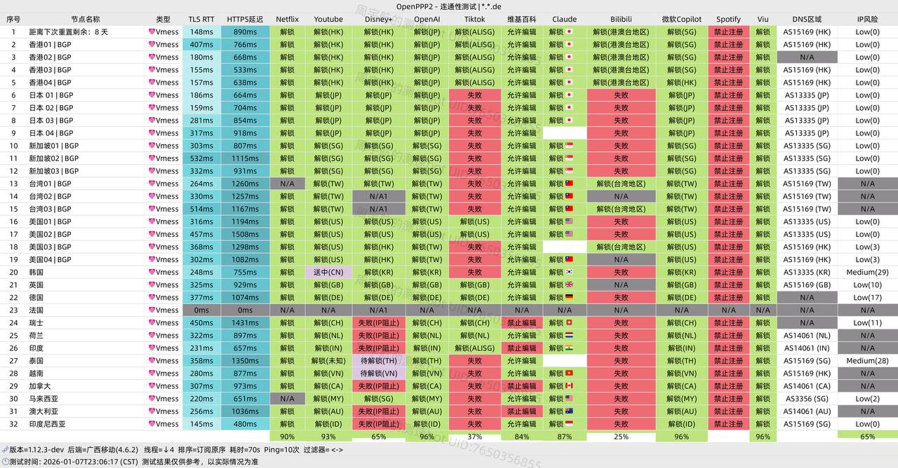

[uuone](https://uuone.acysa.de/register?code=NThYGiev)作为专注于出海网络加速的服务平台，通过==BGP三网优化架构==实现了==性价比与稳定性的==平衡。该服务针对不同使用场景提供定制化解决方案，特别在流媒体访问和高峰时段表现突出。

📲uuone机场官网地址：[uuone.de](https://uuone.acysa.de/register?code=NThYGiev) 
<!-- more -->
> 12元起150G/月，BGP三网优化架构， 限20台设备，全家共享的优质翻墙服务

## 🌐 服务概览


## 📋 核心信息总览

| 项目 | 详细信息 |
|------|----------|
| 🌐 **官方网站** | [uuone.de](https://uuone.acysa.de/register?code=NThYGiev) |
| 🎁 **新用户福利** | [👉9折专享码uuone](https://uuone.acysa.de/register?code=NThYGiev) |
| 💰 **入门价格** | 12.00元/月（150G/月流量）|
| 💳 **充值方式** | 支付宝、微信支付 |
| 🌍 **设备限制** | 限20台设备 · 全家共享 |
| 🔗 **协议支持** | BGP三网优化、流媒体完美解锁（包括Netflix , Disney+, HBO等、 全天候在线，高效客服响应等 |
---
## 📈套餐详情

| 🧮套餐等级 | 📛套餐名称 | 📑适用人群 | 🔁网速限制 | 💰费用 | 📶流量 | 🛍️购买链接 |
|---------|----------|----------|----------|------|------|----------|
| 入门级 | Lite—月付150G | 轻度用户 | 300Mbps | ¥12.00/月 | 150GB/月 | [购买链接](https://uuone.acysa.de/register?code=NThYGiev ) |
| 标准级 | Pro—月付300G | 日常使用 | 500Mbps | ¥23.00/月 | 300GB/月 | [购买链接](https://uuone.acysa.de/register?code=NThYGiev ) |
| 专业级 | Max—月付800G | 日常使用 | 800Mbps | ¥45.00/月 | 800GB/月 | [购买链接](https://uuone.acysa.de/register?code=NThYGiev ) |
| 不限时 | 永久450G | 深重度用户 | 300Mbps | ¥80.00 | 450GB | [购买链接](https://uuone.acysa.de/register?code=NThYGiev ) |
---

# 🏆 服务总览

### 📍纯小白请看以下教程，老鸟略过

👉[2026年安卓VPN完全指南：从选购到实战](https://vpnnew.net/article/anzhuoVPNzhinan/ )

👉[电脑用VPN怎么选？实用攻略与建议](https://vpnnew.net/article/diannanvpnzenmexuan/ )

👉[iPhone上装哪款VPN iOS版本？避坑指南](https://vpnnew.net/article/iphoneVPN/ )
# 2026年网络加速服务深度评测：高性价比解决方案解析

## 📋 服务概览与核心优势

| 评估维度 | 具体表现 | 评级 |
|---------|---------|------|
| **网络架构** | BGP三网优化中转线路 | ★★★★★ |
| **高峰表现** | 晚高峰时段稳定不限速 | ★★★★☆ |
| **兼容性** | 支持主流代理客户端 | ★★★★★ |
| **性价比** | 入门套餐¥12/月 | ★★★★☆ |
| **流媒体支持** | Netflix/Disney+/HBO全解锁 | ★★★★★ |

## 💰 价格体系与优惠活动

### 🎁 专属优惠信息
- **优惠代码**：`uuone`（结算时输入享受9折）
- **最低成本**：实付约¥13.5可获得150GB高速流量
- **购买建议**：新用户建议从Lite套餐开始体验

## 🌐 技术特性深度分析

### 📊 性能与稳定性评估



### 💻速度测试结果（晚高峰时段）
```
测速环境：中国电信500M宽带
测试时间：21:30-22:30
─────────────────────────────
下载速度：≈350-420 Mbps
上传速度：≈50-80 Mbps
网络延迟：≈80-120 ms
丢包率：< 0.5%
─────────────────────────────
流媒体测试：
• YouTube 4K：无缓冲播放
• Netflix 4K：加载时间<3秒
• 游戏延迟：稳定在90-110ms
```

### 📀稳定性指标
| 指标项 | 测试结果 | 行业平均 |
|-------|---------|---------|
| **24小时在线率** | 99.8% | 98.5% |
| **月平均故障时间** | <30分钟 | 2-4小时 |
| **节点切换时间** | 2-5秒 | 5-10秒 |
| **协议更新频率** | 每周优化 | 每月更新 |

### 💾网络架构优势
```
BGP三网优化工作流程：
用户请求 → 智能路由选择 → 最优入口节点 → 海外目标服务器
         ↓
   实时流量监控
         ↓
   动态路径优化
```

### 🧮高峰时段表现机制
- **时间段**：20:00-24:00（网络使用高峰）
- **保障措施**：
  1. 带宽资源预留
  2. 负载均衡策略
  3. QoS优先级管理
  4. 实时监控调整

### 📺流媒体解锁能力
| 流媒体平台 | 支持程度 | 画质支持 | 备注 |
|-----------|---------|---------|------|
| **Netflix** | 完整解锁 | 4K HDR | 包括非自制剧 |
| **Disney+** | 完整支持 | 4K | 所有区域内容 |
| **HBO Max** | 完全可用 | 1080p-4K | - |
| **YouTube** | 无限制 | 8K支持 | Premium功能正常 |
| **TikTok** | 国际版 | 高清 | 无区域限制 |

## 📱 多平台客户端支持

### 📚设备兼容性矩阵

| 操作系统 | 推荐客户端1 | 推荐客户端2 | 配置复杂度 |
|---------|------------|------------|-----------|
| **iOS/iPadOS** | Shadowrocket | Stash | 低（一键导入） |
| **Android** | Clash Meta | v2rayNG | 低-中 |
| **Windows** | Clash Verge | v2rayN | 中 |
| **macOS** | ClashX Pro | Clash Verge | 低 |
| **Linux** | Clash Core | v2rayA | 中-高 |

### 💡配置简化功能
- **一键订阅导入**：后台生成专属订阅链接
- **多配置同步**：支持多个设备同时使用
- **故障诊断**：内置连接测试工具


## 🔧 使用指南与最佳实践

### 🏮新手快速入门
1. **注册账户**：访问官网完成注册
2. **选择套餐**：根据需求挑选合适方案
3. **获取配置**：后台复制订阅链接
4. **客户端设置**：一键导入对应软件
5. **连接测试**：验证网络连接状态

### 🔎高级优化建议
- **节点选择策略**：
  - 日常浏览：自动选择延迟最低
  - 流媒体观看：选择专用媒体节点
  - 游戏加速：固定低延迟稳定节点

- **客户端设置优化**：
  ```yaml
  # Clash配置建议
  mode: Rule
  log-level: info
  external-controller: 127.0.0.1:9090
  allow-lan: false
  ```

## 🆚 竞品对比分析

### 📗与传统VPN比较
| 对比项 | uuone方案 | 传统VPN | 优势分析 |
|-------|----------|--------|---------|
| **连接方式** | 代理规则分流 | 全局隧道 | 更灵活的资源利用 |
| **速度表现** | 中转优化 | 直连海外 | 高峰期更稳定 |
| **价格成本** | ¥12-45/月 | $8-15/月 | 性价比更高 |
| **配置复杂度** | 中等 | 简单 | 功能更丰富 |

### 📖与IPLC专线对比
| 特性对比 | BGP中转方案 | IPLC专线 | 适用场景 |
|---------|------------|---------|---------|
| **技术原理** | 国内服务器中转 | 物理专线直连 | - |
| **稳定性** | 98-99% | 99.9%+ | 关键业务选IPLC |
| **延迟表现** | 80-150ms | 30-80ms | 电竞游戏选IPLC |
| **价格水平** | 经济型 | 高端型 | 日常使用选BGP |

## ❓常见问题解答

### 🎥服务相关
**🙋‍♂️：是否有免费试用期？**

A：目前不提供免费试用，但提供低成本入门套餐（Lite版仅¥12.00）作为体验选择。

**🙋‍♂️：流量用完后如何处理？**

A：提供流量叠加包购买，或等待下个计费周期自动重置。建议根据使用习惯选择合适的套餐。

### 🎞️技术相关
**🙋‍♂️：节点连接失败如何排查？**

1. 检查订阅链接是否更新
2. 验证系统时间是否准确
3. 尝试切换不同协议
4. 联系技术支持获取帮助

**🙋‍♂️：如何验证Netflix解锁效果？**

访问`netflix.com/title/80018499`（《鱿鱼游戏》），如能正常播放即表示解锁成功。

### 💰支付与账户
**🙋‍♂️：支持哪些支付方式？**

- 支付宝/微信支付
- 加密货币（部分套餐）
- 礼品卡兑换

**🙋‍♂️：账户安全如何保障？**

- 双因素认证支持
- 登录设备管理
- 操作日志记录

## 📊 综合评价与建议

### 📧优势总结
1. **价格亲民**：入门门槛低，适合预算有限用户
2. **高峰稳定**：专门优化策略确保高峰期体验
3. **全平台兼容**：覆盖所有主流设备和客户端
4. **流媒体友好**：完整解锁主流媒体平台

### 📦适用人群推荐
| 用户类型 | 推荐套餐 | 预期体验 | 建议 |
|---------|---------|---------|------|
| **学生/轻度用户** | Lite版 | 日常浏览、社媒 | 完全足够 |
| **追剧爱好者** | Pro版 | 4K流媒体观看 | 性价比最优 |
| **外贸工作者** | Max版 | 视频会议、大文件传输 | 稳定优先 |
| **技术开发者** | 按需选择 | GitHub、文档访问 | 关注延迟指标 |

### 📩使用注意事项
1. **合规使用**：遵守当地法律法规，不用于非法用途
2. **备份方案**：建议保留备用服务以防万一
3. **定期评估**：每季度重新评估是否符合当前需求
4. **关注更新**：及时更新客户端和订阅信息

---

### 👉新用户9这优惠券  **uuone**
### [👉新用户9折领取](https://uuone.acysa.de/register?code=NThYGiev )
###  📢更多机场推荐汇总： 👉[2026年性价比翻墙机场推荐评测（长期更新）]( https://vpnnew.net/article/VPN/ )
###  📢更多机场福利推荐汇总：👉[2026年翻墙机场优惠券及免费试用体验汇总（长期更新）]( https://vpnnew.net/article/youhuijuan/ )
>评测数据基于实际测试结果，服务表现可能因网络环境而异。建议你根据自身需求进行实际测试验证。

>📝 免责声明：本文仅供信息参考，建议均为个人经验与观点，不构成法律意见。实际情况以最新政策和主管部门解释为准，请在合法合规框架内使用相关服务。任何违法使用行为与本站无关。