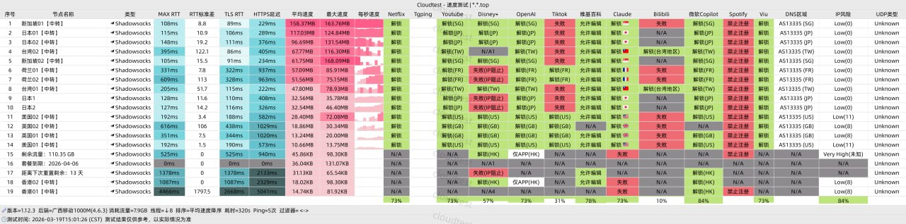

大多数用户最关心的几个问题包括：**机场价格、节点数量、速度稳定性、流媒体解锁能力以及是否支持ChatGPT**。

迅达机场是一家主打高性价比与跨境专线线路的机场服务，价格较低，节点数量较多，适合日常上网、流媒体观看以及AI工具访问。

本文将从 **迅达机场简介、套餐价格、线路质量、流媒体解锁、速度稳定性、客户端使用以及购买建议** 等方面进行完整评测，帮助你判断迅达机场是否值得购买。

👉 官网地址 ： [sulianproxy.com](https://sulianproxy.com/register?code=uutapgJO)
<!-- more -->
---

## 📚 目录（Table of Contents）

- 迅达机场概览
- 迅达机场套餐价格
- 迅达机场线路与节点
- 流媒体解锁能力
- ChatGPT与AI工具支持
- 客户端下载与使用教程
- 迅达机场适合人群
- 常见问题FAQ
- 总结：迅达机场值得买吗
- 机场推荐
---

# 🎯 迅达机场概览

[迅达机场](https://sulianproxy.com/register?code=uutapgJO)是一家提供 **跨境专线节点服务** 的科学上网机场，主要特点是节点多、价格低、支持流媒体解锁以及支持AI工具访问。

## 基本信息

| 项目 | 详细信息 |
|------|----------|
| 🌐 **官方网站** | [sulianproxy.com](https://sulianproxy.com/register?code=uutapgJO) |
| 🎁 **体验套餐** | 3天5G免费试用 |
| 💰 **入门价格** | 15元/月（含150G流量）|
| 💳 **充值方式** | 支付宝、微信支付 |
| 🌍 **服务器分布** | 全球87个国家（港/台/日/韩/美/新） |
| 🔗 **协议支持** |  丝滑解锁 YouTube(4K秒开) / Netflix / TikTok / ChatGPT / Twitter / IG 等全球网站、安卓/鸿蒙/Windows/Mac，一键傻瓜式连接，支持5-10台设备同时在线等 |

迅达机场整体定位为 **高性价比稳定机场**，适合长期使用用户。

---

# 💳 迅达机场套餐价格

迅达机场目前提供多个套餐，适合不同流量需求用户。

## 套餐价格表

### 1. 按量周期付费
| 🧮套餐等级 | 📛套餐名称 | 📑适用人群 | 🔁付费方式 | 💰月费 | 📶流量 | 🛍️购买链接 |
|---------|----------|----------|----------|------|------|----------|
| 基础级 | 基础套 | 日常使用 | 月付、季付、年付 | ¥15.00/元 | 150GB/月 | [购买链接](https://sulianproxy.com/register?code=uutapgJO ) |
| 专业级 | 中级套 | 重度用户 | 月付、季付、年付 | ¥35.00/元 | 300GB/月 | [购买链接](https://sulianproxy.com/register?code=uutapgJO ) |
| 至尊级 | 高级套 | 老鸟必备 | 月付、季付、年付 | ¥50/元 | 600GB/月 | [购买链接](https://sulianproxy.com/register?code=uutapgJO ) |
---
### 2. 按量付费流量包

| 🧮套餐等级 | 📛套餐名称 | 📑适用人群 | 🔁付费方式 | 💰月费 | 📶流量 | 🛍️购买链接 |
|---------|----------|----------|----------|------|------|----------|
| 专业级 | 迷你包【流量包】 | 日常使用 | 一次性 | ¥66.00/元 | 300GB | [购买链接](https://sulianproxy.com/register?code=uutapgJO ) |
| 至尊级 | 全家桶【流量包】 | 老鸟必备 | 一次性 | ¥299.00/元 | 1200GB | [购买链接](https://sulianproxy.com/register?code=uutapgJO ) |
---

从价格来看，迅达机场属于 **便宜机场 / 性价比机场** 类型。

---

# 🌍 迅达机场线路与节点

迅达机场节点覆盖 **87个国家和地区**，热门节点包括：

- 香港节点
- 台湾节点
- 日本节点
- 韩国节点
- 新加坡节点
- 美国节点
- 欧洲节点

## 线路类型

迅达机场主要线路：

1. 小众中转节点
2. BGP跨境专线
3. 企业级跨境专线

相比普通机场线路，跨境专线通常具有：

- 延迟更低
- 高峰期更稳定
- 流媒体更流畅
- 更适合ChatGPT与AI工具

---

# 🎬 流媒体解锁能力

迅达机场支持多个海外流媒体平台，包括：

- Netflix
- YouTube（支持4K）
- TikTok
- Disney+
- HBO
- Amazon Prime Video

如果你主要用途是 **看Netflix、YouTube、TikTok**，迅达机场是可以满足需求的。

---

# 🤖 ChatGPT与AI工具支持

迅达机场支持访问：

- ChatGPT
- Claude
- Gemini
- Midjourney
- Perplexity
- 海外网站与服务

对于需要使用 **AI工具、跨境办公、海外学习资源** 的用户来说比较友好。

---

# 📱 客户端下载与使用教程

迅达机场支持主流代理客户端：

| 平台 | 推荐客户端 |
|---|---|
| Android | Clash for Android |
| iOS | Shadowrocket |
| Windows | Clash Verge Rev |
| macOS | ClashX / Clash Verge |

## 使用步骤

1. 注册迅达机场账号
2. 购买套餐
3. 获取订阅链接
4. 导入 Clash 或 Shadowrocket
5. 更新订阅
6. 选择节点连接
7. 开始科学上网

整体配置难度较低，新手也可以快速上手。

---

# 👥 迅达机场适合哪些用户

迅达机场适合以下人群：

- 日常科学上网用户
- Netflix流媒体用户
- ChatGPT用户
- AI工具用户
- 跨境办公用户
- 多设备用户
- 想找便宜机场的用户
- 想找稳定专线机场的用户

如果你的需求是 **稳定 + 流媒体 + ChatGPT + 多设备**，迅达机场是比较合适的。

---

# ❓ 常见问题 FAQ

## 迅达机场多少钱一个月？
迅达机场最低套餐为15元/月，包含120GB流量。

## 迅达机场支持Netflix吗？
支持Netflix、YouTube、TikTok等流媒体平台，并支持高清视频播放。

## 迅达机场可以用ChatGPT吗？
可以，迅达机场支持访问ChatGPT和其他海外AI工具。

## 迅达机场节点有哪些国家？
节点覆盖87个国家，包括香港、日本、台湾、新加坡、美国、韩国等。

## 迅达机场稳定吗？
迅达机场使用跨境专线线路，整体稳定性比普通机场更好。

---

# ✅ 总结：迅达机场值得买吗？

综合来看，迅达机场的主要特点包括：

**优点：**
- 价格便宜
- 节点国家多
- 支持Netflix流媒体
- 支持ChatGPT
- 支持多设备
- 跨境专线线路
- 性价比较高

**缺点：**
- 高峰期部分节点可能拥堵
- 需要自己配置客户端

## 🎯 购买建议

如果你想找：

- 便宜机场
- 稳定机场
- Netflix机场
- ChatGPT机场
- 多设备机场
- 性价比机场

那么 **迅达机场在2026年属于值得考虑的机场之一**。

---

## 👉迅达机场官网入口：[sulianproxy.com](https://sulianproxy.com/register?code=uutapgJO)

## 👉[新用户5G三天试用福利领取](https://sulianproxy.com/register?code=uutapgJO)

## 👉[新用户福利邀请码：uutapgJO](https://sulianproxy.com/register?code=uutapgJO)
---
## 📢机场推荐汇总： 👉[2026年翻墙机场推荐评测 稳定便宜VPN机场排行榜（高性价比科学上网工具长期更新）]( https://vpnnew.net/article/VPN/ )  

## 📌 延伸阅读

👉iOS手机：[Shadowrocket （小火箭）2026年使用指南：iOS/macOS全平台配置教程(含非国区ID)](https://vpnnew.net/article/Shadowrocket/ )

👉Android手机：[Clash for Android 2026年使用指南：终极配置指南教程](https://vpnnew.net/article/ClashforAndroid/ )

👉Windows/Linux/Mac：[2026年 Clash Verge （Windows/Linux/Mac）全平台配置指南](https://vpnnew.net/article/ClashVerge/ )

👉每天免费更新Apple ID：[2026年 最新最全免费共享美区 Apple ID |Shadowrocket/小火箭下载|每日更新]( https://vpnnew.net/article/freeAppleID/ )  

---

>📝 免责声明：本文仅供信息参考，建议均为个人经验与观点，不构成法律意见。实际情况以最新政策和主管部门解释为准，请在合法合规框架内使用相关服务。任何违法使用行为与本站无关。

