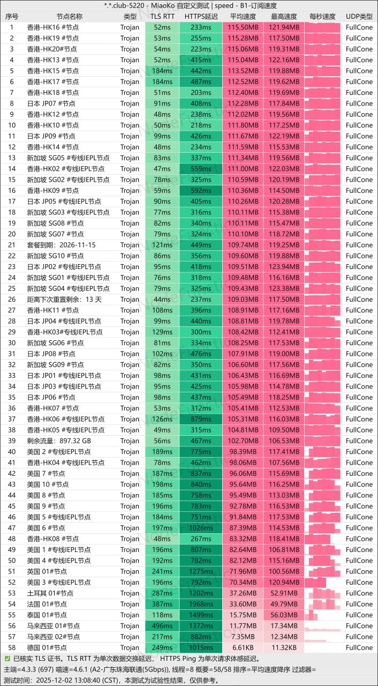
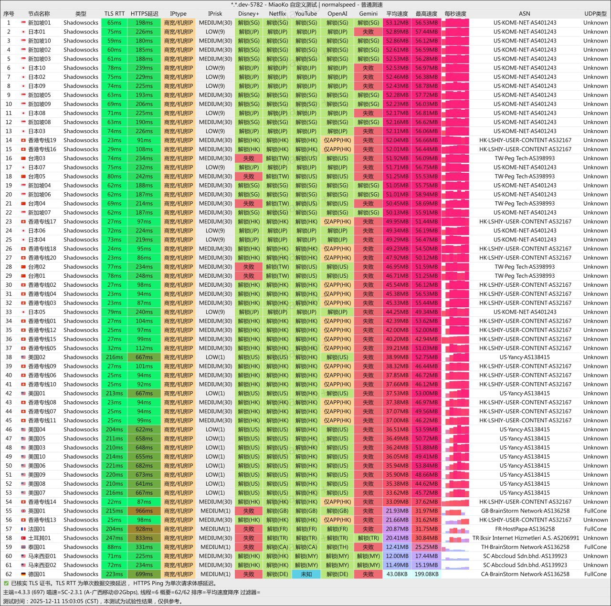
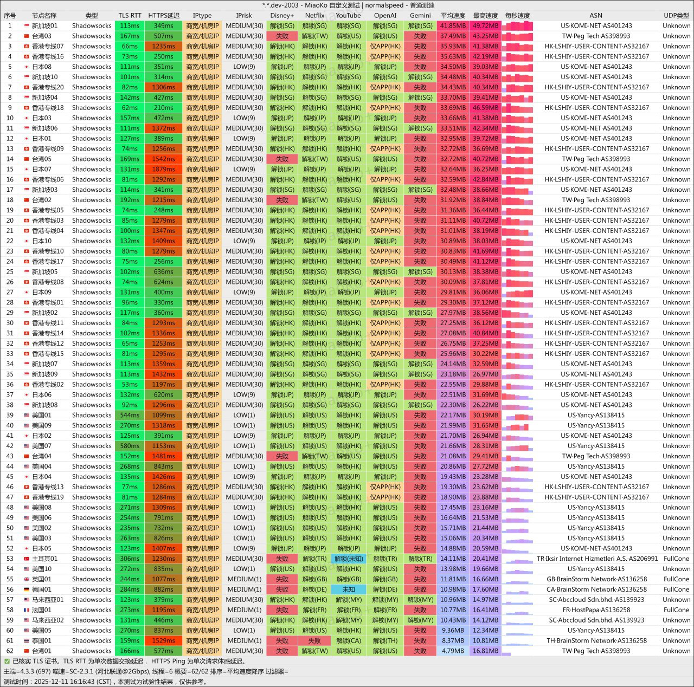
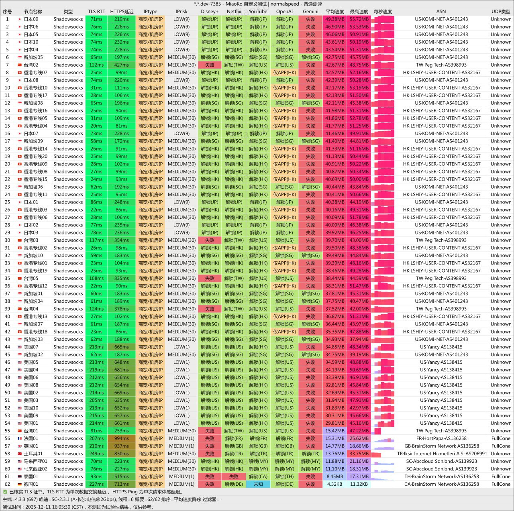

[光速云](https://a01.gsyvipaff.cc/#/?code=wzQ4YW83 )光速云机场以“新锐品牌”的姿态，在2025年的机场市场中打出了==“稳定、高速、高性价比”==的口号。本评测将综合官方信息及第三方用户反馈，呈现一份客观、全面的分析报告，以助你判断其是否值得尝试。

📲光速云机场官网地址：[vip01.lightspeed.club](https://a01.gsyvipaff.cc/#/?code=wzQ4YW83 )
<!-- more -->

## 🔔服务概览与技术架构

## 📲光速云场官网地址：[vip01.lightspeed.club](https://a01.gsyvipaff.cc/#/?code=wzQ4YW83 )

## 👉[新用户八折领取](https://a01.gsyvipaff.cc/#/?code=wzQ4YW83 )

## 💻服务核心信息

| 项目 | 详细信息 |
| :--- | :--- |
| **🌐 官方网站** | [vip01.lightspeed.club](https://a01.gsyvipaff.cc/#/?code=wzQ4YW83 ) |
| **💰 入门价格** | 8.25元/59G每月（年付） |
| **💳 充值方式** | 支付宝、微信支付 |
| **🌍 服务器分布** | 全球 IPLC · 单节点至高 2.5 Gbps |
| **🔗 协议支持** | 原生 IP 解锁 Netflix / Disney+ / ChatGPT / TikTok、不限设备，多端同时在线、专业运维 7×24 支持  |
---

## 📢套餐详情

| 🧮套餐等级 | 📛套餐名称 | 📑适用人群 | 🔁付费方式 | 💰月费 | 📶流量 | 性价比指数 |🛍️购买链接 |
|---------|----------|----------|----------|------|------|----------|----------|
| 入门级 | 光速云 · 轻量版 | 轻度用户 | 年付 | ¥99.00/年 | 60GB/月 | ⭐⭐⭐⭐ |[购买链接](https://a01.gsyvipaff.cc/#/?code=wzQ4YW83) |
| 基础级 | 光速云 · 极速版 | 日常使用 | 月付、季付、半年、年付 | ¥17.00/月 | 110GB/月 | ⭐⭐⭐⭐ |[购买链接](https://a01.gsyvipaff.cc/#/?code=wzQ4YW83 ) |
| 进阶级 | 光速云 · 流光版 | 重度使用 | 月付、季付、半年、年付 | ¥34.00/月 | 220GB/月 | ⭐⭐⭐⭐⭐ |[购买链接](https://a01.gsyvipaff.cc/#/?code=wzQ4YW83 ) |
| 尊享级 | 光速云 · 量子版 | 超重度用户 | 月付、季付、半年、年付 | ¥68.00/月 | 450GB/月 | ⭐⭐⭐⭐ |[购买链接](https://a01.gsyvipaff.cc/#/?code=wzQ4YW83 ) |
| 旗舰级 | 光速云 · 无界版 | 专业用户 | 月付、季付、半年、年付 | ¥130.00/月 | 900GB/月 | ⭐⭐⭐⭐ |[购买链接](https://a01.gsyvipaff.cc/#/?code=wzQ4YW83 ) |
| 永久流量 | 光速云 · 不限时套餐 | 企业/团队 | 一次性付 | ¥680.00 | 1TB | ⭐⭐⭐⭐ |[购买链接](https://a01.gsyvipaff.cc/#/?code=wzQ4YW83 ) |
| 定制 | 光速云 · 定制套餐 | 专业用户 | 月付 | ¥680.00/月 | 500GB/月 | ⭐⭐⭐⭐⭐ |[购买链接](https://a01.gsyvipaff.cc/#/?code=wzQ4YW83 ) |
---

### 📀移动设备
### 纯小白请看以下教程，老鸟略过

👉[2025年安卓VPN完全指南：从选购到实战](https://vpnnew.net/article/anzhuoVPNzhinan/ )

👉[电脑用VPN怎么选？实用攻略与建议](https://vpnnew.net/article/diannanvpnzenmexuan/ )

👉[iPhone上装哪款VPN iOS版本？避坑指南](https://vpnnew.net/article/iphoneVPN/ )

### 🏆 核心评估摘要
为了方便快速了解，下表概括了光速云的核心特点与定位：

| 维度 | 评估摘要 |
|:---|:---|
| **市场定位** | **高性价比的入门及日常使用选择**，定价亲民，适合预算有限的用户。 |
| **核心宣称** | 高速专线、晚高峰流畅、全面流媒体解锁、原生IP。 |
| **主要优势** | 价格极具竞争力；流媒体解锁能力满足基本需求；提供长期有效的不限时套餐。 |
| **潜在考量** | 网络稳定性（尤其是跨网和高峰时段）存在用户报告的波动；作为较新服务，长期运营记录与线路质量有待持续观察。 |
| **适合人群** | **学生党、轻度至中度用户**、对流媒体有需求但对极端稳定性要求不苛刻、寻找备用机场的用户。 |

### 💰 套餐价格与性价比分析
光速云的定价策略是其最突出的吸引力之一，提供了从轻量体验到重度使用的灵活选择。

**主力套餐一览：**
| 套餐名称 | 价格 | 月均流量 | 折算月价 | 核心定位 |
|:---|:---|:---|:---|:---|
| **轻量版 (年付)** | ¥99 / 年 | 59GB/月 | **约 ¥8.25** | **极致性价比之选**，适合低频用户或作为备用线路。 |
| **极速版 (月付)** | ¥17 / 月 | 110GB/月 | ¥17.00 | 入门体验首选，平衡流量与价格。 |
| **流光版 (月付)** | ¥34 / 月 | 220GB/月 | ¥34.00 | 主流推荐，满足日常浏览与视频需求。 |
| **量子版 (月付)** | ¥68 / 月 | 450GB/月 | ¥68.00 | 中重度用户，适合高频流媒体观看或中度下载。 |
| **无界版 (月付)** | ¥130 / 月 | 900GB/月 | ¥130.00 | 自由重度使用，适合多设备或4K/8K流媒体爱好者。 |
| **不限时流量包** | ¥680 (一次性) | 1TB (总量) | **无时间限制** | “囤货”式选择，适合流量需求不固定但想一次买断的用户。 |

**性价比解读：**
1.  **价格门槛极低**：年付套餐折合每月仅8.25元，在机场市场中属于非常低廉的价位，对学生党友好。
2.  **流量设计**：套餐梯度合理，从59GB到900GB，能满足从轻度到重度用户的不同需求。
3.  **长期优惠**：提供 **[ok88](https://a01.gsyvipaff.cc/#/?code=wzQ4YW83 )** 优惠码享受8折，进一步降低了体验成本。年付及以上周期通常能享受更高折扣。
4.  **独特的不限时包**：一次性购买1TGB流量，永不过期，为使用频率不规律的用户提供了另一种灵活选择。

### 🔬 技术性能与用户体验深度剖析
尽管官方宣传“高速专线”，但实际体验需结合第三方反馈理性看待。

**1. 线路质量与速度：优势与不确定性并存**
*   **官方宣传**：所有节点采用“高速专线”，带宽扩容至2Gbps+，晚高峰保留500M冗余，承诺拒绝拥堵。
*   **用户反馈与理性分析**：
    *   **速度表现尚可**：在非高峰时段及网络环境简单的情况下，速度可以满足日常网页浏览、高清视频（1080p）观看的需求。
    *   **稳定性是主要关切点**：有用户报告在**跨网访问**（如从电信网络连接到移动网络优化的节点）或**晚间高峰时段**，可能出现延迟增加、节点短暂失效的情况。这表明其线路可能并非全部为高品质的IPLC/IEPL企业级专线，更可能混合了优化过的公共带宽资源。
    *   **延迟敏感型活动需谨慎**：对于**在线游戏、实时音视频会议、远程桌面**等对延迟和抖动要求极高的场景，基于现有反馈，其表现可能不够理想。

**2. 流媒体与解锁能力：符合宣传，表现达标**
这是光速云表现较好的方面，基本能满足主流娱乐和办公需求。
| 平台/服务 | 解锁状态 | 说明 |
|:---|:---|:---|
| **Netflix, Disney+** | ✅ 支持 | 可解锁非自制剧，支持高清及4K播放。 |
| **YouTube** | ✅ 支持4K/8K | 速度达标时可极速缓冲。 |
| **TikTok** | ✅ 解锁 | 支持对应地区内容。 |
| **ChatGPT, Claude** | ✅ 稳定访问 | 助力科研与办公。 |
| **TVB** | ✅ 支持 | 满足特定地区内容需求。 |

**3. 隐私与安全：透明度存疑，需自行把握**
这是几乎所有同类“机场服务”的共性问题。
*   **日志政策不透明**：服务商通常不会公开明确的“无日志”政策及第三方审计报告。
*   **数据加密依赖协议**：安全性很大程度上取决于你所使用的代理协议（如V2Ray, Shadowsocks）本身的加密强度。
*   **建议**：**避免在此类服务上进行银行转账、密码输入等高敏感操作**。将其主要用于信息浏览和娱乐消费更为稳妥。

### 🆚 横向对比：光速云 vs. 您提到的其他机场
为了帮助您决策，这里将其与您之前了解过的“星岛梦”和“极连云”进行关键维度对比：

| 对比维度 | **[光速云机场](https://a01.gsyvipaff.cc/#/?code=wzQ4YW83 )** | **[星岛梦机场](https://a01.sdmvipaff.cc/#/?code=W91WdGyv)** | **[极连云机场](https://a01.jlyvipaff.cc/#/register?code=aqXIHmRI )** |
|:---|:---|:---|:---|
| **核心线路** | 宣传为“高速专线”，实测可能为优化公网混合线路。 | **明确主打IEPL专线**，延迟和稳定性理论上限更高。 | **明确采用企业级IPLC/IEPL专线**，为三者中线路等级宣称最高的。 |
| **价格起点** | **最低 (¥8.25/月)** | 中等 (¥16/月) | 较高 (¥15.5/月，但年付门槛¥96) |
| **稳定性预期** | **普通**，存在高峰波动反馈。 | **高**，专线设计目标即为稳定。 | **理论上最高**，物理专线特性决定。 |
| **突出特点** | **极致性价比、不限时套餐**。 | 专线性价比、全场景解锁。 | **顶级专线品质、不限制设备数量**、金融级稳定。 |
| **适合场景** | 日常浏览、社交、一般视频、预算优先。 | 跨境业务、稳定流媒体、综合体验。 | 企业办公、4K/8K流媒体、外服游戏、多设备共享。 |

### 🎯 适用人群与最终建议
**✅ 非常适合以下用户：**
1.  **预算严格受限的学生或初级用户**：想以最低成本体验基础的国际网络访问和流媒体服务。
2.  **寻找备用机场的用户**：需要一个高性价比的备用方案，在主用机场出现问题时临时切换。
3.  **轻度至中度流媒体消费者**：主要观看YouTube、Netflix，但对4K HDR极致流畅度或晚高峰绝对稳定无硬性要求。

**❌ 可能需要谨慎考虑：**
1.  **跨境商务或实时办公用户**：需要稳定进行视频会议、访问海外ERP/CRM系统或金融交易的用户。
2.  **硬核游戏玩家或直播主**：对网络延迟、丢包率有极致要求。
3.  **极度重视隐私和安全性的用户**：对服务商背景和数据处理政策有明确要求的用户。

**✍️ 使用建议：**
1.  **从月付套餐开始**：强烈建议先购买 **“流光版”（¥34/月）** 或使用折扣码体验，在其常使用的网络环境和时间段进行至少一周的测试，重点考察**晚高峰（20:00-23:00）** 的速度和稳定性。
2.  **管理心理预期**：理解其低价可能对应的并非企业级专线品质，对偶尔的波动有所准备。
3.  **做好备份**：不要将所有网络需求依赖于此单一服务，准备其他备用方案。

### 📝 总结
[光速云机场](https://a01.gsyvipaff.cc/#/?code=wzQ4YW83 )是2025年市场上一款典型的 **“性价比优先”** 产品。它在**价格上极具侵略性**，在**流媒体解锁等基础功能上表现达标**，确实为预算敏感型用户提供了一个可行的选择。

然而，其宣称的“高速专线”在实际用户体验中，尤其是在复杂网络和高负载时段，**稳定性可能与更高价位、明确采用IPLC/IEPL专线的服务存在差距**。对于网络质量有更高要求的用户而言，您之前了解的**极连云（IPLC专线+不限设备）或星岛梦（IEPL专线）** 可能是更可靠但预算也更高的选择。

最终，选择光速云意味着在**成本与绝对稳定的网络性能之间做出权衡**。如果您愿意接受一定程度的波动以换取更低的价格，那么它值得一试。反之，如果稳定是第一要务，则应考虑投资更专业的服务。

> **立即体验**：访问 [vip01.lightspeed.club](https://a01.gsyvipaff.cc/#/?code=wzQ4YW83 ) 使用优惠码 **ok88** 开启您的优质网络之旅

#  📢更多机场推荐汇总

# 👉[2025年性价比翻墙机场推荐评测（长期更新）]( https://vpnnew.net/article/VPN/ )
## 👉新用户首次订购可使用优惠码  **[ok88](https://a01.gsyvipaff.cc/#/?code=wzQ4YW83)**
## [👉新用户八折专享福利](vip01.lightspeed.club/#/?code=wzQ4YW83  )

>评测数据基于实际测试结果，服务表现可能因网络环境而异。建议你根据自身需求进行实际测试验证。

>📝 免责声明：本文仅供信息参考，建议均为个人经验与观点，不构成法律意见。实际情况以最新政策和主管部门解释为准，请在合法合规框架内使用相关服务。任何违法使用行为与本站无关。