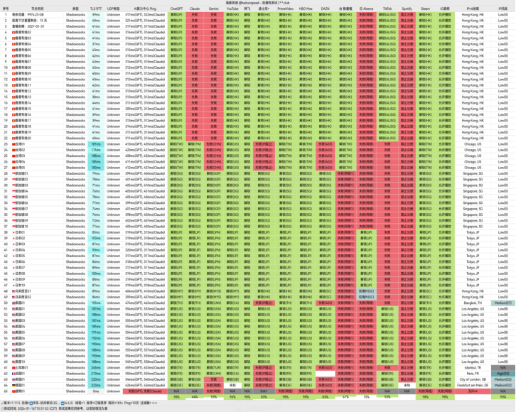

[全球云](http://aff01.gcvipaff.cc/#/?code=hiNLxrP7)是一家聚焦于企业级出海加速与高品质流媒体解锁的专业网络服务商。通过整合优质专线资源与智能路由技术，致力于为国内用户提供高速、稳定、可靠的国际网络接入体验。

📲全球云机场官网地址：[globalyun.cc](http://aff01.gcvipaff.cc/#/?code=hiNLxrP7) 
<!-- more -->
> 8折专享优惠券邀请码qq88，优惠后16元120G/月，BGP 多线路智能调度 + 专线级出口架构，全程不限速，节点统一 1x 计费倍率

## 🌐 服务概览

## 📋 核心信息总览

| 项目 | 详细信息 |
|------|----------|
| 🌐 **官方网站** | [globalyun.cc](http://aff01.gcvipaff.cc/#/?code=hiNLxrP7) |
| 🎁 **新用户福利** | [👉8折专享优惠券邀请码qq88](http://aff01.gcvipaff.cc/#/?code=hiNLxrP7) |
| 💰 **入门价格** | 优惠后16元/月（120G/月流量）|
| 💳 **充值方式** | 支付宝、微信支付 、 USDT |
| 🌍 **设备限制** | 不限制同时在线设备数量 |
| 🔗 **协议支持** | 海外流媒体平台全解锁、4K 秒开体验、兼容 8K 超清播放、AI 平台友好支持、适配 ChatGPT、Claude 等多种智能服务不限制设备等 |
---
## 📈套餐详情

| 🧮套餐等级 | 📛套餐名称 | 📑适用人群 | 🔁设备限制 | 💰费用 | 📶流量 |🔁可选周期| 🛍️购买链接 |
|---------|----------|----------|----------|------|------|------|----------|
| 入门级 | BGP 智能优化 · 入门方案 | 轻度用户 | 不限制设备 | ¥20.00/月 | 120GB/月 |月付、季付、半年、年付、两年、三年| [购买链接](http://aff01.gcvipaff.cc/#/?code=hiNLxrP7 ) |
| 标准级 | BGP 智能优化 · 进阶方案 | 日常使用 | 不限制设备 | ¥40.00/月 | 300GB/月 |月付、季付、半年、年付、两年、三年| [购买链接](http://aff01.gcvipaff.cc/#/?code=hiNLxrP7 ) |
| 专业级 | BGP 智能优化 · 高端方案 | 日常使用 | 不限制设备 | ¥100.00/月 | 700GB/月 |月付、季付、半年、年付、两年、三年| [购买链接](http://aff01.gcvipaff.cc/#/?code=hiNLxrP7 ) |
| 尊享级 | BGP 智能优化 · 商业方案 | 重度用户 | 不限制设备 | ¥180.00/月 | 1.5TB/月 |月付、季付、半年、年付、两年、三年| [购买链接](http://aff01.gcvipaff.cc/#/?code=hiNLxrP7 ) |
| 至尊级 | 独享私人专线节点 | 重度用户 | 不限制设备 | ¥600/月 | 500GB/月 |月付| [购买链接](http://aff01.gcvipaff.cc/#/?code=hiNLxrP7 ) |
---

# 🏆 服务总览

### 📍纯小白请看以下教程，老鸟略过

👉iOS手机：[Shadowrocket （小火箭）2026年使用指南：iOS/macOS全平台配置教程(含非国区ID)](https://vpnnew.net/article/Shadowrocket/ )

👉Android手机：[Clash for Android 2026年使用指南：终极配置指南教程](https://vpnnew.net/article/ClashforAndroid/ )

👉Windows/Linux/Mac：[2026年 Clash Verge （Windows/Linux/Mac）全平台配置指南](https://vpnnew.net/article/ClashVerge/ )

## 🛠️ 核心技术架构

| 特性维度 | 具体说明 |
| :--- | :--- |
| **🛣️ 底层线路** | 核心采用 **IPLC / IEPL 企业级专线**，结合智能负载均衡与三网（电信、联通、移动）入口优化，有效保障连接质量。 |
| **🌍 节点网络** | **全球60+节点**，覆盖亚洲、北美、欧洲等主流地区，提供**独立IP资源**与**2Gbps+** 带宽，并实施高峰冗余策略。 |
| **🔓 解锁能力** | 节点明确标注对流媒体平台（Netflix, Disney+）及AI工具（ChatGPT）和TikTok的解锁支持，实用性强。 |
| **📱 多端兼容** | 支持 **Shadowrocket, Clash, V2Ray, Trojan** 等主流客户端，完美适配 **iOS, Android, Windows, macOS及路由器** 系统。 |
| **👨‍👩‍👧‍👦 共享策略** | 同一账号支持多设备同时在线，适合个人多设备或小范围家庭/团队共享使用。 |
| **🛡️ 服务支持** | 提供工单系统与在线客服，由海外技术团队进行节点维护与网络优化。 |

> **支付方式**：支付宝、微信支付、USDT

## 👥 适用人群分析
- **企业与商务用户**：需要稳定、高速的专线进行跨境通信、云计算及海外业务访问。
- **流媒体与娱乐玩家**：追求稳定解锁Netflix、Disney+等平台，观看高清/4K内容的用户。
- **AI工具与开发者**：依赖稳定访问OpenAI、GitHub等国际开发与生产力平台的用户。
- **多设备家庭/小型团队**：需要一个账号覆盖多个终端设备，实现共享与便利管理。
- **对网络品质有较高要求的用户**：无法接受晚高峰卡顿，追求全天候稳定连接体验。

## 📝 综合评估与建议
- **核心优势**：**企业级专线基础**和**智能路由优化**是其区别于普通机场的关键，尤其在晚高峰时段能提供更可靠的体验。
- **选择建议**：
    - **新手/尝鲜**：可从 **「BGP 智能优化 · 入门方案」** 月付套餐开始，测试本地网络兼容性与实际速度。
    - **流媒体主力**：**「BGP 智能优化 · 进阶方案」** 或 **「BGP 智能优化 · 高端方案」** 能提供更充裕的流量保障。
    - **长期稳定需求**：年付 **「BGP 智能优化 · 入门方案」** 单价极低，但需仔细评估每月120GB流量是否足够。
- **注意事项**：所有套餐的解锁能力以节点实际标注为准，购买前请确认所需服务的节点支持情况。

---
> **总结**：[全球云](http://aff01.gcvipaff.cc/#/?code=hiNLxrP7)凭借其**扎实的专线资源、广泛的节点覆盖和明确的解锁能力**，定位清晰，是一款偏向**中高端及实用主义**的机场服务。它适合那些**将网络稳定性和解锁能力置于首位**，并愿意为此支付合理溢价以获得更优体验的用户。建议潜在用户根据自身流量消耗和核心需求（如流媒体、AI工具）来选择对应的套餐层级。

---
## [👉新用户8折专享优惠券邀请码qq88](http://aff01.gcvipaff.cc/#/?code=hiNLxrP7)
## [👉新用户邀请码  hiNLxrP7](http://aff01.gcvipaff.cc/#/?code=hiNLxrP7)
###  📢机场推荐汇总： 👉[2026年性价比翻墙机场推荐评测（长期更新）]( https://vpnnew.net/article/VPN/ )
###  📢机场福利推荐汇总：👉[2026年翻墙机场优惠券及免费试用体验汇总（长期更新）]( https://vpnnew.net/article/youhuijuan/ )
>评测数据基于实际测试结果，服务表现可能因网络环境而异。建议你根据自身需求进行实际测试验证。

>📝 免责声明：本文仅供信息参考，建议均为个人经验与观点，不构成法律意见。实际情况以最新政策和主管部门解释为准，请在合法合规框架内使用相关服务。任何违法使用行为与本站无关。