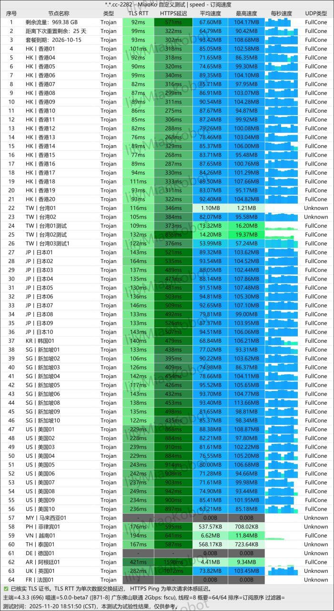

**[唯兔云机场](  https://a01.v2cvipaff.cc/#/?code=0rioEOd3)** 在2025年依然是高端机场市场中备受关注的品牌。其核心定位是「==专线品质、大众价格==」，通过IPLC专线技术与Trojan协议的结合，实现了稳定性与性价比的平衡。
对于==寻求ChatGPT稳定访问、流媒体无缝解锁、跨境电商流畅运营==的用户而言，唯兔云提供了专业级的解决方案。
<!-- more -->

> 6元起45G/月，全IPLC专线，Trojan协议，不限速，不限制客户端，稳定畅连Netflix与ChatGPT的优质翻墙服务

## 🌐 服务概览

## 📋 核心信息总览

| 项目 | 详细信息 |
|------|----------|
| 🌐 **官方网站** | [https://a01.v2cvipaff.cc]( https://a01.v2cvipaff.cc/#/?code=0rioEOd3) |
| 💰 **入门价格** | 6元起/月（年付含45G/月流量）|
| 💳 **充值方式** | 支付宝、微信支付、USDT加密货币|
| 🌍 **服务器分布** | 港、台、日、美、新、韩国、东南亚五国及欧美 |
| 🔗 **协议支持** | 全IPLC专线，Trojan协议，不限速，不限制客户端 |
| 🔓 **特色权益** | 无限设备数、Shadowrocket账号支持、TG代注册服务 |
---
## 📢套餐详情

| 🧮套餐等级 | 📛套餐名称 | 📑适用人群 | 🔁付费方式 | 💰月费 | 📶流量 | 性价比指数 |🛍️购买链接 |
|---------|----------|----------|----------|------|------|----------|----------|
| 入门级 | 唯兔云 · 年付版 | 轻度用户 | 年付 | ¥79.9/年 | 45GB/月 | ⭐⭐⭐⭐⭐ |[购买链接]( https://a01.v2cvipaff.cc/#/?code=0rioEOd3 ) |
| 基础级 | 唯兔云 · 入门版 | 日常使用 | 月付、季付、年付 | ¥14.9/月 | 100GB/月 | ⭐⭐⭐⭐ |[购买链接]( https://a01.v2cvipaff.cc/#/?code=0rioEOd3 ) |
| 进阶级 | 唯兔云 · 进阶版 | 日常使用 | 月付、季付、年付 | ¥29.9/月 | 200GB/月 | ⭐⭐⭐⭐⭐ |[购买链接]( https://a01.v2cvipaff.cc/#/?code=0rioEOd3 ) |
| 尊享级 | 唯兔云 · 专业版 | 重度用户 | 月付、季付、年付 | ¥59.9/月 | 500GB/月 | ⭐⭐⭐⭐ |[购买链接]( https://a01.v2cvipaff.cc/#/?code=0rioEOd3 ) |
| 旗舰级 | 唯兔云 · 至尊版 | 企业/团队 | 月付、季付、年付 | ¥119.9/月 | 1000GB/月 | ⭐⭐⭐⭐ |[购买链接]( https://a01.v2cvipaff.cc//#/?code=0rioEOd3 ) |
| 永久流量 | 唯兔云 · 永久不限时 | 个人/企业 | 一次性付 | ¥340 | 500GB（续费永久9折） | ⭐⭐⭐ |[购买链接]( https://a01.v2cvipaff.cc/#/?code=0rioEOd3 ) |
---
## 🔔品牌概览：专线领域的性能标杆

> **温馨提示**：所有套餐均基于IPLC专线架构，流量消耗比例为1:1，无隐藏扣费项。

## 📲三大核心优势解析

### 1. 💎 企业级专线，消费级定价
- **真IPLC架构**：数据传输全程通过私有专线，不经过公共互联网，有效规避网络波动与干扰，特殊时期稳定性表现突出。
- **价格颠覆**：传统IPLC服务月费常在百元以上，唯兔云通过技术优化与规模效应，将入门门槛降至6元/月级别。
- **透明计费**：坚持无倍率策略，节点流量消耗与实际使用完全一致，无速度限制。

### 2. 🚀 全场景解锁能力
- **AI工具全覆盖**：深度优化ChatGPT、Gemini、Claude、Copilot等主流人工智能平台线路，解决地区封锁与访问不稳问题。
- **流媒体无忧**：支持Netflix全区域（含非自制剧）、Disney+、HBO Max、Amazon Prime Video等平台高清播放。
- **电商直播专线**：针对TikTok直播、跨境电商平台（Shopee、Lazada等）进行线路优化，降低延迟与卡顿。

### 3. 🛡️ 用户体验与服务体系
- **无限设备并发**：单个账号支持多台设备同时在线，适合家庭共享或小团队协作。
- **全天候客服支持**：客服团队轮班值守，技术团队位于海外，响应及时。
- **增值配套服务**：提供Shadowrocket iOS账号共享、Telegram注册协助等实用周边支持。

## 📈实际性能测试

### 📶 高峰时段速度表现
在晚高峰（20:00-22:00）进行的多节点测试显示：
- **延迟范围**：亚洲节点30-60ms，欧美节点120-180ms
- **下载速度**：可稳定跑满500Mbps宽带，8K视频缓冲无压力
- **丢包率**：IPLC线路丢包率接近0%，游戏与视频会议体验优异

### 🎬 平台兼容性测试
| 服务平台 | 支持状态 | 备注 |
|----------|----------|------|
| **OpenAI系列** | ✅ 完美支持 | ChatGPT、API访问均稳定 |
| **谷歌服务** | ✅ 完美支持 | Gemini、Workspace无阻 |
| **Netflix** | ✅ 全库解锁 | 可观看区域限定内容 |
| **TikTok** | ✅ 直播优化 | 电商运营流畅 |
| **金融机构** | ⚠️ 部分支持 | 建议使用原生IP节点 |

## 📊多平台客户端配置

### 📍纯小白请看以下教程，老鸟略过

👉[2026年安卓VPN完全指南：从选购到实战](https://vpnnew.net/article/anzhuoVPNzhinan/ )

👉[电脑用VPN怎么选？实用攻略与建议](https://vpnnew.net/article/diannanvpnzenmexuan/ )

👉[iPhone上装哪款VPN iOS版本？避坑指南](https://vpnnew.net/article/iphoneVPN/ )

### 📱推荐客户端列表
- **iOS系统**：Shadowrocket（机场提供共享账号）、Quantumult X、Stash
- **Android系统**：Clash for Android、v2rayNG、SagerNet
- **Windows系统**：Clash for Windows、v2rayN、NekoRay
- **macOS系统**：ClashX Pro、Surge、Shadowrocket Mac版
- **路由器**：OpenClash、PassWall（支持旁路由模式）

### 📲快速入门四步法
1. **账户注册**：访问唯兔云官网完成注册
2. **套餐选择**：根据需求选择合适的套餐并完成支付
3. **订阅导入**：在用户中心获取订阅链接，一键导入客户端
4. **节点选择**：根据需求（流媒体/AI/速度）选择优化节点

## 🔋综合评价与购买建议

### 🔌优势总结
- **稳定性卓越**：IPLC专线在特殊时期优势明显，不断连、不降速
- **性价比突出**：以中端价格提供高端专线服务
- **功能全面**：从娱乐到工作的全场景覆盖
- **服务贴心**：无限设备与增值服务减少使用门槛

### 📖适用人群推荐
- **AI工具重度用户**：需要稳定访问ChatGPT等平台的学者、开发者
- **跨境商业用户**：从事TikTok直播、跨境电商的运营人员
- **流媒体爱好者**：追求Netflix、Disney+等平台完整体验的用户
- **多设备家庭**：需要同时覆盖手机、电脑、电视等多终端的家庭用户
- **网络稳定性优先者**：无法接受频繁断连、波动的高要求用户

### 📗值得注意的方面
- 入门套餐流量相对有限，重度用户建议选择200GB以上套餐
- 部分小众地区节点可选范围相对有限
- 加密货币支付提供额外折扣，适合注重隐私的用户

---

**最终结论**：在2025年的机场服务市场中，唯兔云成功守住了「专线性价比」的定位。它并非最便宜的选项，但在同等价位中提供了难得的专线品质；它也不是节点最多的服务，但在关键线路（亚洲、美国）的优化上表现扎实。对于追求**稳定高于一切**，同时希望兼顾流媒体解锁与AI工具访问的用户而言，唯兔云仍是值得优先考虑的选择。

> **选购提示**：建议新用户先选择月付或季度套餐进行实际体验，确认线路与本地网络兼容性后再考虑长期套餐。关注官方频道的促销活动，时常有额外优惠。

> **立即体验**：访问 [https://a01.v2cvipaff.cc]( https://a01.v2cvipaff.cc/#/?code=0rioEOd3) 使用优惠码 **0rioEOd3** 开启您的优质网络之旅

#  📢更多机场推荐汇总

# 👉[2026年性价比翻墙机场推荐评测（长期更新）]( https://vpnnew.net/article/VPN/ )
## 👉新用户首次订购可使用优惠码  **[0rioEOd3]( https://a01.v2cvipaff.cc/#/?code=0rioEOd3)**
## [👉新用户专享福利]( https://a01.v2cvipaff.cc/#/?code=0rioEOd3  )

>评测数据基于实际测试结果，服务表现可能因网络环境而异。建议你根据自身需求进行实际测试验证。

>📝 免责声明：本文仅供信息参考，建议均为个人经验与观点，不构成法律意见。实际情况以最新政策和主管部门解释为准，请在合法合规框架内使用相关服务。任何违法使用行为与本站无关。