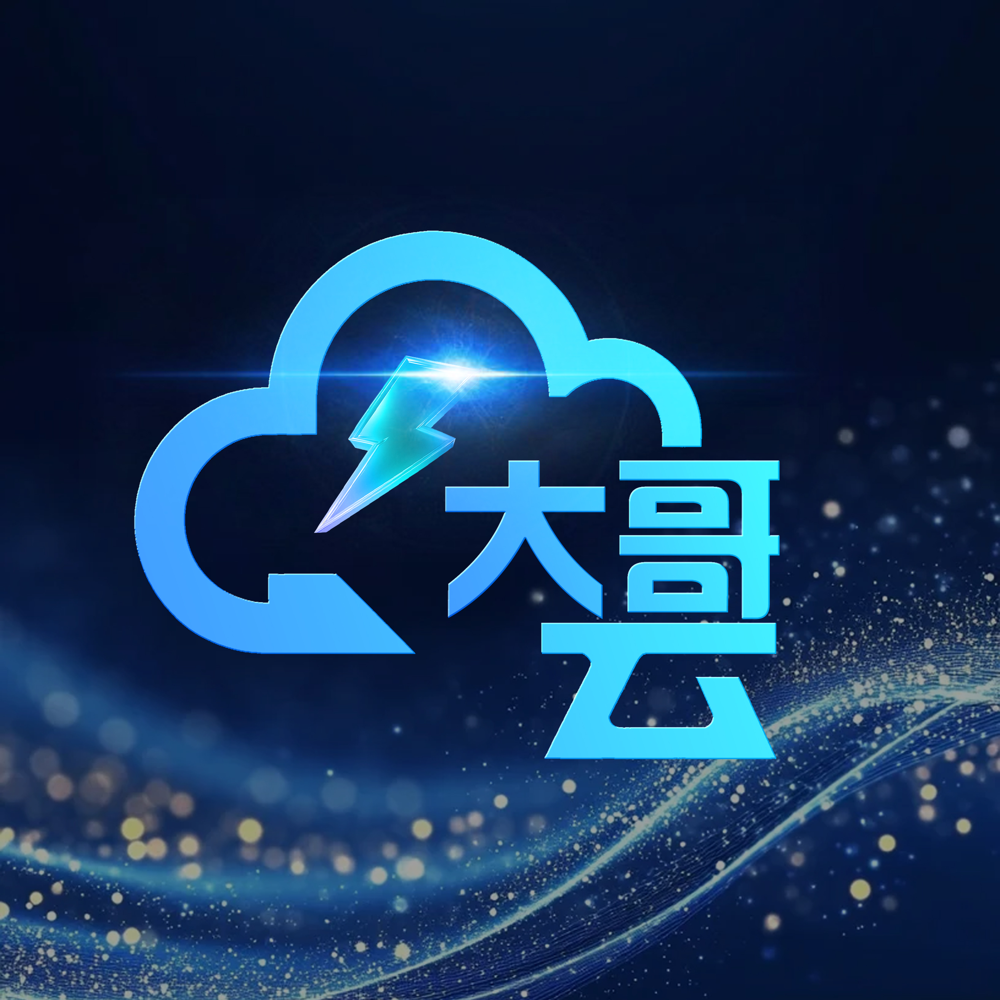
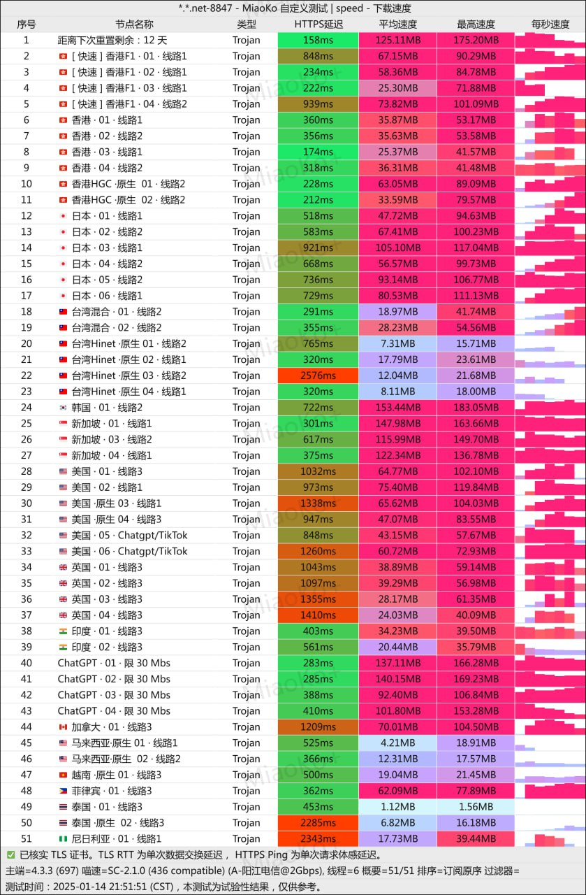

[大哥云](https://aff02.dgy02.com/#/register?code=0Usc20lX ) 作为业内知名的网络加速服务品牌，已持续稳定运营超过五年时间。经过长期的市场检验和技术迭代，积累了丰富的行业经验与良好的用户口碑。品牌名中的“大哥”体现了其在服务可靠性、技术稳定性方面的行业地位。
<!-- more -->

## 服务概览



# 📃大哥云 网络加速服务深度解析

## 📗服务基础信息

### 📰官方访问渠道
- **官方网站**：[aff02.dgy02.com](https://aff02.dgy02.com/#/register?code=0Usc20lX )
- **专属邀请码**：0Usc20lX
- **新用户体验**：[9折优惠券](https://aff02.dgy02.com/#/register?code=0Usc20lX )
- **💰 入门价格**：19.00元100G/月

## 📖套餐详情

### 📢订阅套餐
| 🧮套餐等级 | 📛套餐名称 | 📑适用人群 | 🔁可选周期 | 💰月费 | 📶流量 | 🛍️购买链接 |
|---------|----------|----------|----------|------|------|----------| 
| 基础版 | 单月套餐A100G | 超轻度使用 | 月付 | ¥19.00/每月 |100GB/月 |[购买链接](https://aff02.dgy02.com/#/register?code=0Usc20lX ) |
| 进阶版 | 单月套餐B150G |	轻度使用 | 月付 | ¥29.90/每月 |150GB/月 |[购买链接](https://aff02.dgy02.com/#/register?code=0Usc20lX ) |
| 专业版 | 季付套餐A200G| 中度使用 | 季付  | ¥69.00/每月 |200GB/月 | [购买链接](https://aff02.dgy02.com/#/register?code=0Usc20lX ) |
| VIP版 | 小流量年付15G | 超轻度使用 | 年付 | ¥88.00/每月 |15GB/月 |[购买链接](https://aff02.dgy02.com/#/register?code=0Usc20lX ) |
| 尊享版 | 年付套餐A300G |	重度使用 | 年付 | ¥199.00/每月 |300GB/月 |[购买链接](https://aff02.dgy02.com/#/register?code=0Usc20lX ) |
| 至尊版 | 年付套餐A500G| 超重度使用 | 年付  | ¥299.00/每月 |500GB/月 | [购买链接](https://aff02.dgy02.com/#/register?code=0Usc20lX ) |


## ☎️核心技术与网络架构

### 📀移动设备
### 纯小白请看以下教程，老鸟略过

👉[2026年安卓VPN完全指南：从选购到实战](https://vpnnew.net/article/anzhuoVPNzhinan/ )

👉[电脑用VPN怎么选？实用攻略与建议](https://vpnnew.net/article/diannanvpnzenmexuan/ )

👉[iPhone上装哪款VPN iOS版本？避坑指南](https://vpnnew.net/article/iphoneVPN/ )

### 📲技术架构特色
- **传输协议**：全线采用Trojan协议，在安全性与传输效率之间取得良好平衡
- **网络线路**：提供IPLC国际私用专线，保障跨境数据传输质量与稳定性
- **带宽保障**：提供500Mbps至1000Mbps的峰值带宽配置，满足不同场景需求

### 📱流媒体支持能力
```
支持平台列表：
✅ Netflix - 全系列内容解锁支持
✅ YouTube - 8K超高清流畅播放
✅ Disney+ - 高清流媒体优化
✅ 其他主流国际流媒体平台
```

### 技术指标表现
- **连接稳定性**：五年运营积累的优化经验
- **画质支持**：8K超高清流媒体播放能力
- **延迟控制**：优化路由算法降低网络延迟
- **兼容性能**：全面适配各类终端设备

## 💻服务套餐体系详解

### 🧮月度灵活套餐
| 套餐名称 | 月费 | 月流量 | 峰值带宽 | 计费周期 | 推荐指数 |
|---------|------|--------|----------|----------|----------|
| 单月套餐A | ¥19.90 | 100GB | 500Mbps | 自然月 | ★★★★☆ |
| 单月套餐B | ¥29.90 | 150GB | 500Mbps | 自然月 | ★★★★☆ |

**🎬月度套餐特点**：
- 灵活性强，适合短期或试用需求
- 按月自动续费，操作简便
- 基础带宽满足大多数应用场景
- 入门门槛低，适合新用户体验

### 📉季度优惠套餐
**季付套餐A**：
- **总费用**：¥69.00（相当于月均¥23.00）
- **月流量**：200GB/月
- **带宽升级**：1000Mbps峰值带宽
- **有效时长**：90天连续服务
- **性价比分析**：相比月付节省约23%

### 📈年度高价值套餐

| 套餐类型 | 年费 | 月均费用 | 月流量 | 带宽 | 适用场景 |
|---------|------|----------|--------|------|----------|
| VIP1小流量 | ¥88.00 | ¥7.33 | 15GB | 500Mbps | 极轻度用户 |
| 年付套餐A | ¥199.00 | ¥16.58 | 300GB | 1000Mbps | 常规个人用户 |
| 年付套餐B | ¥299.00 | ¥24.92 | 500GB | 1000Mbps | 中度至重度用户 |

## 📅性能表现与服务特色



### 📂网络性能指标

| 测试项目         | 香港 IPLC 节点      | 美国 CN2 GIA 节点   | 日本 SoftBank 节点  |
| :--------------- | :------------------ | :------------------ | :------------------ |
| **🌐 测试环境**   | 工作日晚高峰 20:00–21:00 | 江苏电信 200M 宽带  | MacBook Air + ClashX |
| ⚡ **下载速度**   | 65.3 Mbps           | 52.7 Mbps           | 58.1 Mbps           |
| ⬆️ **上传速度**   | 48.6 Mbps           | 37.2 Mbps           | 44.9 Mbps           |
| 🏃 **网络延迟**   | 26 ms               | 135 ms              | 72 ms               |
| 📶 **稳定度**     | 掉线率 <0.2%        | 节点切换迅速        | 全程无明显卡顿      |

```
实测性能数据：
- 8K视频播放：稳定流畅，无缓冲卡顿
- 网络延迟：优化路由，跨国连接稳定
- 峰值速度：1000Mbps带宽充分保障
- 连接稳定性：五年技术积累体现
```

### 📍服务质量特色
1. **免费试用政策**：新用户可体验服务品质
2. **长期稳定性**：五年运营历史验证可靠性
3. **技术持续优化**：基于用户反馈持续改进
4. **客户支持体系**：建立完善的服务支持机制

## 📊适用场景分析

### 🔓个人用户场景
- **日常娱乐**：高清视频、音乐流媒体播放
- **社交网络**：国际社交媒体平台访问
- **在线学习**：海外教育资源获取
- **轻度办公**：远程工作基础需求

### 🔔专业用户场景
- **高清影音**：8K超高清内容消费
- **专业应用**：需要稳定国际连接的工作
- **团队协作**：小型团队共享使用
- **长期需求**：对服务稳定性有高要求

### 🔊企业级应用
- **商务沟通**：国际视频会议支持
- **市场研究**：海外信息收集分析
- **技术开发**：国际技术资源访问
- **远程办公**：分布式团队协作支持

## 📢性价比分析与选购建议

### 🎚️成本效益对比
```
套餐性价比排行：
1. 年付套餐A：月均16.58元，300GB流量，性价比最高
2. 季付套餐A：月均23元，200GB流量，灵活与性价比平衡
3. 年付套餐B：月均24.92元，500GB流量，适合中度用户
4. 单月套餐A：19.9元，100GB流量，适合试用或短期需求
```

### 🥁选购策略建议
1. **新用户**：建议从单月套餐开始体验，了解实际需求
2. **轻度用户**：VIP1年付套餐月均仅7.33元，成本极低
3. **常规用户**：年付套餐A提供最佳性价比
4. **高需求用户**：根据流量需求选择年付B或1000GB套餐
5. **不确定用户**：先使用免费试用，再决定长期方案

## 服务优势总结

### 🪗核心竞争优势
- **品牌信誉**：五年稳定运营历史背书
- **技术实力**：IPLC专线+Trojan协议技术组合
- **性价比**：多层次套餐满足不同预算需求
- **用户体验**：8K流媒体支持+稳定连接保障
- **服务保障**：免费试用+完善客户支持

### 📀市场定位分析
[大哥云](https://aff02.dgy02.com/#/register?code=0Usc20lX  )在价格、性能、稳定性三个维度上取得了良好平衡，既提供了具有竞争力的入门价格，又通过五年运营积累确保了服务品质，适合对性价比和服务稳定性都有要求的用户群体。

---

**🔋最终评价**：[大哥云](https://aff02.dgy02.com/#/register?code=0Usc20lX  )凭借其五年行业经验积累、合理的价格体系以及可靠的网络性能，为寻求稳定长期网络加速服务的用户提供了值得考虑的选择。特别是对于重视8K流媒体体验和有长期使用计划的用户，其年度套餐具有显著的成本优势。


---
#  📢更多机场推荐汇总


# 👉[2026年性价比翻墙机场推荐评测（长期更新）]( https://vpnnew.net/article/VPN/ )
## 👉新用户首次订购可使用优惠码  **[0Usc20lX](https://aff02.dgy02.com/#/register?code=0Usc20lX  )**
## [👉新用户9折优惠券](https://aff02.dgy02.com/#/register?code=0Usc20lX  )

>评测数据基于实际测试结果，服务表现可能因网络环境而异。建议你根据自身需求进行实际测试验证。

>📝 免责声明：本文仅供信息参考，建议均为个人经验与观点，不构成法律意见。实际情况以最新政策和主管部门解释为准，请在合法合规框架内使用相关服务。任何违法使用行为与本站无关。