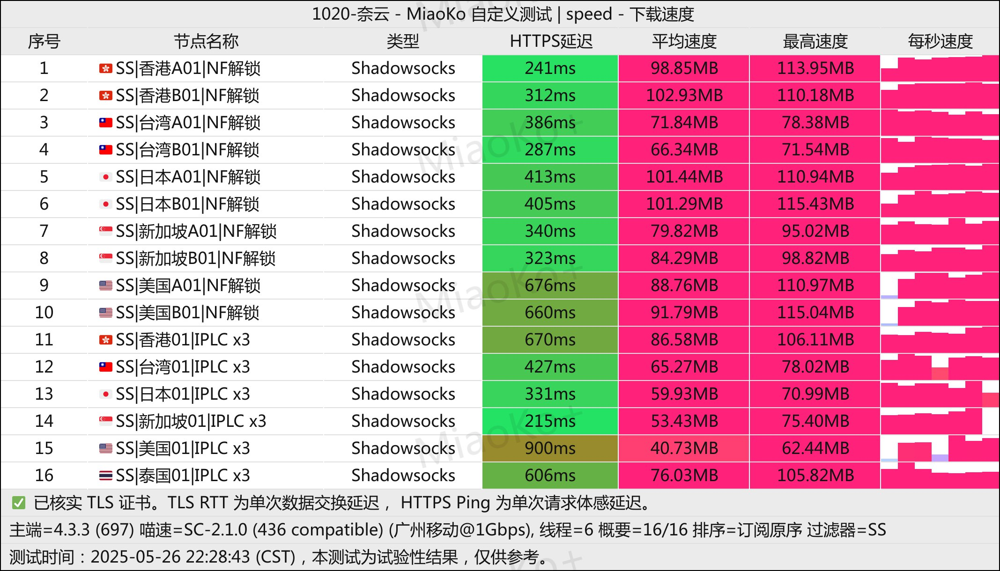

[奈云](https://www.v2ny.me?path=register&code=6bJ8swbK )是一家拥有==六年以上==稳定运营历史的专业网络加速服务提供商，以其卓越的可靠性和海量节点资源在业内享有盛誉。长期运营过程中始终保持零负面评价记录，展现了出色的服务品质和用户信赖度。==本人一直自用的机场,闭眼入！==

📲奈云机场官网地址：[www.v2ny.me](https://www.v2ny.me?path=register&code=6bJ8swbK )
<!-- more -->

## 🔔服务概览与技术架构

## 📲奈云机场官网地址：[www.v2ny.me](https://www.v2ny.me?path=register&code=6bJ8swbK )

## 👉[新用户9折领取](https://www.v2ny.me?path=register&code=6bJ8swbK )

## 💻服务核心信息

| 项目 | 详细信息 |
| :--- | :--- |
| **🌐 官方网站** | [www.v2ny.me](https://www.v2ny.me?path=register&code=6bJ8swbK ) |
| **💰 入门价格** | 10.6元/168G每月（年付） |
| **💳 充值方式** | 支付宝、微信支付 |
| **🌍 服务器分布** | 自有机房专柜 环球多地接入点 |
| **🔗 协议支持** | 多全球流媒体解锁 解锁奈飞/迪士尼/ChatGPT 等、可支持5台设备同时接入、不限速(峰值5000M)  |
---
# 📚套餐详情

| 🧮套餐等级 | 📛套餐名称 | 📑适用人群 | 🔁可选周期 | 💰月费 | 📶流量 | 🛍️购买链接 |
|---------|----------|----------|----------|------|------|----------| 
| 进阶版 | Basic 基础套餐 | 轻度至中度日常使用 | 年付 | ¥10.6/每月(年付) |168GB/月 |[购买链接](https://www.v2ny.me?path=register&code=6bJ8swbK ) |
| 专业版 | Pro 进阶套餐 |	中度用户、高清视频 | 月付、半年、年付 | ¥28.00/每月 |388GB/月 |[购买链接](https://www.v2ny.me?path=register&code=6bJ8swbK ) |
| 尊享版 | Max 专业套餐 | 重度用户 | 月付、半年、年付 | ¥49.00/每月 |788GB/月 | [购买链接](https://www.v2ny.me?path=register&code=6bJ8swbK ) |

### 2. 按量付费流量包

此模式适合使用频率不固定或需求波动的用户，流量包在有效期内无时间限制。

| 🧮套餐等级 | 📛套餐名称 | 📑适用人群 | 🔁可选周期 | 💰费用 | 📶流量 | 🛍️购买链接 |
|---------|----------|----------|----------|------|------|----------| 
| 专业版 | 280G [按量计费] | 临时需求、备用线路 | 一次性 | ¥98 |280GB |[购买链接](https://www.v2ny.me?path=register&code=6bJ8swbK ) |
| 尊享版 | 680G [按量计费]  |	中长期灵活使用 | 一次性 | ¥218 |680GB |[购买链接](https://www.v2ny.me?path=register&code=6bJ8swbK ) |
| 终极版 | 2048G [按量计费] | 高消耗场景、灵活使用 | 一次性 | ¥498 |2048GB | [购买链接](https://www.v2ny.me?path=register&code=6bJ8swbK ) |

# 📢奈云网络加速服务概览

## 🔔奈云机场测试

## 📲核心优势

### 🧮长期稳定运营
- **六年以上持续服务**：自成立以来保持不间断稳定运营
- **零负面评价记录**：用户口碑良好，服务信誉卓越
- **成熟技术架构**：经过长期优化，系统稳定性极高

### 🧾个人用户套餐
| 套餐名称 | 月费 | 月流量 | 特色功能 | 推荐指数 |
|----------|------|--------|----------|----------|
| Basic 基础套餐 | ¥10.6/每月(年付) | 168GB | 特惠 | ★★★★★ |
| Pro 进阶套餐 | ¥28.00 | 388GB | 全平台设备使用 | ★★★★☆ |
| Max 专业套餐 | ¥49.00 | 788GB | 多设备接入 | ★★★★★ |

### 🖌️优惠套餐选项
**Basic 基础套餐：**
- 年费：¥128
- 月均流量：168GB
- 适合长期稳定用户
- 性价比极高

### 📩丰富节点资源
- **海量服务器节点**：提供充足资源满足各类用户需求
- **全球网络覆盖**：支持多地区访问需求
- **持续资源扩容**：根据用户增长及时增加服务器资源

### 📀移动设备
### 纯小白请看以下教程，老鸟略过

👉[2025年安卓VPN完全指南：从选购到实战](https://vpnnew.net/article/anzhuoVPNzhinan/ )

👉[电脑用VPN怎么选？实用攻略与建议](https://vpnnew.net/article/diannanvpnzenmexuan/ )

👉[iPhone上装哪款VPN iOS版本？避坑指南](https://vpnnew.net/article/iphoneVPN/ )

### 💰便捷支付体验
- **支持支付宝支付**：国内用户支付便利
- **微信支付支持**：移动端支付快捷安全
- **多样化套餐选择**：满足不同用户群体的使用需求

## 📝使用建议

### 📈套餐选择指南
- **新用户体验**：建议从Basic年付套餐开始，成本效益最高
- **常规用户**：Pro月付套餐适合大多数日常使用场景
- **高需求用户**：Max套餐或大容量按量包更经济
- **不确定需求**：按量计费套餐提供最大灵活性

### 📋成本优化策略
1. **长期使用优选年付**：Basic年付套餐性价比最高
2. **按需选择流量包**：不固定需求用户适合按量计费
3. **合理评估用量**：根据实际使用情况选择对应套餐
4. **关注官方活动**：定期查看官网是否有特别优惠

## 🔓服务特点总结

- **历史验证可靠**：六年稳定运营提供质量保证
- **资源充足丰富**：海量节点满足各类访问需求
- **支付方式便捷**：支持主流国内支付工具
- **套餐选择灵活**：从经济型到专业型全面覆盖
- **用户口碑良好**：长期保持零负面评价记录

---
#  📢更多机场推荐汇总

# 👉[2025年性价比翻墙机场推荐评测（长期更新）]( https://vpnnew.net/article/VPN/ )
## 👉新用户首次订购可使用优惠码  **6bJ8swbK**
## [👉新用户9折领取](https://www.v2ny.me?path=register&code=6bJ8swbK )

>评测数据基于实际测试结果，服务表现可能因网络环境而异。建议你根据自身需求进行实际测试验证。

>📝 免责声明：本文仅供信息参考，建议均为个人经验与观点，不构成法律意见。实际情况以最新政策和主管部门解释为准，请在合法合规框架内使用相关服务。任何违法使用行为与本站无关。