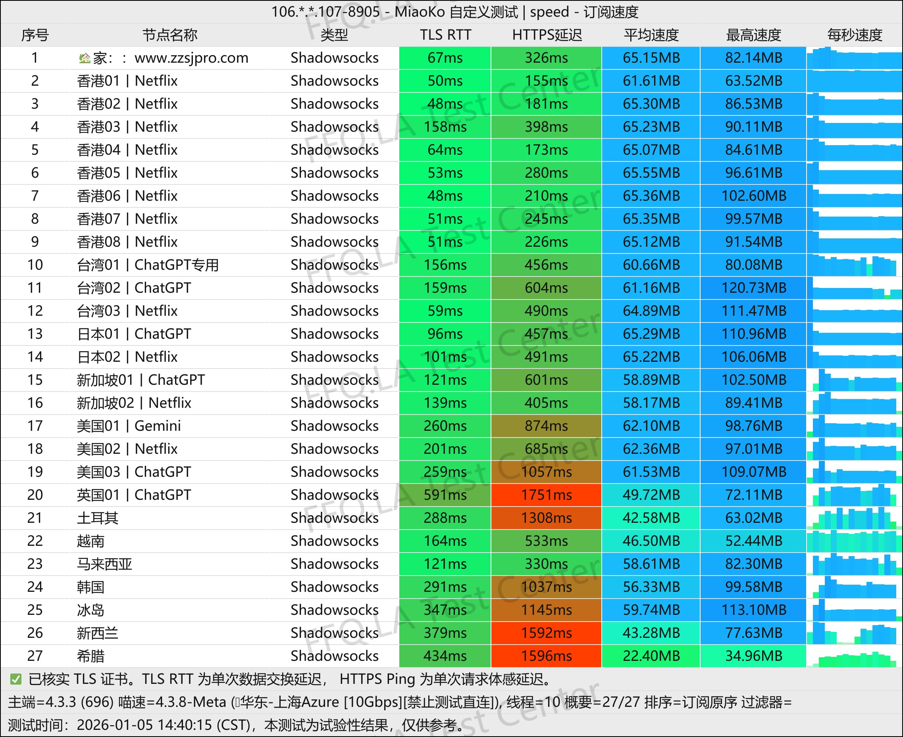

[掌中世界](https://www.zjs2025.com/user/register?code=d0AwII8g )是一款主打==用户体验和服务易用性==的网络加速器，通过提供免费试用与全方位的附加服务，降低用户决策门槛，旨在成为新手及多场景用户的“一站式”解决方案。

📲掌中世界机场官网地址：[https://qq.zjs2025.com](https://www.zjs2025.com/user/register?code=d0AwII8g )
<!-- more -->

## 🔔服务概览与技术架构

## 掌中世界机场官网地址：[https://qq.zjs2025.com](https://www.zjs2025.com/user/register?code=d0AwII8g )

## 👉[新用户9折福利领取](https://www.zjs2025.com/user/register?code=d0AwII8g )
## 👉[新用户优惠码zzsj9](https://www.zjs2025.com/user/register?code=d0AwII8g )
## 💻服务核心信息

| 项目 | 详细信息 |
| :--- | :--- |
| **🌐 官方网站** | [https://qq.zjs2025.com](https://www.zjs2025.com/user/register?code=d0AwII8g )
| **💰 入门价格** | 18.00元/100G每月 |
| **📑 试用体验** | 1天 5GB |
| **💳 充值方式** | 支付宝、微信支付 |
| **🌍 服务特色** | 小伙箭id IOS美区账号 |
| **🔗 协议支持** |ChatGPT Netflix Midjourney等、最高10台支持设备同时使用〔手机/电脑不限〕等 |
---
# 📚套餐详情

| 🧮套餐等级 | 📛套餐名称 | 📑适用人群 | 🔁可选周期 | 💰月费 | 📶流量 | 🛍️购买链接 |
|---------|----------|----------|----------|------|------|----------| 
| 进阶版 | BA1.0 小号 | 轻度使用 | 月付、季付、半年、年付 | ¥18.00/每月 |100GB/月 |[购买链接](https://www.zjs2025.com/user/register?code=d0AwII8g ) |
| 专业版 | ST2.0 中号〔畅销款〕 |	中度用户 | 月付、季付、半年、年付 | ¥20.00/每月 |280GB/月 |[购买链接](https://www.zjs2025.com/user/register?code=d0AwII8g ) |
| 尊享版 | PR5 火力全开 | 重度用户 | 月付、季付、半年、年付 | ¥45.00/每月 |680GB/月 | [购买链接](https://www.zjs2025.com/user/register?code=d0AwII8g ) |
| 特惠进阶版 | mini X | 轻度至中度日常使用 | 年付 | ¥78.00/每年 |30GB/月 |[购买链接](https://www.zjs2025.com/user/register?code=d0AwII8g ) |
| 特惠入门版 | mini S〔畅销款〕 |	中度用户、高清视频 | 年付 | ¥88.00/每年 |60GB/月 |[购买链接](https://www.zjs2025.com/user/register?code=d0AwII8g ) |
| 两年进阶版 | king | 老鸟灵活用户 | 2年内有效 | ¥299.00 |2088GB | [购买链接](https://www.zjs2025.com/user/register?code=d0AwII8g ) |
| 永久专业版 | 传家宝〔限量款〕 | 老鸟重度灵活用户 | 一次性 | ¥399.00 |5550GB | [购买链接](https://www.zjs2025.com/user/register?code=d0AwII8g ) |

### 📀移动设备
### 纯小白请看以下教程，老鸟略过

👉[2026年安卓VPN完全指南：从选购到实战](https://vpnnew.net/article/anzhuoVPNzhinan/ )

👉[电脑用VPN怎么选？实用攻略与建议](https://vpnnew.net/article/diannanvpnzenmexuan/ )

👉[iPhone上装哪款VPN iOS版本？避坑指南](https://vpnnew.net/article/iphoneVPN/ )

## 🔔掌中世界机场测试

## 🎁 核心特色与服务

| 特色类别 | 具体说明 |
| :--- | :--- |
| **🆓 零成本体验** | **1天5G的免费试用**，无需付费即可全面测试服务。 |
| **⚡ 极速连接** | 宣称支持 **YouTube 8K视频瞬间播放**，并利用**移动、联通、电信三网5G**网络优化，实现高速稳定连接。 |
| **🎬 全媒体解锁** | 支持解锁 **Netflix 热门剧集库** 及全球流媒体内容。 |
| **📱 多设备与便利性** | **支持全家设备**（手机、电脑、路由器等）同时使用，并提供**一键加速**功能，简化操作。 |
| **🍎 iOS专享福利** | 为iOS用户提供**免费美区App Store ID**，方便下载海外应用。 |
| **🛟 全天候支持** | 提供 **24小时在线客服**，确保用户问题能及时得到解答。 |

## 👥 适用场景与人群

| 用户类型 | 可解决的痛点 |
| :--- | :--- |
| **追剧爱好者** | 无缓冲观看Netflix等平台的独家高清剧集。 |
| **手游与网游玩家** | 获得低延迟、高稳定的国际游戏连接，避免卡顿掉线。 |
| **远程办公与学习人员** | 保障国际视频会议、在线课程的流畅与稳定。 |
| **多设备家庭用户** | 一个账号覆盖全家所有设备的网络加速需求。 |
| **新手与尝鲜用户** | 利用超长免费试用期，零风险体验服务。 |

## 📝 使用评价与建议
- **最大亮点**：**1天5G免费试用**是其最具吸引力的优势，为用户提供了充分的体验和评估时间。
- **服务整合**：除基础加速服务外，整合了提供美区ID等周边支持，提升了便利性。
- **目标用户**：非常适合**惧怕复杂设置的新手用户**、**需要临时或短期加速服务的用户**，以及追求**开箱即用、服务省心**的群体。
- **建议**：所有潜在用户都应充分利用免费试用期，全面测试在自己常用时间段（特别是晚高峰）和主要用途（如游戏、4K流媒体）下的实际表现。

---
> **总结**：掌中世界通过“**超长免费试用+全方位便利服务**”的组合拳，显著降低了用户的尝试成本和使用门槛。它是一款**高度用户友好型**的产品，特别适合**新手、追剧党、多设备家庭**以及对客服响应有要求的用户。建议所有感兴趣的用户**务必先进行1天免费体验**，以验证其在实际网络环境下的表现是否符合预期。

## [👉新用户试用1天 5GB福利领取](https://www.zjs2025.com/user/register?code=d0AwII8g )
## 👉新用户首次订购可使用优惠码  **d0AwII8g**
##  📢更多机场推荐汇总：👉[2026年性价比翻墙机场推荐评测（长期更新）]( https://vpnnew.net/article/VPN/ )
>评测数据基于实际测试结果，服务表现可能因网络环境而异。建议你根据自身需求进行实际测试验证。

>📝 免责声明：本文仅供信息参考，建议均为个人经验与观点，不构成法律意见。实际情况以最新政策和主管部门解释为准，请在合法合规框架内使用相关服务。任何违法使用行为与本站无关。