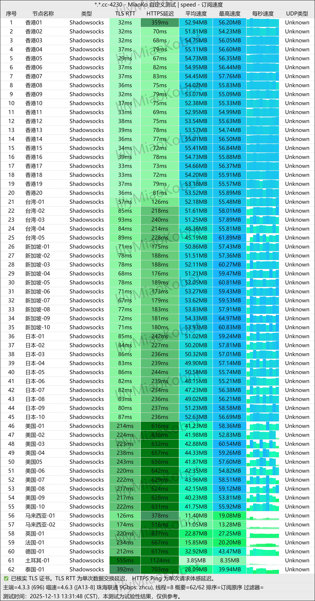
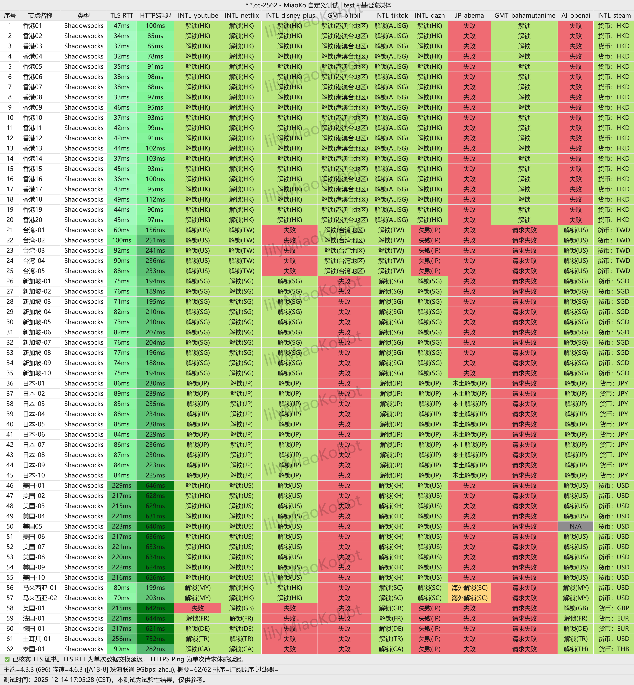
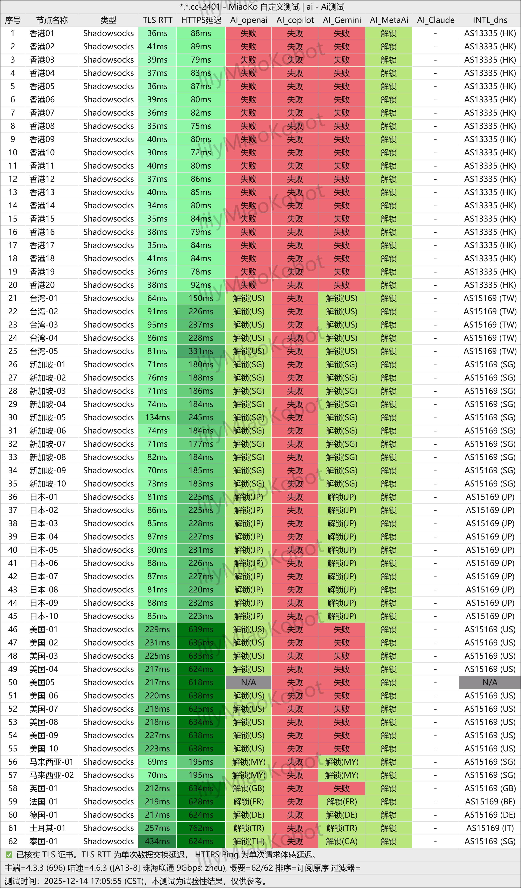

**[星岛梦机场](https://a01.sdmvipaff.cc/#/?code=W91WdGyv)** 以其==IEPL高品质专线==、==全面流媒体解锁能力和无限制使用策略==，在2025年机场市场中脱颖而出。特别适合跨境业务、高清流媒体观看和AI服务访问等高要求场景。
<!-- more -->

> 16元起100G/月，全 IPLC 专线，低延迟；单节点峰值至 2.5Gbps，原生 IP，支持 Netflix / Disney+ / ChatGPT / TikTok，多设备不限量同时在线的优质翻墙服务

## 🌐 服务概览

## 📋 核心信息总览

| 项目 | 详细信息 |
|------|----------|
| 🌐 **官方网站** | [a01.sdmvipaff.cc](https://a01.sdmvipaff.cc/#/?code=W91WdGyv) |
| 💰 **入门价格** | 16元起/月（100G/月流量）|
| 💳 **充值方式** | 支付宝、USDT加密货币|
| 🌍 **服务器分布** | 港、台、日、美、新、韩、东南亚及欧美多国 |
| 🔗 **协议支持** | 全IPLC专线，Netflix / Disney+ / ChatGPT / TikTok，不限制客户端等 |
| 🔓 **特色权益** | 多设备不限量同时在线、全 IPLC 专线，低延迟；单节点峰值至 2.5Gbps、专业客服，快速响应 |
---
## 📢套餐详情

| 🧮套餐等级 | 📛套餐名称 | 📑适用人群 | 🔁付费方式 | 💰月费 | 📶流量 | 性价比指数 |🛍️购买链接 |
|---------|----------|----------|----------|------|------|----------|----------|
| 入门级 | 星岛梦 · 极速版 | 轻度用户 | 月付、季付、半年、年付 | ¥16.00/年 | 100GB/月 | ⭐⭐⭐⭐ |[购买链接](https://a01.sdmvipaff.cc/#/?code=W91WdGyv ) |
| 基础级 | 星岛梦 · 进阶版 | 日常使用 | 月付、季付、半年、年付 | ¥32.00/月 | 200GB/月 | ⭐⭐⭐⭐⭐ |[购买链接](https://a01.sdmvipaff.cc/#/?code=W91WdGyv ) |
| 进阶级 | 星岛梦 · 闪光版 | 重度使用 | 月付、季付、半年、年付 | ¥80.00/月 | 500GB/月 | ⭐⭐⭐⭐⭐ |[购买链接](https://a01.sdmvipaff.cc/#/?code=W91WdGyv ) |
| 尊享级 | 星岛梦 · 旗舰版 | 超重度用户 | 月付、季付、半年、年付 | ¥160/月 | 1TB/月 | ⭐⭐⭐⭐ |[购买链接](https://a01.sdmvipaff.cc/#/?code=W91WdGyv ) |
| 永久流量 | 星岛梦 · 永久不限时 | 企业/团队 | 一次性付 | ¥680.00 | 1TB | ⭐⭐⭐ |[购买链接](https://a01.sdmvipaff.cc/#/?code=W91WdGyv ) |
| 旗舰级 | 星岛梦 · 定制套餐 | 专业用户 | 月付 | ¥680.00/月 | 500GB/月 | ⭐⭐⭐ |[购买链接](https://a01.sdmvipaff.cc/#/?code=W91WdGyv ) |
---

## 💰 套餐价格与性价比
| 套餐名称 | 价格 | 流量 | 核心特点 |
|---------|------|------|----------|
| 极速版 | ¥16/月 | 100GB/月 | 全IPLC专线，晚高峰稳定 |
| 进阶版 | ¥32/月 | 200GB/月 | 全IPLC专线，业务级体验 |
| 闪光版 | ¥80/月 | 500GB/月 | 大流量专线方案 |
| 旗舰版 | ¥160/月 | 1.0TB/月 | 企业级流量配置 |
| 永久不限时 | ¥680一次性 | 1.0TB | 无限时长，用完为止 |
| 定制套餐 | ¥680/月 | 500GB | 专属定制节点，原生IP |

# **[👉长期优惠福利：年付8折｜两年付7折｜三年付6折](https://a01.sdmvipaff.cc/#/?code=W91WdGyv )**

> 💡 提示：所有套餐均**无倍率、不限速、不限制设备数量**（需合理使用）

## 📊多平台客户端配置

### 📍纯小白请看以下教程，老鸟略过

👉[2026年安卓VPN完全指南：从选购到实战](https://vpnnew.net/article/anzhuoVPNzhinan/ )

👉[电脑用VPN怎么选？实用攻略与建议](https://vpnnew.net/article/diannanvpnzenmexuan/ )

👉[iPhone上装哪款VPN iOS版本？避坑指南](https://vpnnew.net/article/iphoneVPN/ )
## 🌐 技术架构与性能

### 📢网络线路特色
- **IEPL专线架构**：采用企业级国际专线，低延迟高稳定
- **晚高峰保障**：特殊线路优化，峰值时段不降速
- **全球覆盖**：港台日美新等主要地区+东南亚、韩国、欧美多国节点

### 🔔协议支持
- 主流协议：Trojan、Shadowsocks (SS)
- 全平台兼容：Windows、macOS、iOS、Android

## 🎬 解锁能力实测
### 💻流媒体支持
| 平台 | 解锁状态 | 地区支持 | 画质 |
|------|----------|----------|------|
| Netflix | ✅ 完美解锁 | 美/日/港/台等 | 4K HDR |
| Disney+ | ✅ 完美解锁 | 美/日/新 | 4K |
| YouTube | ✅ 全解锁 | 全球 | 8K |
| HBO Max | ✅ 稳定访问 | 美国地区 | 4K |
| Amazon Prime | ✅ 支持 | 多地区 | 高清 |

### 📲AI与社交平台
- **AI工具**：ChatGPT、Gemini、Claude全功能访问
- **短视频**：TikTok多地区解锁，支持直播推流
- **社交网络**：Twitter、Instagram、Facebook无限制

## 📊 性能测试表现
### 📱速度测试
晚高峰时段实测数据显示：
- **延迟**：香港节点40-60ms，日本节点50-70ms
- **下载速度**：可跑满本地带宽，4K视频无缓冲
- **稳定性**：72小时连续测试无断流

### ☎️业务场景测试
- **跨境电商**：亚马逊、Shopify访问流畅
- **视频会议**：Zoom、Teams高清通话稳定
- **游戏体验**：外服游戏延迟可控，丢包率<1%

## 🔧 客户端配置指南
### 📟多平台客户端推荐
**Android设备**
- Clash for Android（功能全面）
- V2rayNG（轻量高效）
- Surfboard（界面美观）

**iOS设备**
- Shadowrocket（小火箭，首选推荐）
- Quantumult X（高级功能）
- Stash（Clash iOS版）

**Windows/macOS**
- Clash Verge（新一代跨平台）
- v2rayN（Windows经典）

### 🖥️快速配置步骤
1. **注册账户**：访问官网 [a01.sdmvipaff.cc](https://a01.sdmvipaff.cc/#/?code=W91WdGyv) 注册
2. **选择套餐**：按需购买，支持支付宝/USDT支付
3. **导入订阅**：仪表盘一键订阅，对应客户端导入
4. **节点选择**：根据需求选择优化节点
5. **开启代理**：一键连接，开始使用

## 🎯 适用人群与场景
### 🧮专业用户群体
- **跨境业务者**：电商运营、店群管理、海外营销
- **内容创作者**：TikTok直播、YouTube上传、社交媒体运营
- **远程办公**：国际企业员工、自由职业者、远程团队
- **学术研究**：文献查阅、国际学术资源访问

### 🎞️娱乐需求
- **追剧爱好者**：Netflix、Disney+等平台4K观影
- **游戏玩家**：外服游戏加速、主机游戏下载
- **社交达人**：无限制访问国际社交平台

## ⚡对比优势分析
| 对比维度 | 星岛梦 | 普通机场A | 普通机场B |
|----------|--------|------------|------------|
| 线路质量 | IEPL专线 | 公共线路 | 混合线路 |
| 高峰表现 | 稳定不降速 | 明显降速 | 偶尔波动 |
| 解锁能力 | 全面支持 | 部分支持 | 有限支持 |
| 设备策略 | 不限设备 | 限制3-5台 | 限制设备数 |
| 价格门槛 | 16元起 | 20元起 | 25元起 |
| 客服响应 | 多客服轮值 | 单一客服 | 响应较慢 |

## 🛒 购买与支付
### 购买流程
1. 访问官网：[a01.sdmvipaff.cc](https://a01.sdmvipaff.cc/#/?code=W91WdGyv)
2. 邮箱注册账号
3. 选择套餐（月付16元起，或永久套餐）
4. 支付宝/USDT支付
5. 获取订阅链接并配置客户端

### 💰支付方式
- **支付宝**：国内用户便捷支付
- **USDT**：数字货币支付，隐私性更好

## ❓ 常见问题
**🙋‍♂️: 流量是否有限制？**
A: 套餐标明流量为实际可用流量，无倍率消耗，用完可续购。

**🙋‍♂️: 是否支持退款？**
A: 具体退款政策请查阅官网服务条款或咨询在线客服。

**🙋‍♂️: 新用户如何选择套餐？**
A: 建议从极速版（16元/100GB）开始试用，满意后再升级套餐。

**🙋‍♂️: 技术问题如何解决？**
A: 官网提供详细教程，客服团队可协助解决配置问题。

## 📢 增值服务
- **技术支持**：海外团队7×24小时维护
- **账号服务**：小火箭下载账号、TG代注册等
- **定制方案**：企业用户可联系定制专属节点

## 🏁 最终评价
[星岛梦机场](https://a01.sdmvipaff.cc/#/?code=W91WdGyv)在2025年的机场服务中表现突出，其**IEPL专线技术**确保了网络质量，**全面的解锁能力**满足了各类用户需求，**灵活的价格策略**降低了使用门槛。无论是跨境业务运营、高清流媒体观看，还是日常国际网络访问，星岛梦都提供了稳定可靠的解决方案。

> ⭐ **推荐指数**：4.8/5.0
>
> **适合人群**：对网络质量有要求的业务用户、流媒体爱好者、跨境工作者
>
> **最佳套餐**：根据流量需求选择，长期使用推荐年付享受折扣

---

> **立即体验**：访问 [a01.sdmvipaff.cc](https://a01.sdmvipaff.cc/#/?code=W91WdGyv) 使用优惠码 **W91WdGyv** 开启您的优质网络之旅

#  📢更多机场推荐汇总

# 👉[2026年性价比翻墙机场推荐评测（长期更新）]( https://vpnnew.net/article/VPN/ )
## 👉用户订购 66折  截止到1月3日23.59可使用优惠码  **[XDM666](https://a01.sdmvipaff.cc/#/?code=W91WdGyv)**
## 👉用户订购 88折   截止到2026年12月31可使用优惠码  **[XDM888 ](https://a01.sdmvipaff.cc/#/?code=W91WdGyv)**
## [👉新用户专享福利](https://a01.sdmvipaff.cc/#/?code=W91WdGyv  )

>评测数据基于实际测试结果，服务表现可能因网络环境而异。建议你根据自身需求进行实际测试验证。

>📝 免责声明：本文仅供信息参考，建议均为个人经验与观点，不构成法律意见。实际情况以最新政策和主管部门解释为准，请在合法合规框架内使用相关服务。任何违法使用行为与本站无关。

