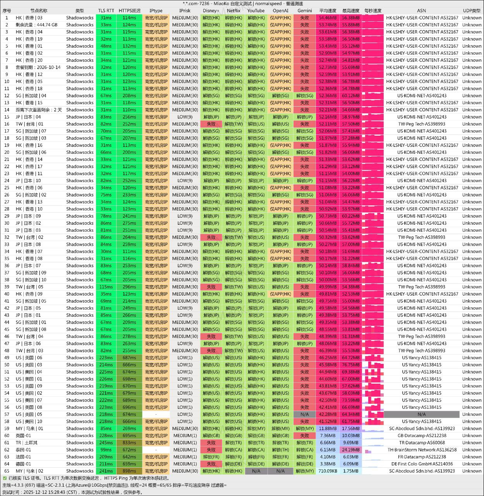
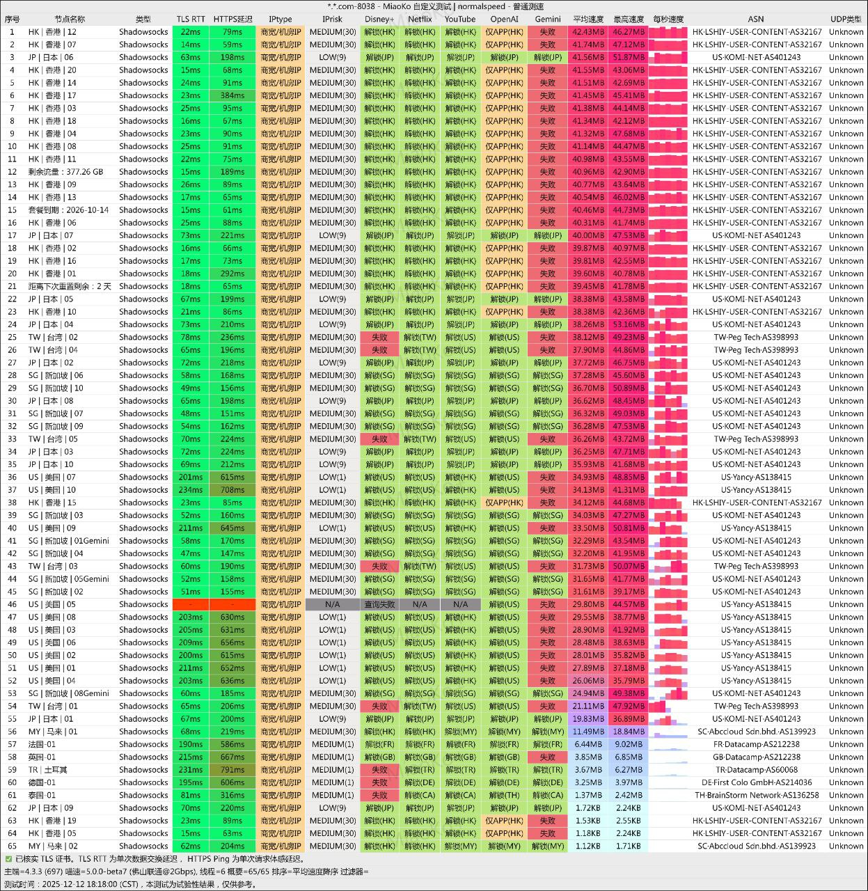
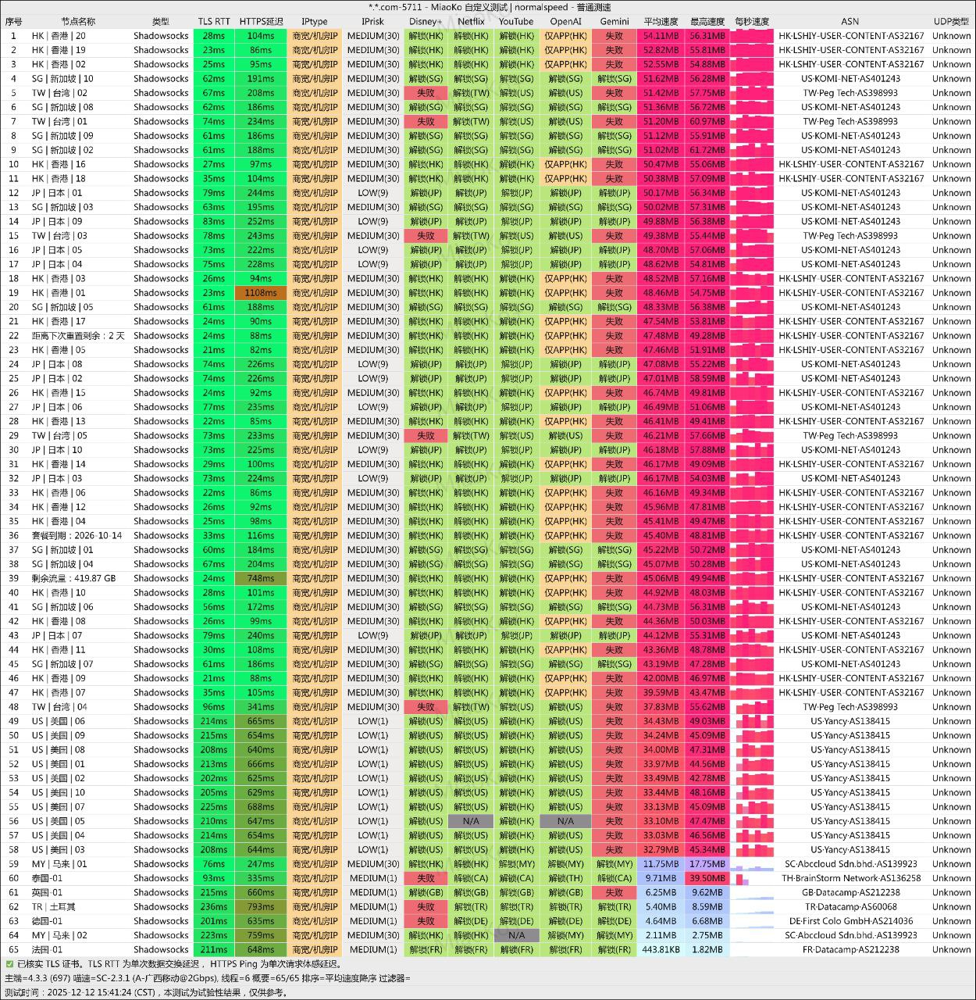
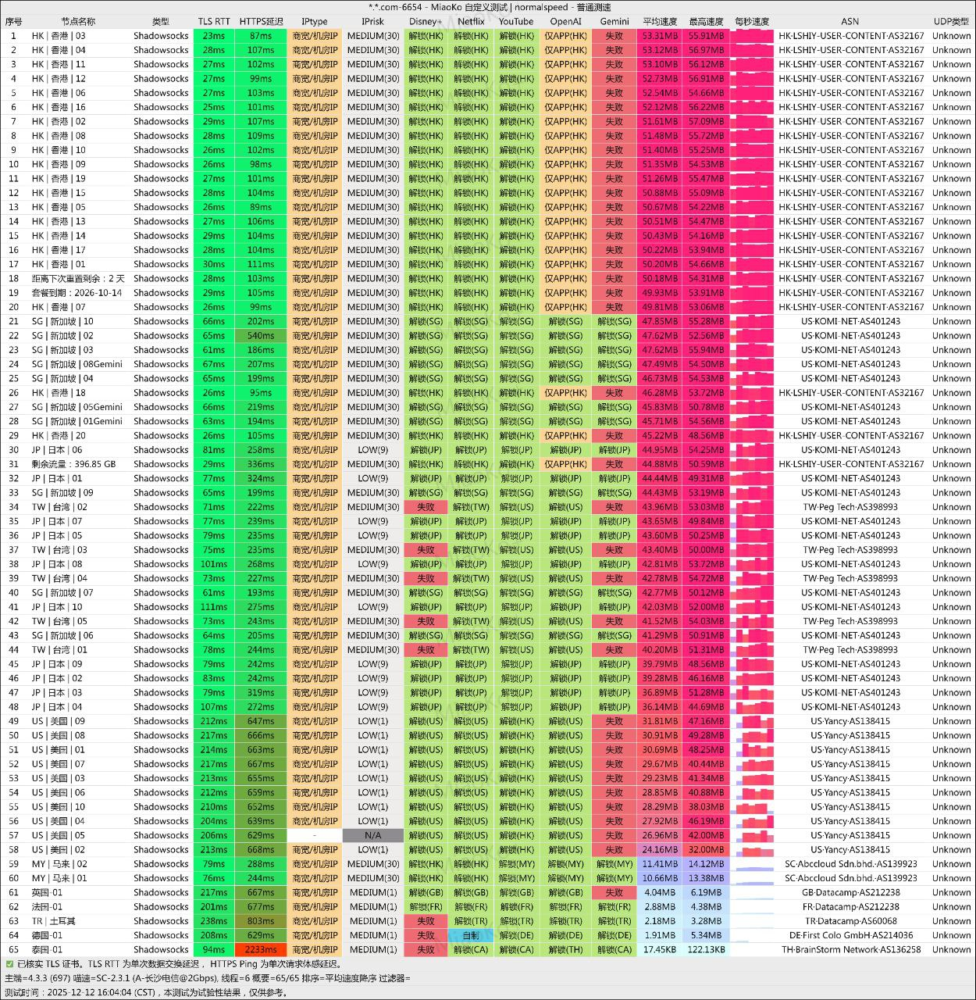

[极连云](https://yyo649901.jlcvipaff.cc/#/register?code=aqXIHmRI )作为2025年新兴的服务商，其核心卖点在于==全IPLC/IEPL企业级专线==和==完全不限制设备数量==的策略。它主要面向==追求极致网络稳定性、低延迟，且拥有多台设备==的用户，尤其适合跨境业务、高清流媒体和在线游戏等对网络质量要求苛刻的场景。

📲极连云机场官网地址：[jly01.jiliancloud.net](https://yyo649901.jlcvipaff.cc/#/register?code=aqXIHmRI )
<!-- more -->

## 🔔服务概览与技术架构

## 📲极连云机场官网地址：[jly01.jiliancloud.net](https://yyo649901.jlcvipaff.cc/#/register?code=aqXIHmRI )

## 👉[新用户八折领取](https://yyo649901.jlcvipaff.cc/#/register?code=aqXIHmRI )

## 💻服务核心信息

| 项目 | 详细信息 |
| :--- | :--- |
| **🌐 官方网站** | [jly01.jiliancloud.net](https://yyo649901.jlcvipaff.cc/#/register?code=aqXIHmRI ) |
| **💰 入门价格** | 8元/60G每月（年付） |
| **💳 充值方式** | 支付宝、USDT |
| **🌍 服务器分布** | 全 IPLC 专线，最大提供 2.5Gbps 速率 |
| **📲 核心线路** | **IPLC/IEPL国际专线** |
| **💻 突出优势** | 物理独享带宽，延迟极低且稳定（如深港可&lt;5ms），几乎零丢包。**不限制同时在线设备数**。 |
| **🖲️ 主要场景** | 跨境业务（电商、会议）、4K/8K流媒体、外服游戏、高频交易等低延迟需求。 |
| **📀 解锁能力** | 支持 Netflix、Disney+、TikTok、ChatGPT、YouTube 4K/8K。 |
| **🧮 节点覆盖** | 60+节点，覆盖香港、日本、新加坡、美国、韩国、欧洲等多个地区。 |
| **🔗 协议支持** | 原生 IP 解锁各大流媒体、不限制同时使用客户端数量、1 年付 8 折、2 年付 7 折、3 年付 6 折等  |
---
## 📢套餐详情

| 🧮套餐等级 | 📛套餐名称 | 📑适用人群 | 🔁付费方式 | 💰月费 | 📶流量 | 性价比指数 |🛍️购买链接 |
|---------|----------|----------|----------|------|------|----------|----------|
| 入门级 | 限时年付套餐体验 | 轻度用户 | 年付 | ¥8.00/月 | 60GB/月 | ⭐⭐⭐ |[购买链接](https://yyo649901.jlcvipaff.cc/#/register?code=aqXIHmRI) |
| 基础级 | 极连云 · 基础套餐 | 日常使用 | 月付、季付、半年、年付 | ¥15.50/月 | 100GB/月 | ⭐⭐⭐⭐ |[购买链接](https://yyo649901.jlcvipaff.cc/#/register?code=aqXIHmRI ) |
| 进阶级 | 极连云 · 进阶套餐 | 重度使用 | 月付、季付、半年、年付 | ¥30.050/月 | 200GB/月 | ⭐⭐⭐⭐ |[购买链接](https://yyo649901.jlcvipaff.cc/#/register?code=aqXIHmRI ) |
| 尊享级 | 极连云 · 旗舰套餐 | 超重度用户 | 月付、季付、半年、年付 | ¥65.50/月 | 500GB/月 | ⭐⭐⭐⭐⭐ |[购买链接](https://yyo649901.jlcvipaff.cc/#/register?code=aqXIHmRI ) |
| 旗舰级 | 极连云 · 尊享套餐 | 专业用户 | 月付、季付、半年、年付 | ¥120.50/月 | 1TB/月 | ⭐⭐⭐⭐ |[购买链接](https://yyo649901.jlcvipaff.cc/#/register?code=aqXIHmRI ) |
| 永久流量 | 极连云 · 不限时套餐 | 企业/团队 | 一次性付 | ¥399.00 | 600GB | ⭐⭐⭐⭐ |[购买链接](https://yyo649901.jlcvipaff.cc/#/register?code=aqXIHmRI ) |
---

## 🔬 技术特点与性能深度分析

### 🔔1. 专线品质：IPLC/IEPL的核心优势
极连云采用的IPLC/IEPL并非普通线路，而是企业级的国际专线。其技术优势直接决定了使用体验：
*   **物理隔离，超低延迟**：数据通过**物理光纤直连**传输，不经过拥挤的公共互联网。例如，深圳到香港的延迟可稳定在**5毫秒以内**，相比普通跨境线路（60-120ms）有数量级提升。
*   **极致稳定，几乎零丢包**：独享带宽避免了网络拥堵，丢包率可长期低于**0.1%**，远超普通线路。这对于**视频会议、直播推流和在线游戏**至关重要。
*   **高安全性**：专线通道本身具有隔离性，数据传输更安全。

> 注：IPLC/IEPL专线成本高昂，通常服务于企业。极连云将其应用于机场服务，是其宣称“高端稳定”的基础，但实际体验需取决于供应商的线路质量与运维水平。

### 📣2. “不限设备”策略解读
这是极连云极具吸引力的策略，意味着一个订阅可在**手机、电脑、平板、路由器等多台设备上同时使用**，非常适合家庭或小型团队共享，能显著降低人均使用成本。

**潜在考量**：理论上，无限制的设备连接可能对单节点的负载造成压力，影响高峰期的速度。其实际表现取决于服务商的带宽冗余和负载均衡能力。

### 📯3. 解锁与速度表现
根据评测资料：
*   **流媒体**：全面解锁主流平台，并支持Netflix的4K HDR和YouTube的8K播放。
*   **速度**：凭借专线优势，在各地三网（电信、移动、联通）测试中均能跑满带宽，晚高峰表现是其重点宣传的亮点。

## 💰 套餐选择与性价比分析
极连云提供从轻度到重度的多种套餐，年付享有较大折扣。

| 套餐名称 | 价格 | 月均流量 | 核心特点 | 适合人群 |
| :--- | :--- | :--- | :--- | :--- |
| **轻量体验(年付)** | ¥96/年 | 60GB | 门槛低，适合体验 | 轻度用户，仅用于查资料、社交 |
| **基础套餐** | ¥15.50/月 | 100GB | 性价比之选 | 个人日常使用，中强度流媒体 |
| **进阶套餐** | ¥30.50/月 | 200GB | 流量加倍 | 高频用户、4K流媒体爱好者 |
| **旗舰套餐** | ¥65.50/月 | 500GB | 高速专线 | 小型团队、重度下载与游戏玩家 |
| **尊享套餐** | ¥120.50/月 | 1000GB | 顶级带宽(2.5Gbps) | 极客用户、小型工作室、直播推流 |
| **不限时套餐** | ¥399.00 | 1000GB | **永久有效**，用完为止 | 需求不固定，希望一次买断的用户 |

**💡 购买建议：**
1.  **新用户**：建议使用“**轻量体验年付套餐**”配合专属优惠码 `iphoneVPN` 进行试用，折后约¥76.8/年，试错成本低。
2.  **普通用户**：`基础套餐`或`进阶套餐`已足够日常和娱乐使用。
3.  **高需求用户**：直接选择`旗舰套餐`或`尊享套餐`，体验最佳性能。
4.  **长期主义**：年付及以上享有**8折至6折**优惠，长期使用更划算。

## 🎯 适用场景与人群
*   **👍 特别适合**：
    *   **跨境业务工作者**：如跨境电商运营、国际视频会议、远程协同办公。
    *   **影音游戏极客**：对4K/8K流媒体、外服游戏低延迟有硬性要求的用户。
    *   **多设备用户/家庭**：需要同时在手机、电脑、电视等多台设备上使用的场景。
    *   **追求稳定性的用户**：无法忍受网络波动、丢包和高峰时段减速。
*   **🤔 可能不必要**：
    *   仅用于偶尔浏览网页、刷刷社交媒体等轻度用户。
    *   对价格极度敏感，且对高峰时段网速不苛求的用户。

## ⚖️ 总结：优势与潜在考量
**优势：**
1.  **线路质量上限高**：IPLC/IEPL专线提供了普通机场难以比拟的**低延迟和稳定性基础**。
2.  **设备策略友好**：真正的“不限设备”，共享便利，性价比突出。
3.  **解锁能力全面**：满足主流娱乐、办公和学习需求。
4.  **套餐灵活**：从低价体验到顶级配置，选择范围广。

**潜在考量：**
1.  **价格相对较高**：专线成本决定了其价格高于普通机场，是**为性能付费**的选择。
2.  **协议选择单一**：目前主要支持Shadowsocks (SS)，对习惯其他新协议的用户可能选择较少。
3.  **依赖供应商运维**：再好的线路也需优质的维护，其长期稳定性有待时间检验。

### 🔊**最终建议**
“极连云机场”是一款**特点鲜明、定位清晰**的服务。如果您需要稳定、低延迟的网络连接来处理重要工作或享受高品质娱乐，并且拥有多台设备，那么它为价格敏感度较低的用户提供了一个值得尝试的高端选择。建议充分利用其低价年付套餐进行实际体验，以验证其在您本地网络环境下的真实表现。

---
#  📢更多机场推荐汇总

## 👉新用户首次订购可使用优惠码  **aqXIHmRIK**
## [👉新用户八折领取](https://yyo649901.jlcvipaff.cc/#/register?code=aqXIHmRIK )

## 📢机场推荐汇总： 👉[2026年翻墙机场推荐评测 稳定便宜VPN机场排行榜（高性价比科学上网工具长期更新）]( /vpn-recommend/ )  

## 📌 延伸阅读

👉iOS手机：[Shadowrocket （小火箭）2026年使用指南：iOS/macOS全平台配置教程(含非国区ID)](/article/Shadowrocket/ )

👉Android手机：[Clash for Android 2026年使用指南：终极配置指南教程](/article/ClashforAndroid/ )

👉Windows/Linux/Mac：[2026年 Clash Verge （Windows/Linux/Mac）全平台配置指南](/article/ClashVerge/ )

👉每天免费更新Apple ID：[2026年 最新最全免费共享美区 Apple ID |Shadowrocket/小火箭下载|每日更新](/article/freeAppleID/ )  

---

>📝 免责声明：本文仅供信息参考，建议均为个人经验与观点，不构成法律意见。实际情况以最新政策和主管部门解释为准，请在合法合规框架内使用相关服务。任何违法使用行为与本站无关。