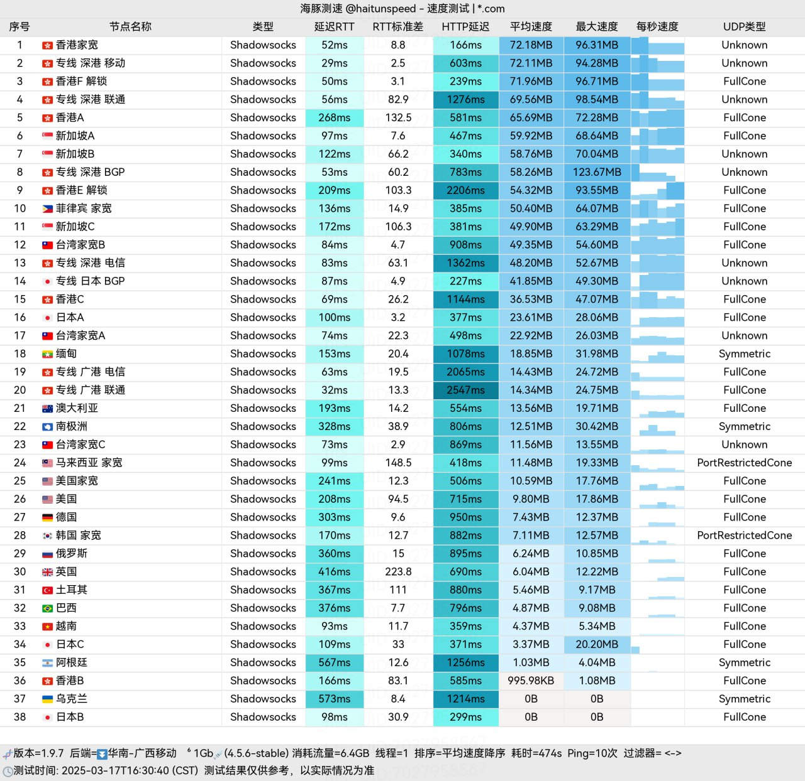

[纵云梯](https://zyt.subcome.com/?r=145154 )是一家基于**全自研技术平台**的机场服务商，致力于提供**高速、稳定且智能**的网络加速解决方案。其技术核心与“冲上云霄”机场同源，主打台湾家宽资源与智能线路管理。

📲纵云梯机场官网地址：[https://zongyunti.com/](https://zyt.subcome.com/?r=145154 )
<!-- more -->

## 🔔服务概览与技术架构

## 📲纵云梯机场官网地址：[https://zongyunti.com/](https://zyt.subcome.com/?r=145154 )

## 👉[用户累计消费最高可以享七五折](https://zyt.subcome.com/?r=145154 )

## 💻服务核心信息

| 项目 | 详细信息 |
| :--- | :--- |
| **🌐 官方网站** | [https://zongyunti.com/](https://zyt.subcome.com/?r=145154 ) |
| **💰 入门价格** | 5.00元/10G每月 （年付）|
| **💳 充值方式** | 支付宝、微信支付 |
| **💳 试用体验** | 1G 不限时 |
| **🌍 服务器分布** | 全自研技术平台、全球畅连 |
| **🔗 协议支持** | 最大限速 5000Mbps、不限设备数、支持专线、流媒体解锁 & GPT不降智等  |
---
## 📚套餐详情

| 🧮套餐等级 | 📛套餐名称 | 📑适用人群 | 🔁可选周期 | 💰月费 | 📶流量 |📶限速 | 🛍️购买链接 |
|---------|----------|----------|----------|------|------|------|----------| 
| 基础版 | 救生圈 | 微轻度用户 | 年付 | ¥5.00/每月(年付) |10GB/月 |100Mbps|[购买链接](https://zyt.subcome.com/?r=145154 ) |
| 入门版 | 冲浪板 |	中度用户 | 月付、年付 | ¥10.00/每月 |60GB/月 |300Mbps|[购买链接](https://zyt.subcome.com/?r=145154 ) |
| 进阶版 | 快艇 | 重度用户 | 月付、年付 | ¥20.00/每月 |188GB/月 | 500Mbps| [购买链接](https://zyt.subcome.com/?r=145154 ) |
| 专业版 | 邮轮 | 中度用户、高清视频 | 月付、年付 | ¥30.00/每月 |365GB/月 |800Mbps|[购买链接](https://zyt.subcome.com/?r=145154 ) |
| 尊享版 | 驱逐舰 |	重度用户、高清视频 | 月付、年付 | ¥40.00/每月 |600GB/月 |1000Mbps|[购买链接](https://zyt.subcome.com/?r=145154 ) |
| 至尊版 | 直升机 | 超重度用户 | 月付、年付 | ¥50.00/每月 |800GB/月 |1500Mbps| [购买链接](https://zyt.subcome.com/?r=145154 ) |
| 终极性 | 歼-20 | 老司机用户 | 永不过期 | ¥88.00/每月 |1688GB/月 | 2000Mbps|[购买链接](https://zyt.subcome.com/?r=145154 ) |
| 一次性 | 长江七号 |	中长期灵活使用 | 永不过期 | ¥188.00/每月 |200GB/月 |3000Mbps|[购买链接](https://zyt.subcome.com/?r=145154 ) |
| 一次性 | 星舰 | 高消耗场景、灵活使用 | 月付、年付 | ¥888.00/每月 |1688GB/月 |5000Mbps| [购买链接](https://zyt.subcome.com/?r=145154 ) |

## 🛠️ 核心技术架构

## 🌍纵云梯机场测试

| 特性类别 | 具体说明 |
| :--- | :--- |
| **🏠 线路资源** | **台湾住宅宽带IP**，纯净度高，有效应对流媒体与服务的IP限制。 |
| **🚦 智能路由系统** | **动态隧道切换**：在晚高峰时段自动将入口切换至BGP多线，保障连接速度和稳定性。 |
| **🛣️ 线路类型** | **直连、中转、IEPL专线**三种线路混合调度，针对不同场景优化，兼顾速度与稳定性。 |
| **🤖 AI访问优化** | 专线确保访问 **ChatGPT、Claude等AI服务** 时响应快速，体验流畅。 |
| **💰 客户忠诚计划** | 依据**累计消费金额**提供阶梯式返利，**最高可享75折**的长期优惠。 |
| **🌍 全球节点覆盖** | 服务器分布于全球多地，确保用户在任何区域都能获得流畅的网络体验。 |

## 🔒 安全与便利性
- **高级加密**：采用先进的加密技术，全面保障数据传输安全与用户隐私。
- **简易连接**：提供主流的客户端订阅链接，支持一键导入，大幅降低使用门槛。
- **全球化运营**：由海外团队提供技术支持与客户服务，确保服务稳定与问题快速响应。

## 👥 适用用户群体
- **对IP质量有要求的用户**：需要台湾等地区原生IP进行工作或娱乐。
- **AI工具重度使用者**：依赖稳定访问国际AI平台的开发者、研究者与创作者。
- **追求网络品质的用户**：对晚高峰速度、线路稳定性和低延迟有较高要求的玩家或流媒体观众。
- **长期使用者**：其累计消费折扣机制对计划长期使用的用户具有吸引力。

## 📝 使用建议
1. **线路选择**：平台提供直连、中转、专线等多种线路，用户可根据当前网络状况（如是否为晚高峰）和需求（速度优先或稳定优先）手动或使用智能模式选择。
2. **新用户体验**：建议新用户从入门套餐开始，实际测试本地网络与各节点的兼容性及速度。
3. **长期价值**：如有长期使用打算，可关注其累计消费折扣，规划套餐购买以获得最大优惠。

---
> **总结**：纵云梯作为一款技术导向的机场服务，凭借其**全自研平台、智能线路调度**和**高质量的台湾家宽资源**，在提供稳定、高速的国际网络访问方面表现出色。尤其适合对**AI工具访问、网络延迟及IP纯净度**有特定要求的用户。其与“冲上云霄”同源的技术背景也意味着可靠的技术积累。

### 👉新用户首次订购可使用优惠码  **145154**
### [👉新用户福利领取](https://zyt.subcome.com/?r=145154 )

>评测数据基于实际测试结果，服务表现可能因网络环境而异。建议你根据自身需求进行实际测试验证。

## 📢机场推荐汇总： 👉[2026年翻墙机场推荐评测 稳定便宜VPN机场排行榜（高性价比科学上网工具长期更新）]( https://vpnnew.net/article/VPN/ )  

## 📌 延伸阅读

👉iOS手机：[Shadowrocket （小火箭）2026年使用指南：iOS/macOS全平台配置教程(含非国区ID)](https://vpnnew.net/article/Shadowrocket/ )

👉Android手机：[Clash for Android 2026年使用指南：终极配置指南教程](https://vpnnew.net/article/ClashforAndroid/ )

👉Windows/Linux/Mac：[2026年 Clash Verge （Windows/Linux/Mac）全平台配置指南](https://vpnnew.net/article/ClashVerge/ )

👉每天免费更新Apple ID：[2026年 最新最全免费共享美区 Apple ID |Shadowrocket/小火箭下载|每日更新]( https://vpnnew.net/article/freeAppleID/ )  

---

>📝 免责声明：本文仅供信息参考，建议均为个人经验与观点，不构成法律意见。实际情况以最新政策和主管部门解释为准，请在合法合规框架内使用相关服务。任何违法使用行为与本站无关。