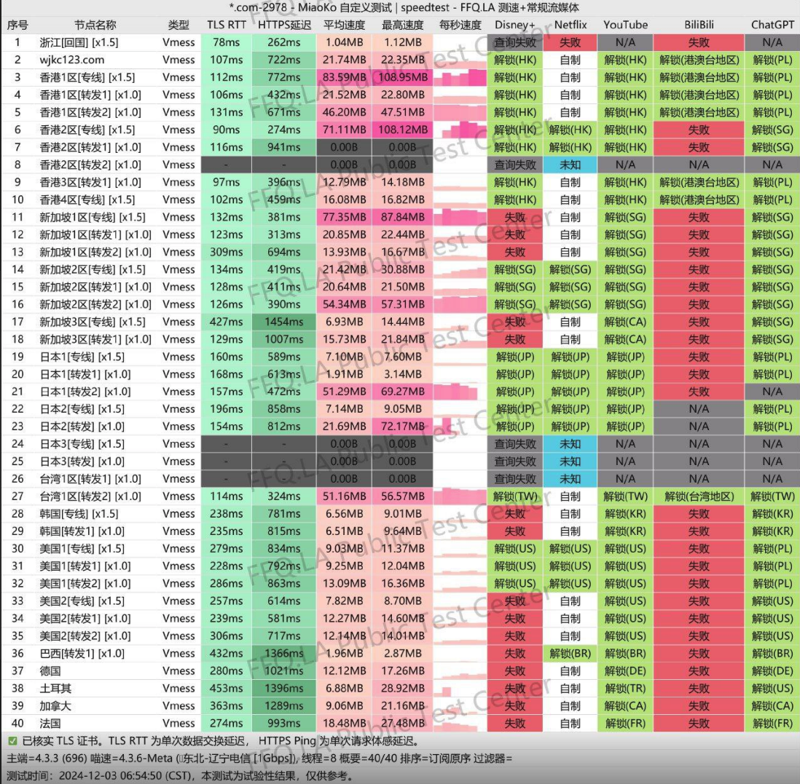

[网际快车](https://快车.com?c=SRNIQJ ) 是一家以**住宅 IP 节点、流量永久不过期、不限制设备数量**为主要特点的机场服务商。  
相比传统按月清零流量的机场模式，这类永久流量机场更适合作为**长期备用机场、AI工具访问线路以及多设备共享使用**。
- 入门价格低：6.8 元即可购买 20GB 永久流量   
- 流量长期有效：没有月底清零的问题   
- 不限制同时在线设备数量    
- 使用住宅 IP 节点，AI 工具解锁能力较强  
- 支持 YouTube、Netflix 等流媒体播放   
- 更适合作为长期备用机场或 AI 专用线路   

官网入口： [wjkc.click](https://快车.com?c=SRNIQJ )   

<!-- more -->
---

# 目录
- 网际快车简介
- 官网入口与注册流程
- 套餐价格与购买建议
- 测速与稳定性表现
- 核心优势分析
- 常见问题 FAQ
- 适合人群总结

---

## 网际快车简介

网际快车的定位并不是追求极限速度的跑分型机场，而是更偏向**稳定连接、长期持有成本低以及住宅IP解锁能力**。

传统机场大多采用月付流量清零模式，而网际快车提供**流量永久有效**的套餐结构，这种模式非常适合不希望每个月都续费或者流量经常用不完的用户。

对于轻度用户、备用机场用户以及 AI 工具用户来说，这种流量模式会更加划算。

---

## 基础参数信息

## 📲网际快车机场官网地址：[wjkc.click](https://快车.com?c=SRNIQJ )

## 👉[新用户5G一天试用福利领取](https://快车.com?c=SRNIQJ )

## 👉[新用户体验券：vpnnew](https://快车.com?c=SRNIQJ )

## 💻服务核心信息

| 项目 | 详细信息 |
| :--- | :--- |
| **🌐 官方网站** | [wjkc.click](https://快车.com?c=SRNIQJ ) |
| **💰 入门价格** | 6.80元/20G（永久） |
| **💳 充值方式** | 支付宝、微信支付、USDT |
| **🌍 服务器分布** | 40+ 国家和地区 |
| **🔗 协议支持** | 万能订阅、四端专用VPN、40+国家、稳定不断流、解锁所有AI、永久流量、不限设备数等  |

---

# 📚套餐详情（全部不限设备数量）
### 1. 按量周期付费（每日60GB）
| 🧮套餐等级 | 📛套餐名称 | 📑适用人群 | 🔁可选周期 | 💰月费 | 📶流量 | 🛍️购买链接 |
|---------|----------|----------|----------|------|------|----------| 
| 进阶版 | 包月套餐 | 轻度至中度日常使用 | 月付 | ¥24.00/每月 |1800GB/月 |[购买链接](https://快车.com?c=SRNIQJ ) |
| 专业版 | 包季套餐 |	中度用户、高清视频 | 季付 | ¥58.00/每月 |5400GB/季 |[购买链接](https://快车.com?c=SRNIQJ ) |
| 尊享版 | 包年套餐 | 重度用户 | 年付 | ¥186.00/每月 |21900GB/年 | [购买链接](https://快车.com?c=SRNIQJ ) |
---
### 2. 按量付费流量包（永久使用不过期）

此模式适合使用频率不固定或需求波动的用户，流量包在有效期内无时间限制。

| 🧮套餐等级 | 📛套餐名称 | 📑适用人群 | 🔁可选周期 | 💰费用 | 📶流量 | 🛍️购买链接 |
|---------|----------|----------|----------|------|------|----------| 
| 体验版 | 试用套餐-不限时间 | 尝鲜体验 | 一次性 | ¥6.80元 |20GB |[购买链接](https://快车.com?c=SRNIQJ ) |
| 入门版 | 标准套餐-不限时间  |	轻度用户 | 一次性 | ¥16.00元 |100GB |[购买链接](https://快车.com?c=SRNIQJ ) |
| 进阶版 | 优选套餐-不限时间 | 灵活使用 | 一次性 | ¥29.00元 |200GB | [购买链接](https://快车.com?c=SRNIQJ ) |
| 专业版 | 高级套餐-不限时间 | 备用线路 | 一次性 | ¥49.00元 |380GB |[购买链接](https://快车.com?c=SRNIQJ ) |
| 尊享版 | 大神套餐-不限时间  |	长期灵活使用 | 一次性 | ¥188.00元 |1000GB |[购买链接](https://快车.com?c=SRNIQJ ) |
| 终极版 | 至尊套餐-不限时间 | 高消耗场景 | 一次性 | ¥198.00元 |1980GB | [购买链接](https://快车.com?c=SRNIQJ ) |
---
# 官网入口与注册购买流程

官网注册地址：  
[wjkc.click](https://快车.com?c=SRNIQJ )

## 注册与购买步骤

整体流程比较简单，新手用户也可以快速完成：

1. 打开官网并注册账号
2. 登录用户后台进入商店页面
3. 选择不限时流量套餐或周期套餐
4. 完成支付
5. 在后台复制订阅链接导入 Clash、Shadowrocket 等客户端
6. 或下载官方提供的客户端直接使用

整个流程通常几分钟即可完成。

---

# 套餐价格与购买建议

网际快车的套餐主要分为两种模式：

1. 永久流量套餐（不限时流量）
2. 周期套餐（月付/季付/ 年付大流量）

## 套餐价格表

| 套餐名称 | 价格 | 流量 | 适合人群 |
|---------|------|------|---------|
| 入门流量包 | ¥6.8 | 20GB 不限时 | 测试节点、轻度备用 |
| 优选套餐 | ¥29 | 200GB 不限时 | 长期备用、轻度使用 |
| 至尊套餐 | ¥198 | 1980GB 不限时 | 多设备家庭用户 |
| 包月套餐 | ¥24 | 每日60GB | 流媒体与AI重度用户 |
| 包年套餐 | ¥186 | 每日60GB | 长期高频用户 |

---

## 套餐选择建议

不同使用需求建议选择不同套餐：

- 新用户建议先购买 6.8 元套餐测试本地连接速度
- 轻度用户推荐 29 元 200GB 套餐，性价比较高
- 多设备家庭或共享用户可以选择大流量套餐
- 流媒体或 AI 重度用户更适合包月套餐

总体来说，这个机场更适合**备用机场或长期持有流量用户**。

---

# 测速与稳定性表现

## 实际使用体验总结

从线路结构和实际体验来看，网际快车的重点在于**稳定连接与解锁能力**，而不是极限速度跑分。

测试体验总结如下：

- 普通网页访问速度较快
- YouTube 可流畅播放 4K 视频
- Netflix 多数节点可以解锁
- ChatGPT、Claude 等 AI 服务访问稳定
- 晚高峰时段整体较稳定
- 常用节点包括美国、日本、香港、新加坡

整体表现属于**稳定型机场，而非速度跑分型机场**。

---

# 核心优势分析

## 住宅 IP 节点解锁能力

住宅 IP 相比机房 IP 更不容易被平台封锁，因此在以下场景更有优势：

- Netflix 解锁
- YouTube Premium
- ChatGPT
- Claude
- Gemini
- 跨境业务平台
- 电商平台账号

住宅 IP 在账号安全性和风控通过率方面通常更高。

---

## 流量永久不过期模式

传统机场普遍存在的问题是流量按月清零，如果没有用完就会浪费。

网际快车的永久流量模式优势在于：

- 流量不会过期
- 不需要每个月续费
- 可以长期囤流量
- 适合作为备用机场
- 长期使用成本更低

这种模式对于不每天翻墙的用户会更加划算。

---

## 不限制设备数量

很多机场限制同时在线设备数量，而网际快车官方说明为不限设备数量。

适合以下用户：

- 一人多设备用户
- 家庭共享用户
- 路由器共享网络
- 手机 + 平板 + 电脑同时使用

对于设备较多的用户来说会更加方便。

---

## 新手使用门槛低

网际快车提供官方客户端，支持多个系统平台：

- Windows
- Mac
- Android
- iOS

新手用户无需复杂配置即可直接使用。

---

# 常见问题 FAQ

## 网际快车最便宜套餐多少钱？

目前最便宜套餐为 6.8 元，可购买 20GB 永久流量，适合测试或备用使用。

---

## 网际快车支持多少设备同时在线？

官方说明为不限设备数量，一个账号可以在多台设备同时使用。

---

## 永久流量机场有什么优势？

永久流量的最大优势是流量不会清零，不需要每月续费，更适合不频繁使用的用户，长期使用成本更低。

---

## 网际快车适合访问 ChatGPT 吗？

由于使用住宅 IP 节点，对 ChatGPT、Claude、Gemini 等 AI 服务访问稳定性较好，适合用于 AI 工具访问。

---

# 网际快车适合哪些用户？

根据套餐结构和线路特点，比较适合以下人群：

- 需要访问 ChatGPT 或 AI 工具的用户
- 想找住宅 IP 机场的用户
- 想要长期备用机场的用户
- 多设备用户或家庭用户
- 不想月付流量清零的用户
- 流媒体观看用户
- 想低成本科学上网的用户

---

# 总体评测总结

综合价格、套餐结构、线路类型以及使用体验来看，网际快车更偏向以下定位：

**长期备用机场 + 住宅IP解锁机场 + 多设备共享机场**

如果你的需求包括：

- 想找便宜机场
- 想要永久流量
- 想要住宅 IP 节点
- 想稳定访问 ChatGPT
- 想找备用机场

那么网际快车属于性价比比较高的一类机场服务。

## 👉网际快车机场官网入口：[wjkc.click](https://快车.com?c=SRNIQJ )

## 👉[新用户5G一天试用福利领取](https://快车.com?c=SRNIQJ )

## 👉[新用户体验券：vpnnew](https://快车.com?c=SRNIQJ )
---
## 📢机场推荐汇总： 👉[2026年翻墙机场推荐评测 稳定便宜VPN机场排行榜（高性价比科学上网工具长期更新）]( /vpn-recommend/ )  

## 📌 延伸阅读

👉iOS手机：[Shadowrocket （小火箭）2026年使用指南：iOS/macOS全平台配置教程(含非国区ID)](/article/Shadowrocket/ )

👉Android手机：[Clash for Android 2026年使用指南：终极配置指南教程](/article/ClashforAndroid/ )

👉Windows/Linux/Mac：[2026年 Clash Verge （Windows/Linux/Mac）全平台配置指南](/article/ClashVerge/ )

👉每天免费更新Apple ID：[2026年 最新最全免费共享美区 Apple ID |Shadowrocket/小火箭下载|每日更新](/article/freeAppleID/ )  

---

>📝 免责声明：本文仅供信息参考，建议均为个人经验与观点，不构成法律意见。实际情况以最新政策和主管部门解释为准，请在合法合规框架内使用相关服务。任何违法使用行为与本站无关。