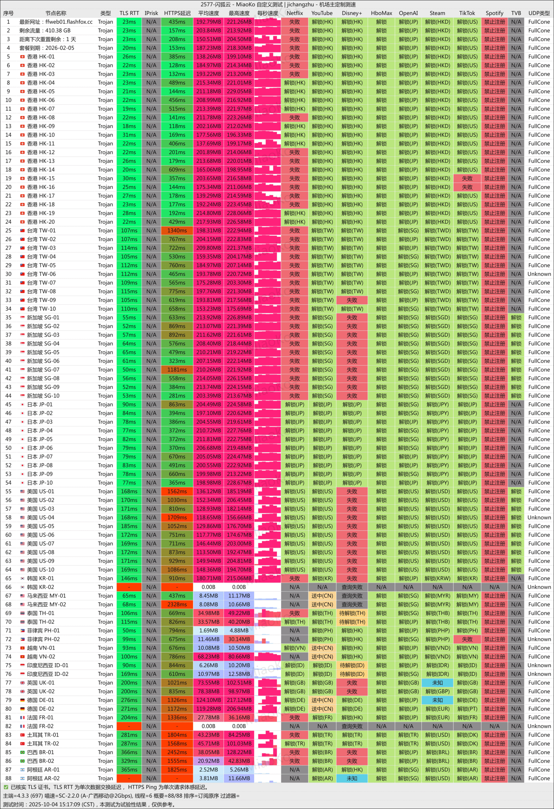
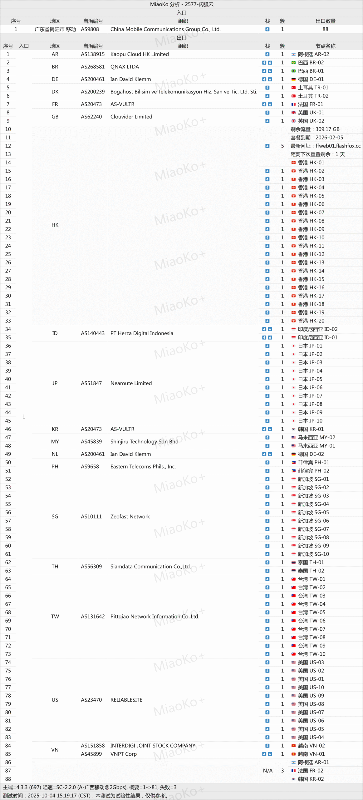

[闪狐云](https://inv03.ffaff.cc/register?aff=3fjoDec3 )是一家新兴的跨境网络服务商，主打==动态优化线路与高性价比==。通过整合优质资源，为用户提供==稳定、高速、安全==的全球网络接入体验。

📲闪狐云机场官网地址：[flashfox.cc](https://inv03.ffaff.cc/register?aff=3fjoDec3 )
<!-- more -->

## 🔔服务概览与技术架构

## 📲闪狐云机场官网地址：[flashfox.cc](https://inv03.ffaff.cc/register?aff=3fjoDec3 )

## 👉[新用户福利领取](https://inv03.ffaff.cc/register?aff=3fjoDec3 )

## 💻服务核心信息

| 项目 | 详细信息 |
| :--- | :--- |
| **🌐 官方网站** | [flashfox.cc](https://inv03.ffaff.cc/register?aff=3fjoDec3 ) |
| **💰 入门价格** | 20元/120G每月 |
| **💳 充值方式** | 支付宝 |
| **🌍 服务器分布** | 5大运营商动态优化 |
| **🔗 协议支持** |  BGP隧道中转，IPLC高速内网纯专线出口、trojan协议，轻量、高速、加密、无设备和ip限制、 解锁全球流媒体、AI工具等  |
---
# 📚套餐详情

| 🧮套餐等级 | 📛套餐名称 | 📑适用人群 | 🔁可选周期 | 💰月费 | 📶流量 | 🛍️购买链接 |
|---------|----------|----------|----------|------|------|----------| 
| 进阶版 | Basic Plan | 轻度至中度日常使用 | 月付、季付、半年、年付、两年付、三年付 | ¥20.00/每月 |120GB/月 |[购买链接](https://inv03.ffaff.cc/register?aff=3fjoDec3 ) |
| 专业版 | Standard Plan |	中度用户、高清视频 | 月付、季付、半年、年付、两年付、三年付 | ¥40.00/每月 |240GB/月 |[购买链接](https://inv03.ffaff.cc/register?aff=3fjoDec3 ) |
| 尊享版 | Advanced Plan | 重度用户 | 月付、季付、半年、年付、两年付、三年付 | ¥72.00/每月 |500GB/月 | [购买链接](https://inv03.ffaff.cc/register?aff=3fjoDec3 ) |
| 至尊版 | Premium Plan | 超重度用户 | 月付、季付、半年、年付、两年付、三年付 | ¥125.00/每月 |1000GB/月 | [购买链接](https://inv03.ffaff.cc/register?aff=3fjoDec3 ) |

## 📊 核心亮点

### 🔔闪狐云机场测试

| 特性 | 具体说明 |
| :--- | :--- |
| **🚄 动态智能线路** | 融合五大运营商BGP入口与IPLC专线，根据网络状况实时智能切换，保障路径最优。 |
| **🔒 高级安全防护** | 采用TLS协议加密传输，有效保护数据隐私与通信安全，抵御中间人攻击。 |
| **⚡ 超宽带宽保障** | 提供1000Mbps高速带宽，晚高峰不降速，支持4K/8K流媒体无缓冲播放。 |
| **🌍 全球节点覆盖** | 部署多地区出口节点，优化国际访问与本地化体验，解锁全球内容。 |
| **📱 无限制策略** | 不限制同时在线设备数量，不限制IP更换，支持多场景无缝切换使用。 |
| **🎯 定制化服务** | 支持企业及个人用户定制专属线路与客户端方案，满足特定业务需求。 |

## 💡 适合人群
- **追求性价比的新用户**：希望以合理价格体验优质线路。
- **流媒体与游戏玩家**：需要高速稳定连接观看高清视频或进行国际服游戏。
- **远程办公与跨境业务者**：对网络稳定性与安全性有较高要求的用户。
- **多设备用户**：需要在手机、电脑、平板等多台设备上同时使用的家庭或个人。

## 🛠️ 使用与服务
- **连接协议**：支持主流的代理协议，兼容Clash、V2rayN等常用客户端。
- **客服支持**：提供专业人工客服，响应迅速，解决问题高效。
- **入门难度**：提供详细教程与一键导入配置，新手也能快速上手。

## ⚠️ 注意事项
- 作为新兴机场，长期稳定性有待更多用户验证。
- 建议先使用月付套餐或试用服务体验线路质量。
- 特殊时期（如重大会议期间）的网络表现请以实际体验为准。

---

## 👉新用户首次订购可使用邀请码  **3fjoDec3**
## [👉新用户福利领取](https://inv03.ffaff.cc/register?aff=3fjoDec3 )

## 📢机场推荐汇总： 👉[2026年翻墙机场推荐评测 稳定便宜VPN机场排行榜（高性价比科学上网工具长期更新）]( https://vpnnew.net/article/VPN/ )  

## 📌 延伸阅读

👉iOS手机：[Shadowrocket （小火箭）2026年使用指南：iOS/macOS全平台配置教程(含非国区ID)](https://vpnnew.net/article/Shadowrocket/ )

👉Android手机：[Clash for Android 2026年使用指南：终极配置指南教程](https://vpnnew.net/article/ClashforAndroid/ )

👉Windows/Linux/Mac：[2026年 Clash Verge （Windows/Linux/Mac）全平台配置指南](https://vpnnew.net/article/ClashVerge/ )

👉每天免费更新Apple ID：[2026年 最新最全免费共享美区 Apple ID |Shadowrocket/小火箭下载|每日更新]( https://vpnnew.net/article/freeAppleID/ )  

---

>📝 免责声明：本文仅供信息参考，建议均为个人经验与观点，不构成法律意见。实际情况以最新政策和主管部门解释为准，请在合法合规框架内使用相关服务。任何违法使用行为与本站无关。