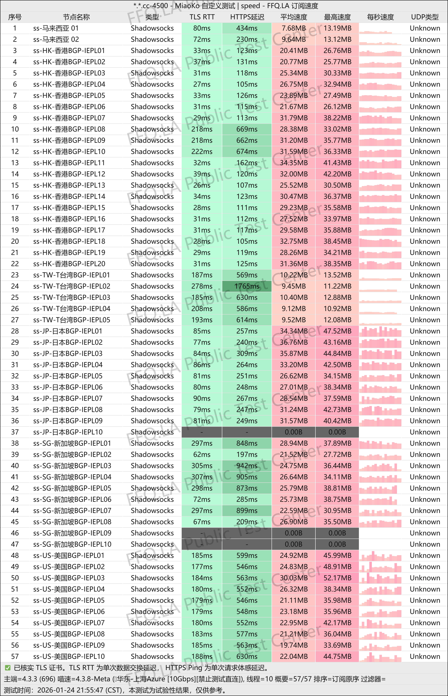

[飞猫云](https://vip02.flyingcat.work/#/?code=NxRd5uLn )是一款主打原生IPLC专线与全平台解锁能力的高性价比机场服务。它以亲民的价格，为用户提供具备企业级专线品质、广泛内容解锁覆盖的高速网络解决方案。

📲飞猫云机场官网地址：[http://figgcat.cc](https://vip02.flyingcat.work/#/?code=NxRd5uLn )
<!-- more -->

## 🔔服务概览与技术架构

## 📲飞猫云机场官网地址：[http://figgcat.cc](https://vip02.flyingcat.work/#/?code=NxRd5uLn )

## 👉[新用户85折优惠码**KY85**](https://vip02.flyingcat.work/#/?code=NxRd5uLn )
## 💻服务核心信息

| 项目 | 详细信息 |
| :--- | :--- |
| **🌐 官方网站** | [http://figgcat.cc](https://vip02.flyingcat.work/#/?code=NxRd5uLn )
| **💰 入门价格** | 15.00元/100G每月 |
| **💳 充值方式** | 支付宝、微信支付 |
| **💳 新用户福利** | 85折优惠 【KY85】，年付 8 折、两年付 7 折、三年付 6 折 优惠长期有效 |
| **🌍 节点分布** | 香港 x20、台湾 x10、日本 x10、新加坡 x10、马来西亚、美国 x10、韩国 x2、越南 x1、菲律宾 x1、泰国 x1、印度 x1、德国 x1、法国 x1、英国 x1、阿根廷 x2等 |
| **🔗 协议支持** | 全 IPLC 专线，最大提供 2.5Gbps 速率，不限制同时使用客户端数量，原生 IP 线路，轻松解锁 Netflix、Disney+、ChatGPT、TikTok 等服务  |
---
# 📚套餐详情

| 🧮套餐等级 | 📛套餐名称 | 📑适用人群 | 🔁付费方式 | 💰月费 | 📶流量 | 性价比指数 |🛍️购买链接 |
|---------|----------|----------|----------|------|------|----------|----------|
| 入门级 | 飞猫 · 星耀版 | 轻度用户 | 月付、季付、半年付、年付、两年付、三年付 | ¥15.00/月 | 100GB/月 | ⭐⭐⭐⭐⭐ |[购买链接](https://vip02.flyingcat.work/#/?code=NxRd5uLn ) |
| 进阶级 | 飞猫 · 星环版 | 日常使用 | 月付、季付、半年付、年付、两年付、三年付 | ¥30.00/月 | 200GB/月 | ⭐⭐⭐ |[购买链接](https://vip02.flyingcat.work/#/?code=NxRd5uLn ) |
| 专业级 | 飞猫 · 银河版 | 重度用户 | 月付、季付、半年付、年付、两年付、三年付 | ¥55.00/月 | 550GB/月 | ⭐⭐⭐⭐⭐ |[购买链接](https://vip02.flyingcat.work/#/?code=NxRd5uLn ) |
| 尊享级 | 飞猫 · 宇宙版 | 老鸟用户 | 月付、季付、半年付、年付、两年付、三年付 | ¥100.00/月 | 1TB/月 | ⭐⭐⭐⭐ |[购买链接](https://vip02.flyingcat.work/#/?code=NxRd5uLn ) |
| 至尊级 | 飞猫 · 定制套餐 | 电商直播用户 | 月付 | ¥550.00/月 | 500GB/月 | ⭐⭐⭐⭐⭐ |[购买链接](https://vip02.flyingcat.work/#/?code=NxRd5uLn ) |
| 一次性 | 飞猫 · 不限时套餐| 重度灵活使用用户 | 一次性 | ¥680.00/月 | 1TB | ⭐⭐⭐⭐ |[购买链接](https://vip02.flyingcat.work/#/?code=NxRd5uLn ) |
---

## 📊 核心特性一览

| 特性维度 | 具体说明 |
| :--- | :--- |
| **💰 价格与配置** | **月付15元**，提供**每月100GB**流量，性价比突出。 |
| **🛣️ 网络架构** | **全IPLC专线网络**，提供稳定、低延迟、低丢包的连接质量。 |
| **⚡ 速率保障** | 提供最高 **2.5Gbps** 的稳定带宽，满足高速下载与超高画质流媒体需求。 |
| **🏠 IP资源** | **原生IP线路**，纯净度高，有效规避流媒体平台与AI服务的IP封锁与限制。 |
| **🔓 解锁能力** | 轻松解锁 **Netflix、Disney+、ChatGPT、TikTok** 等主流娱乐与生产力平台。 |
| **📱 设备策略** | **不限制设备连接数量**，支持手机、电脑、平板等多终端同时在线使用。 |

## 👥 目标用户群体
- **流媒体深度用户**：需要稳定观看Netflix、Disney+等平台高清/4K内容，且不愿被IP限制困扰的用户。
- **跨境内容创作者/电商**：依赖TikTok、ChatGPT等平台进行内容创作、直播或运营的从业者。
- **多设备家庭或小型团队**：需要在多个设备上共享同一网络加速服务的用户。
- **追求速度与稳定兼顾的用户**：希望以合理价格获得专线级稳定性和高带宽体验的实用主义者。
- **新手入门尝试**：较低的单月门槛，适合作为体验原生IP专线服务的第一站。

## ⚠️ 使用评估与建议
1. **流量规划**：100GB月度流量适合中度偏重度的流媒体用户，但若频繁观看4K HDR内容或进行大体积文件传输，需注意用量。
2. **核心优势**：本服务的核心竞争力在于 **“原生IP专线”** 与 **“全平台解锁”** 的结合，在同等价位中提供了稀缺的IP资源。
3. **适用性**：对于主要需求为“解锁”和“稳定”的用户，此套餐具有很强吸引力。对于追求极致速度或超大流量的极端用户，则需关注更高阶套餐。
4. **购买建议**：建议先选择月付套餐，重点测试在您常用时间段内，对Netflix、ChatGPT等目标服务的实际解锁效果与连接速度。

> **总结**：飞猫云精准地整合了 **“原生IP”、“IPLC专线”、“全功能解锁”** 和 **“无设备限制”** 等关键卖点，并以极具竞争力的价格打包提供。它是一款非常适合**有明确流媒体或AI工具访问需求，且重视网络稳定性与IP质量**的用户选择的“水桶型”性价比产品。作为主力或专项用途机场，都值得纳入优先考虑范围。

## [👉新用户85折福利领取](https://vip02.flyingcat.work/#/?code=NxRd5uLn)
## 👉新用户首次订购可使用优惠码  **KY85**
---
## 📢机场推荐汇总： 👉[2026年翻墙机场推荐评测 稳定便宜VPN机场排行榜（高性价比科学上网工具长期更新）]( https://vpnnew.net/article/VPN/ )  

## 📌 延伸阅读

👉iOS手机：[Shadowrocket （小火箭）2026年使用指南：iOS/macOS全平台配置教程(含非国区ID)](https://vpnnew.net/article/Shadowrocket/ )

👉Android手机：[Clash for Android 2026年使用指南：终极配置指南教程](https://vpnnew.net/article/ClashforAndroid/ )

👉Windows/Linux/Mac：[2026年 Clash Verge （Windows/Linux/Mac）全平台配置指南](https://vpnnew.net/article/ClashVerge/ )

👉每天免费更新Apple ID：[2026年 最新最全免费共享美区 Apple ID |Shadowrocket/小火箭下载|每日更新]( https://vpnnew.net/article/freeAppleID/ )  

---

>📝 免责声明：本文仅供信息参考，建议均为个人经验与观点，不构成法律意见。实际情况以最新政策和主管部门解释为准，请在合法合规框架内使用相关服务。任何违法使用行为与本站无关。