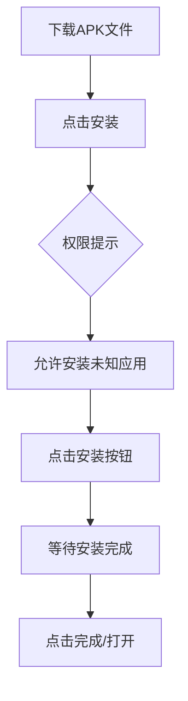
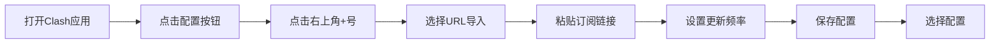
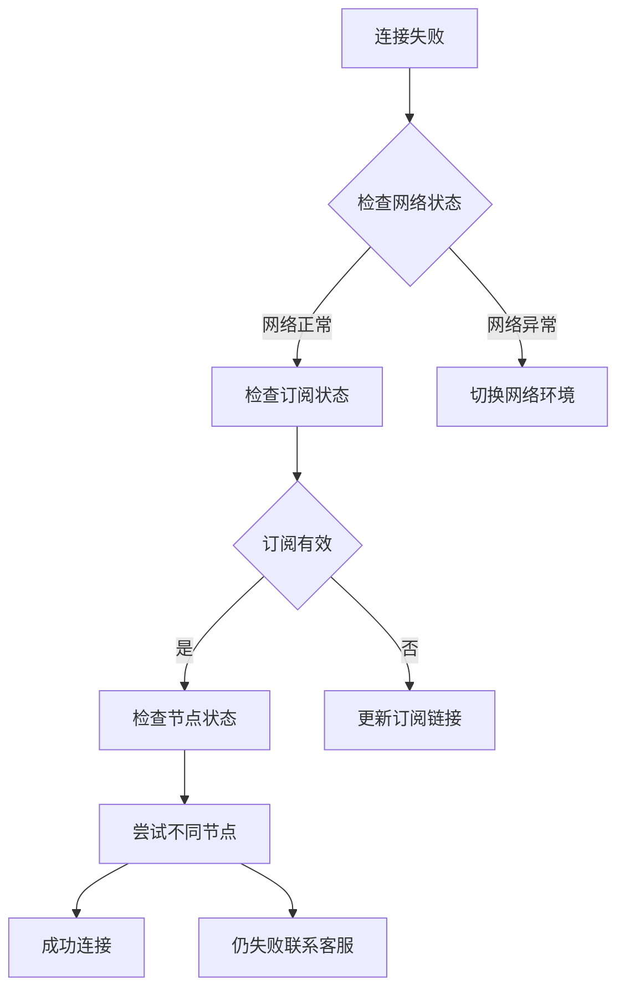

 本文将带你全面了解Clash for Android下载安装，保姆级教学，全平台配置教程，小白快速上手。
<!-- more -->
---


## 📋 目录
- 一、应用概述与版本选择
- 二、下载安装全流程
- 三、配置订阅详细步骤
- 四、启动使用与验证
- 五、高级设置与优化
- 六、故障排除指南
- 七、安全注意事项

---

## 📍一、应用概述与版本选择 

### 📊Clash for Android 版本对比

| 版本类型 | 推荐指数 | 主要特点 | 适用人群 |网址|
|---------|---------|---------|---------|---------|
| **Clash Meta For Android** | ⭐⭐⭐⭐⭐ | 功能最全，持续更新，支持最新协议 | 所有用户，特别是技术爱好者 |[https://down.shudongapi.monster/client-download/cmfa.apk](https://down.shudongapi.monster/client-download/cmfa.apk)|
| **Clash For Android (原版)** | ⭐⭐⭐⭐ | 稳定可靠，社区支持良好 | 追求稳定性的普通用户 |[https://down.shudongapi.monster/client-download/clash.apk](https://down.shudongapi.monster/client-download/clash.apk)|
| **github下载** | ⭐⭐⭐ | 可能添加额外功能 | 特殊需求用户 |[https://github.com/cfwtf/clash_for_android/releases](https://github.com/cfwtf/clash_for_android/releases)|

### 📈2026年版本推荐
- **首选**：Clash Meta For Android（CFA-Meta）
- **备用**：Clash For Android（原版）
- **避免**：来源不明的第三方修改版本

---

###  📢机场推荐汇总： 👉[2026年翻墙机场推荐评测 稳定便宜VPN机场排行榜（高性价比科学上网工具长期更新）](/vpn-recommend/)  

## 📍二、下载安装全流程 

### 💼安装前准备
```markdown
⚠️ 重要提醒：
1. 确保Android系统版本 ≥ 8.0
2. 允许"未知来源应用"安装
3. 建议关闭安全软件的安装拦截
4. 准备至少100MB可用存储空间
```

### 📉下载渠道对比

| 下载来源 | 安全性 | 更新速度 | 推荐度 |
|---------|-------|---------|-------|
| **官方GitHub** | ⭐⭐⭐⭐⭐ | 及时 | ⭐⭐⭐⭐ |
| **镜像站点** | ⭐⭐⭐⭐ | 及时 | ⭐⭐⭐⭐ |
| **应用商店** | ⭐⭐⭐⭐⭐ | 可能延迟 | ⭐⭐⭐ |

### 📂安装步骤详解

#### 🔓步骤1：获取安装包
**推荐下载链接**：
- Clash Meta For Android：`https://down.shudongapi.monster/client-download/cmfa.apk`
- 备用下载地址：`https://down.shudongapi.monster/client-download/clash.apk`


#### 🔓步骤2：安装应用

::: tabs
@tab 图表

 

@tab 代码



:::


#### 🔓步骤3：首次运行配置
1. **打开Clash应用**
2. **授予VPN权限**（必须允许）
3. **同意用户协议**
4. **跳过或完成初始引导**

---

## 📍三、配置订阅详细步骤 

### 📑配置流程图

::: tabs
@tab 图表

 

@tab 代码


:::

### 📒详细操作指南

#### 📄步骤1：进入配置界面


1. 打开Clash for Android应用
2. 点击底部导航栏的"配置"按钮
3. 界面显示现有配置文件列表

#### 📄步骤2：添加新配置


1. 点击右上角的"+"按钮
2. 在弹出的菜单中选择添加方式
3. **推荐选择"URL"导入方式**


#### 📄步骤3：URL配置设置


```yaml
配置参数说明：
- URL: 订阅链接地址（从服务商获取）
- 名称: 自定义配置名称（如"我的机场"）
- 自动更新: 建议开启
- 更新间隔: 推荐60分钟
- 代理模式: 建议选择"规则"
```

###  📢机场推荐汇总： 👉[2026年翻墙机场推荐评测 稳定便宜VPN机场排行榜（高性价比科学上网工具长期更新）](/vpn-recommend/)  

1. 在URL字段粘贴订阅链接
2. 填写自定义配置名称
3. 设置自动更新频率（推荐每天）
4. 点击"确定"保存设置

#### 📄步骤4：保存并启用配置


1. 配置保存后返回配置列表
2. 点击刚添加的配置文件
3. 系统会自动下载并解析节点信息


---

## 📍四、启动使用与验证 


### 🔌连接操作步骤


**详细流程**：
1. **返回主界面**：点击底部"主页"按钮
2. **选择代理模式**（建议使用"规则"模式）
3. **点击圆形开关按钮**启动代理
4. **授权VPN连接**（系统会弹出授权请求）
5. **等待连接成功**（状态显示已连接）

### 🪫连接状态验证
| 验证方法 | 操作步骤 | 成功标志 |
|---------|---------|---------|
| **内置测试** | 点击节点右侧测速 | 显示延迟和速度 |
| **浏览器访问** | 访问google.com | 正常打开页面 |
| **专业测速** | 使用speedtest.net | 显示代理IP地址 |
| **流媒体测试** | 访问netflix.com | 显示非中国大陆内容 |

### 🧮状态图标说明
```markdown
🔴 红色：未连接
🟡 黄色：连接中
🟢 绿色：已连接
⚪ 灰色：配置未加载
```

---

## 📍五、高级设置与优化 

### 🎞️代理模式详解
| 模式名称 | 适用场景 | 配置建议 |
|---------|---------|---------|
| **规则模式** | 日常使用 | 智能分流，国内外自动判断 |
| **全局模式** | 全部代理 | 所有流量都走代理 |
| **直连模式** | 临时关闭 | 所有流量都不走代理 |
| **脚本模式** | 高级用户 | 自定义分流规则 |

### 🎬节点选择策略

**选择标准**：
1. **延迟优先**：选择延迟最低的节点
2. **负载均衡**：选择用户数较少的节点
3. **用途匹配**：
   - 视频：选择大带宽节点
   - 游戏：选择低延迟稳定节点
   - 下载：选择不限速节点

### 📺性能优化设置
```yaml
# 推荐配置参数
代理设置：
  - 日志级别: info（日常使用）
  - 允许局域网: 关闭（安全考虑）
  - IPv6支持: 根据网络情况开启
  - DNS设置: 使用国内公共DNS

网络优化：
  - TCP快速打开: 开启
  - UDP转发: 根据需求开启
  - MTU值: 默认或根据网络调整
```

---

## 📍六、故障排除指南 

### 💡常见问题与解决方案

| 问题现象 | 可能原因 | 解决方案 |
|---------|---------|---------|
| **无法连接** | 订阅失效/网络问题 | 1.更新订阅 2.切换网络 3.重启应用 |
| **速度缓慢** | 节点拥堵/线路问题 | 1.切换节点 2.更换协议 3.测速选择 |
| **频繁断开** | 网络不稳定 | 1.检查网络 2.设置重连 3.更换节点 |
| **配置加载失败** | 订阅格式错误 | 1.检查URL 2.联系服务商 3.手动配置 |
| **VPN权限被拒绝** | 系统限制 | 1.重启手机 2.清除VPN配置 3.重新安装 |

### 🔎连接测试流程

::: tabs
@tab 图表

 

@tab 代码


:::

### 🔍日志查看方法
1. 进入设置 → 日志
2. 查看错误信息
3. 根据错误代码搜索解决方案

---

## 📍七、安全注意事项 

### 📕安全使用准则
```markdown
🔒 账户安全：
1. 不要分享订阅链接
2. 定期更换密码
3. 使用可靠的支付方式

🛡️ 隐私保护：
1. 选择零日志服务商
2. 关闭不必要的权限
3. 定期清理日志

📱 设备安全：
1. 保持系统更新
2. 安装安全软件
3. 避免使用公共Wi-Fi
```

### 📖更新维护建议
| 维护项目 | 频率 | 操作内容 |
|---------|------|---------|
| **应用更新** | 每月 | 检查GitHub版本更新 |
| **订阅更新** | 自动 | 设置每日自动更新 |
| **节点测试** | 每周 | 测速选择最优节点 |
| **配置备份** | 每月 | 导出配置文件备份 |
| **日志清理** | 每周 | 清理应用日志文件 |

### 📓备份与恢复
1. **配置备份**：设置 → 备份与恢复 → 导出配置
2. **云端备份**：保存至私人云存储
3. **本地备份**：导出到设备存储

---

## 📱 应用信息汇总

| 项目 | 详细信息 |
|------|---------|
| **应用名称** | Clash Meta for Android |
| **最新版本** | v2.5.12（2026年1月） |
| **系统要求** | Android 8.0+ |
| **文件大小** | 约25MB |
| **开源状态** | 完全开源 |
| **开发者** | MetaCubeX |
| **支持协议** | VMess、VLESS、Trojan、Shadowsocks等 |

---

## ✅ 最终检查清单

### 🔒安装完成确认
- [ ] Clash应用已成功安装
- [ ] VPN权限已授予
- [ ] 订阅配置已添加
- [ ] 节点列表已加载
- [ ] 代理连接成功
- [ ] 网络访问正常

### 🔐优化建议完成
- [ ] 代理模式设置为"规则"
- [ ] 自动更新已开启
- [ ] 节点测速已完成
- [ ] 配置文件已备份
- [ ] 安全设置已检查

---

## 📢机场推荐汇总： 👉[2026年翻墙机场推荐评测 稳定便宜VPN机场排行榜（高性价比科学上网工具长期更新）](/vpn-recommend/)  
## 📌 延伸阅读

👉iOS手机：[Shadowrocket （小火箭）2026年使用指南：iOS/macOS全平台配置教程(含非国区ID)](/article/Shadowrocket/)

👉Android手机：[Clash for Android 2026年使用指南：终极配置指南教程](/article/ClashforAndroid/)

👉Windows/Linux/Mac：[2026年 Clash Verge （Windows/Linux/Mac）全平台配置指南](/article/ClashVerge/)

👉每天免费更新Apple ID：[2026年 最新最全免费共享美区 Apple ID |Shadowrocket/小火箭下载|每日更新](/article/freeAppleID/)  

---

>评测数据基于实际测试结果，服务表现可能因网络环境而异。建议你根据自身需求进行实际测试验证。

>📝 免责声明：本文仅供信息参考，建议均为个人经验与观点，不构成法律意见。实际情况以最新政策和主管部门解释为准，请在合法合规框架内使用相关服务。任何违法使用行为与本站无关。