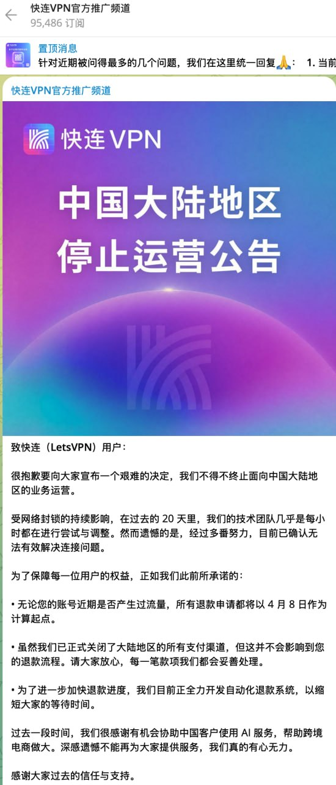
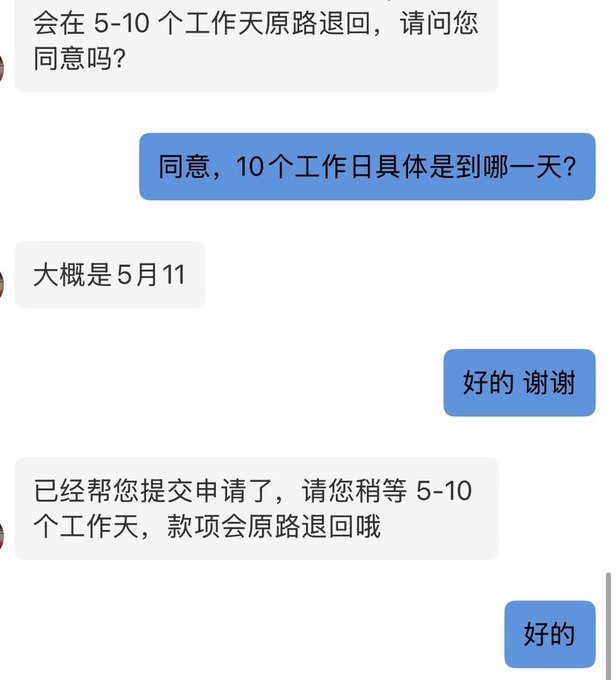
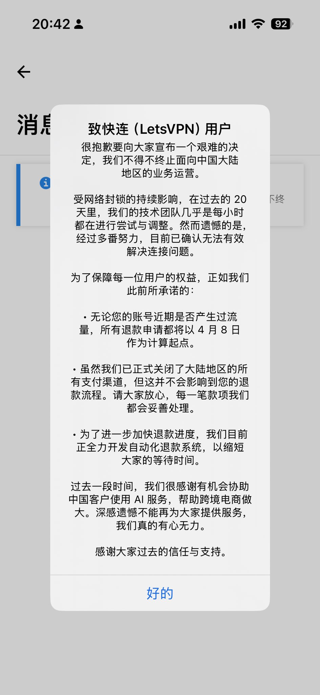
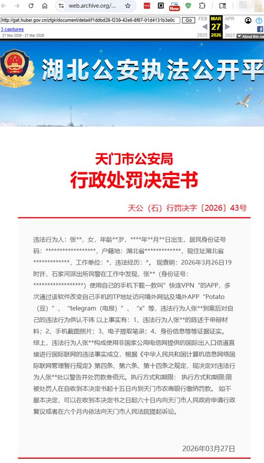

🚨 突发：LetsVPN退出中国，普通VPN时代正式终结？

2026年，一条消息迅速在用户圈层中扩散：

> **快连（LetsVPN）宣布退出中国大陆市场。**

对于普通用户来说，这不仅仅是一个VPN产品的下线，而更像是一个信号：

👉 **“一键连接”的VPN时代，可能真的结束了。**

<!-- more -->

---

## 📉 一、LetsVPN退出意味着什么？

很多人第一反应是：  
“换一个VPN不就行了？”

但现实远比这复杂。

### 1️⃣ 这不是个例，而是趋势信号

LetsVPN并不是小众工具，它属于：

- 用户量大  
- 技术成熟  
- 专门优化中国网络环境  

👉 **连这种级别的产品都无法维持服务，说明问题已经不是“优化问题”，而是“环境变化”。**

---

### 2️⃣ 技术层面的根本变化

过去几年，VPN还能通过：

- 更换IP  
- 混淆协议  
- 节点轮换  

来规避封锁。

但2026年的变化在于：

👉 **识别能力升级 + 精准封锁**

表现为：

- TLS指纹识别增强  
- 流量特征识别更精准  
- 主动探测（Active Probing）频率提高  

结果就是：

> ❌ 不再是“慢”，而是**直接不可用**

---

## ⚠️ 二、你的VPN为什么会“突然归零”？

很多用户已经感受到：

- 昨天还能用  
- 今天直接连不上  

这背后其实有三个关键原因👇

---

### 1️⃣ IP池被整体封锁

传统VPN依赖固定服务器：

👉 一旦被识别  
👉 **整批IP直接失效**

---

### 2️⃣ 协议特征被识别

常见协议：

- OpenVPN  
- IPSec  
- WireGuard  

👉 都存在可识别特征  

一旦被标记：

> 🚫 即使换IP也没用

---

### 3️⃣ 用户规模导致“暴露”

一个残酷现实：

> **用户越多 → 越容易被重点打击**

LetsVPN正是典型案例。

---

## 💣 三、普通VPN时代正在终结

我们可以明确一个结论：

### ✔️ “傻瓜式VPN”正在淘汰

过去的模式：

- 下载APP  
- 点击连接  
- 完全无脑使用  

👉 这种模式正在失效。

---

### ❗ 未来趋势（非常关键）

#### 1️⃣ 技术门槛上升
用户需要理解：

- 节点  
- 协议  
- 订阅  

---

#### 2️⃣ 服务形态改变
从：

👉 VPN软件  

转向：

👉 节点 + 客户端（如Clash）

---

#### 3️⃣ 稳定性优先于品牌
未来不是看“谁最有名”，而是：

👉 **谁活得久**

---

## 💸 四、最大风险：不是不能用，而是“损失”

很多人忽略了一个更严重的问题👇

### ⚠️ VPN失效带来的真实损失

#### 1️⃣ 订阅费用打水漂
- 年付用户损失最大  
- 无法退款情况常见  

---

#### 2️⃣ 数据安全风险
一些低质量VPN：

- 记录日志  
- 数据泄露  

---

#### 3️⃣ 紧急失联风险
例如：

- 工作需要外网  
- AI工具访问中断  
- 海外业务无法处理  

👉 后果远比“上不了网”严重

---

## 🧠 五、2026还能用的方案（核心重点）

重点来了👇

---

### ✅ 方案一：Clash + 订阅节点（主流）

特点：

- 支持多协议  
- 节点可动态更新  
- 抗封锁能力强  

适合：

👉 大多数用户

---

### ✅ 方案二：优质机场（高性价比）

优势：

- 专业维护  
- 自动切换线路  
- 成本较低  

但注意：

⚠️ 避免低价劣质机场

---

### ✅ 方案三：自建节点（高阶）

适合：

- 技术用户  
- 对隐私要求高  

优点：

- 控制权在自己手里  

缺点：

- 成本高  
- 维护复杂  

---

## 🚨 六、如何避免成为“下一个受害者”

### ✔️ 1 不要长期付费
建议：

👉 最多月付 / 季付

---

### ✔️ 2 不依赖单一工具
至少准备：

- 主用方案  
- 备用方案  

---

### ✔️ 3 关注实时可用性
不要看广告：

👉 看真实用户反馈

---

### ✔️ 4 优先选择抗封锁技术
例如：

- Reality  
- Hysteria  
- Trojan  

---

## 📊 七、未来趋势判断

### 未来1-2年变化：

#### 🔺 VPN品牌会持续减少  
#### 🔺 技术型方案成为主流  
#### 🔺 用户分层明显  

---

### 核心结论：

> **翻墙不会消失，但会越来越“专业化”。**

---

## 🧩 八、总结

LetsVPN的退出，不是结束，而是开始。

它揭示了三个现实：

1️⃣ 普通VPN正在淘汰  
2️⃣ 网络环境正在升级  
3️⃣ 用户必须升级认知  

---

👉 如果你现在还在用：

- 低价VPN  
- 单一工具  
- 年付套餐  

那么：

> ⚠️ 风险已经非常高

---

## ❓ 常见问题 FAQ

### LetsVPN退出后还能恢复吗？
短期来看几乎不可能，属于环境性问题。

---

### VPN未来会全部失效吗？
不会，但会越来越难用，需要更高技术方案。

---

### 免费VPN还能用吗？
基本不建议，稳定性和安全性都无法保证。

---

### Clash是不是必须学？
如果你想长期稳定使用，基本是趋势。

---

### 有没有完全稳定的方案？
没有，但可以通过组合方案大幅提高稳定性。

---

## 🔚 最后一句提醒

> **不是VPN消失了，而是“低级玩法”消失了。**

如果你不升级认知：

👉 你的网络，随时可能“归零”。

## 🔥 延伸阅读

👉梯子翻墙机场推荐： [2026年翻墙机场推荐评测 稳定便宜VPN机场排行榜（高性价比科学上网工具长期更新）](/vpn-recommend/)  

👉iOS手机：[Shadowrocket （小火箭）2026年使用指南：iOS/macOS全平台配置教程(含非国区ID)](/article/Shadowrocket/)

👉Android手机：[Clash for Android 2026年使用指南：终极配置指南教程](/article/ClashforAndroid/)

👉Windows/Linux/Mac：[2026年 Clash Verge （Windows/Linux/Mac）全平台配置指南](/article/ClashVerge/)

👉每天免费更新Apple ID：[2026年 最新最全免费共享美区 Apple ID |Shadowrocket/小火箭下载|每日更新](/article/freeAppleID/)  

👉 Clash教程：[2026最新版Clash 全平台使用教程（Windows / Mac / Android / iOS）｜新手入门+配置详解](/scamvpn/Clashquanpingtai/)  

---

## 🔄 更新说明

📅 最后更新：2026年4月（定期更新）  

本文将持续更新**快连（LetsVPN）**问题答疑，建议收藏。

---

>📝 免责声明：本文仅供信息参考，建议均为个人经验与观点，不构成法律意见。实际情况以最新政策和主管部门解释为准，请在合法合规框架内使用相关服务。任何违法使用行为与本站无关。

