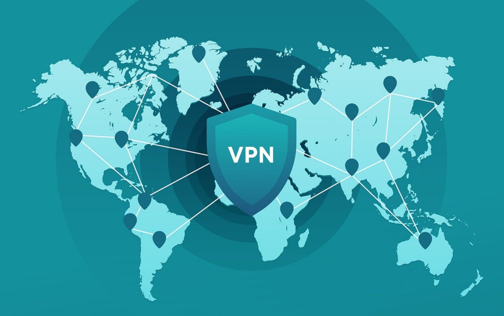
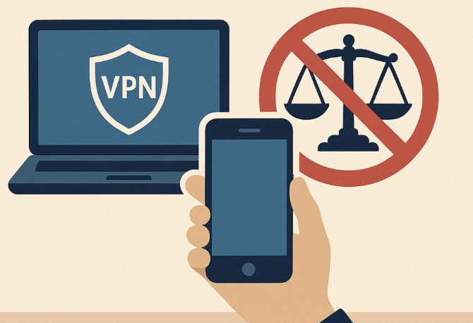

国内购买VPN违法吗？法律解析与合规建议

国内法规主要打击的是私自搭建和经营VPN，普通用户购买正规服务自用一般不会被认定为违法。本文将梳理中国购买VPN的法律边界，说明“搭建违法、购买通常不违法”的逻辑，并给出合规使用建议。
<!-- more -->
---

## ❓国内购买VPN是否违法？

在中国，法律重点规范的是私自搭建、出租或经营VPN（跨境专线）等行为。普通个人仅为自用而购买第三方VPN服务，通常不会被认定为违法。当然，若利用VPN从事违法活动，仍可能面临行政或刑事责任。

---

## ❗法律依据与监管重点

- **《计算机信息网络国际联网管理暂行规定（2024修订）》第六条**  
 >  计算机信息网络直接进行国际联网，必须使用国家公用电信网提供的国际出入口信道。任何单位和个人不得自行建立或者使用其他信道进行国际联网。

- **第十四条处罚规定**  
 >  违反本规定第六条、第八条和第十条的规定的，由公安机关责令停止联网，给予警告，可以并处 15000 元以下的罚款；有违法所得的，没收违法所得。

**监管现实：**

- 🚫 严查对象：私建VPN、转售账号、提供跨境通信业务的个人或企业。
- ✅ 普通购买者：法律未明文禁止，实际多以提醒为主，很少处罚单纯购买者。
- ⚠️ 违法加重：利用VPN实施诈骗、危害国家安全等，将依据刑法追责。

---

## 📊为什么说“搭建违法、购买不违法”？

| 情形                   | 法律定位           | 说明                                   |
|------------------------|--------------------|----------------------------------------|
| 私自搭建VPN、出售账号  | 行政违法/刑法      | 未经批准提供国际联网服务，处罚多集中于此 |
| 企业自建专线           | 行政违法           | 需向工信部门申请专线或VPN审批           |
| 个人购买第三方VPN自用  | 通常不认定违法     | 无经营行为，监管以劝导为主              |
| 利用VPN从事违法犯罪    | 触及刑法           | 依据具体行为定性，与VPN本身无直接关联    |

>**✔️总结：** 法规针对的是“信道建设与运营”。消费者购买服务不存在“自行建立”问题，原则上不违反相关条款。

---

## ✅行政风险与合规提醒

- **选择正规服务商**：优先选有备案、获批的跨境通信产品（如运营商国际精品网）。
- **避免倒卖账号**：转售或分享订阅，可能被认定为经营活动。
- **审慎使用**：即便购买合法服务，也需遵守网络安全、数据安全等法规。
- **留存凭证**：保存协议和付款记录，证明自用性质。

---

## 🤏常见问题速答

**🙋‍♂️：仅为访问外网资讯购买VPN会被处罚吗？**  
A：通常不会。监管重点在非法搭建和牟利经营，普通自用用户大概率只会收到提醒。

**🙋‍♂️：公司统一购买VPN给员工用违法吗？**  
A：企业批量购买需确保服务商有合法资质，否则建议申请合规专线。

**🙋‍♂️：为何有报道说有人因VPN被罚？**  
A：多数案例是“非法运营”“倒卖账号”或“搭建私服”，非单纯购买使用。

**🙋‍♂️：如何判断VPN服务合规？**  
A：看是否由基础电信运营商或持牌增值电信业务提供，正规服务有合同和备案信息。

---

## 🌐合规使用建议

- 明确用途，如远程办公、学术访问等合法需求。
- 企业或团队优先走工信部审批流程申请专线。
- 保持良好上网习惯，不传播违法信息、不参与违法活动。
- 需更高合规性时，可咨询律师或主管部门。

---

## 🍉案例参考

- **案例1：个人架设VPN出租**  
  行为：搭建节点、售卖账号。  
  结果：设备被没收，罚款并行政拘留。  
  启示：经营性行为风险极高。

- **案例2：企业自建国际专线**  
  行为：自行搭建跨境线路。  
  结果：被责令停用并罚款。  
  启示：企业必须走审批流程。

- **案例3：消费者购买境外VPN自用**  
  行为：仅为查看资料，无经营行为。  
  结果：未见处罚案例。  
  启示：普通消费者风险极低，但需理性判断服务合法性。

---

## 总结

🔺 搭建与转售：未经批准即违法，务必避免。  
🔺 个人购买自用：通常不被认定违法，现实中监管宽松。  
🔺 合规底线：保持合法用途、选择正规渠道、遵守网络安全法规。  
🔺 风险意识：了解法律边界，必要时咨询专业律师获取权威意见。

## 📢机场推荐汇总： 👉[2026年翻墙机场推荐评测 稳定便宜VPN机场排行榜（高性价比科学上网工具长期更新）](/vpn-recommend/)  

## 📌 延伸阅读

👉iOS手机：[Shadowrocket （小火箭）2026年使用指南：iOS/macOS全平台配置教程(含非国区ID)](/article/Shadowrocket/)

👉Android手机：[Clash for Android 2026年使用指南：终极配置指南教程](/article/ClashforAndroid/)

👉Windows/Linux/Mac：[2026年 Clash Verge （Windows/Linux/Mac）全平台配置指南](/article/ClashVerge/)

👉每天免费更新Apple ID：[2026年 最新最全免费共享美区 Apple ID |Shadowrocket/小火箭下载|每日更新](/article/freeAppleID/)  

---

>评测数据基于实际测试结果，服务表现可能因网络环境而异。建议你根据自身需求进行实际测试验证。

>📝 免责声明：本文仅供信息参考，建议均为个人经验与观点，不构成法律意见。实际情况以最新政策和主管部门解释为准，请在合法合规框架内使用相关服务。任何违法使用行为与本站无关。