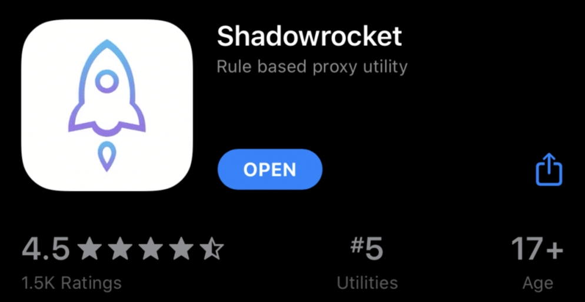

# 🚀 Shadowrocket(iOS小火箭) 新手使用教程

适用于苹果手机、iOS设备和Mac电脑，Shadowrocket是一款常用的科学上网工具。下面为新手详细介绍如何下载安装和配置Shadowrocket。

---

## 0. Shadowrocket简介

正版Shadowrocket在App Store的图标如下，请注意辨别，避免下载到仿冒应用。

---

## 1. 下载与安装

由于Shadowrocket未在中国区上架，需要切换到非国区Apple ID。

- 打开手机桌面的App Store，点击头像，滑到底部退出当前账号。
- 用提供的Apple ID登录，登录时在弹出的安全页面选择“其它选项”-不升级。
- 登录后App Store会自动切换到英文或其他地区商店。如果界面仍为中文，可重启App Store或手机。
- 搜索“Shadowrocket”，核对图标后下载安装。
- 安装完成后及时退出共享账号，保障手机安全。
- 若提示验证手机或回答问题，可尝试更换账号或检查登录步骤。

---

## 2. 配置订阅链接

没有订阅链接时，可评论留言获取。

- 打开Shadowrocket应用，点击右上角“+”按钮，类型选择“Subscribe”。
- 将机场提供的订阅URL粘贴进去，点击“保存”。
- 应用会自动下载并更新配置文件。

---

## 3. 选择服务器

- 订阅成功后，在主界面点击服务器列表，选择一个合适的节点。

---

## 4. 启动代理

- 将右上角的开关拨到“开启”，代理开始工作。
- 状态栏会出现VPN图标，表示Shadowrocket已运行。

---

## 5. 测试连接

- 打开浏览器访问Google等被墙网站，能正常访问即配置成功。

---

## 6. 高级设置（可选）

- 规则设置：默认全局路由为“配置”，如有网站无法代理，可切换到“代理”模式。
- 测速：主页点击“连通性测试”，选择速度最快的节点。

---

## 7. 常见问题

- 无法连接：检查订阅链接、服务器状态和网络连接。
- 速度慢：切换不同服务器或用测速功能选择最快节点。

---

## 8. 其他功能

- 更新订阅：主页订阅旁边点击“圆圈”按钮自动更新配置。

---

通过以上步骤，Shadowrocket即可轻松实现科学上网，畅享自由互联网体验。

---
没有合适的机场可以评论留言获取
---