# 使用Vim上班摸鱼

随着高校毕业生人数逐年攀升，职场竞争愈发激烈。对于在职社畜来说，如何在工作中适度“摸鱼”，不仅能缓解压力，还能为更多人创造就业机会。今天就分享一个实用技巧——用 Vim 编辑器在上班时偷偷看小说。

---

## 一、声明

本教程主要适用于程序开发相关岗位。如果你是 HR、医生、教师、设计师、警察、财务等平时很少用代码编辑器的职业，请谨慎参考。因使用本教程而被领导批评，作者概不负责。

---

## 二、下载并安装 Vim

这里以 Windows 系统为例，介绍 Vim 的下载安装流程。

- 官方下载地址：[https://www.vim.org/download.php#pc](https://www.vim.org/download.php#pc)
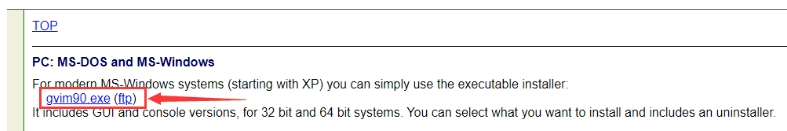
- 找到 `gvimxx.exe` 文件，点击下载。
- 下载完成后直接运行安装程序。若系统提示风险，选择“更多信息”并继续安装即可。
- 按照提示一路“下一步”完成安装。
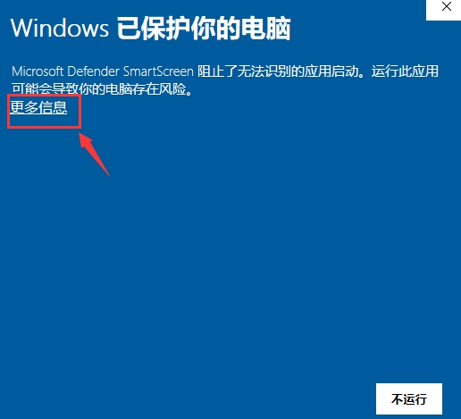
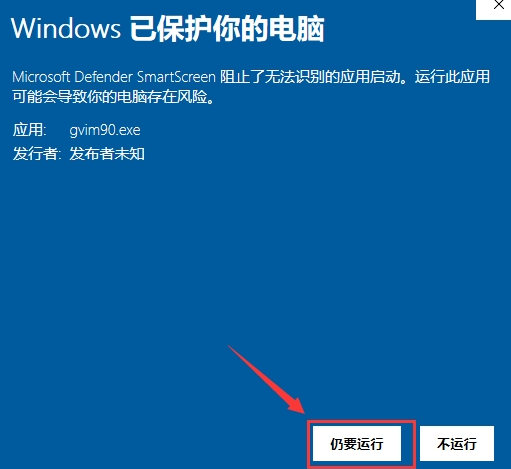

### 设置环境变量

1. 在桌面 Vim 快捷方式上右键，选择“打开文件所在位置”。
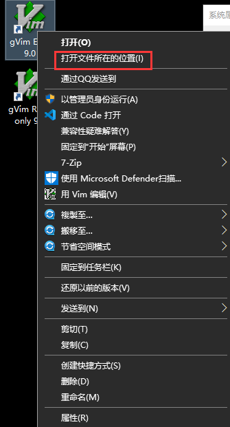
2. 复制该目录路径。
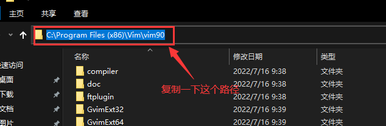
3. 按 Win 键，输入“环境变量”，点击“编辑系统环境变量”。
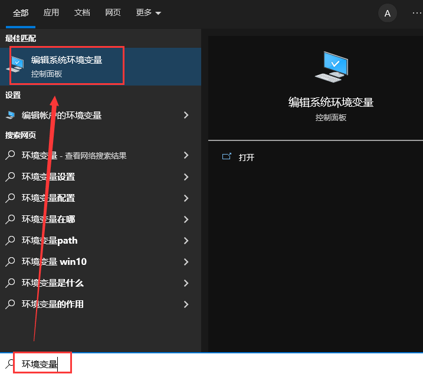
4. 依次点击“环境变量” → 双击“Path” → 双击空白处 → 粘贴 Vim 目录路径 → 一路点击“确定”。
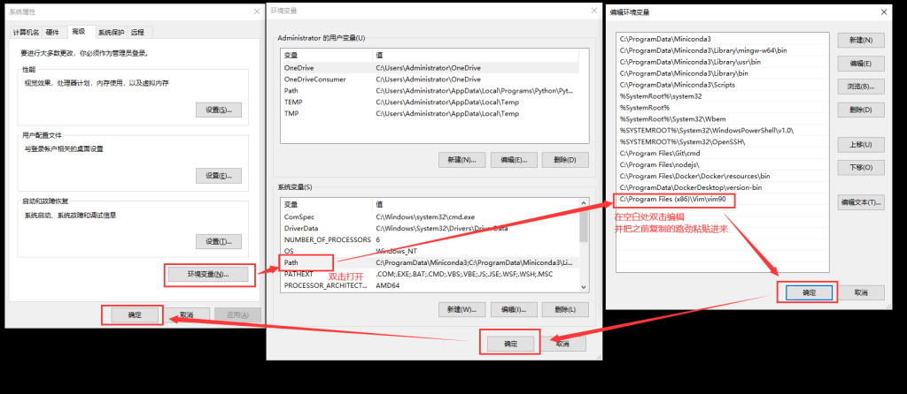

### 检查安装

1. 按 Win 键，输入“powershell”，回车进入 PowerShell。
2. 输入 `vim --version` 检查 Vim 是否安装成功。
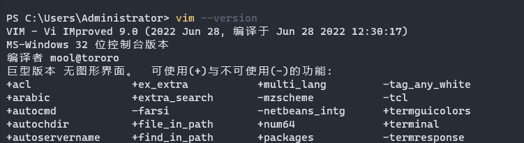

---

## 三、配置 Vim

1. 在 PowerShell 中输入 `vim ~/.vimrc` 打开 Vim 配置文件。
2. 按 `:` 键，输入 `set paste` 并回车，进入粘贴模式（可保留原有文本格式）。
3. 按 `i` 键进入编辑模式，将下面的内容敲进去，（懒得写的评论留言找我获取）。
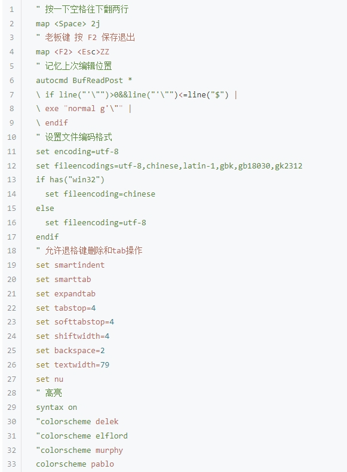


完事后按下 `Esc` 键，输入 `:wp!` 并回车即可保存并退出。注意，冒号和叹号都要用英文符号！

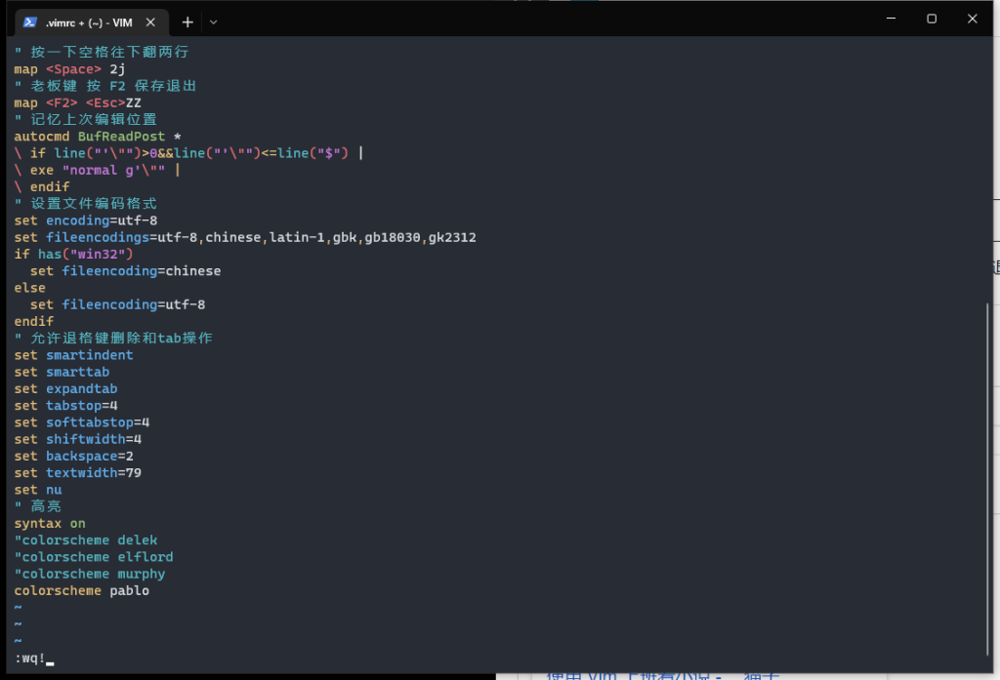

这样 Vim 的配置就完成了。

---

## 四、用编辑器看小说

其实不仅 Vim，任何带命令窗口的编辑器或 IDE 都可以用来看小说，比如 VS Code、PyCharm、Eclipse。这里以 VS Code 为例：

1. 在命令窗口输入： ”vim 小说的绝对路径“
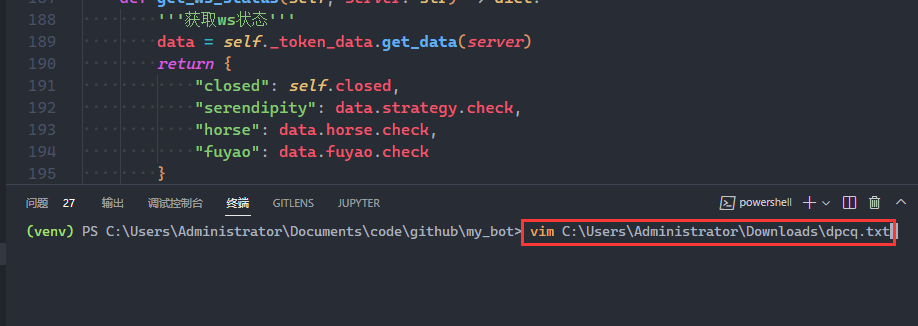
就能打开小说文件。

2. 效果如下图所示：


- 按空格键可以向下翻两行。
- 按 F2 可以保存并退出。
- 下次打开还能自动跳转到上次阅读的位置，继续看。

---

通过这些方法，你可以在工作时用 Vim 或编辑器轻松摸鱼看小说，既能伪装认真工作，又能享受阅读乐趣。

---
## 五、在 PowerShell 下更优雅地看小说

你可以通过配置 PowerShell 的 profile 文件，让看小说更加便捷。

1. 首先，在 PowerShell 中执行以下命令，创建 profile 文件：

   ```powershell
   New-Item -Type file -Force $profile
然后用 Vim 打开 profile 文件，并切换到粘贴编辑模式将下放内容敲进去（懒得写评论留言获取）。
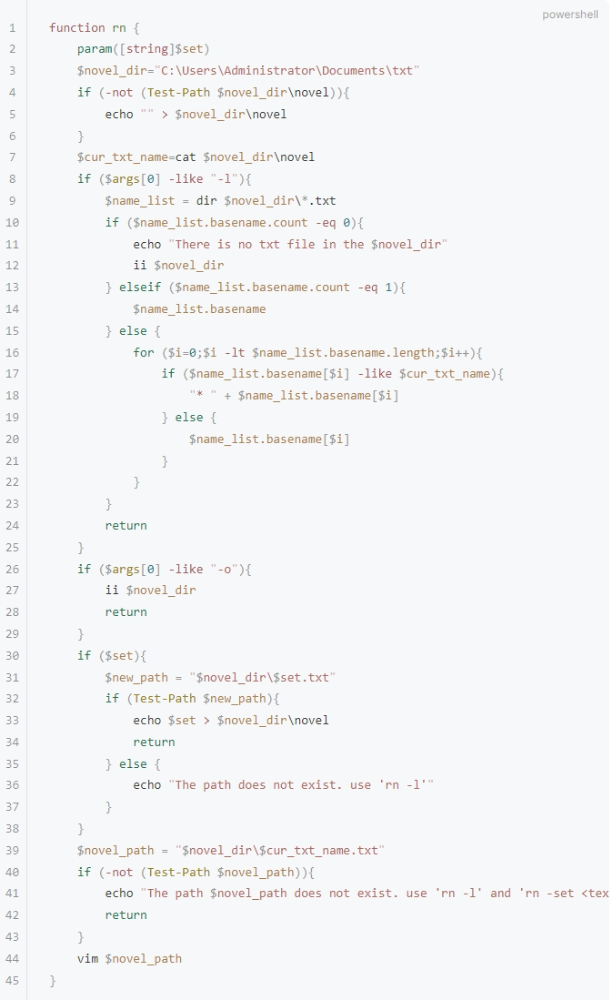

完成配置后，保存并退出 Vim，然后重新打开 PowerShell。

在 PowerShell 中执行 `rn -o` 可以打开小说存放目录。

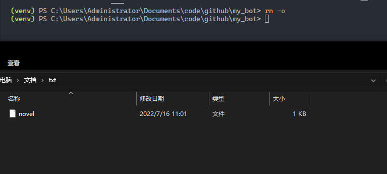

使用 `rn -l` 可以列出该目录下的所有小说文件，如果目录为空会有提示。

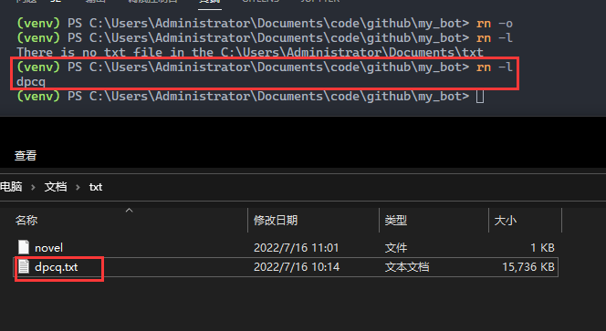

通过 `rn -s 小说名` 可以设置默认小说。


之后只需输入 `rn`，就能直接开始阅读默认小说了！

---

这样一来，你就能在 PowerShell 下优雅地管理和阅读小说，摸鱼体验更上一层楼。既能伪装成认真工作，又能享受摸鱼时光，轻松应对职场压力。
---
## 再次声明

本教程主要适用于程序开发相关岗位。如果你是 HR、医生、教师、设计师、警察、财务等平时很少用代码编辑器的职业，请谨慎参考。因使用本教程而被领导批评，作者概不负责。

---