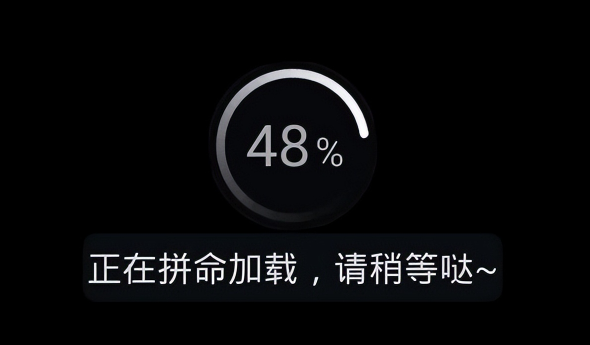
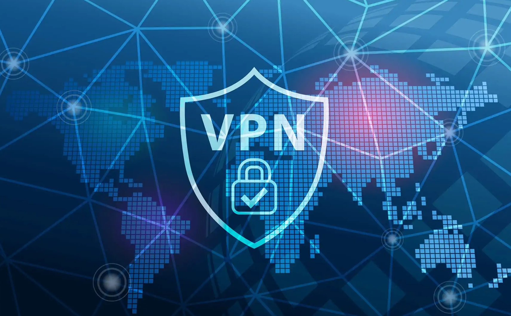
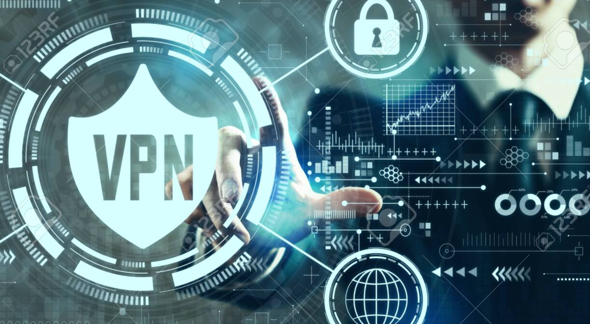
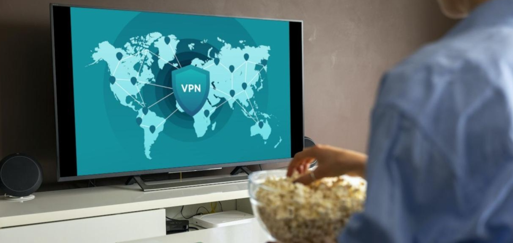

# 如何流畅观看海外视频？

你是否遇到过这样的情况：想看热门海外剧集或刷YouTube，却发现页面无法访问？在中国大陆，很多海外平台内容都被屏蔽。其实，只要用对科学上网工具，就能轻松突破这些限制，享受高清流畅的观影体验。本文将介绍如何通过专用VPN科学上网。

---

## 为什么用VPN才能流畅看海外视频？

在中国大陆，YouTube、Netflix、Disney+、Hulu等海外流媒体平台都无法直接访问，甚至会遇到加载缓慢或被屏蔽的问题。这是因为网络审查和地理限制。通过稳定可靠的VPN（虚拟专用网络）就可以享受高清流畅的观看体验，需要稳定靠谱的VPN可以评论留言。

- **绕过地理封锁**：加密流量并通过海外服务器转发，让你“伪装”成在国外上网，轻松访问被屏蔽的视频平台。
- **提升观看体验**：优质VPN有高速服务器，能减少延迟和卡顿，支持4K/HD流畅播放。
- **保护隐私安全**：加密数据，防止隐私泄露，避免运营商限速。

许多用户反馈，使用VPN后，视频加载速度明显提升，体验大幅改善。

---

## VPN如何帮助你科学上网？

VPN的原理很简单，相当于为你的网络加了一层保护。当你连接VPN后，设备会通过加密隧道将数据发送到VPN服务器，再由服务器访问互联网。这样一来，你的真实IP被隐藏，取而代之的是服务器的IP，看起来就像在国外上网，从而顺利翻墙，访问被封锁的海外视频站点。

VPN还能提升视频观看质量。例如，想看欧洲杯直播，没有VPN可能根本连不上。用VPN连到欧洲服务器，不仅能解锁，还能选择低延迟线路，避免卡顿。加密过程采用AES-256等高级标准，保障数据安全和隐私。许多VPN还配有自动断线保护，连接异常时会自动切断网络，防止IP泄露。

在中国大陆，选择带混淆服务器的VPN尤为重要，这类服务器能让流量看起来像普通网页浏览，不易被检测。总之，VPN不仅能翻墙，还能优化整体上网体验，让观看海外视频变得像在家看电视一样自然。

---

## 挑选VPN的实用技巧

选择VPN时，不能只看广告或推荐榜单，要结合自身需求，尤其是想流畅看海外视频的用户。速度是首要因素，视频播放需要高带宽和低延迟。建议选择服务器数量多、亚洲或欧美节点丰富的VPN，这样连接更稳定。比如，服务器距离太远，ping值高，看直播就会有延迟，体验大打折扣。

兼容性也很重要。无论你用的是手机、电脑还是智能电视，好的VPN都应支持多平台，并允许多设备同时连接。隐私保护同样不可忽视，无日志政策是基本要求，确保不会记录你的上网行为。针对中国大陆，VPN还需具备抗审查能力，如自动混淆或专用协议，能有效避开检测。

价格和性价比也要考虑。月付灵活，年付通常更划算，还有不少优惠。试用期或退款保证很重要，可以先体验再决定。最后，参考用户评价和实际测试，尤其是中国用户的反馈，能帮助你选到真正适合的翻墙梯子，让科学上网更可靠。

---
# 如何设置VPN并优化视频观看

设置VPN其实很简单，即使是新手也能快速上手。只需从官网下载安装最新版VPN应用，注册并登录账号。选择服务器时，建议优先选择负载低且靠近视频源的节点，这样能获得更流畅的观看体验。连接成功后，打开你想看的视频应用，就可以访问海外内容了。

## 视频观看优化技巧

- 使用自动协议选择最佳速度
- 让VPN在后台运行，避免断线
- 手机端可启用分应用VPN，仅让视频App走VPN通道，节省流量
- 遇到卡顿时，尝试切换服务器或重启App
- 不同时间段测试，避开网络高峰
- 定期更新VPN，保持最新的绕墙能力

如果遇到连接慢等问题，先检查网络状况，或联系VPN客服获取专属大陆使用指南。设置好后，观看海外视频就会非常流畅。

---

## 常见疑问解答

### 在中国大陆如何选择适合观看海外视频的VPN？

建议选择专为流媒体优化、能有效绕过地域限制且在中国大陆表现良好的VPN服务商，同时关注是否有无日志政策和强加密技术，保障隐私安全。

### 用VPN观看YouTube和Netflix会卡顿吗？

优质VPN通常配备高速服务器，并针对流媒体优化，能显著提升观看体验，减少卡顿和缓冲。建议选择有中国大陆专用节点或智能分流功能的VPN，获得更流畅的视频播放。

### VPN会影响视频画质吗？

只要VPN速度足够快，基本不会影响画质。顶级VPN甚至支持4K高清流媒体播放。免费或低质量VPN可能导致画质下降或频繁掉线，建议选择信誉良好的付费VPN。

### 使用VPN看海外视频安全吗？

使用正规、无日志政策的VPN服务商，观看海外视频是安全的。数据会被加密传输，个人隐私也能得到保护。避免使用来路不明或免费VPN，以防数据泄露风险。

### VPN在中国大陆会被封吗？如何应对？

部分VPN可能会被封锁或连接不稳定，但主流服务商会不断更新技术应对封锁。建议选择支持中国大陆的VPN，关注官方动态，遇到问题可尝试更换服务器或协议。

### 这些VPN在大陆真的有效吗？

推荐的VPN服务都经过实际测试，在中国大陆依然可以稳定连接，支持访问YouTube、Netflix等海外流媒体。但网络环境可能随政策变化，建议选择支持大陆用户的VPN并关注更新。

---

## 结语
## 选对VPN，就能轻松翻墙，流畅观看海外视频。
我会多测试一些可靠的VPN后分享给大家，大家可以评论留言领取体验，找到最适合自己的翻墙梯子。享受自由上网的同时，注意安全习惯，科学上网不再难，赶紧行动起来，畅享你喜欢的海外节目吧！

---